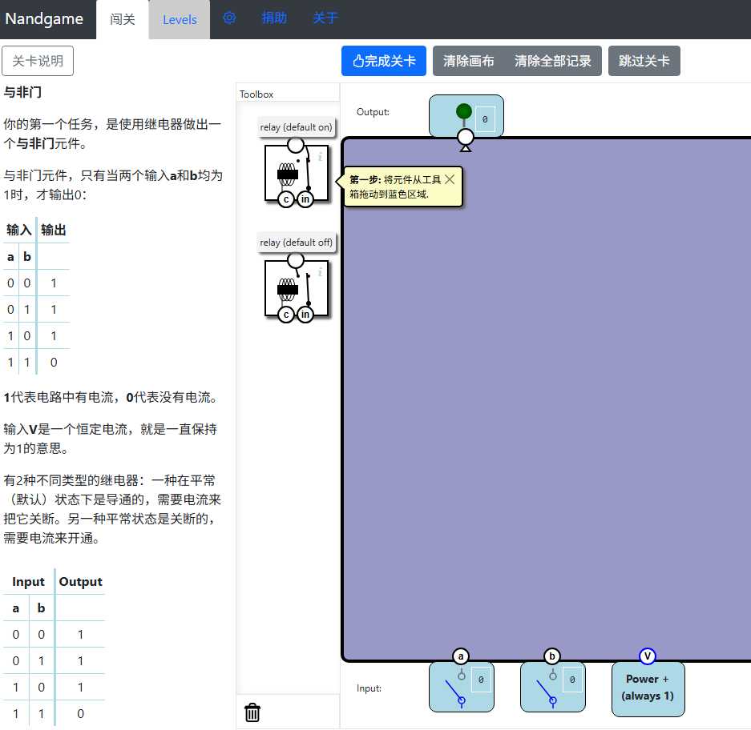
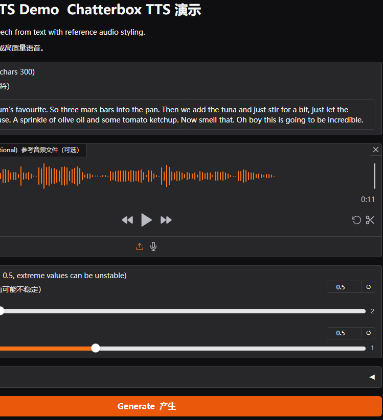
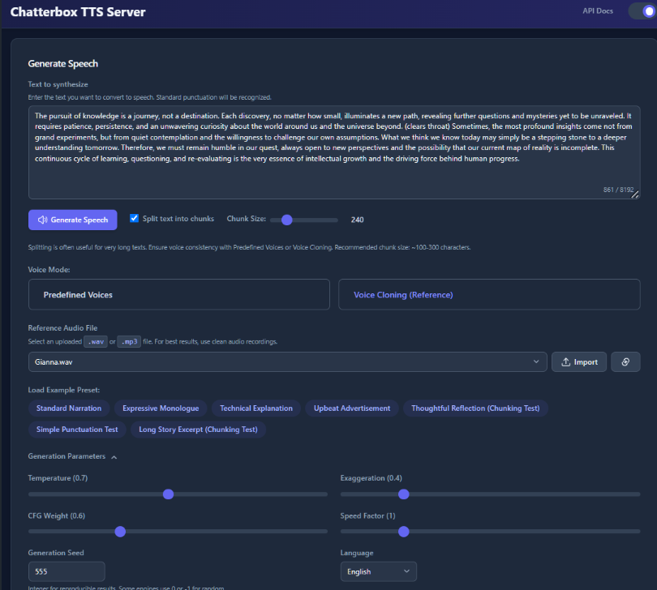
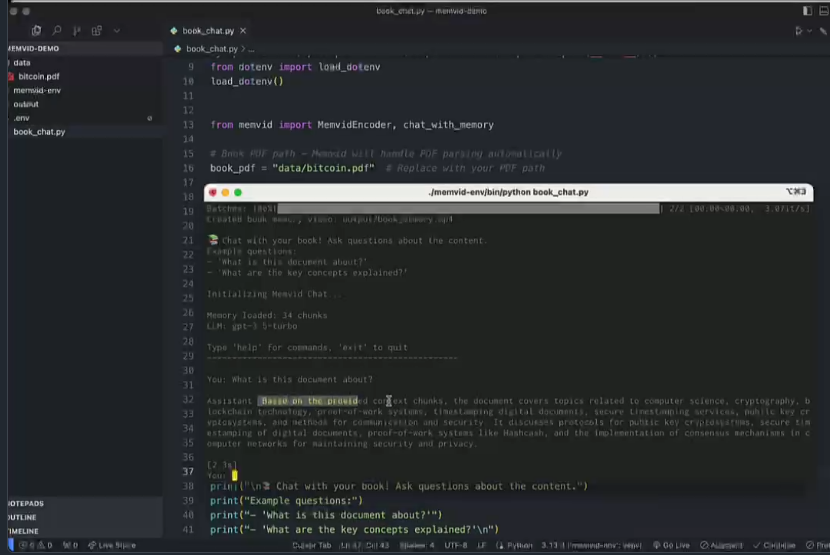
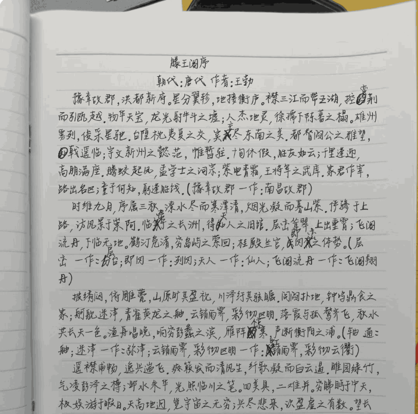
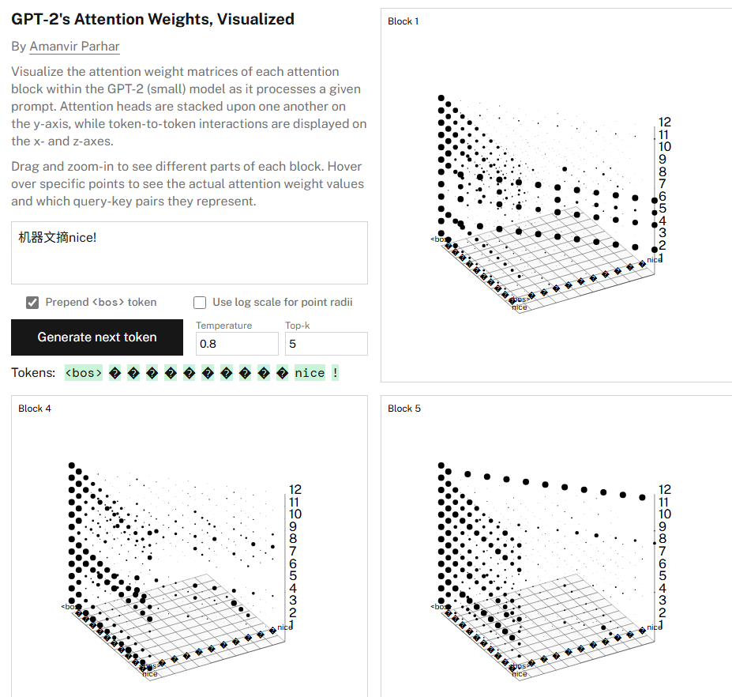
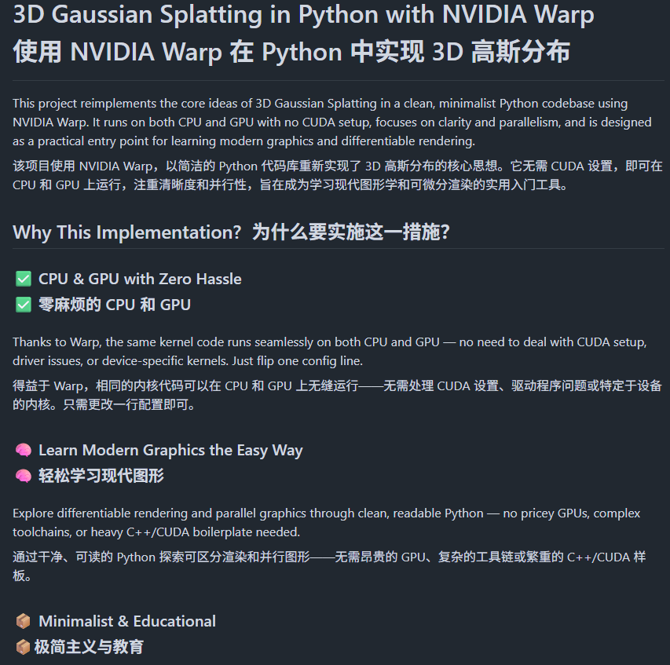

# 机器文摘 第 134 期
### 教你从头（从与非门开始）构建一台计算机的游戏

[欢迎来到 Nand 游戏世界](https://www.nandgame.com/)，你将从基础部件开始组装一台计算机。

游戏包含一系列关卡。在每一关里，你需要按照要求构建一个功能符合规范的组件，该组件可在后续关卡中作为基础模块使用。

本游戏无需预先掌握计算机架构或软件知识，数学方面也只需用到加减法即可。（不过需要一定耐心——部分关卡可能需要花些时间才能破解！）

你的首要任务是制作一个与非门元件。

### 又一个强大的开源 TTS 模型

[Chatterbox TTS](https://github.com/resemble-ai/chatterbox)，基于 0.5B Llama 架构训练，不仅支持零样本语音克隆，还独创了情感夸张控制功能，能够让合成语音更生动有趣。

主要特性：

- 零样本文本转语音，无需训练即可模仿任何声音
- 情感夸张控制，可调节语音的戏剧化程度
- 超稳定对齐推理，确保输出质量始终如一  
- 内置声音转换脚本，轻松实现声音克隆
- 内置 PerTh 水印保护，防止恶意使用
- 在盲测中击败 ElevenLabs，质量有保障

[在线体验 Chatterbox TTS](https://huggingface.co/spaces/ResembleAI/Chatterbox)。

### 自托管专业级语音合成服务

[Chatterbox-TTS-Server](https://github.com/devnen/Chatterbox-TTS-Server)，基于 [Chatterbox TTS](https://github.com/resemble-ai/chatterbox) 模型构建，提供可视化 Web 界面和完整 API，支持声音克隆、智能长文本分块处理，还有 GPU 加速。

主要特性：

- 提供 Web UI 界面，支持文本输入和参数调节
- 支持声音克隆功能，可上传参考音频生成相似声音  
- 预定义声音库，提供多种高质量合成声音选择
- 智能长文本处理，自动分块避免生成限制
- OpenAI 兼容 API 接口，方便集成到现有项目
- 支持GPU 加速和 Docker 部署，性能强劲易于部署

### 基于视频文件存储 AI 的记忆

把用于 AI 模型的向量数据存储在视频里？[Memvid](https://github.com/olow304/memvid)，颠覆传统的向量数据库处理方式，直接将文本数据编码成视频文件。

通过将数百万文本块压缩到单个 MP4 文件中，不仅实现了 10 倍的存储压缩率，还能在亚秒级时间内完成语义搜索，完全无需数据库服务器。

项目内置对话功能，可与知识库进行上下文感知的对话，同时支持直接导入 PDF 文档并自动索引处理。

可完全离线工作，视频生成后无需网络连接。

### 一键生成手写文稿

[autohanding](https://www.autohanding.com/)，一键生成手写文稿，模仿真实笔迹。支持多种字体选择与纸张背景设置，用户可上传 Word 文件并进行个性化调整，打印出高质量的手写效果，满足各种需求。

支持以指定概率进行随机文字涂改。

支持设置文字凌乱度。

### 可视化 GPT-2 “小模型”的注意力矩阵

[gpt-2-attention](https://amanvir.com/gpt-2-attention)，这个网站可以可视化 GPT-2（小模型）生成文本时的每一个注意力权重矩阵。

### 从零实现高斯泼溅 3D 渲染

[3D Gaussian Splatting with NVIDIA Warp](https://github.com/guoriyue/3dgs-warp-scratch)，用Python从零构建3D高斯绘制，无需CUDA即可在CPU/GPU上运行。

主要特性：
1. 无需复杂CUDA设置，无缝切换CPU/GPU；
2. 代码简洁易懂，适合学习现代图形学；
3. 仅需Python和NVIDIA Warp，无需昂贵GPU。

## 订阅
这里会不定期分享我看到的有趣的内容（不一定是最新的，但是有意思），因为大部分都与机器有关，所以先叫它“机器文摘”吧。

Github仓库地址：https://github.com/sbabybird/MachineDigest

喜欢的朋友可以订阅关注：

- 通过微信公众号“从容地狂奔”订阅。

