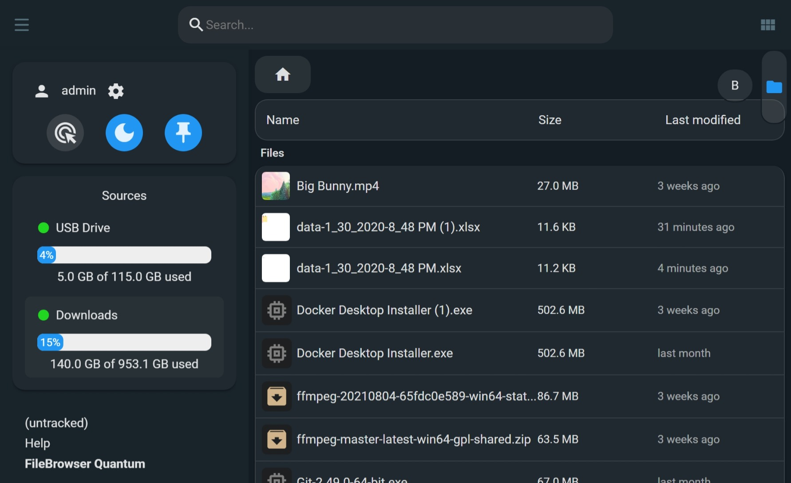
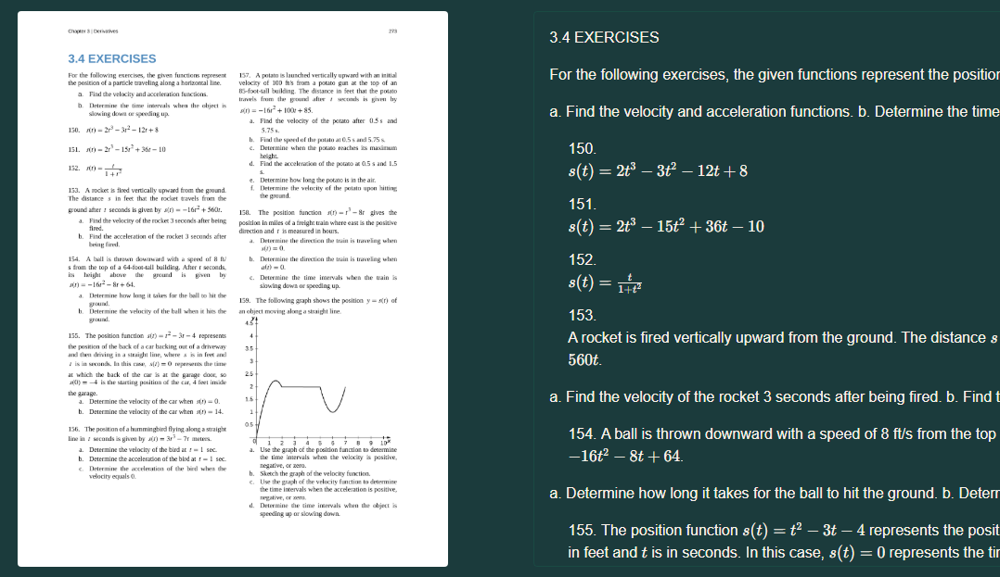
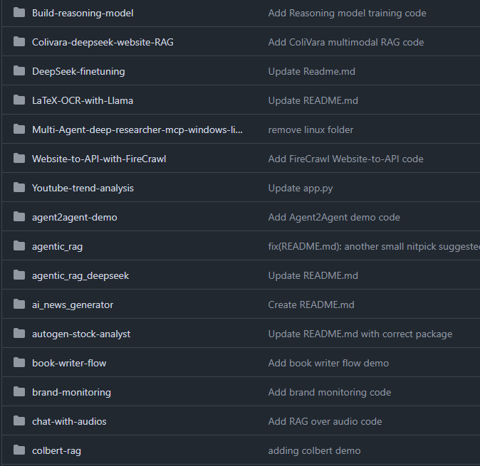
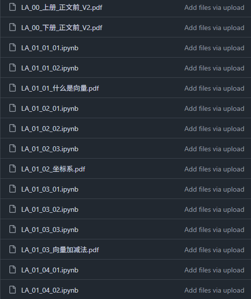
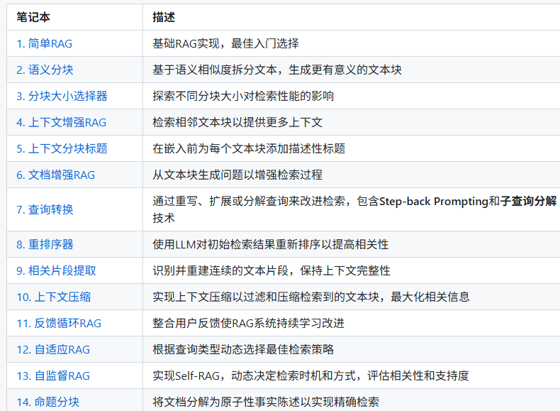
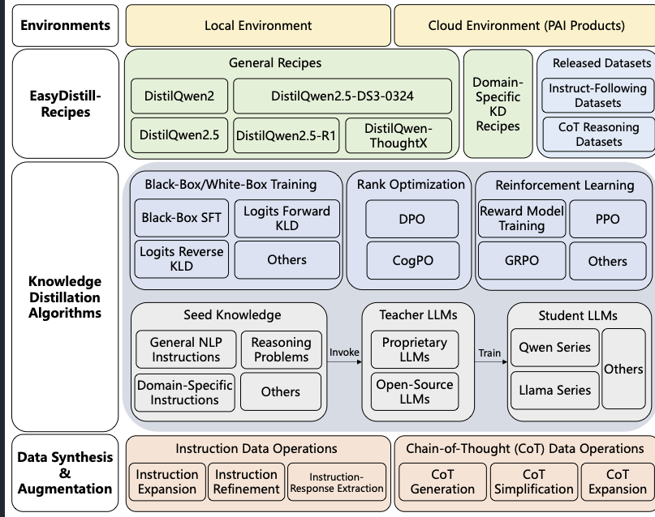
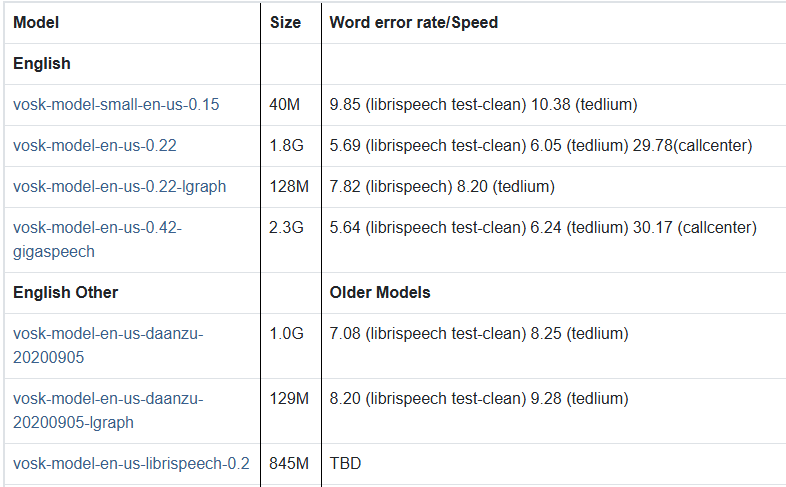

# 机器文摘 第 135 期
### 跨平台现代文件管理器

[FileBrowser Quantum](https://github.com/gtsteffaniak/filebrowser)，最好的免费自托管基于 Web 的文件管理器。

主要特性：

- 实时搜索和文件监控，边输入边显示结果
- 支持多个文件源同时管理，告别单一目录限制  
- Office 和视频文件在线预览，无需下载查看
- OIDC、密码+2FA 等多种登录方式保障安全
- 开发者 API 支持，可集成到自己的项目中
- 文件夹大小显示和高级过滤搜索功能

在项目发布页面提供了开箱即用安装包，支持 Windows、macOS 和 Linux 系统。

### 本周最新最火的 OCR 模型工具箱

[olmOCR](https://github.com/allenai/olmocr)，将 PDF 和其他基于图像的文档格式转换为干净、可读、纯文本格式的工具包。

仅仅 3B 参数，性能超越 Gemini 2.5 Pro 等闭源模型，不仅能精确识别文字、公式和表格，还能保持原有的文档结构和布局关系。

主要特性：
- 将基于 PDF、PNG 和 JPEG 的文档转换为干净的 Markdown
- 支持方程式、表格、手写和复杂格式
- 自动删除页眉和页脚
- 转换为具有自然阅读顺序的文本，即使存在图形、多列布局和插图
- 高效，每转换一百万页的成本不到 200 美元
- 基于 7B 参数 VLM，因此需要 GPU

### 人工智能工程中心 

[AI Engineering Hub](https://github.com/patchy631/ai-engineering-hub)，有关 LLM、RAG 和真实世界 AI 代理应用的深入教程。

人工智能工程正在快速发展，保持领先地位需要深刻的理解和实践经验。在这里，您将了解：
- 关于 LLM 和 RAG 的深入教程；
- 现实世界的智能体应用程序；
- 在您的项目中实施、调整和扩展的示例；

无论您是初学者、从业者还是研究人员，此 repo 都为各个技能水平的人员提供了资源，以便他们在 AI 工程中进行实验并取得成功。

### 线性代数开源书籍

[”数学不难“ 之 《线性代数不难》上下册](https://github.com/Visualize-ML/Linear-Algebra-Made-Easy---Learn-with-Python-and-Visualization)，一本让学习线性代数变得生动有趣的开源书籍，分为上下两册从基础到高阶内容，通过大量几何图形和动画展示向量、矩阵、特征值分解等数学概念。

配有 Python 实战示例，可直接运行的 .ipynb 文件，通过动手实践对抽象理论知识有更深刻的理解。

适合想系统掌握线性代数并应用到数据分析、机器学习领域的开发者学习。

### 一个 RAG 教学项目

[all-rag-techniques](http://github.com/fareedkhan-dev/all-rag-techniques)，采用了一种清晰、亲身实践的方法来讲解检索增强生成（RAG），将各种先进技术分解为直截了当、易于理解的实现。这里的所有内容都是使用我们熟悉的 Python 库（如 openai、numpy、matplotlib 及其他几个库）构建的，而不是依赖 LangChain 或 FAISS 等框架。

目标很简单：提供可读、可修改且具有教育意义的代码。通过专注于基础原理，本项目旨在揭开 RAG 的神秘面紗，让您更容易理解其真实的工作原理。

### 为大语言模型提供高效知识蒸馏的工具包

[EasyDistill](https://github.com/modelscope/easydistill)，帮助研究人员和开发者轻松实现大语言模型的知识蒸馏，将复杂的大模型性能迁移到小模型中。

EasyDistill 提供了一个多功能且用户友好的平台来简化知识蒸馏过程，支持黑盒和白盒两种方法。它促进高效的模型训练，使较小的模型能够在不损失准确性的情况下模拟较大模型的性能。EasyDistill 拥有广泛的功能特性，包括数据合成、监督微调、排序优化和强化学习，所有这些都针对各种知识蒸馏场景进行了定制。该工具包设计用于适应系统1（快速、直觉）和系统2（缓慢、分析）认知模型，具有模块化和易于使用的特点，配备简单的命令行界面来指导用户。除了学术探索之外，EasyDistill 还锚定实际的工业解决方案，提供强大的蒸馏模型和开源数据集，同时展示与阿里云AI平台PAI的无缝集成。致力于连接理论进步与实际需求，EasyDistill 赋能NLP社区，使最先进的知识蒸馏策略对研究人员和行业从业者都变得可及。

亮点：
1. 支持黑箱和白箱蒸馏方法；
2. 提供数据合成、监督微调、强化学习等多种功能；
3. 与阿里云PAI平台无缝集成

### 离线开源语音识别工具包

[vosk](https://github.com/alphacep/vosk-api)，支持 20 多种语言识别，模型仅 50MB 却能提供连续大词汇量转录，还支持流式 API 和说话人识别等高级功能。

主要特性：

- 支持英语、中文、俄语、德语、法语等 20+ 种语言
- 完全离线运行，无需网络连接和 API 费用
- 零延迟响应，提供流式 API 接口
- 模型小巧（50MB）支持连续大词汇量转录
- 支持说话人识别和可重新配置词汇表
- 提供 Python、Java、C++、Node.js 等多语言绑定
- 适用于聊天机器人、智能家居、字幕生成等场景

提供了详细安装说明和使用示例，可通过官网下载对应语言模型。

## 订阅
这里会不定期分享我看到的有趣的内容（不一定是最新的，但是有意思），因为大部分都与机器有关，所以先叫它“机器文摘”吧。

Github仓库地址：https://github.com/sbabybird/MachineDigest

喜欢的朋友可以订阅关注：

- 通过微信公众号“从容地狂奔”订阅。

