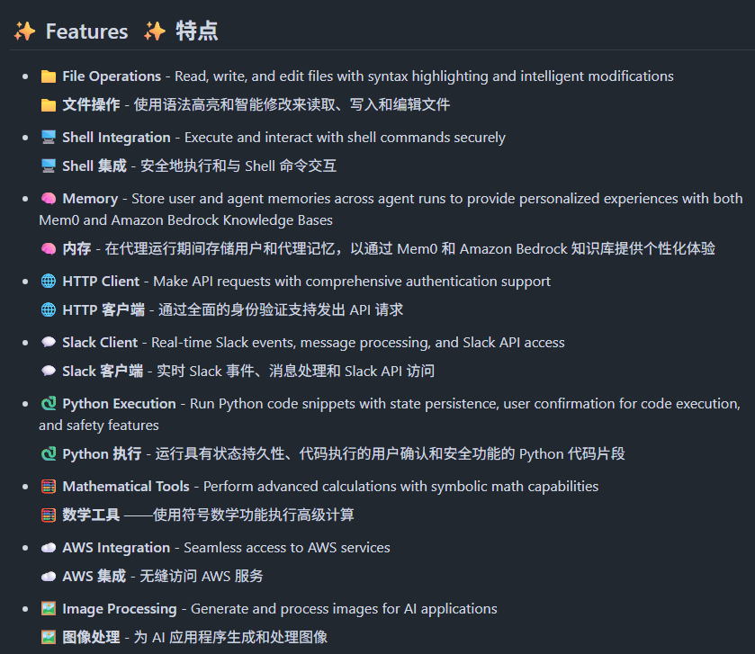
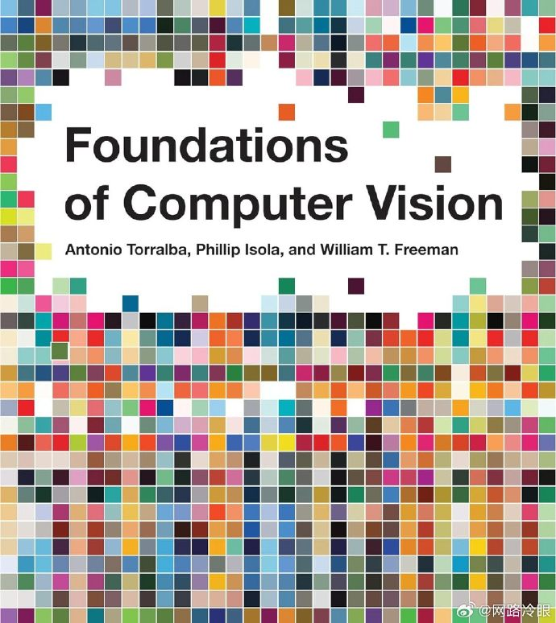
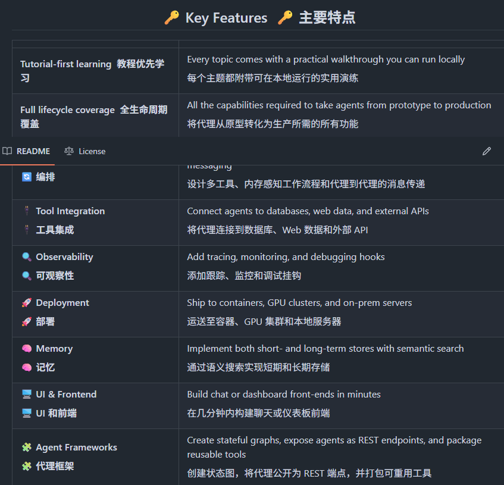
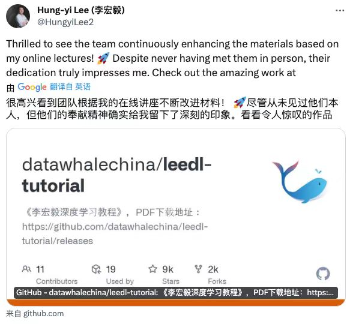

# 机器文摘 第 136 期
### 用收据打印机管理任务 

[《收据打印机治好了我的拖延症》](https://joshworth.com/dev/pixelspace/pixelspace_solarsystem.html)，这篇文章的作者分享了自己如何借助热敏式收据打印机克服拖延症并提升生产力的心路历程。

作者曾因拖延症导致健康问题和事业失败，但在深入研究视频游戏的成瘾机制后，发现游戏通过即时反馈和重复的游戏循环让人们沉浸其中。

他将这一原理应用于自己的日常生活，通过将任务分解成小步骤并使用便签纸记录任务完成情况，创造出即时反馈的机制。

然而，手写便签的繁琐促使他采用热敏式收据打印机打印每日任务，实现快速、批量的任务管理。

最终，作者通过开发自定义软件与打印机结合，构建了一套高效的生产力系统，显著提升了工作效率并摆脱了低效拖延的困扰。

这种方法不仅对作者个人产生了积极影响，也提供了对科技如何辅助个人提升生产力的创新思考。

### 如果月球只有 1 个像素

[一个乏味而精确的太阳系模型](https://joshworth.com/dev/pixelspace/pixelspace_solarsystem.html)，个项目以一种直观且颇具创意的方式，展示了太阳系行星之间的浩瀚距离。

它通过一个互动式的太阳系模型，使我们仿佛在太空中旅行，体验从地球到其他行星的漫长旅程。

太阳系中大部分区域实际上是空无一物的，这也是为什么大多数太阳系地图无法按比例绘制的原因。

作者通过生动的比喻和数据，强调了行星之间距离的遥远以及太阳系中 “空无一物” 的本质。

尽管我们可能无法完全理解这些巨大的空间尺度，但正是这些渺小的行星和恒星的存在，让我们在这广阔的宇宙中显得尤为珍贵。

### 开源 AI Agents 开发框架

[Strands Agents Tools](https://github.com/strands-agents/tools)，仅需几行代码就能构建出强大的智能助手。

提供了 30 多种实用工具，涵盖文件操作、系统命令、HTTP 请求、Python 执行等核心功能，还支持集群智能协调多个代理解决复杂问题。

功能特性：

- 文件读写编辑，支持语法高亮和智能修改
- Shell 命令执行和系统交互，确保安全性
- HTTP 客户端和 AWS 服务集成，轻松对接外部 API
- Python 代码执行，带状态持久化和安全确认
- 批量工具并行调用，大幅提升处理效率
- 内存管理和任务调度，提供完整的代理生命周期支持

### 自动生成软著申请文档

[ruanzhu](https://www.textimagecraft.com/zh/ruanzhu)，一键生成软著申请所需文档，可导出 MD 文件。

### 麻省理工免费电子书

[《计算机视觉基础》](https://visionbook.mit.edu/)，本书涵盖了计算机视觉领域的基础主题，并从图像处理和机器学习的角度进行讲解。我们希望培养读者的直觉，因此本书包含了许多可视化效果。本书的读者对象是即将进入该领域的本科生和研究生，但我​​们希望经验丰富的从业者也能从本书中受益。

> 我们最初的目标是写一本涵盖该领域的厚书。可惜的是，计算机视觉领域实在太庞大，我们无法做到这一点。因此，我们决定写一本小书，每章不超过五页。这样的目标迫使我们真正专注于理解每个主题所需的重要概念。写一本短书非常合适，因为我们没有时间写长书，而且读者也没有时间阅读。可惜的是，我们也未能实现这个目标。

### 生产级智能体

[Agents Towards Production](https://github.com/NirDiamant/agents-towards-production)，是一个开源项目，帮助开发者将AI代理从概念转化为实际产品。

提供了一系列的教程、工具和代码示例，涵盖从零到生产部署的全过程。这些教程包括编排、工具集成、可观测性、部署、安全等多个方面，旨在帮助开发者快速从概念验证转向生产环境。

项目还提供了详细的文档和代码，方便开发者学习和应用。

### 李宏毅深度学习教程

[LeeDL-Tutorial（苹果书）](https://github.com/datawhalechina/leedl-tutorial)，李宏毅老师是台湾大学的教授，其《机器学习》（2021年春）是深度学习领域经典的中文视频之一。

李老师幽默风趣的授课风格深受大家喜爱，让晦涩难懂的深度学习理论变得轻松易懂，他会通过很多动漫相关的有趣例子来讲解深度学习理论。

李老师的课程内容很全面，覆盖了到深度学习必须掌握的常见理论，能让学生对于深度学习的绝大多数领域都有一定了解，从而可以进一步选择想要深入的方向进行学习，培养深度学习的直觉，对于想入门深度学习又想看中文讲解的同学是非常推荐的。

本教程主要内容源于《机器学习》（2021年春），并在其基础上进行了一定的原创。

比如，为了尽可能地降低阅读门槛，笔者对这门公开课的精华内容进行选取并优化，对所涉及的公式都给出详细的推导过程，对较难理解的知识点进行了重点讲解和强化，以方便读者较为轻松地入门。

此外，为了丰富内容，笔者在教程中选取了《机器学习》（2017年春） 的部分内容，并补充了不少除这门公开课之外的深度学习相关知识。

## 订阅
这里会不定期分享我看到的有趣的内容（不一定是最新的，但是有意思），因为大部分都与机器有关，所以先叫它“机器文摘”吧。

Github仓库地址：https://github.com/sbabybird/MachineDigest

喜欢的朋友可以订阅关注：

- 通过微信公众号“从容地狂奔”订阅。

