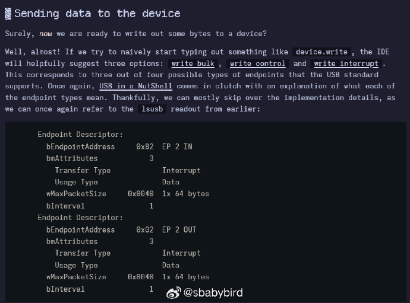
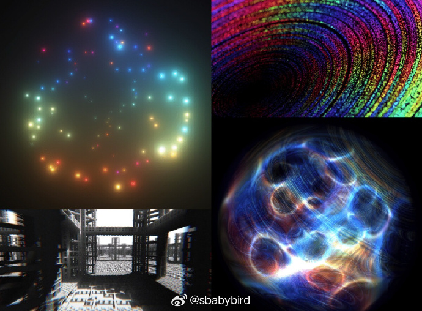
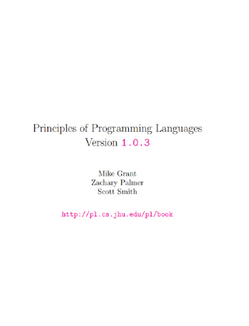
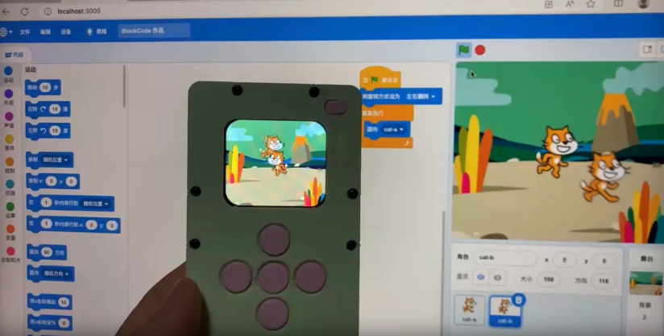
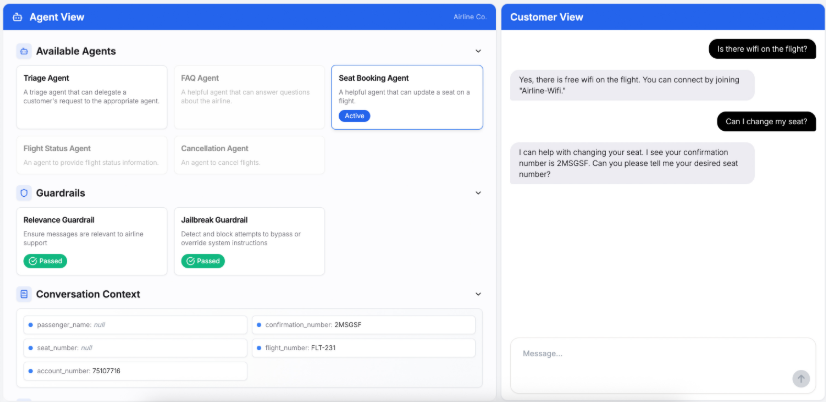
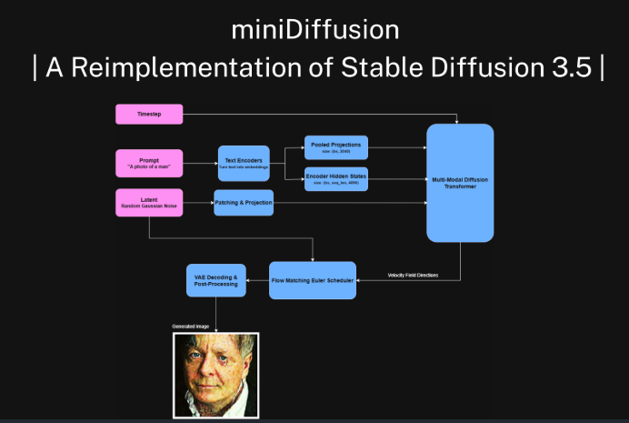

# 机器文摘 第 137 期
### 新手如何编写 Linux 设备驱动程序

[《编写基本的 Linux 设备驱动程序》](https://crescentro.se/posts/writing-drivers/)，展示了从零开始为特定 USB 设备开发 Linux 用户空间驱动的完整过程，包括前期的知识储备、工具使用、与内核驱动的交互、代码实现与调试等，对想了解 USB 设备驱动开发的读者有较大参考价值。

作者因购买的 Nanoleaf Pegboard Desk Dock 仅支持 Windows 和 macOS，决定为其开发 Linux 驱动，尽管此前对 Linux 驱动和 USB 知识几乎一无所知。

通过逆向工程官方驱动和联系厂商获取协议文档，作者选择用 Rust 语言结合 rusb 库编写用户空间驱动，而非内核驱动。

在开发中，作者创建 udev 规则获取设备访问权限，通过 lsusb 查看设备信息，使用 rusb 库的相应方法实现设备的接口声明、数据发送与接收，并处理了内核驱动占用设备的问题。

### 用280个字符建模世界

[《Modeling the World in 280 Characters》](https://tympanus.net/codrops/2025/06/23/modeling-the-world-in-280-characters/)，这篇文章主要讲述了作者作为一名图形程序员，热衷于编写 280 字符以内的 GLSL 代码片段（即 “代码高尔夫”），并通过分享自己的创作过程、动机和相关技巧，鼓励读者尝试这一有趣的编程方式。

作者 [Xor](https://xordev.com/) 是一名图形程序员，负责视频效果等的开发，他喜欢编写紧凑的着色器程序，认为这一过程充满乐趣、挑战，还能激发对图形编程的兴趣并推动学习发现。同时，他通过此结识了众多有趣的人。

着色器运行在 GPU 上而非 CPU，碎片着色器（片段着色器）是 “推特着色器” 的类型，主要功能是根据输入的片段坐标输出颜色和不透明度。

作者以写 “Milky” 星星着色器为例(可在[twigl.app](https://twigl.app/体验))，介绍了创作思路，包括确定初始想法、进行中心化与缩放以适应不同分辨率和宽高比、循环创建环绕中心的点光源、添加发光效果、运用三角函数确定粒子位置、使用正弦波进行着色等步骤，还强调了代码高尔夫需要平衡多方面因素。

### 电子书《Principles of Programming Languages》编程语言原理

[《编程语言原理》](https://pl.cs.jhu.edu/pl/book/book.pdf)是由 Mike Grant、Zachary Palmer 和 Scott Smith 编写的教材，主要面向计算机科学专业的高年级本科生和研究生。内容涉及编程语言的核心概念、设计原则和实现技术，涵盖了从基础的函数式编程到高级的并发编程和类型系统等多个方面。

> “在这本书中，我们的目标是研究编程语言中的基本概念，而不是学习一系列特定的语言。语言易于学习，难的是理解它们背后的概念。我们依次研究的基本特性包括高阶函数、以记录和变量形式的数据结构、可变状态、异常、对象和类以及类型。我们还研究语言实现，包括语言解释器和语言编译器。在整本书中，我们为玩具语言编写小型解释器，而在第8章，我们编写了一个有原则的编译器。我们定义类型检查器来确定哪些程序是类型正确的，哪些不是。我们还通过操作语义和类型系统的概念，对解释器和类型检查器进行了更精确、数学化的理解。这两个概念历史上是从逻辑学家对编程的视角演变而来的。”

### 图形化编程教育游戏机

[Scratch Arcade](https://github.com/ScratchArcade/arcade-lite)，这是一款针对少儿编程可编程游戏机硬件产品，解决当前Scratch教学模式单一，程序模版化，没有硬件关联，导致学生兴趣下滑。这款产品将完全弥补这些不足，提升教学内容的丰富性，程序的多样性和变化性，学生的成就感获得完全提升，并且完全不改变现在已有的教学内容，完全拿来即用。

> “目前市面上图形化编程教育游戏机大多是基于MakeCode Arcade设计，但MakeCode并不符合中国教育环境，大部分人只熟悉Scratch图形编程，于是诞生了这个基于Scratch设计的游戏机。”

> “本人从小就热爱玩游戏，并从事游戏开发工作十多年，自2018年开始接触到Scratch少儿编程，一开始只是完成由游戏开发者到少儿编程教育工作者转型。由于工作关系接触到了开源硬件micro:bit, 偶然发现micro:bit V2加上LCD屏幕可以使用MakeCode Arcade图形化工具来开发游戏。任何人真的可以通过图形化的工具给自己制作开发游戏还可以下载到游戏机里面去玩。接触这个软件后对我一个传统游戏开发者来说是非常震惊的，于是立马淘宝上买了一个回来玩，玩了一阵子后，职业的原因让我发现了一些用户体验问题，MakeCode Arcade编程所有的游戏场景，背景，元素全部在一个主程序里面，并且控制器都要依赖游戏机本身的硬件，这样导致游戏程序的编写难度偏大。别说是小朋友和新手用户，就算是我这个游戏开发多年的人来说都感觉有点绕，MakeCode Arcade还是有一种程序员在做游戏开发的影子在里面。相比而言Scratch游戏编程就显得简单很多，常用图标，声音元素可以直接使用自带的或者电脑上传，不需要全部靠编程去实现。不同角色可以独立模块化编程，无论是编程框架还是编程思想，用户都能很容易理解。我在实际教学应用中也验证了这点，教学难度Scratch远低于MakeCode Arcade。”

### 开源智能客服 Agent

[openai-cs-agents-demo](https://github.com/openai/openai-cs-agents-demo)，OpenAI 开源的一个客服 Agent 演示 Demo，值得一看，对我们构建一套 AI 客服系统有一定启发。

基于 OpenAI Agents SDK 构建，一套航空公司智能客服系统，内置多个 Agent，系统能自动识别问题类型并路由给对应的专业 Agent。

主要有如下 Agent 组成，实现完善的航空客服系统：

- 智能分流 Agent，自动识别并路由不同类型客户请求
- 专业座位预订 Agent，处理座位更改和互动座位图
- 航班状态 Agent，提供实时航班信息查询
- FAQ Agent，回答常见问题和机型信息
- 取消服务 Agent，处理退票和改签业务

同时提供了安全防护机制，防止越狱攻击和无关话题。

### 用 PyTorch 重新实现 Stable Diffusion 3.5 模型

[miniDiffusion](https://github.com/yousef-rafat/miniDiffusion)，它以最少的代码（约2800行）从头开始复现Stable Diffusion 3.5，包括从VAE到DiT以及训练和数据集脚本。项目包含核心图像生成模块、文本编码器、字节对和单体分词器等组件，还提供训练和推理脚本。该项目用于教育和实验目的。

### 构建语音 AI Agent 的框架库

[livekit/agents](https://github.com/livekit/agents)，这个库包括了语音转文本、大型语言模型、文本转语音和实时 API，甚至还包括各种检测用户开始说话，停止说话，与手机电话集成等等各种实用的微型模型和脚本。

## 订阅
这里会不定期分享我看到的有趣的内容（不一定是最新的，但是有意思），因为大部分都与机器有关，所以先叫它“机器文摘”吧。

Github仓库地址：https://github.com/sbabybird/MachineDigest

喜欢的朋友可以订阅关注：

- 通过微信公众号“从容地狂奔”订阅。

