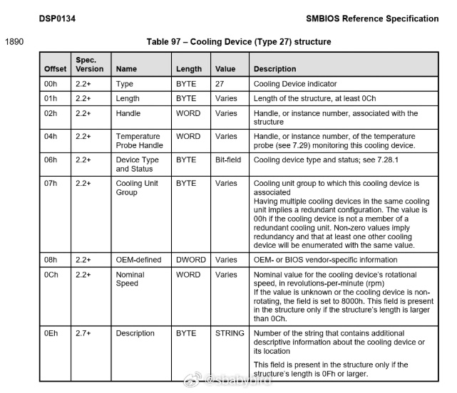
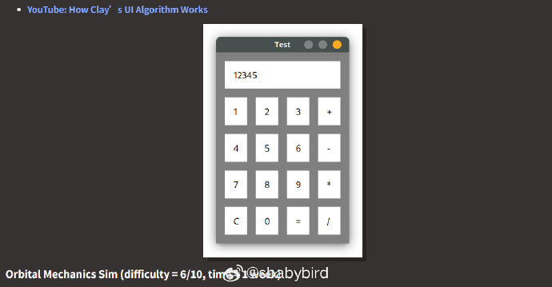
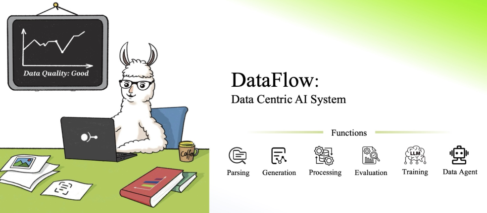
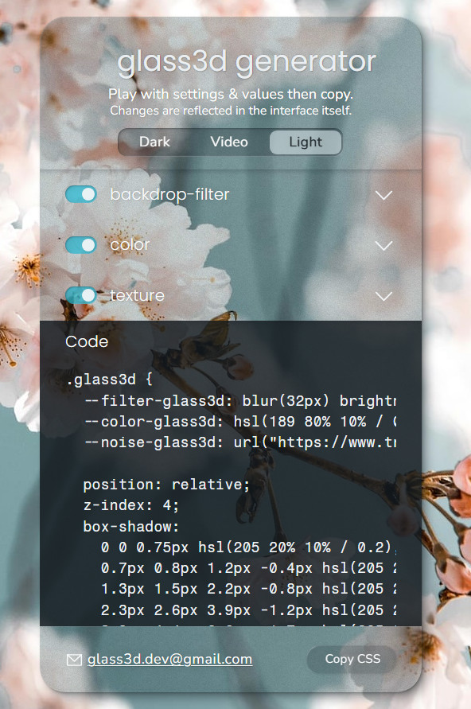
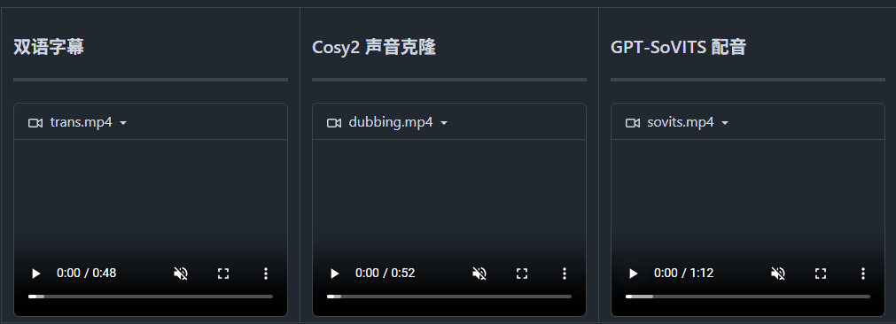
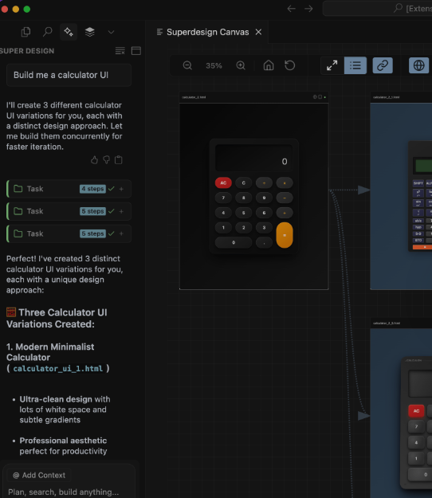
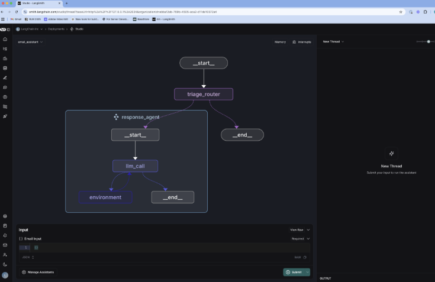

# 机器文摘 第 138 期
### 在虚拟机中启用 CPU 风扇

一位开发者通过调用冷门系统API，成功[欺骗虚拟机（VM）使其认为自己配备了物理CPU风扇](https://wbenny.github.io/2025/06/29/i-made-my-vm-think-it-has-a-cpu-fan.html)。这篇文章讲述了一个关于如何让虚拟机（VM）误以为它拥有一个CPU风扇的故事。作者通过技术手段修改了虚拟机的系统管理BIOS（SMBIOS）数据，使得虚拟机中的恶意软件检测不到它运行在虚拟环境中。

一些恶意软件会通过检测某些硬件组件是否存在来判断是否运行在虚拟机中，因为虚拟环境通常不会完整地模拟所有硬件。其中一个常见的检测点是CPU风扇，恶意软件会通过检查WMI（Windows Management Instrumentation）中的Win32_Fan类来判断。

作者希望通过让虚拟机“拥有”CPU风扇，来欺骗恶意软件，使其认为自己运行在物理机上，从而绕过恶意软件的虚拟机检测机制。

SMBIOS是一个存储系统硬件信息的标准，计算机通过读取SMBIOS数据来识别硬件设备，包括CPU风扇。

作者通过反汇编cimwin32.dll发现，Win32_Fan类通过读取SMBIOS数据（特别是类型27的条目）来获取风扇设备信息。

作者使用dmidecode工具从物理主机上获取了CPU风扇的SMBIOS数据，并将其转换为字节格式。

通过伪造SMBIOS数据，作者成功让虚拟机“拥有”了CPU风扇，从而欺骗了恶意软件的检测机制。这一技术不仅可以用于CPU风扇，还可以扩展到其他硬件组件和WMI类。

### 编写玩具软件是一种乐趣

[software is joy](https://blog.jsbarretto.com/post/software-is-joy)，John Barretto 在这篇短文中抛出了一个反工业化开发的清新主张：当现代软件日益被效率、规模和AI工具裹挟时，亲手编写“玩具软件”才是重新触摸编程本真快乐的密钥。

玩具软件的本质：指那些无商业压力、纯粹为探索或乐趣而建的“无用之物”（如迷你解释器、自制渲染器）。它们剥离了工业化开发的功利性，让开发者回归“创造欲”的原点。

费曼名言的实践：文中引用物理学家费曼的箴言——“我无法创造的东西，我就无法理解”（What I cannot create, I do not understand），直指玩具项目的终极意义：通过从零构建，开发者能穿透技术表象，抵达系统性理解的深层愉悦。

对抗“工具化”的良药：当AI生成代码逐渐普及，被动使用工具易导致思维钝化。而玩具项目要求开发者主动设计、调试与迭代，这种全链条的创造性掌控，正是抵御“工具化”的精神锚点1。

### 以数据为中心的 AI 系统

[DataFlow](https://github.com/OpenDCAI/DataFlow)，是一个数据准备系统，旨在从噪声数据源（PDF、纯文本、低质量问答）中解析，生成，加工并评估高质量数据，以提升大语言模型（LLMs）在特定领域的表现，支持预训练、监督微调（SFT）、强化学习训练以及基于知识库的 RAG 系统。

> 我们在医疗、金融和法律等多个垂类领域实证验证了 DataFlow 的有效性。

主要特性：
1. 支持多种数据源（PDF、文本、低质量问答）的解析与处理； 
2. 提供多种预构建的高效数据处理管道；
3. 配备智能DataFlow-agent，可根据任务需求动态构建新管道。

### 用纯 CSS 来做出毛玻璃效果

[glass3d](https://glass3d.dev)，在市面上有很多玻璃拟态生成器，但 glass3d 想把这种效果做得更进一步！这个项目是作者花费数月时间，不断尝试CSS属性层叠并与各种浏览器兼容性问题作斗争的结果。

效果包括：
1. 可调节的模糊、亮度和饱和度（通过 backdrop-filter 实现）
2. 微妙的半透明纹理
3. 仿3D斜角效果（使用 box-shadow 实现，而非 outline）

玻璃拟态效果相当消耗（计算机）资源，因此最好只用作点缀，并避免在宽大的桌面元素上使用。它应该与最新版本的Chrome、Safari和Firefox（桌面端和移动端）兼容。

### 一键搬运视频工具

[VideoLingo](https://github.com/Huanshere/VideoLingo)，这个工具使用 yt-dlp下载油管视频，然后进行AI字幕分割，AI翻译，自动增字幕，使用大模型进行配音。实现了一个全流程的搬运工具。

主要功能：
- 🎥 使用 yt-dlp 从 Youtube 链接下载视频
- 🎙️ 使用 WhisperX 进行单词级和低幻觉字幕识别
- 📝 使用 NLP 和 AI 进行字幕分割
- 📚 自定义 + AI 生成术语库，保证翻译连贯性
- 🔄 三步直译、反思、意译，实现影视级翻译质量
- ✅ 按照 Netflix 标准检查单行长度，绝无双行字幕
- 🗣️ 支持 GPT-SoVITS、Azure、OpenAI 等多种配音方案
- 🚀 一键启动，在 streamlit 中一键出片
- 🌍 多语言支持就绪的 streamlit UI
- 📝 详细记录每步操作日志，支持随时中断和恢复进度

与同类项目相比的优势：绝无多行字幕，最佳的翻译质量，无缝的配音体验

### 集成在 IDE 中的开源 AI 设计 Agent

[SuperDesign](https://github.com/superdesigndev/superdesign)，可直接在 IDE 中生成 UI 设计。

通过自然语言提示就能生成完整的 UI 界面、可复用组件和线框图，并支持 Cursor、Windsurf、VS Code 等主流 AI 编辑器。

主要特性：

- 产品界面生成：通过单个提示即可创建完整 UI 界面
- UI 组件创建：生成可直接使用的可复用组件  
- 线框图绘制：快速探索低保真度布局设计
- 设计分支和迭代：轻松复制和改进现有设计
- 提示词转代码：将设计提示直接复制到 AI IDE 中

通过 Cursor/VS Code 市场安装插件即可使用，其中设计文件本地存储在 .superdesign/ 目录中。

### 从零开始构建 AI Agent 的完整教程指南

[Agents From Scratch](https://github.com/langchain-ai/agents-from-scratch)，LangChain 官方团队开放了一份从零开始构建 AI Agent 的完整教程指南。通过构建一个能管理邮件的智能助手，循序渐进地教授代理构建、评估、人机交互和记忆机制等核心技术，最终能连接真实的 Gmail API。

主要内容：

- 从基础智能代理到高级功能的完整学习路径
- 实战构建邮件助手项目，包含邮件分类和自动回复
- 智能代理评估方法，使用 LLM 作为评判器
- 人机交互机制，支持用户审核关键操作
- 记忆系统实现，让代理能学习和适应用户偏好
- Gmail API 集成和部署指南，可投入实际使用

适合想学习 AI Agent 开发的 AI 开发者，提供了完整的开发环境配置和测试方案。

## 订阅
这里会不定期分享我看到的有趣的内容（不一定是最新的，但是有意思），因为大部分都与机器有关，所以先叫它“机器文摘”吧。

Github仓库地址：https://github.com/sbabybird/MachineDigest

喜欢的朋友可以订阅关注：

- 通过微信公众号“从容地狂奔”订阅。

