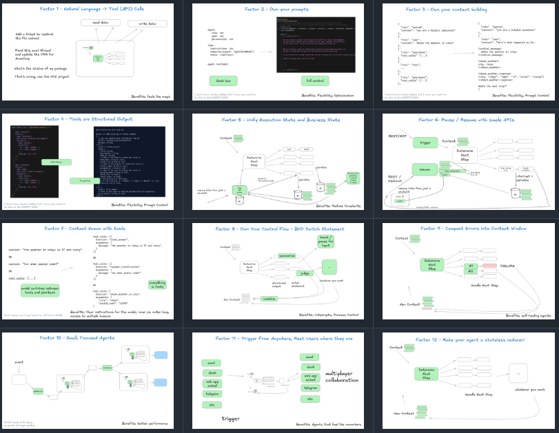
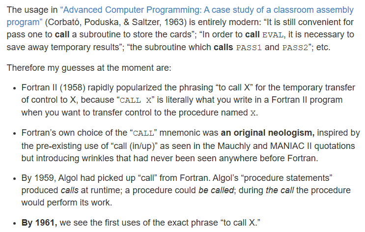
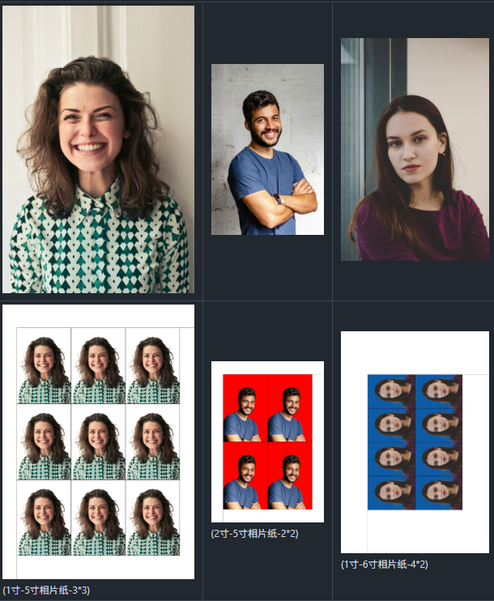
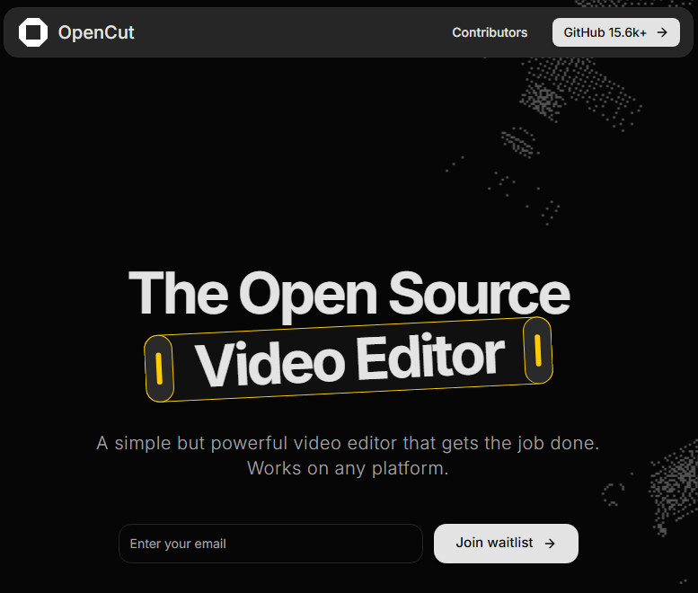
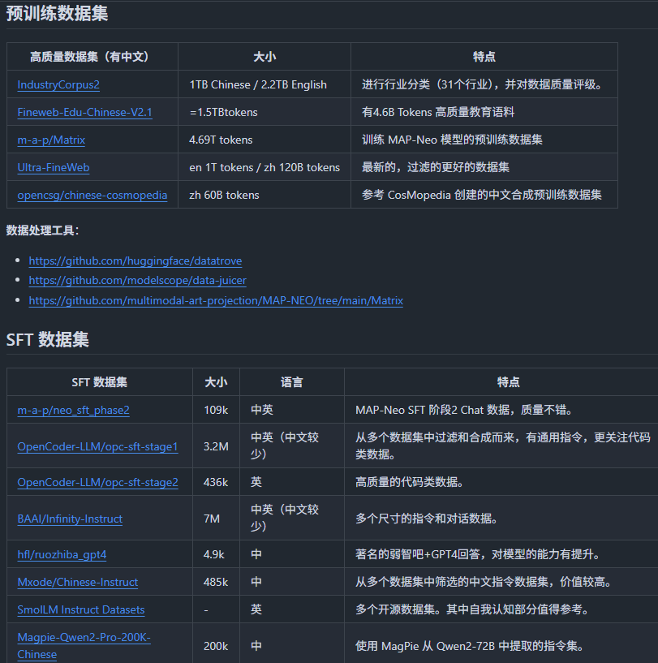
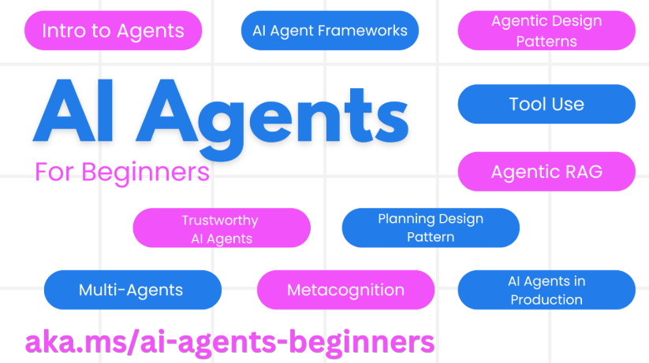
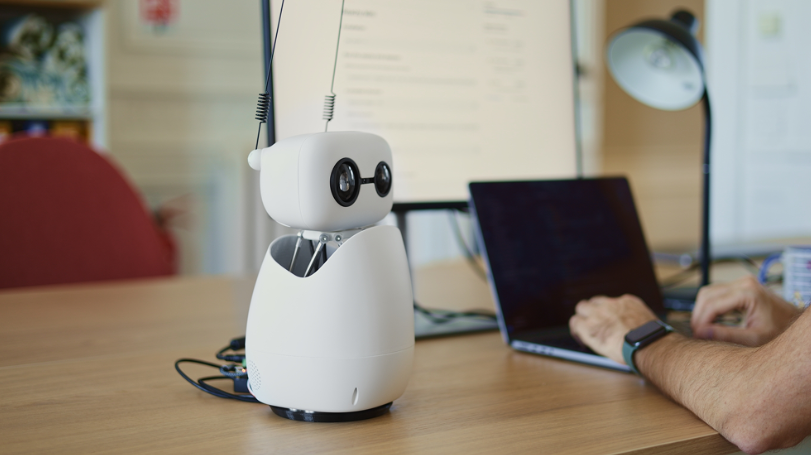
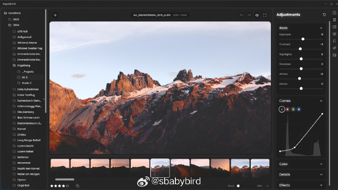

# 机器文摘 第 139 期
### 构建可靠 LLM 应用程序的原则

[12-factor-agents](https://github.com/humanlayer/12-factor-agents)，我们可以使用哪些原则来构建真正足够好并可以交到生产客户手中的 LLM 软件？

项目的作者对于智能体的构建进行了总结，总结出了 12 种模式和设计原则。

主要内容：
- How We Got Here: A Brief History of Software 我们如何走到今天：软件简史
- Factor 1: Natural Language to Tool Calls 因素 1：自然语言到工具调用
- Factor 2: Own your prompts 因素 2：拥有自己的提示
- Factor 3: Own your context window 因素 3：拥有自己的上下文窗口
- Factor 4: Tools are just structured outputs 因素 4：工具只是结构化的输出
- Factor 5: Unify execution state and business state 因素 5：统一执行状态和业务状态
- Factor 6: Launch/Pause/Resume with simple APIs 因素 6：使用简单的 API 启动/暂停/恢复
- Factor 7: Contact humans with tool calls 因素 7：通过工具调用与人类联系
- Factor 8: Own your control flow 因素 8：拥有自己的控制流
- Factor 9: Compact Errors into Context Window 因素 9：将错误压缩到上下文窗口中
- Factor 10: Small, Focused Agents 因素 10：小型、专注的代理商
- Factor 11: Trigger from anywhere, meet users where they are 因素 11：随时随地触发，随时随地与用户见面
- Factor 12: Make your agent a stateless reducer 因素 12：让你的代理成为无状态的 Reducer

### “函数调用”为什么被叫做“call functions”

我们每天都在写 foo()，但有没有想过——为什么这叫‘调用（call）’一个函数，而不是‘启动’、‘执行’或者‘使唤’？

这篇趣味考据[《Why do we “call” functions?》](https://quuxplusone.github.io/blog/2025/04/04/etymology-of-call/)给出了一个出人意料的答案：把函数“call”出来，其实源自图书馆的“call number（索书号）”！

作者从 StackExchange 上的一次闲聊出发，一路追到 1876 年杜威十进分类法、1947 年冯·诺依曼架构的 EDVAC 报告、1958 年 Fortran II 手册，再到 1960 年代的 Algol 规范，用大量一手文献串起了“call”这个词从“到图书馆喊一嗓子取书”到“在代码里喊一嗓子取函数”的完整演化史。

### 开源证件照处理程序

[LiYing](https://github.com/aoguai/LiYing)，是一套适用于自动化 完成一般照相馆后期证件照处理流程的照片自动处理的程序。

可以完成人体、人脸自动识别，角度自动纠正，自动更换任意背景色，任意尺寸证件照自动裁切，并自动排版。

完全离线运行。所有图像处理操作都在本地运行。

主要功能：

- 人脸和人体自动识别定位，精准抠图换背景
- 照片角度自动纠正，解决拍摄角度问题
- 支持任意背景色替换，一键生成不同底色证件照
- 多种证件照尺寸自动裁切，涵盖1寸到6寸各种规格
- 智能排版功能，自动生成照片表格便于打印
- 完全离线运行，保护隐私且无需网络连接

提供 Windows 整合包直接使用，也可通过源码安装运行。

### 开源视频剪辑软件

[OpenCut](https://github.com/OpenCut-app/OpenCut)，适用于 Web、桌面和移动设备的免费开源视频编辑器。

据说是有人嫌弃收费版的 CapCut 卖的太贵，发起了这个开源项目，完全免费，功能对标 CapCut。

主要特性：
- Timeline-based editing  基于时间轴的编辑
- Multi-track support  多轨支持
- Real-time preview  实时预览
- No watermarks or subscriptions 无水印或订阅
- Analytics provided by Databuddy, 100% Anonymized & Non-invasive. 由 Databuddy 提供的分析，100%匿名和非侵入性。

### 大语言模型高质量数据集汇总（2025.5 更新）

[大语言模型高质量数据集汇总](https://github.com/ninehills/blog/issues/129)，本贴收藏整理了数十份用于训练和评估大模型的数据集。

### 微软官方的面向初学者的AI Agent开发课程

[11 Lessons to Get Started Building AI Agents](https://github.com/microsoft/ai-agents-for-beginners)，微软官方的面向初学者的AI Agent开发课程，包含 11 个课程，涵盖了构建 AI 代理的基本知识。

既然是面向初学者的，就有一些“21 天精通 C++”的味道。不过也算适合入门。

课程内容目前以英文为主，后续将翻译为多国语言支持。

### Hugging Face 开源的智能小机器人

Hugging Face 的开源小机器人 [Reachy Mini](https://huggingface.co/blog/reachy-mini) ，支持 Python 编程（即将支持 JavaScript 和 Scratch），价格 299 美元起（比起国内的开源机器人可是贵了不少，我之前试过的小智机器人开发板才不到一百块钱人民币）。

Reachy Mini 高 28 厘米，宽16 厘米（睡眠模式下约 23 厘米高），重量 1.5 公斤。

它以套件形式提供，有 Lite 版（299 美元，不带算力板，需接 Mac、Linux，稍后支持 Windows）和正式版（449 美元，配树莓派5、电池）两种版本。

Reachy Mini  配备摄像头、麦克风和扬声器，头部有 6 个自由度，提供了 15 种以上的机器人行为，开箱即用。

### 开源 RAW 图像编辑器

[RapidRAW](https://github.com/CyberTimon/RapidRAW)一款美观、无损且 GPU 加速的 RAW 图像编辑器，在构建时充分考虑了性能。

RapidRAW 是 Adobe Lightroom 的现代、高性能替代品。它以适用于 Windows、macOS 和 Linux 的轻量级软件包（小于 30MB）提供功能丰富、美观的编辑体验。

作者在 18 岁时开发了这个项目，作为一项个人挑战。目标是在 Google Gemini 的支持下，为自己的摄影工作流程创建一个高性能工具，同时加深其对 React 和 Rust 的理解。

### 一个网络监控工具 

[Sniffnet](https://sniffnet.net/)，你可以看到你机器上的流量情况，包括在和谁交换数据，并且可以深入检查网络中的情况。 ​​​

## 订阅
这里会不定期分享我看到的有趣的内容（不一定是最新的，但是有意思），因为大部分都与机器有关，所以先叫它“机器文摘”吧。

Github仓库地址：https://github.com/sbabybird/MachineDigest

喜欢的朋友可以订阅关注：

- 通过微信公众号“从容地狂奔”订阅。

