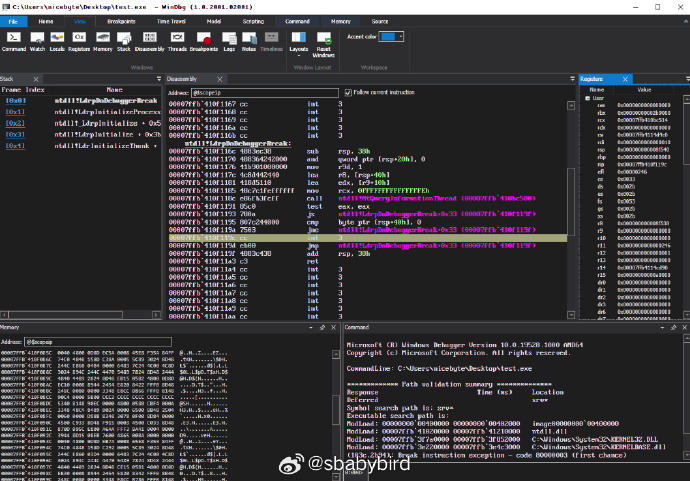
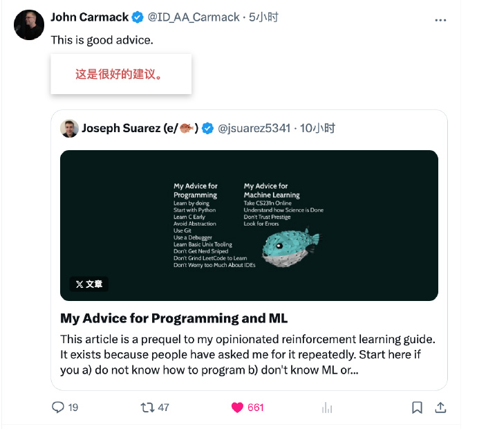
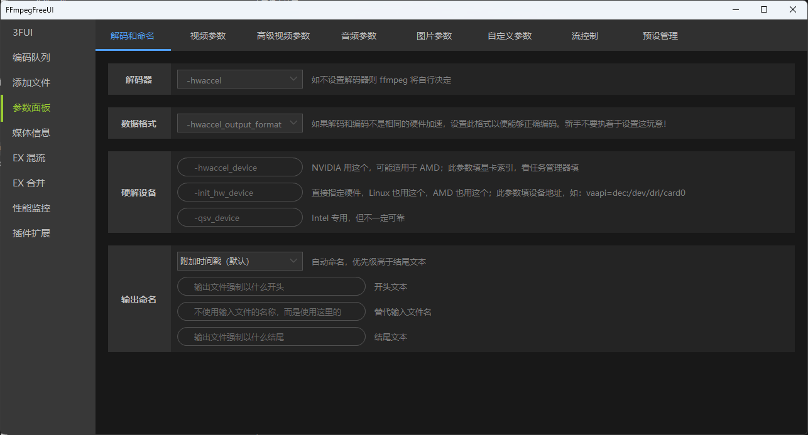
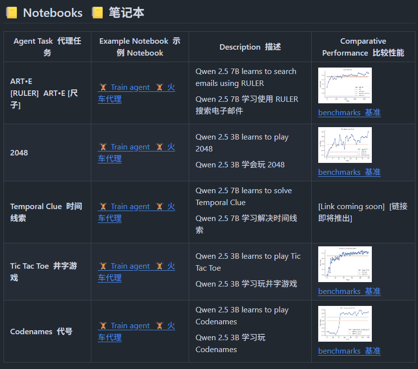

# 机器文摘 第 140 期
### x64 汇编编程入门教程

如果你曾好奇C代码最终如何与 CPU 对话，或者想深入理解程序的性能瓶颈，这篇从零开始的 x64 汇编教程就是为你准备的。它没有陈旧的理论，只有直达核心的现代实战。

  来自 gpfault.net 的[这篇教程](https://gpfault.net/posts/asm-tut-0.txt.html)是“现代 x64 汇编”系列的第一部分。作者没有一上来就抛出指令集，而是先回答了一个最重
  要的问题：在2024年，我们为什么还要学习汇编？

  答案非常清晰：
   1. 理解底层：真正明白我们的高级语言代码是如何在硬件上执行的。
   2. 性能优化：识别并解决编译器无法优化的性能瓶颈。
   3. 安全研究：进行逆向工程和漏洞分析。
   4. 调试：在没有源码的情况下，深入调试复杂问题。

  这篇文章最大的特点是它的纯粹性。它将带你使用 NASM 汇编器和 ld
  链接器，在不依赖任何 C 标准库（libc）的情况下，编写一个打印 "Hello, world!" 的程序。
  
  你将直接通过系统调用
  (syscall) 与Linux内核交互，亲手完成 write（写入屏幕）和 exit（退出程序）这两个核心操作。

  整个过程就像是剥开了操作系统的层层外壳，让你直接触摸到程序执行的最基本脉络。

### 被卡马克推荐的十大编程建议

[@Joseph Suárez](https://x.com/jsuarez5341)  在 X 上发表了关于编程的十条建议，如果希望成为编程高手，可以参考一下。

*该推还被游戏编程大神约翰卡马克转推并赞同了*。

十条建议翻译为中文如下：

>1. 通过实践学习。从耗时几小时的项目开始，逐步挑战需要数天完成的任务。简单的游戏是绝佳选择，因为你能快速获得大多数问题的可视化反馈。我推荐使用 raylib 进行渲染——它轻量级、支持几乎所有语言，且该库本身就是优秀软件设计的典范。
>
>2. 从 Python 开始。很多资深开发者讨厌 Python，我有时也讨厌它。但无论如何你都应该从 Python 入手，因为它能让你比几乎任何其他语言更快起步。你遇到的大多数 AI 项目至少表层代码都是用 Python 写的。不过别在 Python 上停留太久——语言的设计会引导你以特定方式思考问题。避免使用复杂的外部包、继承、装饰器，以及任何会让你偏离学习用赋值、条件、迭代和函数来表达逻辑的东西。写几个基础游戏、应用程序或工具后就转向其他语言。包管理推荐使用 uv。
>
>3. 尽早学习 C 语言。C 是一门非常适合编写高性能软件的极简语言。我之所以不建议初学者先学 C，唯一原因是它要求你同时理解计算机和操作系统的工作原理，这对新手来说信息量过大。你需要掌握的核心概念包括：数据类型、类型转换、结构体、（单遍）编译、链接、内存分配、栈与堆的区别、指针。现阶段请避开 C++，它只是在 C 语言基础上堆砌了大量你暂时用不着的复杂功能。
>
>4. 警惕过度抽象。始终以最简单的方式解决眼前问题为目标。除非能百分百确定未来会出现某种情况，否则不要为了追求通用性而增加复杂度。即便真有这种需求，通常也等真正遇到时再解决更明智。C 语言在这方面表现优异，因为它移除了继承体系和臃肿第三方库这类诱人但事与愿违的工具。
>
>5. 使用 Git。这一点基础到我差点忘了提。默认在 GitHub 上创建新项目并频繁提交。这是避免工作丢失的最佳方式，还能为那些"明明之前能用"的代码提供版本回溯。~所有开源项目都通过 GitHub 运作。
>
>6. 善用调试器。调试器能让你逐行执行代码并检查局部变量值，比到处塞 print 语句高效灵活得多，还能快速跳转检查。Python 用 pdb，C 语言用 gdb 就够。写 C 语言务必搭配地址消毒器(Address Sanitizer)，它能提供可读的错误提示——重要到我建议没有它就别碰 C 语言。
>
>7. 掌握基础 Unix 工具。尽快熟悉命令行操作，不必追求花哨。像 ls、pwd、cat、head、mv、cp、cd、mkdir、top 等基础命令就能满足 90%的日常需求，最常用的工具不超过 10 个。条件允许尽量用原生 Linux 系统，MacOS 尚可，Windows 则不建议——若不想双系统就装 WSL。推荐安装基础版 Ubuntu，别过度折腾系统定制。熟悉发行版的包管理工具（很可能是 apt），别用 snap。
>
>8. 警惕技术陷阱。程序员总爱发明些让事情更糟的"聪明"办法来浪费你时间。新手尤其要避开：面向对象和函数式编程（都是教条）、测试驱动开发（少量测试无妨）、频繁更换语言和发行版、行业"最佳实践"（FAANG 里蹩脚工程师多的是）、Python 类型提示系统、C 语言的 make/cmake、Hydra 这类复杂配置解析器、GitHub 子模块和花哨的 CI、React 等现代前端框架（学基础 HTML+CSS 就够了）、系统美化、X 上最新的编程潮流，以及我在开发直播里吐槽过的一切。
>
>9. 不要为了学习而刷 LeetCode。虽然这对求职面试可能是种必要的妥协，但用巧妙算法解决刁钻问题并不能代表编程的全貌。你当然应该学习基础数据结构和算法，但相比构建更多项目，掌握十种动态编程变体在面试之外的作用有限。我已多年未参加编程面试，但我确信 18 岁的我会比 28 岁的我表现更好——而 28 岁的我在其他所有方面都更出色。
>
>10. 不必过度纠结 IDE 选择。这真的没那么重要。我只用带两个插件的 NeoVim，它轻量且不碍事。是的，我用过无数 IDE；不，这根本不重要。VSCode 就不错，但请坚持通过终端运行代码而非依赖项目配置和按钮。这会打破"IDE 是神奇必需品"的幻觉。别用 AI 优先的编辑器。当你掌握了基础后，像 Copilot 或 SuperMaven 这类代码补全工具无妨，但请仅用于节省打字和文档查阅时间——而非替代思考。

### Bilibili 发布的文本生成语音大模型

[IndexTTS2](https://index-tts.github.io/index-tts2.github.io/)，Bilibili Index 语音团队开发的文本到语音的大模型，效果惊人，他们用了《让子弹飞》、《甄嬛传》来示意这个模型的语音生成能力，不仅给张麻子、黄四郎、皇后、甄嬛加上了英配，还能精确控制情绪和时长（非常适合用来进行影视配音）。

主要特性：
- 零样本语音克隆
- 支持情绪分离
- 指定 token 数量，来控制生成的语音长度
- 基于 Qwen3 微调，支持手动编辑情绪

### Windows 上 FFmpeg 的专业交互界面

[FFmpegFreeUI](https://github.com/Lake1059/FFmpegFreeUI)，是 ffmpeg 在 Windows 上的轻度专业交互外壳，收录大量参数，界面美观，交互友好。此项目面向国内使用环境，让普通人也能够轻松压制视频和转换格式。

对于不习惯使用命令行参数（主要是也不好记，我每次都是用大模型帮我生成命令）来操作 ffmpeg 进行音视频格式处理的人来说真是福音。

亮点：
1. 永久免费、干净无广告；
2. 支持实时计算剩余时间和预估最终大小；
3. 开发插件扩展功能，VB 和 C# 都能写；

### Blender Studio 官方发布了一个游戏

[Dog walk](https://blenderstudio.itch.io/dogwalk)。是一个简短的休闲互动故事。玩家将扮演一只可爱的大狗穿越冬季树林，帮助一个小孩子用隐藏在环境中的五颜六色的物品装饰雪人。

在这个微型开放世界中，您可以尽情漫步露营地、森林小径、田园诗般的小溪和结冰的池塘。

引导或拖动您拖着的小孩主人。互相帮助，成为威胁或做一个好孩子。

该项目免费向所有人开放原始文档和代码，用于测试和改进 Blender 和 Godot 游戏引擎。

### 训练 Agent 智能体能力的专用框架

[ART （Agent Reinforcement Trainer）](https://github.com/OpenPipe/ART)，使用这个框架可以将 GRPO 【群体相对策略优化(GRPO，Group Relative Policy Optimization) 是一种强化学习 (RL) 算法，专门用于增强大型语言模型(LLM) 中的推理能力】集成到你的 python 应用中，比如使用这个训练 Qwen2.5-7B 搜索邮件，或者玩各种游戏。这里使用小模型是因为小模型更适合用于这些零散任务的驱动模型。

使用 GRPO 训练多步骤代理完成实际任务。相当于为智能体提供在职培训。支持 Qwen2.5、Qwen3、Llama、Kimi 等 LLM；

## 订阅
这里会不定期分享我看到的有趣的内容（不一定是最新的，但是有意思），因为大部分都与机器有关，所以先叫它“机器文摘”吧。

Github仓库地址：https://github.com/sbabybird/MachineDigest

喜欢的朋友可以订阅关注：

- 通过微信公众号“从容地狂奔”订阅。

