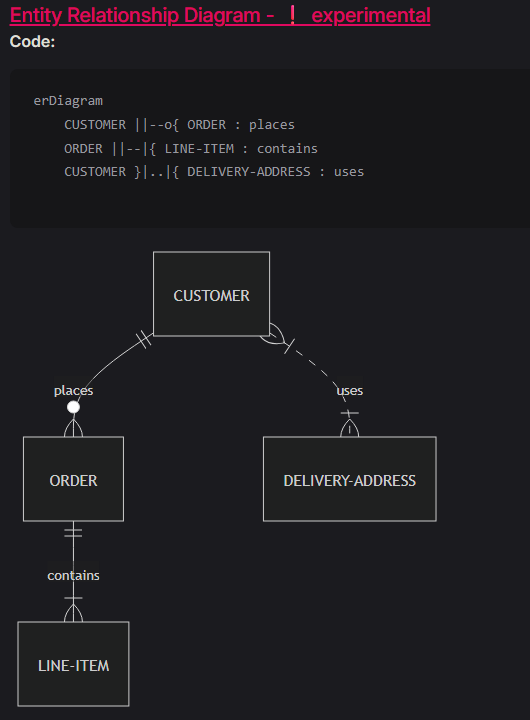
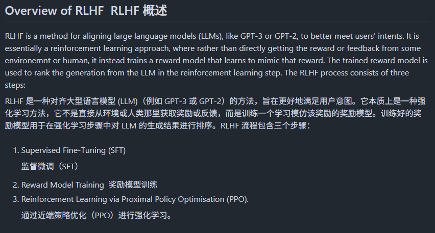

# 机器文摘 第 141 期
### 大语言模型的演进

[一篇长文，介绍大语言模型的演进](https://goyalpramod.github.io/blogs/evolution_of_LLMs/)，（主要是自2017年 Transformer 架构被引入以来的演进）。

这篇文章主要探讨了自2017年以来语言模型的演变历程，重点介绍了Transformer架构的引入以及随后在自然语言处理领域引发的数学基础、架构创新和训练突破。文章详细分析了Transformer、RLHF（基于人类偏好的强化学习）、PPO（近端策略优化）和MoE（混合专家模型）等关键技术和理论，并探讨了BERT、GPT-1等模型的创新之处。

### LLM 架构对比

[大型 LLM 架构对比](https://sebastianraschka.com/blog/2025/the-big-llm-architecture-comparison.html)，文中列举了 llama-3.2, Qwen3-4B, SmolLM3-3B, DeepSeek-V3, Qwen3-235B-A22B, Kimi-K2 的架构并详细探讨了他们的区别和优势。

### 字节跳动开源了“扣子”平台

[Coze Studio](https://github.com/coze-dev/coze-studio)，是一站式 AI Agent 开发工具。提供各类最新大模型和工具、多种开发模式和框架，从开发到部署，为你提供最便捷的 AI Agent 开发环境。

主要特性：
- 提供 AI Agent 开发所需的全部核心技术：Prompt、RAG、Plugin、Workflow，使得开发者可以聚焦创造 AI 核心价值。
- 开箱即用，用最低的成本开发最专业的 AI Agent：Coze Studio 为开发者提供了健全的应用模板和编排框架，你可以基于它们快速构建各种 AI Agent ，将创意变为现实。

| **功能模块** | **功能点**                                                                         |
| ------------ | ---------------------------------------------------------------------------------- |
| 模型服务     | 管理模型列表，可接入OpenAI、火山方舟 等在线或离线模型服务                          |
| 搭建智能体   | * 编排、发布、管理智能体   * 支持配置工作流、知识库等资源                       |
| 搭建应用     | * 创建、发布应用   * 通过工作流搭建业务逻辑                                     |
| 搭建工作流   | 创建、修改、发布、删除工作流                                                       |
| 开发资源     | 支持创建并管理以下资源：   * 插件   * 知识库   * 数据库   * 提示词     |
| API 与 SDK   | * 创建会话、发起对话等 OpenAPI   * 通过 Chat SDK 将智能体或应用集成到自己的应用 |

感觉会成为 dify 的强有力竞争对手。

### 浏览器阅读Markdown的插件

[Markdown Reader](https://md-reader.github.io/)，可以用这个扩展在浏览器里高效阅读Markdown 文件（支持本地文件需要开启权限）。 ​​​

### 帮你监控咸鱼的工具

[ai-goofish-monitor](https://github.com/dingyufei615/ai-goofish-monitor)，一个基于 Playwright 和AI过滤分析的闲鱼多任务实时监控与智能分析工具，配备了功能完善的 Web 管理界面。

在闲鱼上越来越难淘到个人闲置的好东西了，刷到的大多是商家货。这个工具能实时监控和分析闲鱼商品。你只需用文字描述想买什么，它就能自动设置监控任务，帮你精准找到匹配的商品。

### 用类 Markdown 语法快速生成多种复杂图表

[Mermaid](https://mermaid.js.org/)，用类 Markdown 语法快速生成多种复杂图表的开源 JavaScript 工具，为文档与开发流程无缝衔接提供高效方案。

- 支持流程图、时序图、甘特图、类图、状态图、饼图、Git 图谱、用户旅程图、C4 架构图等多种图形表达形式。  
- 以文本驱动图形，降低绘图门槛，非程序员也能通过 Mermaid Live Editor 轻松创建和编辑。  
- 消除文档滞后的痛点，实现图文同步更新，提升团队沟通和知识管理效率。  
- 可集成到 GitHub 及主流应用中，支持 CDN 引入，适合嵌入生产脚本和自动化流程。  
- 强调视觉回归测试，保障图形变更的可控性和稳定性，提升维护质量。  
- 社区活跃，已有 8 万+星，持续迭代与贡献，MIT 许可证，开放共建。  
- 针对安全风险设计沙箱渲染模式，兼顾交互功能与防范恶意脚本。  
  
通过“代码即文档”的理念，Mermaid 将图形表达纳入代码管理体系，促进文档的实时演进，打破传统图形工具的隔阂，实现开发与非开发人员的高效协作。长期看，这种基于文本的图形描述是构建可维护、透明且自动化文档体系的核心路径。  

### 从零开始学习 RLHF（人类反馈强化学习）教程

[RLHF_in_notebooks](https://github.com/ash80/RLHF_in_notebooks)，仅用 3 个完整 Notebook 笔记带我们一步步实现 RLHF 全流程。

基于 GPT-2 模型和电影评论情感数据集，演示了从监督微调到奖励建模再到 PPO 强化学习的完整过程。

主要内容：

- 监督微调（SFT）：在情感数据集上微调 GPT-2 模型
- 奖励模型训练：训练能够识别正面情感的奖励模型
- PPO 强化学习：使用策略优化让模型生成更积极的内容
- 完整代码实现：三个独立的 Notebook 详细展示每个步骤
- 实际案例演示：将 GPT-2 训练成只生成正面情感句子的模型
- 配套视频教程：YouTube 上有对应的详细讲解视频

不仅如此，还配套了详细的视频教程，感兴趣的同学，按顺序运行三个 Notebook 即可完成学习。

## 订阅
这里会不定期分享我看到的有趣的内容（不一定是最新的，但是有意思），因为大部分都与机器有关，所以先叫它“机器文摘”吧。

Github仓库地址：https://github.com/sbabybird/MachineDigest

喜欢的朋友可以订阅关注：

- 通过微信公众号“从容地狂奔”订阅。

