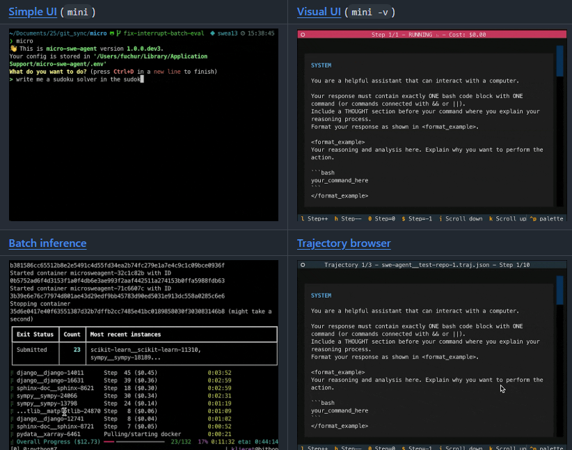

# 机器文摘 第 142 期

### 让 Qwen3-0.6B 拥有视觉的教程

[让Qwen3-0.6B拥有视觉](https://mp.weixin.qq.com/s/dMr1KmlesrdQG2WNauzpwQ)，介绍了一种将 SmolVLM2 视觉模块 和 Qwen3-0.6B 进行模型拼贴的方法，并通过微调实现具备「超小规模+多模态+支持中文」特性的“Qwen3-SmVL”。

> 最近Huggingface团队发布了超小多模态模型SmolVLM2，可以做到端侧1GB显存推理。在怀着惊喜试用后发现，虽然模型有极其强大的视觉文本理解能力，但是模型却无法理解中文，这对中文技术社区并不是非常友好。
> 
> 刚好前段时间做SwanLab硬件检测适配时有一台未到期的沐曦曦云C500服务器，因此萌生了把当前中文小模型扛把子Qwen3与SmolVLM2直接微调拼接的想法。
> 
> 本教程将介绍一种模型拼接的思路，将SmolVLM2的视觉模块（0.09B）与Qwen3最小的模型（0.6B）进行对齐微调，最终使得Qwen模型具备一定的视觉理解能力。

### 基于 LLM 的结构化信息提取库

[LangExtract](https://github.com/google/langextract)，谷歌开源的一个能从非结构化信息中提取结构化信息的库。

使用 LLMs 从非结构化文本文档中提取结构化信息，这些信息基于用户定义的指令。 它处理诸如临床笔记或报告之类的材料，识别并整理关键细节，同时确保提取的数据与源文本相对应。

### 终端中的 AI 编程助手

[Crush](https://github.com/charmbracelet/crush)，将你喜爱的终端环境与多样化 LLM 无缝融合，打造专业、高效且灵活的 AI 编码工作站。深度整合多模型与工作流，提升开发效率与体验。

设计理念凸显“工具即服务”的方法论，强调持续上下文管理和多模型协同，适应不同项目需求，具备长期演进潜力。

主要特性：
- 多模型支持：可切换多种 LLM，支持 OpenAI、Anthropic 等兼容 API，实时转换模型不中断上下文  
- 会话管理：针对项目维护多会话、多上下文，代码与工具环境无缝串联  
- LSP 集成：利用语言服务器协议增强上下文感知，辅助智能代码生成与提示  
- 拓展性强：支持 MCP（http、stdio、sse）协议扩展能力，灵活集成自定义功能  
- 跨平台兼容：macOS、Linux、Windows（PowerShell/WSL）、FreeBSD/OpenBSD/NetBSD 全面支持  
- 便捷安装：支持 Homebrew、npm、Arch、Nix、Go 等多种安装方式，Debian/RPM 包及多平台二进制均可用  
- 配置灵活：JSON 格式配置支持本地和全局，权限白名单及自定义 Provider 深度定制  
- 日志追踪：内置日志管理，支持实时查看和调试，助力问题快速定位  

### 一个深度研究 Agent

[Open Deep Research](https://github.com/langchain-ai/open_deep_research)，来自 LangChain 团队完全开源的一个深度研究 Agent。

支持多种模型提供商和搜索工具，能够自行执行复杂的研究任务，从信息收集到分析整理自动化处理。

主要特性：

- 支持 OpenAI、Anthropic、Google 等多种模型提供商
- 集成 Tavily、原生网页搜索等多种搜索工具
- 可配置的并发研究单元，提升研究效率
- 支持 MCP 服务器扩展，增强研究能力
- 提供 LangGraph Studio 可视化界面
- 内置评估系统，确保研究质量

### 在线配色生成器

[Color Generator](https://kigen.design/color)，这个配色生成器很适合我这种强迫症，输入一个颜色，自动帮你生成一批好看的颜色，界面真的很清新啊。可以直接复制网站给出的 CSS 代码。 ​​​

### 背景纹理生成器

[CSS3 Patterns Gallery](https://projects.verou.me/css3patterns/)，这个网站有好多纯CSS3实现的各种背景纹理，包括程序员最爱的格子衫纹理。

### 通义万相 Wan2.2 系列模型

[Wan2.2](https://github.com/Wan-Video/Wan2.2)，通义万相 2.2（Wan 2.2）是阿里云推出的新一代多模态生成模型。该模型采用创新的 MoE（Mixture of Experts）架构，由高噪专家模型和低噪专家模型组成，能够根据去噪时间步进行专家模型划分，从而生成更高质量的视频内容。

Wan 2.2 具备三大核心特性：
- 影视级美学控制，深度融合专业电影工业的美学标准，支持光影、色彩、构图等多维度视觉控制；
- 大规模复杂运动，轻松还原各类复杂运动并强化运动的流畅度和可控性；
- 精准语义遵循，在复杂场景和多对象生成方面表现卓越，更好还原用户的创意意图。

模型支持文生视频、图生视频等多种生成模式，适用于内容创作、艺术创作、教育培训等多种应用场景。

目前 Wan2.2 支持在通义官网、魔搭社区、HuggingFace 和 GitHub 下载，也提供阿里云的 API 服务。

### 基于 Python 的文件服务器工具

[copyparty](https://github.com/9001/copyparty)，只需 Python 即可运行，支持断点续传下载上传，兼容几乎所有网页浏览器，还能同时提供 HTTP、WebDAV、FTP、TFTP、SMB 多种协议访问。

主要特性：

- 支持 HTTP/WebDAV/FTP/TFTP/SMB 多协议文件传输
- 断点续传上传下载，网络中断也不怕
- 内置音频播放器，支持几乎所有音频格式
- 文件搜索和媒体标签索引功能
- 用户权限管理，支持只读、只写等细粒度控制
- 跨平台运行，支持 Windows、Linux、macOS、Android

提供一键 Python 脚本部署，也有 Windows exe 版本和 Docker 镜像。

### 100 行代码的智能体框架

[mini-swe-agent](https://github.com/SWE-agent/mini-swe-agent)，SWE-bench 推出的智能体框架，只有 100 行 python（环境、模型、脚本总共 +100 行），解决了 SWE-bench 验证基准测试（使用 Claude Sonnet 4）中 65% 的 GitHub 问题。

带有 UI，除了本地部署之外，还可以使用 docker 容器方式构建。

## 订阅
这里会不定期分享我看到的有趣的内容（不一定是最新的，但是有意思），因为大部分都与机器有关，所以先叫它“机器文摘”吧。

Github仓库地址：https://github.com/sbabybird/MachineDigest

喜欢的朋友可以订阅关注：

- 通过微信公众号“从容地狂奔”订阅。

