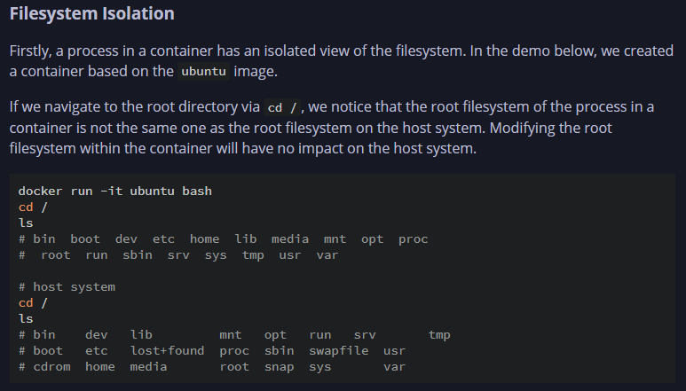
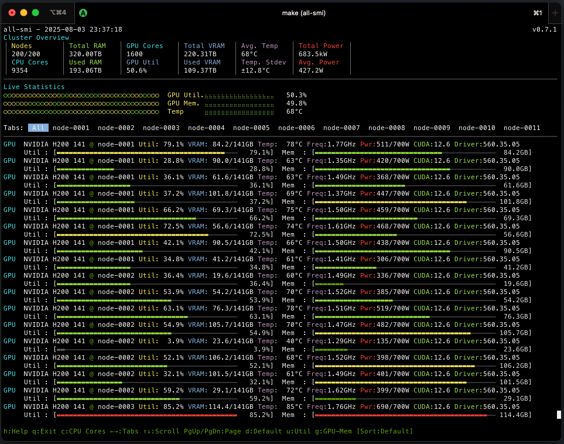
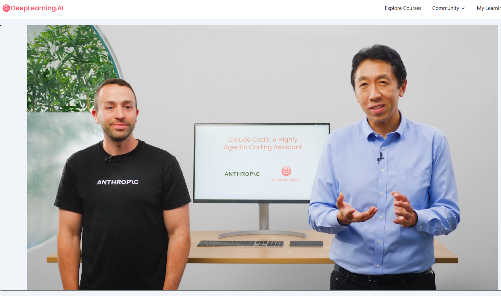
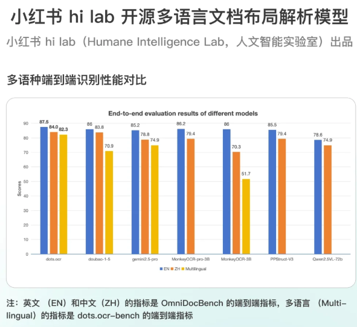
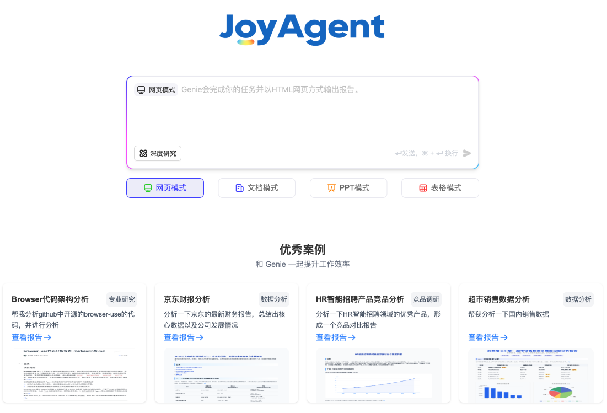
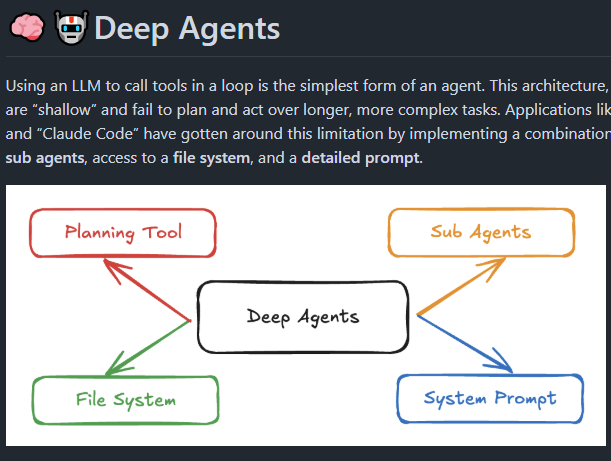
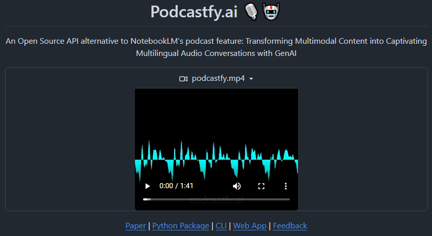

# 机器文摘 第 143 期

### 使用 Rust 从零开始构建容器

[Building a Container from Scratch in Rust](https://brianshih1.github.io/mini-container/preface.html)，用 Rust 语言从零开始构建容器系列教程。

主要内容：
- 使用挂载命名空间隔离根文件系统；
- 使用 cgroups 进行资源限制；
- 使用 seccomp 限制系统调用；
- 使用用户命名空间和 uid 映射隔离用户 ID 和组 ID；
- 通过功能进行权限控制；

> 我使用 Docker 容器已经很多年了，但一直把它当作神奇的黑匣子。我知道 Docker 使用容器运行时来创建隔离环境以运行代码。 不过，我不知道“隔离”到底是什么意思。为了揭开这个黑匣子，我决定在 Rust 中从头开始实现一个玩具容器运行时。
> 
> 在这个博客系列中，我将从 Linux 新手的角度，介绍容器的理论基础和实现过程。 我还会尽可能多地提供演示，以展示构成容器的 Linux 原语是如何工作的。

### 跨平台命令行 GPU/NPU 监控工具

[all-smi](https://github.com/inureyes/all-smi)，覆盖NVIDIA、Apple Silicon、Tenstorrent、Rebellions、Furiosa多种硬件，支持单机与集群远程实时监控，完美替代nvidia-smi。

主要特性：
- 实时监控核心指标：GPU/NPU利用率、显存占用、温度、功耗、频率，多平台细节数据（如PCIe、DLA、ANE功耗、NPU核心负载等）。
- 多节点集群视图：支持256+远程节点统一管理，带连接池与重连机制，自动调节刷新间隔，历史趋势图和多标签界面优化运维效率。
- 进程级别监控：GPU进程内存、CPU占用、用户信息、命令行，支持多维度排序和全进程树展示，助力精准资源调度。
- CPU/内存/存储全面覆盖：多核利用率、频率、温度及功耗，系统内存及缓冲区细节，交换空间和磁盘使用状态实时呈现。
- 极致交互体验：终端UI支持键鼠操作、颜色分级高亮、响应式布局、无闪烁渲染，兼顾美观与实用。
- 多种安装途径：Homebrew、Ubuntu PPA、Deb包、Cargo安装，兼容Linux/macOS/NVIDIA Jetson，轻松部署。
- Prometheus API输出：硬件指标标准化暴露，方便集成到监控体系，支持自定义刷新周期和进程信息。
- 持续迭代优化：最新版本支持容器感知资源监控，ARM CPU频率检测增强，流程列表UI升级，Apache 2.0开源协议。

### Anthropic 和吴恩达一起出的 Claude Code 教程

[Claude Code: A Highly Agentic Coding Assistant](https://learn.deeplearning.ai/courses/claude-code-a-highly-agentic-coding-assistant/lesson/66b35/introduction)，

课程内容：
- 协调多个 Claude 子 Agent 同时处理代码库的不同部分
- 在 GitHub 问题中标记 Claude，并让它自主创建、审查和合并拉取请求 
- 将杂乱的 Jupyter 笔记本转变为干净、可用于生产的仪表板 
- 使用 Playwright 等 MCP 工具，这样 Claude 就能发现你的 UI 出了什么问题，并自主修复它

### 小红书开源了一个 OCR 识别的模型

[dots.ocr](https://huggingface.co/rednote-hilab/dots.ocr)，可以把一些书、图标、公式扫描到电脑中。

模型只有1.7B参数，模型大小只有6G左右。

主要特性：
- 强大的性能：dots.ocr 在 OmniDocBench 上实现了文本、表格和阅读顺序的 SOTA 性能，同时提供与豆包 1.5 和 gemini2.5-pro 等大型模型相当的公式识别结果。
- 多语言支持：dots.ocr 展示了针对低资源语言的强大解析能力，在我们的内部多语言文档基准测试中，在布局检测和内容识别方面取得了决定性的优势。
- 统一简单的架构：通过利用单一视觉语言模型，dots.ocr 提供了比依赖复杂多模型管道的传统方法更加精简的架构。只需更改输入提示即可完成任务之间的切换，证明与 DocLayout-YOLO 等传统检测模型相比，VLM 可以获得具有竞争力的检测结果。
- 高效快速的性能：dots.ocr 建立在紧凑的 1.7B LLM 之上，提供比许多其他基于更大基础的高性能模型更快的推理速度。

### 京东开源了 JoyAgent 

[JoyAgent](https://github.com/jd-opensource/joyagent-jdgenie)，业界首个开源高完成度轻量化通用多智能体产品(JoyAgent-JDGenie)。

> JoyAgent-JDGenie是一个通用的多智能体框架，对于用户需要定制的一些新场景功能，只需将相关的子智能体或者工具挂载到JoyAgent-Genie即可。为了验证JoyAgent-JDGenie的通用性，在GAIA榜单Validation集准确率75.15%、Test集65.12%，已超越OWL（CAMEL）、Smolagent（Huggingface）、LRC-Huawei（Huawei）、xManus（OpenManus）、AutoAgent（香港大学）等行业知名产品。
> 
> 当前相关开源agent主要是SDK或者框架，用户还需基于此做进一步的开发，无法直接做到开箱即用。我们开源的JoyAgent-JDGenie是端到端的多Agent产品，对于输入的query或者任务，可以直接回答或者解决。例如用户query"给我做一个最近美元和黄金的走势分析"，JoyAgent-Genie可以直接给出网页版或者PPT版的报告文档。
>
> 我们整体开源了智能体产品JoyAgent-JDGenie，包括前端、后端、框架、引擎、核心子智能体（报告生成智能体、代码智能体、PPT智能体、文件智能体等）、想用微调后效果更好的欢迎使用JoyAgent。

### 深度 AI 代理通用开源库 

[Deep Agents](https://github.com/hwchase17/deepagents)，LangChain 团队深度挖掘 Claude Code、Manus 与 Deep Research 核心，整合详细系统提示、规划工具、子代理与文件系统访问，打造的通用Python框架。

主要特性：
- 通过deepagents库轻松创建支持复杂长远任务的深度AI代理。  
- 支持多工具调用、子代理任务分解及虚拟文件系统，提升任务规划与执行能力。  
- 与 LangGraph 无缝集成，支持流式交互、人机协作及记忆持久化。  

### NotebookLM 开源平替

[Podcastfy.ai](https://github.com/souzatharsis/podcastfy)，一款制作播客音频的开源工具，可作为 NotebookLM 开源平替。

支持从网页、PDF、YouTube 视频甚至图片中提取内容，并自动生成有逻辑、有语气、有语音的自然流流畅播客对话。

主要特性：
- 支持网页、PDF、图片、YouTube 视频等多种输入格式
- 可生成短播客（2-5分钟）或长播客（30+分钟）
- 自定义对话风格、语言和音频生成参数
- 集成 100+ 种 LLM 模型进行文本生成
- 支持本地 LLM 运行，保护数据隐私
- 支持多语言，包括中文、英文、日文等

## 订阅
这里会不定期分享我看到的有趣的内容（不一定是最新的，但是有意思），因为大部分都与机器有关，所以先叫它“机器文摘”吧。

Github仓库地址：https://github.com/sbabybird/MachineDigest

喜欢的朋友可以订阅关注：

- 通过微信公众号“从容地狂奔”订阅。

