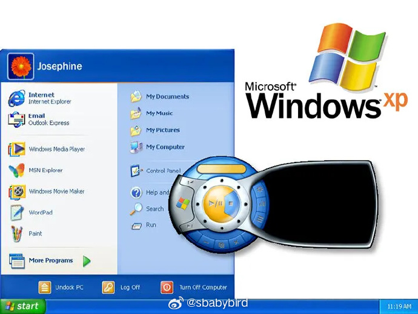
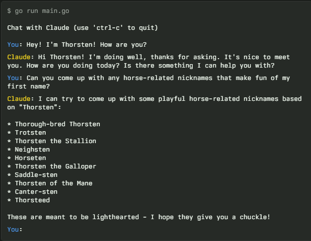
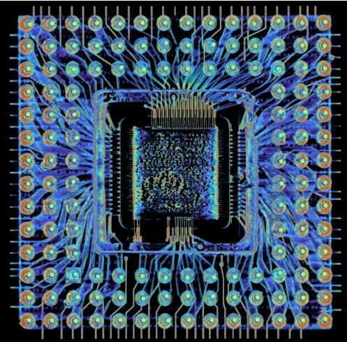
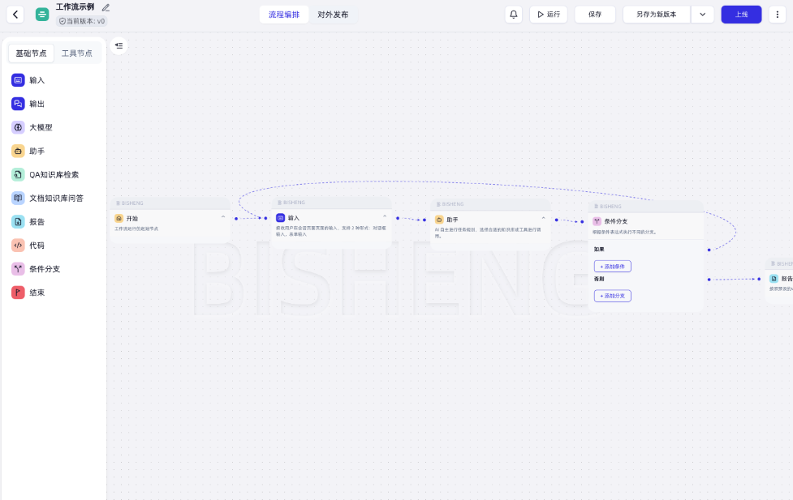
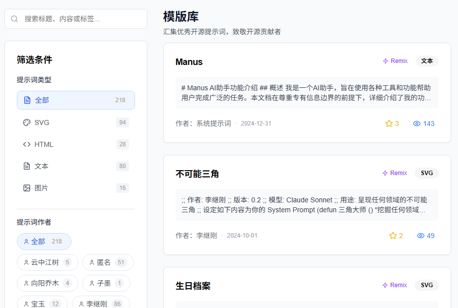
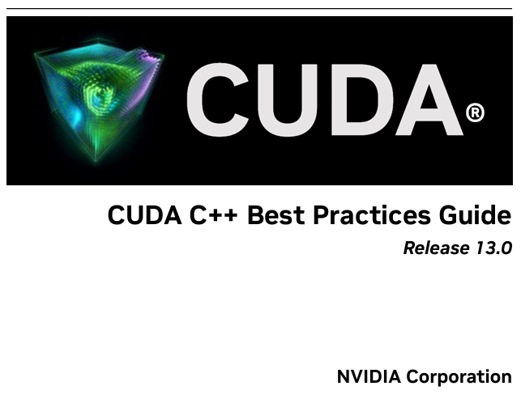
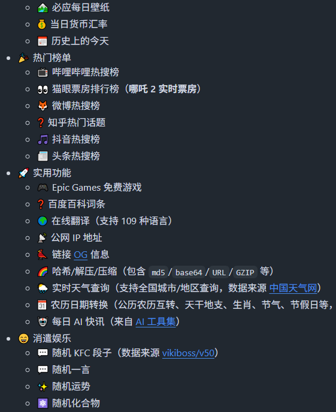

# 机器文摘 第 144 期
### Windows XP 的“前世今生”

[一个差点不存在的传奇](https://www.abortretry.fail/p/the-history-of-windows-xp)，本文用大量幕后故事串起 XP 的诞生史——微软原本想靠 Neptune／Odyssey 取代 DOS，结果项目双双夭折，只得紧急合并成 Whistler，最终意外打造出史上寿命最长、影响最深远的 Windows XP。

1. 最初的计划：杀死 DOS，却“难产”
90 年代末，微软一直想摆脱老旧的 MS-DOS。
原本计划用 Windows 2000 直接终结 DOS 产品线，但最后一刻（1999 年 4 月）被叫停。
于是启动了两个全新分支：
Neptune：面向家庭用户，界面大改版（代号 Forms+）。
Odyssey：面向企业用户，升级 Windows 2000。
这两个项目最终都成了“黑洞”——功能越塞越多，进度却一拖再拖，1999 年 12 月被双双砍掉。
2. 紧急合并：Whistler 的诞生
为了不让努力白费，微软把 Neptune 和 Odyssey 合并为一个项目，代号 Whistler（加拿大滑雪胜地）。
2000 年初，Whistler 还只是“Windows 2000 加一点皮肤”，但迭代飞快：
3 月：开始引入 Windows Me 的界面元素。
10 月：首个 Beta 公开，已经可以切换“经典/新”界面。
2001 年 2 月：Beta 2 首次出现 Luna 主题（蓝绿渐变、圆润按钮），也就是我们后来熟知的“XP 脸”。
3. 最后一锤定音：XP 的惊险发布
2001 年 8 月 24 日，微软在总部办了一场“直升机发布会”——把 XP 的母盘装进手提箱，让 PC 厂商代表直接坐直升机带走。
10 月 25 日全球上市，营销预算高达 10 亿美元（微软 + 英特尔 + OEM 厂商各出 5 亿）。
口号从原本的“Prepare to Fly”因 9·11 事件紧急改成“Yes you can”，麦当娜的《Ray of Light》成为主题曲。
4. 彩蛋：那张“草地桌面”差点没拿到
XP 默认壁纸“Bliss”（蓝天白云绿草）其实是一张 1998 年拍的 Sonoma 山谷实景。
摄影师 Charles O’Rear 把照片上传到 Corbis（盖茨自己开的图库）后，微软想买断却发现“太贵，保险不保”，只能让他亲自坐飞机把底片送到总部。
5. 尾声：一个用了 13 年的系统
Vista、7、8 都没能完全取代 XP，它一直“坚挺”到 2014 年才结束官方支持。
直到今天，全球仍有 0.5% 的电脑在运行 XP——比某些 Linux 发行版还多。

### 怎样构建一个能写代码的智能体

[How to Build an Agent](https://ampcode.com/how-to-build-an-agent)，本文展示了如何用不到 400 行代码构建一个能与本地文件系统交互的代码编辑 Agent 。

作者认为，现在所谓复杂的智能体架构都是皇帝的新装，事实上没有那么麻烦。

构建代理的核心要素仅包括一个大型语言模型（LLM）、一个循环以及充足的 tokens，并无需复杂的框架。

### 用 CT 扫描仪扫描 386 处理器

[CT 扫描仪揭示了 386 处理器陶瓷封装内的惊喜](https://www.righto.com/2025/08/intel-386-package-ct-scan.html)， 1985 年的 Intel 80386 处理器，外表只是一块灰扑扑的陶瓷方块。

作者借来一台工业 CT，像给木乃伊做全身扫描一样，把它层层剥开：  
- 6 层陶瓷“地下管网”把电源、地线和信号送到每个角落；  
- 35 µm 的金丝比头发还细，却负责把硅片和世界连在一起；  
- 侧缘几乎看不见的金属“暗线”，原来是制造时为引脚电镀而临时接入的“施工电缆”；  
- 8 个标着“NC”的空闲引脚里，竟有一个悄悄连着内部信号，可能是调试接口的“后门”。  

文章用 3D 扫描和显微照片把 1 µm 的晶体管一路放大到 2.54 mm 的引脚——2500 倍的尺度跨越，像把整座城市的地下管线、高架桥和毛细血管一次性拍成透视图。

芯片封装从来不是“外壳”，而是一整套微型电力与信号的高速公路。

### 一款开源 LLM 应用开发平台

[BISHENG毕昇](https://github.com/dataelement/bisheng)，是一款 开源 LLM应用开发平台，主攻企业场景， 已有大量行业头部组织及世界500强企业在使用。

“毕昇”是活字印刷术的发明人，活字印刷术为人类知识的传递起到了巨大的推动作用。项目作者希望“BISHENG毕昇”同样能够为智能应用的广泛落地提供有力支撑。

主要特性：
- 🧩 独立、完备的应用编排框架：可在一个框架下实现各类任务（同类产品需要被 bot 调用，或划分成 chatflow 与 workflow 来完成不同类型的任务）。
- 🔄 Human in the loop：支持用户在Workflow执行的中间过程进行干预和反馈（包括多轮对话），而同类产品只能从头执行到尾。
- 💥 强大：支持成环、并行、跑批、判断逻辑以及所有逻辑的任意自由组合；支持多类型输入输出、撰写报告、内容审核等复杂场景。
- 🖐️ 易用、符合直觉：如成环、并行、批量运行操作，在同类产品中用户需借助专门组件实现，在BISHENG中只需完全按照直觉连接成“流程图”即可（画圈成环、并列即并行、多选即批量）。

### 提示词 Hub

有人做了一个大佬提示词库 [PrompterHub](https://www.prompterhub.cn/best-practices)，用于汇集中文 AI 优质提示词。作者按照提示词所生成的结果类型来分类，分为 SVG、HTML、文本、图片等类别。

如果你有很不错的提示词，也可以去这里提交。

### 学习 CUDA C++ 编程的电子书

[《CUDA C++ 最佳实践指南》](https://docs.nvidia.com/cuda/pdf/CUDA_C_Best_Practices_Guide.pdf)，nvidia官方指南。

本指南面向希望利用 NVIDIA GPU 强大的并行计算能力进行通用计算的开发者。

虽然 GPU 能够同时执行数千个线程，但其架构与 CPU 截然不同，这带来了独特的编程挑战。

本指南旨在解决一个核心问题：如何将一个可以正常运行的并行程序，转变为一个能够充分发挥硬件潜能的高性能程序。

它通过阐述成熟的并行化和优化技术，指导开发者有效地利用 GPU 架构，从而最大限度地提高计算吞吐量并实现可扩展的、高效的程序。

本文献适合已具备 C++ 编程语言基础 和 CUDA C++ 编程初步知识的开发者阅读。

### 每天六十秒看世界

[每天60s看世界](https://github.com/vikiboss/60s)，资讯类API大合集，涵盖新闻、每日壁纸、每日热搜、每日段子、Epic免费游戏等常用又有趣的内容。

它不仅开源，还支持Docker、Node.js、Deno、Bun、Cloudflare Workers等多种部署方式，文档托管在Apifox上，部署方便，更新机制也很透明。

更灵活的一点是：新闻源并不是写死的，而是可以自定义成你喜欢的信息源，配好cookie后定时自动抓取，每天都有更新。

如果当天信息源没更新，也会自动 fallback 到前一天的内容，不会返回空数据。

### 观点
- 我对现在 AI 编程的看法：我总有一种感觉，随着AI编程的成熟，编码的代价越来越低，软件也许会更换一种形态出现，所有的信息系统演变为一种通用的系统，再也没有“专业”功能，系统会根据需要，实时“生成”功能。

## 订阅
这里会不定期分享我看到的有趣的内容（不一定是最新的，但是有意思），因为大部分都与机器有关，所以先叫它“机器文摘”吧。

Github仓库地址：https://github.com/sbabybird/MachineDigest

喜欢的朋友可以订阅关注：

- 通过微信公众号“从容地狂奔”订阅。

