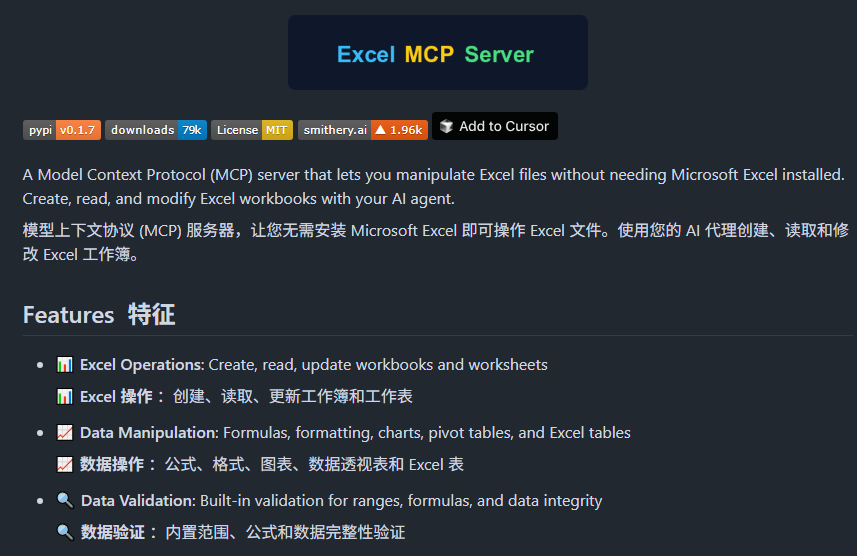

# 机器文摘 第 145 期
### 用 Excel 来学习多头注意力机制

什么是大模型赖以生存的“注意力机制”？论文读起来太枯燥？Excel 总会用吧？

[用 Excel 来学习多头注意力机制](https://www.byhand.ai/p/multihead-attention)，之前有人用 Excel 做了一个 CPU，现在又有人基于 Excel 实现了一个“多头注意力”模型。

跟着作者可以一步一步理解其中的技术原理。

Excel：俺也是图灵完备的哦！

### 操作 Excel 的 MCP Server

[excel-mcp-server](https://github.com/haris-musa/excel-mcp-server)，一个Excel mcp，用AI操作Excel表格。

利用这个 mcp server 你就可以让 AI 创建销售数据表，把A列都乘1.1，结果放B 列，然后画个柱状图。

支持创建、复制工作表；填数、写公式、画图表、调颜色、加透视表、保存、转 PDF 等 Excel 的常规操作。

本地或远程都能跑，stdio、SSE、HTTP 三种连接方式。

### 量产的激光灭蚊套装

[光子矩阵](https://photonmatrixlab.com/)，全球首款便携式激光灭蚊器。用激光雷达检测蚊子，用激光消灭蚊子。

可以有效地识别和打击飞行速度不超过 1m/s、尺寸特征为 2~20mm 的蚊子。它也可以有效打击该特征范围内的其他飞虫，但对飞行速度要快得多的苍蝇等飞虫基本无效。 ​​​

### 开源跨平台多智能体框架

[Mobile-Agent-v3](https://github.com/X-PLUG/MobileAgent/blob/main/README_zh.md)，是一款基于GUI-Owl的跨平台多智能体框架，GUI-Owl也同时被开源，这是一款多模态跨平台GUI虚拟层模型

GUI-Owl 作为 GUI 自动化基础模型，具备GUI感知、落地、端到端操作能力。

可以理解 GUI界面布局、元素，把指令转化为具体的屏幕坐标和操作，完成完整的GUI操作流程。

Mobile-Agent-v3 利用 GUI-Owl 能力与 GUI 交互，具备任务分解、规划以及进度管理、异常处理和反射能力、关键信息记录能力。

比如，完成特定目标制定行动计划，跟踪任务执行进度，反馈调整行动。

具备关键信息记录能力，支持跨应用任务。

### 基于控制台终端的电子书“阅读器”

[lue](https://github.com/superstarryeyes/lue)，在终端中运行的电子书阅读器，支持 EPUB、PDF、TXT 等多种格式，还自带 TTS 语音朗读功能，支持 100+ 种语言朗读。

界面简洁完美融入终端，同时支持快捷键操作，可轻松上下翻页。

看起来就像在敲代码，实际却在上班看小说。

主要特性：

- 支持 EPUB、PDF、DOCX 等多种电子书格式
- 内置 TTS 语音朗读，可以离线听书
- 高颜值的终端界面，完美伪装成工作状态
- 自动保存阅读进度，随时继续阅读
- 提供快捷键导航与进阶阅读控制
- 支持离线语音朗读，无需联网使用

程序员们，继续摸鱼吧，马上鱼就上岸啦。

### 开源数字人对话系统

[Open Avatar Chat](https://github.com/HumanAIGC-Engineering/OpenAvatarChat)，在自己个人电脑上就能运行一个能与我们实时对话的数字人系统，平均回答延迟仅 2.2 秒。支持 Docker 一键快速部署。

主要特性：

- 低延迟数字人实时对话，平均响应时间 2.2 秒
- 支持多模态交互，包括文本、音频、视频输入
- 模块化架构设计，可灵活替换各个组件
- 预置 100+ 数字人形象，支持 LiteAvatar 和 LAM 两种渲染方式
- 前后端分离，方便自定义界面和扩展功能
- 支持本地推理和云端 API 两种部署模式

### 可以跑在计算器上的 lisp 解释器

[tinylisp](https://github.com/Robert-van-Engelen/tinylisp)，这个项目教你如何使用 C 语言在 99 行代码内实现一个小型的 Lisp 解释器。

尽管代码很简洁，但这个 Lisp 解释器具备 21 个内置原语、简单的垃圾回收和 REPL（交互式环境），使其比简单的示例更加实用，甚至可以在复古 Sharp PC-G850VS 掌上电脑上运行。 ​​​

## 订阅
这里会不定期分享我看到的有趣的内容（不一定是最新的，但是有意思），因为大部分都与机器有关，所以先叫它“机器文摘”吧。

Github仓库地址：https://github.com/sbabybird/MachineDigest

喜欢的朋友可以订阅关注：

- 通过微信公众号“从容地狂奔”订阅。

