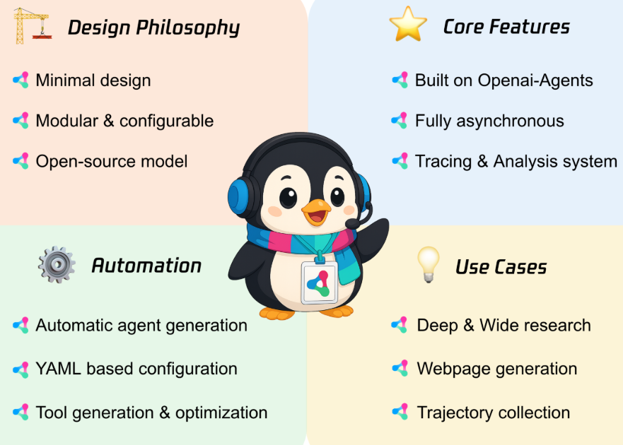
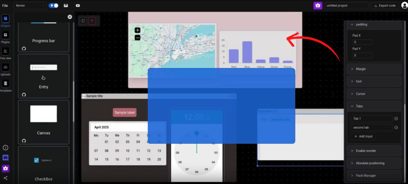
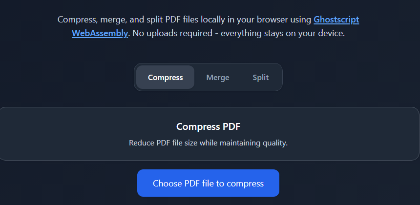
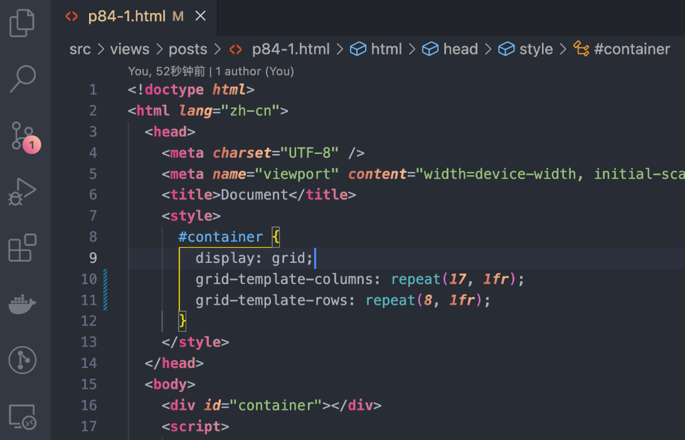

# 机器文摘 第 146 期
### 关于安全启动和 TPM 的文章

[安全启动与TPM技术成为游戏反作弊新手段](https://andrewmoore.ca/blog/post/anticheat-secure-boot-tpm/)。

硬件级安全功能正被用于打击游戏作弊，提升多人在线游戏的公平性。

多家游戏开发商开始要求玩家启用安全启动（Secure Boot）和可信平台模块（TPM 2.0） 才能运行热门在线游戏。

安全启动通过验证UEFI启动镜像和内核驱动程序的数字签名，防止加载未授权的代码。TPM则提供不可篡改的硬件唯一标识符（基于认可密钥），允许反作弊系统实施硬件封禁，增加作弊者成本。

此外，TPM的平台配置寄存器（PCR） 可记录启动过程中的各种事件哈希值，为系统启动状态提供加密验证，确保启动链未被篡改。

这些技术要求旨在对抗内核级作弊、内存修改、硬件ID欺骗等作弊手段，但也在玩家社群中引发了关于隐私和便利性的讨论。

### 腾讯开源的多智能体框架 

[Youtu-agent](https://github.com/Tencent/Youtu-agent)，是一个灵活、高性能的框架，用于构建、运行和评估自主智能体。除了在基准测试中名列前茅，该框架还提供了强大的智能体能力，例如数据分析、文件处理和深度研究。

主要特性：
- **验证性能**：在 WebWalkerQA 上达到 71.47% 的 pass@1，在 GAIA（纯文本子集）上达到 72.8% 的 pass@1，纯粹使用 `DeepSeek-V3` 系列模型（不使用 Claude 或 GPT），建立了强大的开源起点。
- **开源友好且成本敏感**：针对可访问、低成本部署进行了优化，不依赖封闭模型。
- **实际用例**：开箱即用地支持 CSV 分析、文献综述、个人文件整理以及播客和视频生成等任务。（即将推出）
- **灵活的架构**：基于 [openai-agents](https://github.com/openai/openai-agents-python) 构建，可兼容各种模型 API（从 `DeepSeek` 到 `gpt-oss`）、工具集成和框架实现。
- **自动化与简洁性**：基于 YAML 的配置、自动智能体生成和简化的设置减少了手动开销。

### 短视频生成工厂

[short-video-factory](https://github.com/YILS-LIN/short-video-factory)，一键生成产品营销与泛内容短视频，AI批量自动剪辑，高颜值跨平台桌面端工具。

短视频工厂是一个开源的桌面端应用，旨在通过AI技术简化短视频的制作流程。用户可以通过简单的提示词文本+视频分镜素材，快速且自动的剪辑出高质量的产品营销和泛内容短视频。该项目集成了AI驱动的文案生成、语音合成、视频剪辑、字幕特效等功能，旨在为用户提供开箱即用的短视频制作体验。

核心功能：
- 🤖 AI驱动：集成了最新的AI技术，提升视频制作效率和质量
- 📝 文案生成：基于提示词生成高质量的短视频文案
- 🎥 自动剪辑：支持多种视频格式，自动化批量处理视频剪辑任务
- 🎙️ 语音合成：将生成的文案转换为自然流畅的语音
- 🎬 字幕特效：自动添加字幕和特效，提升视频质量
- 📦 批量处理：支持批量任务，按预设自动持续合成视频
- 🌐 多语言支持：支持中文、英文等多种语言，满足不同用户需求
- 📦 开箱即用：无需复杂配置，用户可以快速上手
- 📈 持续更新：定期发布新版本，修复bug并添加新功能
- 🔒 安全可靠：完全本地本地化运行，确保用户数据安全
- 🎨 用户友好：简洁直观的用户界面，易于操作
💻 多平台支持：支持Windows、macOS和Linux等多个操作系统

### 可视化开发 Python 图形界面

[PyUIBuilder](https://github.com/PaulleDemon/PyUIBuilder)，一款突破传统框架限制的 Python GUI 可视化构建工具，支持 Tkinter、CustomTkinter，Kivy 与未来的 PySide，颠覆你对 GUI 开发的认知。

主要特性：
- 框架无关，生成纯 Python 代码，方便调试与后续维护，兼容多种主流 UI 库  
- 拖拽式设计，预置丰富 UI 组件，支持布局管理（flex、grid、绝对定位）和本地资源上传  
- 自动生成 requirements.txt，助力快速部署，提升开发效率  
- 即将支持事件处理、PyQt/PySide、Electron 桌面应用等高级功能，路线图公开透明  
- 免费网页版编辑器永远开放，付费版本享终身授权、优先支持和更多高级组件与功能  
- 开源社区活跃，作者独立维护，支持开源项目发展的同时享超值优惠预购许可  
- 适合快速原型设计、学习及商业项目，减少重复造轮子，释放更多时间专注业务逻辑  

快速上手只需三步：选框架 + 拖组件 + 生成代码，Python GUI 开发从未如此简单高效📱💻

### 在本地浏览器中运行的PDF处理工具

[Local PDF Tools](https://github.com/krmanik/local-pdf-tools)，一个完全在本地浏览器中运行的PDF处理工具。

使用 Ghostscript WebAssembly 在浏览器中完全运行。它的主要功能包括：压缩、合并和拆分 PDF 文件。

在线体验：krmanik.github.io/local-pdf-tools/

### 带渐变效果的编辑器主题

[gradient-theme](https://github.com/shaobeichen/gradient-theme)，基于多个知名主题如 Dracula、Monokai Pro 等添加了精美的渐变效果，通过修改 VS Code 核心文件实现真正的渐变背景。

主要特性：

- 支持 8 种经典主题的渐变版本，包括 Dracula、Monokai Pro 等
- 一键启用/禁用渐变效果，操作简单便捷
- 支持自定义渐变样式，可以创建专属的个性化主题
- 完全保留原主题的语法高亮和配色方案
- 提供详细的自定义教程和在线压缩工具支持

> 有一天我看到了一个自已修改 VSCode 主题 CSS 文件的视频，
>
> 于是我觉得我可以使用相同的方式来制作一个 VSCode 渐变效果 CSS 文件，
>
> 然后我就开始使用 Custom CSS and JS Loader 插件来加载自定义的渐变 CSS，
> 
> 后来许多人觉得我的渐变主题非常好看，希望也能在自己的 VSCode 上能使用它，
> 
> 但是如果要使用它的话，需要安装插件还需要我给他们一份 CSS 文件，这太麻烦了！
> 
> 于是我去学习了如何制作一个 VSCode 主题插件，做出了这个渐变色主题插件。

## 订阅
这里会不定期分享我看到的有趣的内容（不一定是最新的，但是有意思），因为大部分都与机器有关，所以先叫它“机器文摘”吧。

Github仓库地址：https://github.com/sbabybird/MachineDigest

喜欢的朋友可以订阅关注：

- 通过微信公众号“从容地狂奔”订阅。

