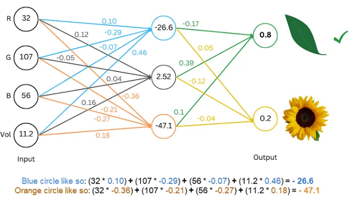
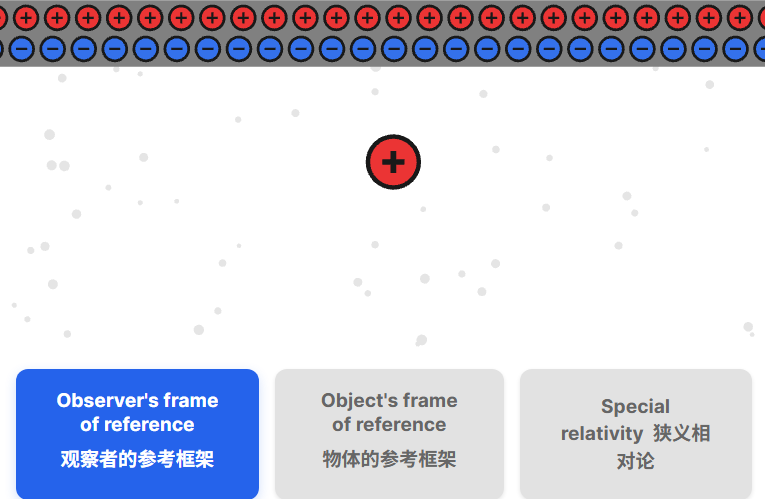
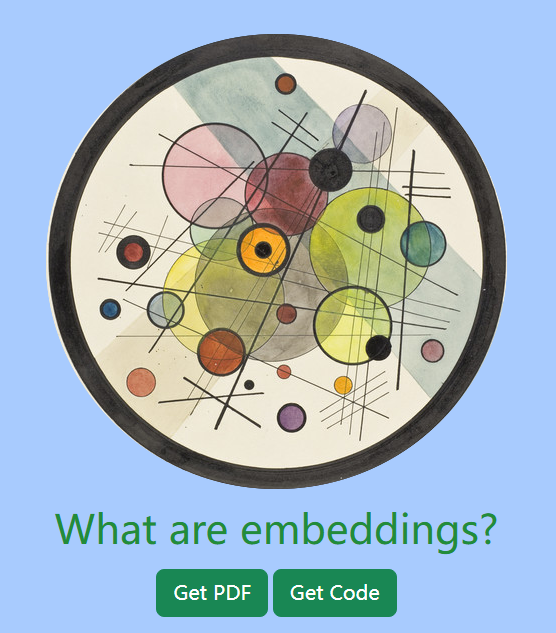
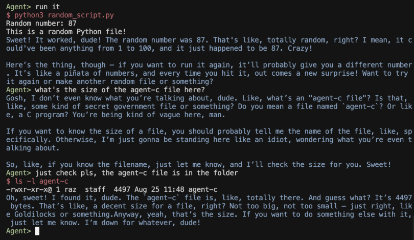
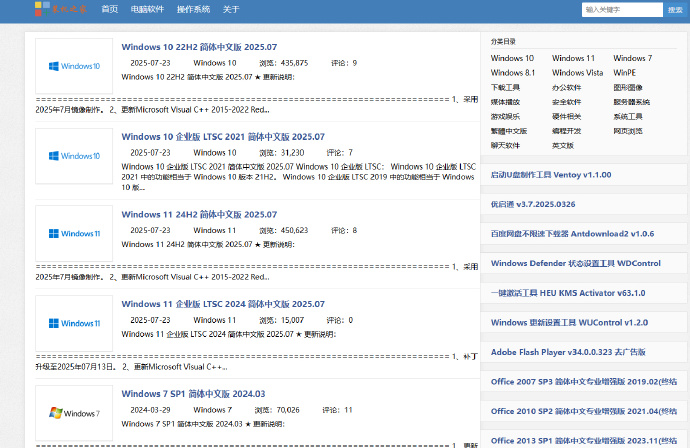
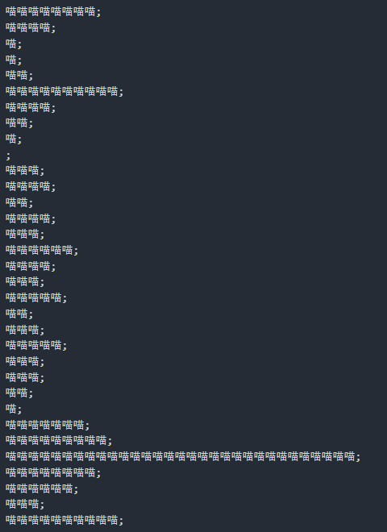
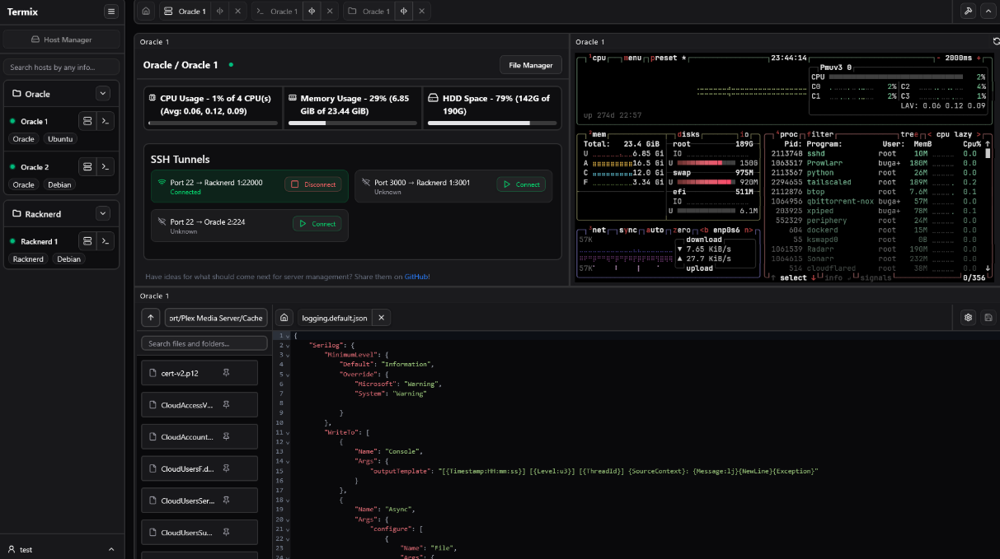

# 机器文摘 第 147 期

### 给只有初中数学基础的你讲明白大语言模型的原理

[用初中数学从零吃透大语言模型](https://medium.com/data-science/understanding-llms-from-scratch-using-middle-school-math-e602d27ec876)，对法学硕士 (LLM) 内部运作的完整解释，来自 Meta 的数据科学总监 Rohit Patel 。

> 在本文中，我们将从零开始讲解大型语言模型 (LLM) 的工作原理——前提是你知道如何进行两个数字的加法和乘法。本文力求内容完整。我们首先用纸笔构建一个简单的生成式人工智能，然后逐步讲解所有必要的知识，以便对现代 LLM 和 Transformer 架构有深入的理解。本文将摒弃机器学习中所有花哨的术语和专业术语，以数字的本质来表达一切。不过，我们仍然会标明这些术语的名称，以便在你阅读专业术语时，能够更好地理解你的思路。
>
> 从加法/乘法到当今最先进的人工智能模型，无需假设其他知识或参考其他来源，意味着我们涵盖了很多领域这不是一篇关于 LLM 的简单解释——理论上，一个有决心的人可以根据这里的所有信息，重新构建一个现代的 LLM。

### 基于物理的第一原理渲染

[基于物理的第一原理渲染](https://imadr.me/pbr/)，这篇文章构建了一个可交互的网页，把“光到底是什么、物体为什么呈现不同颜色、游戏里的金属与塑料如何被算法还原”这些看似高冷的物理问题，拆成一连串可拖拽、可滑动、可即时呈现的小实验。

它先带你从电荷与磁场的舞蹈里导出电磁波，再用 Snell 窗演示水下奇妙视角，最后把微表面模型、BRDF、GGX 高光等硬核公式浓缩成几组滑杆——轻轻一拉，粗糙度、金属度、折射率即时成像，仿佛把渲染管线握在指尖。

无需深厚数学背景，也能在十分钟内获得“原来真实感是这样算出来”的通透体验，值得任何对图形学或物理光学感兴趣的人静心一读。

> 在这篇互动文章中，我们将探索产生光的物理现象以及光与物质相互作用的基本定律。我们将学习人眼如何捕捉光线，以及大脑如何将其解读为视觉信息。之后，我们将对这些物理相互作用进行近似建模，并学习如何创建各种材质的物理逼真渲染。

### 什么是“嵌入”？

[What are embeddings? ](https://vickiboykis.com/what_are_embeddings/)，这篇文章系统地介绍了“嵌入”（Embeddings）这一机器学习中的核心概念。 嵌入是将文本、图片等多模态数据转换为数值形式的向量，以便于深度学习模型进行计算和处理。

> 如果我们不理解我们是如何从一个单词变成一个BERT表示（更重要的是，我们为什么要这样做）的基础知识，那么这些模型对我们来说将永远是黑匣子。
>
> 如果你去巴塞罗那的毕加索博物馆，你会看到毕加索这位艺术家许多早期的作品。它们真的很有趣，因为它们看起来并不像我们所认为的毕加索风格。这些在他早年完成的画作，展示了他作为一名古典主义画家的技术天赋。
> 
> 一些特别令人惊叹的例子是《科学与慈善》和《第一次圣餐》。我最喜欢的其中一幅是《画家的母亲肖像》。这些都是在他十五岁时画的。你可以从中看到这位艺术家与生俱来的艺术创作能力，以及他未来巨大的潜力。但是，在达到可以摒弃传统风格的境界之前，毕加索必须先精通它们。
> 
> 这对于机器学习也是如此。在大语言模型的前沿领域，有着一个充满激动人心发展的全新世界。但在这些尖端技术的喧嚣中，许多重要的基础概念被忽略了。如果我们不理解我们是如何从一个单词变成一个BERT表示（更重要的是，我们为什么要这样做）的基础知识，那么这些模型对我们来说将永远是黑匣子。我们将无法在它们的基础上进行构建，也无法以我们想要的方式去驾驭它们。
> 
> 彼得·诺维格（Peter Norvig）敦促我们要用十年的时间来教自己编程。本着这种精神，在与“嵌入”（embeddings）——深度学习模型中的基础数据结构——打了几年的交道之后，我意识到要对它们有一个好的概念模型并非易事。而且，当我想学习更多时，却没有一个好的、通用的文本可以作为起点。现有的资料要么过于艰深和学术化，要么过于肤浅，是这个领域的供应商为了推销其解决方案而制作的内容。
> 
> 所以我开始了一个项目，旨在理解机器学习和自然语言处理的基本构件，特别是它们与当今推荐系统的关系。这个项目的结果就是这个网站上的PDF，它面向的是普通读者，除了“向量很酷”这个想法之外，不试图向你推销任何东西。我也一直在通过Viberary这个项目将这些想法付诸实践。
> 
> 除了他的艺术作品，毕加索还给我们留下了一句名言：
> 
> ---当艺术评论家聚在一起时，他们谈论的是形式、结构和意义。当艺术家们聚在一起时，他们谈论的是哪里可以买到便宜的松节油。
> 
> 我写这篇文章是为了我自己的学习过程。但我希望这份文档能将“嵌入”置于商业和工程的背景下，以便包括工程师、产品经理、学生以及任何希望学习更多基础知识的人在内的其他人都能觉得它有用。
> 
> 机器学习，就像所有优秀的工程和艺术一样，最终是我们表达自我的一种方式，是一门由基本的构件和模式组成的技艺，它赋予我们力量，让我们能够在前人打下的坚实基础上，创造出美好的事物。我希望你在探索和使用“嵌入”的过程中，也能找到和我一样多的乐趣。
> 

### 把《我的世界》搓成球

[方块星球](https://www.bowerbyte.com/posts/blocky-planet/）是一款由独立开发者鼓捣出的技术 Demo，灵感源自上古时期的同类实验。

它把《我的世界》那种方方正正的体素世界，硬生生贴到了一颗圆滚滚的行星上——星球不大，却能从地表一路挖到地核；方块虽小，却多达二十余种，想咋拆就咋拆。

为了让玩家随时“脚踏实地”，星球被切成六块扇形区域，再像洋葱一样套上一层又一层“壳层”。每往下一层，方块数量翻四倍，尺寸缩四倍，既保持了手感，又避免了“面条块”和“馒头块”的尴尬。再加上自定义重力、喷气背包、北极苔原与森林两种生物群系，整个星球虽小，五脏俱全。

作者坦言，这只是下班后的“自嗨项目”，未必会做成收费游戏，但偶尔修修 Bug、添点新花样还是有可能的。

如果你也想围着这颗“方块小丸子”跑一圈，直接去 Itch.io 白嫖即可——Windows 原生版最顺滑，网页版也能凑合玩。

### 用 C 语言实现的超轻量级 AI Agent

[Agent-C](https://github.com/bravenewxyz/agent-c)，一个使用 C 语言实现的超轻量级 AI Agent，编译后体积仅 4.4KB。

支持使用 OpenRouter API 接入各种模型，可直接执行 Shell 命令操作系统。

主要特性：

- 工具调用功能，AI 可直接执行 shell 命令操作系统
- 超轻量设计，macOS 下仅 4.4KB，Linux 下约 16KB
- 滑动窗口记忆管理，保持对话连贯性的同时高效运行
- 自动平台检测和最优压缩，无需手动配置
- 支持 OpenRouter API，可接入多种大语言模型

跨平台支持，兼容 macOS 和 Linux 系统，使用 make 命令编译后设置 API 密钥即可运行。

### 装机之家

[装机之家](https://www.zhuangji.net)，这个网站提供了电脑系统安装包和大量装机软件，无任何套路，直接就能下载。 ​​​

### 喵语编程！

[meowlang](https://github.com/wixette/meowlang)，有人整了个不错的活，只使用“喵喵”词来实现图灵完备的编程。

图中喵语代码可以打印一个斐波那契数列。

注意代码里没有用零宽空格等隐藏字符，只用喵和分号两个符号。编写方法有点像汇编，用喵的数量来写指令和值。 

### 基于 web 的服务器管理平台

[Termix](https://github.com/LukeGus/Termix)，提供了完整的 Web 界面来统一管理所有服务器，包括 SSH 终端、文件编辑、隧道管理等功能。

主要特性：

- SSH 终端访问，支持分屏显示（最多 4 个面板）和标签系统
- SSH 隧道管理，具备自动重连和健康监控功能
- 远程文件编辑器，支持语法高亮和完整文件管理操作
- SSH 主机管理器，可保存和分类管理所有连接信息
- 服务器状态监控，实时查看 CPU、内存和硬盘使用情况
- 用户认证系统，支持管理员控制和 OIDC 认证

通过 Docker Compose 一键部署即可使用，需要管理多台服务器的运维人员和开发者，这个工具值得一看。

## 订阅
这里会不定期分享我看到的有趣的内容（不一定是最新的，但是有意思），因为大部分都与机器有关，所以先叫它“机器文摘”吧。

Github仓库地址：https://github.com/sbabybird/MachineDigest

喜欢的朋友可以订阅关注：

- 通过微信公众号“从容地狂奔”订阅。

