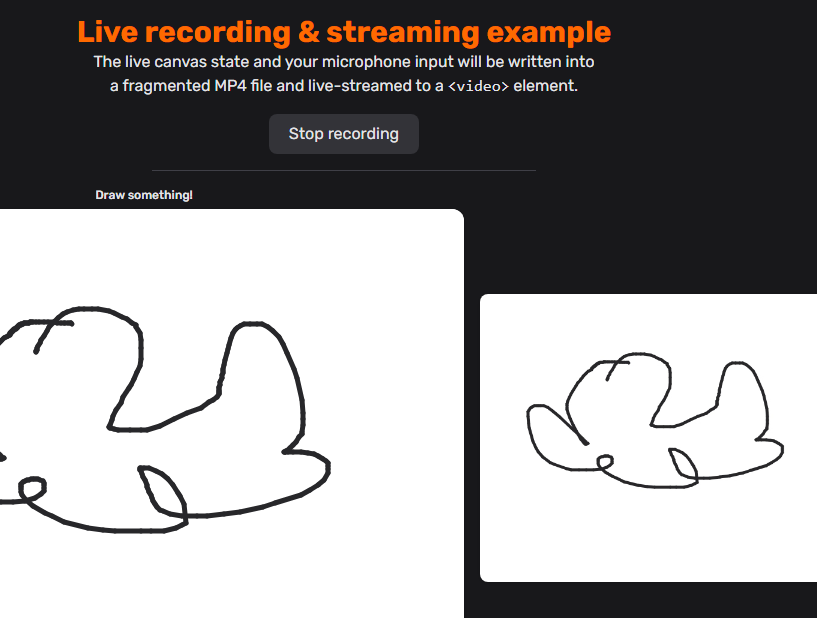

# 机器文摘 第 148 期

### 创新科技（Creative Technology）的发展简史

[创新科技（Creative Technology）：一场关于“声音”的逆袭与教训](https://www.abortretry.fail/p/the-story-of-creative-technology)

如果你曾经用PC玩过游戏、听过音乐，那么你大概率听过**Sound Blaster（声霸卡）**这个名字。  
它曾是PC音频的代名词，是90年代多媒体革命的起点，也是新加坡科技史上最闪耀的一张名片。  
但这家名叫**Creative Technology（创新科技）**的公司，并非一路高歌猛进。它曾站在巅峰，也曾错失风口；它定义了一个时代，也被时代抛在身后。

981年，新加坡工程师**沈望傅（Sim Wong Hoo）**在公交车上听到一段刺耳的音乐播放，忍不住吐槽：“这音质太烂了。”  
这句抱怨，成了Creative Technology的起点。  
他和两位合伙人成立公司，目标很简单：**让PC发出真正的“声音”**。

在那个PC还只能发出“哔哔”警报的年代，Creative推出的第一款声卡——**Sound Blaster**，不仅支持8-bit音频采样，还能播放MIDI音乐，甚至能接游戏手柄。  
这款产品迅速成为PC游戏玩家和音乐爱好者的“神器”，也奠定了Creative在音频领域的霸主地位。

90年代是Creative的黄金时代。  
随着Windows系统的普及和多媒体PC的兴起，Creative不断迭代Sound Blaster产品线，推出了**Sound Blaster 16、AWE32、AWE64 Gold**等经典型号。  
这些产品不仅音质出色，还引入了波表合成、硬件音效处理等先进技术，成为PC音频的行业标准。

当时的市场几乎被Creative垄断，甚至英特尔和微软也不得不与其合作。  
沈望傅一度豪言：**“只要PC要发声，就得用我们的技术。”**  
这句话并不夸张。Creative不仅定义了PC音频，还推动了整个多媒体生态的发展。

进入2000年代，MP3开始流行，数字音乐浪潮来袭。  
Creative迅速推出**Nomad系列MP3播放器**，技术上并不落后，甚至在某些方面领先于苹果的iPod。  
但问题在于：**产品体验太差了**。

- 软件难用，传歌慢  
- 设计厚重，缺乏美感  
- 品牌调性模糊，无法打动消费者  

而苹果则凭借**iPod + iTunes**的组合拳，打造出无缝的音乐体验，彻底改变了市场格局。  
Creative错失了MP3时代，也错失了成为“音乐硬件王者”的机会。

MP3败北后，Creative并未放弃消费电子市场。  
他们推出了**Zen系列**播放器，试图与iPod再战一场，但市场已今非昔比。  
更致命的是，随着智能手机的崛起，**“独立播放器”这个市场本身正在消失**。

Creative试图转型，推出过Android平板、蓝牙音箱、游戏耳机等产品，但始终未能再造爆款。  
在智能手机全面整合音频功能的浪潮下，**“声卡”这个品类也逐渐边缘化**。  
Creative从“标准制定者”变成了“边缘参与者”。

如今的Creative已不再是消费市场的主角，但它并未消失。  
他们转向**高端音频设备、专业录音、游戏耳机、VR音频技术**等细分市场，继续为音频发烧友和专业用户提供服务。  
其**Super X-Fi（声晰飞）**技术，甚至获得了CES多项大奖，被誉为“耳机中的全息音响”。

虽然再也回不到90年代的巅峰，但Creative依然活着，**用自己的方式坚持对“声音”的探索**。

### 改造与“升级”一台九十年代 PC

[我替14岁的自己，圆了30年前的电脑梦](https://fabiensanglard.net/2168/)，买回小时候梦想电脑并升级修复。

1993年的夏天，14岁的Fabien Sanglard被邻居书桌上的那台 IBM PS/1 2168 馋得走不动路。

米色迷你塔式机箱、滑动式软驱挡板、顶部提手，像台可以拎着走的艺术品。

486DX2-66 的 logo 在开机自检时一闪而过，DOOM 能跑满 25 fps，而他家的 Cyrix 486SLC 只能把分辨率缩成邮票大小才能勉强运行。

三十年后，他在 eBay 刷到一台芬兰卖家挂出的整机，原盒、 manuals、深灰底座一样不少，连三十年前的购机收据都留着。

快递横跨欧洲，泡沫碎成雪，机器却争气地第一次加电就点亮。

于是一场没有deadline的“童年补完计划”正式启动：软驱磁头用棉签蘸酒精一点点擦，CRT色差信号接索尼PVM做无损采集，Sound Blaster 16 和 Roland SCP-55 同时出声，让 E1M1 的吉他 riff 在 ISA 总线上重新咆哮。

他把 L2 Cache 从 128 kB升到 512 kB，帧率稳稳提升四分之一。

### Macbook 屏幕转轴角度传感器

国外有一位开发者发现了 MacBook 上一个未公开的屏幕角度传感器 API，并利用该 API 制作成一个有趣小工具：[Lid Angle Sensor](https://github.com/samhenrigold/LidAngleSensor)。

通过该工具能实时显示 MacBook 笔记本屏幕被盖上的角度数值，并发出逼真的木门开关声音，相当有趣。

网友们也纷纷发挥创意让笔记本在开合屏幕的时候发出各种声音（比如乐曲solo等）。

### 中文 DOS 游戏合集

[chinese-dos-games](https://github.com/rwv/chinese-dos-games)，直接在浏览器里重温儿童经典。

基于 em-dosbox 模拟器实现完美兼容，并提供完整游戏列表和搜索功能。

同时提供 Python 脚本可以一键批量下载游戏文件到本地，支持 IPFS 分布式存储，确保资源永久可访问。

目前共有 1898 款游戏。访问这个地址可以直接在线玩耍：https://dos.lol/

### 浏览器指纹信息查看

[Browser Fingerprint Detector](https://fingerprint.goldenowl.ai/)，这个网站可以直观展示你的浏览器当前暴露给服务端的隐私信息。

可以点开看看，当你访问一个网站后，对方已经知道了你的多少信息了。

### 在线练习 vim 使用技巧

[vim大师](https://github.com/renzorlive/vimmaster)，一个基于浏览器运行的小游戏，可以帮助你快速上手掌握vim编辑器的快捷操作命令。从入门到大师。 ​​​

我 fork 后基于 GitHub Pages 做了个静态页面，可以访问这里使用：https://sbabybird.github.io/vimmaster/

### 基于浏览器的媒体处理工具

[mediabunny](https://github.com/Vanilagy/mediabunny)，纯 TypeScript 实现的浏览器端媒体处理利器，专注高性能视频音频文件的读写与转换。

主要特性：
- 支持 MP4、MOV、WebM、MKV、WAVE、MP3、Ogg、ADTS 等多格式，内置25+编解码器，借助 WebCodecs API 实现硬件加速  
- 精确到微秒级的读写操作，支持转封装、转码、缩放、旋转、重采样、裁剪等复杂转换功能  
- 流式 I/O，内存占用极低，可处理任意大小文件，且体积极小，tree-shakable 最终包仅 5KB gzipped  
- 零依赖，跨平台兼容浏览器和 Node.js，基于 ECMAScript2021+，完全用 TypeScript 编写，类型支持最新版本  
- 类似 FFmpeg 却专为 Web 从零设计，具备极高性能和灵活性，满足现代前端对媒体处理的高要求  
- 开源且采用 MPL-2.0 许可证，允许商用和闭源项目使用，修改后需开源，确保生态健康持续发展  

### 专门给 qwen3-0.6b 用的迷你推理引擎

[qwen600](https://github.com/yassa9/qwen600)，一个从0实现的推理引擎，专门面向 Qwen3-0.6B 设计, 在3050-8GB 上能跑到 116.15 token/s（ 比llama.cpp 还快）。

主要特性：  
- 单批次推理引擎  
- 静态常量优化，支持编译时优化  
- 纯 CUDA C/C++ 实现，无 Python 依赖（仅分词器初始化除外）  
- 极简依赖：仅使用 cuBLAS、CUB 和标准 IO 库  
- 高效内存流水线：支持 mmap、单 GPU 内存块、异步拷贝  
- GPU 上基于指针的零开销权重管理

## 订阅
这里会不定期分享我看到的有趣的内容（不一定是最新的，但是有意思），因为大部分都与机器有关，所以先叫它“机器文摘”吧。

Github仓库地址：https://github.com/sbabybird/MachineDigest

喜欢的朋友可以订阅关注：

- 通过微信公众号“从容地狂奔”订阅。

