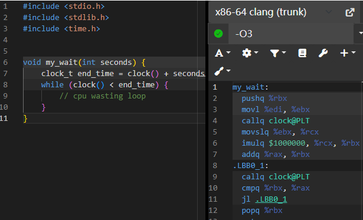
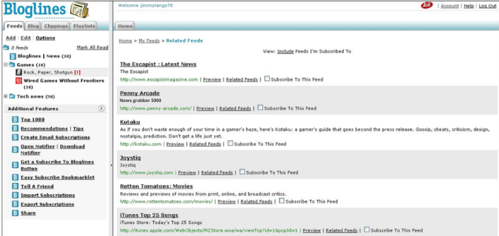
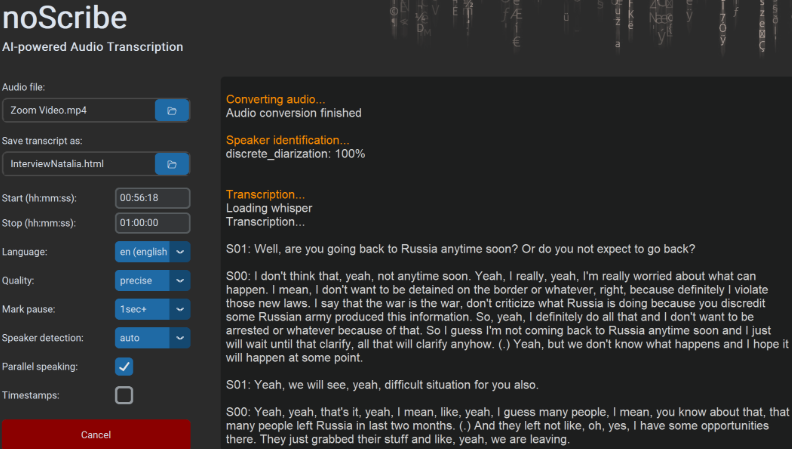
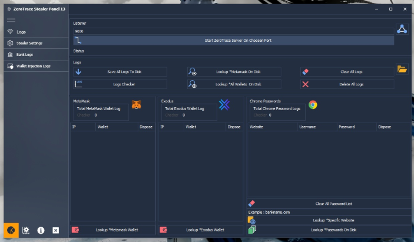
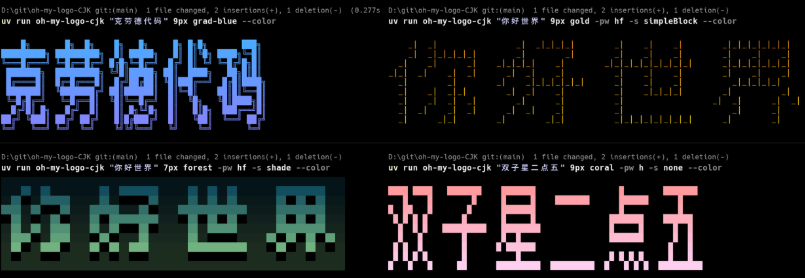
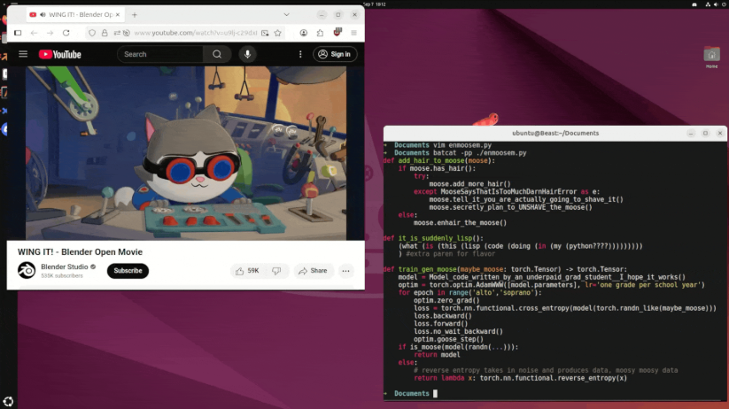

# 机器文摘 第 149 期

### 怎样“正确地”浪费 CPU 资源

还记得那个给甲方预先进行负优化的程序员段子，为了将来满足甲方的优化需求，提前让程序跑的特别慢，随着项目的推进再逐渐注释掉代码，程序性能“大幅提升”，深得甲方认可。

然而，现在的编译器都有了比较完善的编译期优化技术，如果只是傻傻的写一些让 CPU 浪费时间的循环，很可能这段代码根本就不会被编译进去，直接被“优化”掉了。

[《如何像专家一样“浪费”CPU资源》](https://mostlynerdless.de/blog/2025/09/19/how-to-waste-cpu-like-a-professional/)，这篇文章通过一个“如何浪费CPU”的有趣问题，讲解了程序、编译器和操作系统之间的一些工作原理，比如系统调用、编译器优化等。

想让CPU跑满的话，简单的写一个死循环很容易被现在的编译器给优化掉。为了解决代码被优化的问题，文章介绍了三种技巧：
1. 使用特定的编译器指令。
2. 访问一个volatile（易变）变量，告诉编译器这个值随时可能改变，不要优化。
3. 使用内联汇编代码。

以及，最优雅的方法：即使用“单调时钟”（monotonic clock）。这种方法既能精确计时，又能最大限度地减少系统调用，是实现CPU占用的最高效和最准确的方式。

### RSS 标准的故事

[RSS 标准是怎样干微软的](https://buttondown.com/blog/rss-vs-ice)，这篇文章讲述了 RSS（简易信息聚合）如何在与微软等大厂支持的ICE（信息与内容交换）标准竞争中胜出的故事。

文章通过对比Betamax与VHS（有人说是色情厂商的支持导致 VHS 胜出，但这还不是关键）的竞争，类比ICE与RSS的竞争，指出尽管ICE技术更先进、资金更雄厚，但RSS因其简单、开放、易用而最终胜出。

开放的技术标准或格式总是更有力量和优势。

### 技术越无聊越好使

[更无聊的技术更好用](https://jenson.org/boring/)。

真正有价值的技术，往往看起来不那么炫酷，反而很“无聊”。

就像电从大型发电机变成我们家里墙上的插座一样，AI也会慢慢从喧嚣走向日常，成为我们生活中安静又可靠的一部分。

这篇文字让我重新思考：也许未来不是让机器像人，而是让机器更好地帮我们从琐事中解脱。

### 网站建在电子烟屁股上

[在一次性电子烟上托管网站](https://bogdanthegeek.github.io/blog/projects/vapeserver/)，上次有哥们儿把博客网站建在了一个手机上，我轻蔑一笑。

这次的得点个赞了，有哥们把网站建在了“电子烟”的烟屁股上了。 ​​​

他直接把电子烟里的控制芯片（ESP32）当成一台“迷你服务器”： 用 Arduino 写了个最简 HTTP 服务器程序，烧录进芯片； 把需要展示的网页内容转成 C 数组，随固件一起刷进去；

### 可完全离线运行的 AI 语音转录工具

[noScribe](https://github.com/kaixxx/noScribe)，专为于学术研究和新闻采访设计的语音转文字工具。

能够自动识别不同说话人、支持 60 多种语言转录，还内置了专业的编辑器来校对结果。

支持几乎所有音频和视频格式的自动转录，可进行音频同步播放校对。

可以本地离线运行，提供即开即用安装包（支持 Windows、macOS 和 Linux 全平台）。

### 来自 HuggingFace 的大模型教学项目

[picotron](https://github.com/huggingface/picotron)，HuggingFace 的从 0 预训练大模型的框架，官方还给了视频教程，核心部分的源代码文件，每个都不到300行。

### 一个开源监控工具

[ZeroTrace](https://github.com/luis22d/ZeroTrace-Stealer-13-2026)，可从客户端窃取大量数据或信息，并发送到服务器。

支持对 Chrome 浏览器进行提取密码、Cookies、浏览历史、书签等信息。

并且具备实时客户端监控、数据收集、分析工具、安全特性等多项功能。

同时提供一个直观的界面显示，包括仪表板、文件资源管理器、密码管理器等多个视图。

此外，还支持自定义端口配置和客户端构建器，以适应不同的网络环境和需求。

### 渲染中文字到字符界面

[oh-my-logo-CJK](https://github.com/Antonoko/oh-my-logo-CJK)，[oh-my-logo](https://github.com/shinshin86/oh-my-logo) 项目的中文版，能将输入的中、日、韩文本渲染为 CLI 中的像素风 ASCII 图，支持多种渐变色板。

主要特性：
- CJK 友好：基于像素字体采样（非预制 ASCII），支持中、日、韩等多语种
- 从 oh-my-logo 偷了多种渐变色板与方向，支持 24-bit ANSI 颜色
- 多种像素输出模式与样式（half/full、block/shade 等）
- 开箱即用，跨平台（Windows 通过 colorama 兼容 ANSI）

### 直接在终端里运行任何 GUI 应用

[Term.Everything](https://github.com/mmulet/term.everything)，可以让我们直接在终端里运行任何 GUI 应用。

包括浏览器、游戏、视频等，并兼容 kitty、iTerm2 等终端，实现全分辨率渲染。

同时支持通过 SSH 远程运行 GUI 应用，无需 X11 转发，提供了流畅使用体验。

我推测其实现原理是直接将像素映射为终端里的字符，不知性能如何。

## 订阅
这里会不定期分享我看到的有趣的内容（不一定是最新的，但是有意思），因为大部分都与机器有关，所以先叫它“机器文摘”吧。

Github仓库地址：https://github.com/sbabybird/MachineDigest

喜欢的朋友可以订阅关注：

- 通过微信公众号“从容地狂奔”订阅。

