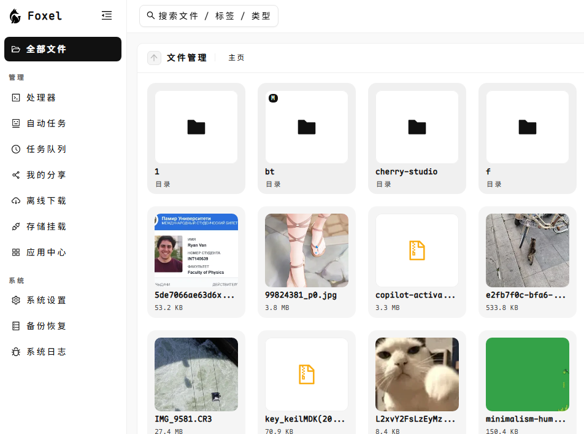
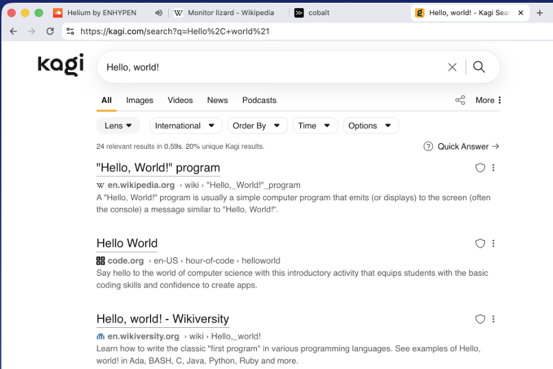
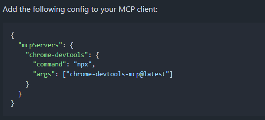
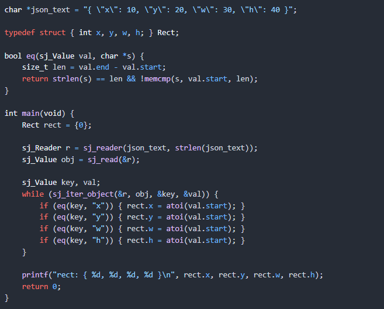
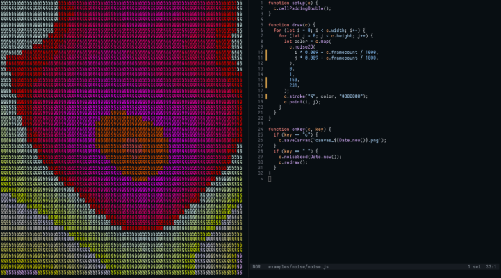

# 机器文摘 第 150 期

### 又一个私有云盘

[foxel](https://demo.foxel.cc/)，为个人和团队提供高度可扩展的私有云存储解决方案，具有人工智能语义搜索功能。

可以直接预览文件，支持图片、视频、PDF 等各种格式。

完善的权限和分享功能，支持公开火私密分享链接给他人。

通过 Docker 一键部署，简单配置一下即可使用，项目有提供了详细的安装教程。

### 基于 chrome 内核构建的高度隐私浏览器 

[Helium](https://helium.computer/)，氦气浏览器。高度注重隐私的浏览器。

集成高效的广告拦截能力，追求极速、拒绝臃肿。

目前仍在测试中。需要的可以下载试用。

项目在 GitHub 开源：https://github.com/imputnet/helium

### 用于网页调试的 MCP

[chrome-devtools-mcp](https://github.com/ChromeDevTools/chrome-devtools-mcp)，Chrome DevTools 推出了 MCP 并且代码已开源，可以直接让 AI 完成网页自动化测试、调试以及优化整套开发流程。

能够自动进行网页导航、性能分析、截图调试等复杂操作，简化开发流程。

可以模拟真人操作，比如页面点击、填写表单、元素拖拽等各种交互，可应用于自动化测试以及爬虫等场景。

### 极简 JSON 解析库

[sj.h](https://github.com/rxi/sj.h)，只有 150 行代码的 json 解析库，符合 c99 规范，极致轻量。

主要特性：
- 仅约150行纯 C11 代码，极致轻量，零动态内存分配，状态占用极小  
- 精确错误定位，支持行列号提示，助力快速调试定位问题  
- 不含数字和字符串解析逻辑，strtod和unicode代理对由用户自定义，灵活度极高  
- 结构简单，便于集成，示例代码展示如何将 JSON 映射到自定义结构体，易于理解和扩展  
- 代码完全开源，Unlicense 许可，公共领域软件，无任何使用限制  
- 适合对性能和内存要求极高的场景，不依赖外部库，适合嵌入式、游戏引擎、系统工具等领域  
- 设计理念反直觉：舍弃繁重的全功能解析，专注核心解析需求，提升整体效率和可控性 

### 面向终端的创意编码环境

[runal](https://github.com/emprcl/runal)，面向终端的文本创意编程环境，赋予命令行艺术以全新生命。

主要特性：
- 类似 processing 和 p5js，但所有渲染均以纯文本形式呈现，开启 ASCII 艺术与文本图形的无限可能
- 支持 JavaScript 编写，内置 setup 和 draw 函数，实时监测脚本变动，无需重启即可动态更新画面  
- 提供键盘与鼠标事件响应接口（onKey、onMouseMove、onMouseClick 等），实现交互式文本创作  
- 同时支持 Go 包调用，方便集成到 Go 项目，满足多语言环境下的灵活开发需求  
- 轻量跨平台：Linux/macOS/Windows（推荐 Windows Terminal+Iosevka 字体），单文件运行或自定义编译均可

## 想法

经常需要提醒自己的是，世界还有很多精彩的未知。

这并不代表着自己无知，而是未知里存在的那些精彩值得时常提醒。

还有很多大门等待打开。 ​​​

## 订阅
这里会不定期分享我看到的有趣的内容（不一定是最新的，但是有意思），因为大部分都与机器有关，所以先叫它“机器文摘”吧。

Github仓库地址：https://github.com/sbabybird/MachineDigest

喜欢的朋友可以订阅关注：

- 通过微信公众号“从容地狂奔”订阅。

