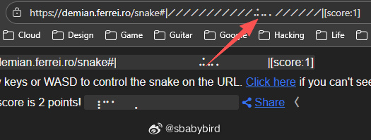
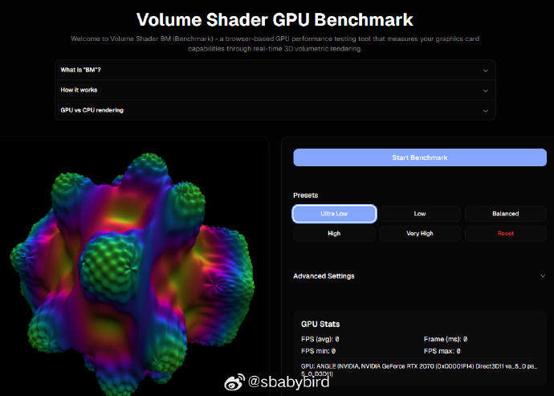
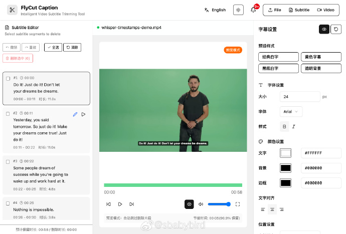
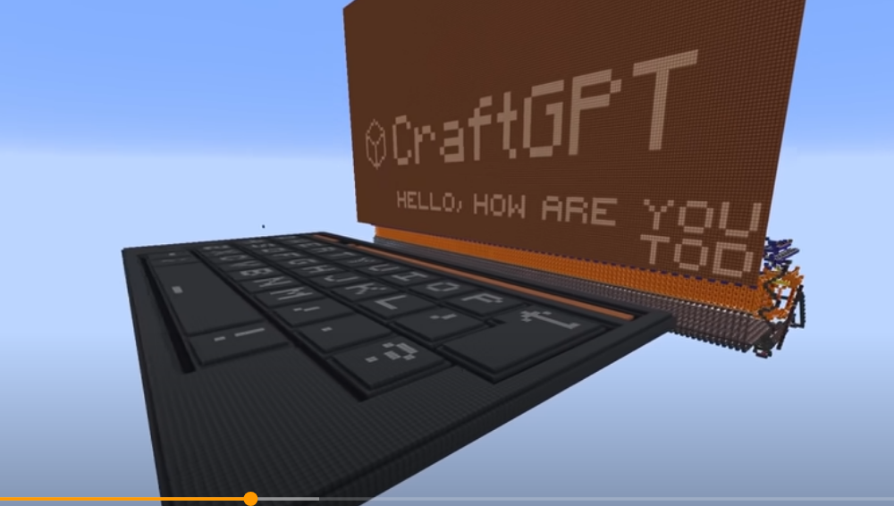
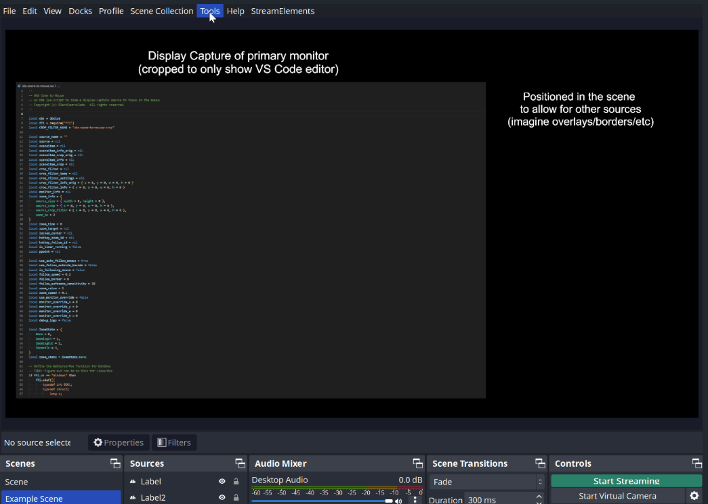

# 机器文摘 第 151 期

### 在地址栏玩贪食蛇

[snake](https://demian.ferrei.ro/[paused])  这个网址点进去可以让你在浏览器的 URL 地址栏里玩贪食蛇游戏。

通过定时器用 JS 实时更新地址栏的字符实现的效果：） ​​​

### 在线GPU性能测试

[Volume Shader BM 在线GPU性能测试工具](https://www.volumeshader.dev/)

这个网站是一个在线GPU性能测试工具，通过3D体积渲染来检测显卡性能。

Volume Shader BM 网站主要用于测试和评估你电脑显卡（GPU）的3D渲染性能。它的核心功能包括：
- WebGL 体积渲染：直接在浏览器里运行3D体积着色器（volume shader）渲染，无需下载安装任何软件。
- 实时性能数据：测试过程中会显示实时的帧率（FPS）、帧时间和显卡利用率等性能指标。
- 跨平台支持：支持 Windows、macOS 和 Linux，只要浏览器支持 WebGL 就能用。
- 结果导出与分享：测试完成后可以导出和分享你的显卡测试结果。

使用方法很简单：

1. 点击“Start GPU Test”按钮开始测试。
2. 浏览器会实时渲染3D体积效果，同时检测你的显卡性能。
3. 测试结束后可以查看详细的性能数据。

这个工具适合想要了解自己电脑显卡3D渲染能力、对比不同设备性能，或者开发者需要测试WebGL渲染效果的人群。

### 网页版视频字幕编辑工具

[FlyCutCaption](https://github.com/x007xyz/flycut-caption) 纯前端实现的视频字幕编辑工具，支持字幕裁剪视频，视频字幕合成

🎯 核心功能：
- 🎤 智能语音识别：基于 Whisper 模型的高精度语音转文字，支持多种语言
- ✂️ 可视化字幕编辑：直观的字幕片段选择和删除界面
- 🎬 实时视频预览：与字幕同步的视频播放器，支持区间播放
- 📤 多格式导出：支持 SRT、JSON 字幕格式以及视频文件导出
- 🎨 字幕样式定制：自定义字幕字体、颜色、位置等样式
- 🌐 国际化支持：组件化国际化设计，支持中文、英文、自定义语言包（如日语示例）
- 🔧 技术特色
- ⚡ 现代化技术栈：React 19 + TypeScript + Vite + Tailwind CSS
- 🧠 本地 AI 处理：使用 Hugging Face Transformers.js 在浏览器本地运行 AI 模型
- 🎯 Web Workers：ASR 处理在后台线程运行，不阻塞主界面
- 📱 响应式设计：适配不同屏幕尺寸的现代化界面
- 🎪 组件化架构：模块化设计，易于维护和扩展

### 在“我的世界”构建一个 GPT

油管视频博主[sammyuri](https://www.youtube.com/watch?v=VaeI9YgE1o8)在游戏“我的世界”里通过红石系统构建了一个“chatGPT”。

> 该模型拥有 5,087,280 个参数，使用 Python 在 TinyChat 基本英语对话数据集上进行训练。其嵌入维度为 240，词汇量为 1920 个 token，由 6 层组成。上下文窗口大小为 64 个 token，足以应对（非常）短的对话。大多数权重被量化为 8 位，但嵌入和 LayerNorm 权重分别以 18 位和 24 位存储。量化后的权重链接如下；它们被拆分成数百个文件，与构建过程中 ROM 的各个部分相对应。
>
> 该建筑的体积为 1020x260x1656 方块。由于其巨大的体积，使用了 Distant Horizo​​ns 模组来拍摄整个建筑的画面；这导致远处的红石组件看起来很奇怪，因为它们的渲染细节较低。
>
> 当使用 MCHPRS（Minecraft 高性能红石服务器）将滴答率提高到约 40,000 倍速度时，它可以在约 2 小时内产生响应。

### OBS 跟随鼠标放大插件 

[OBS-Zoom-To-Mouse](https://github.com/BlankSourceCode/obs-zoom-to-mouse)，可让 OBS 自动跟随鼠标进行智能缩放。

不仅能自动调整显示捕获源的缩放和位置，还支持一键缩放到鼠标位置，甚至能跟随鼠标的移动，同时有效避免画面抖动。

主要特性：

- 一键缩放到当前鼠标位置，可自定义缩放倍数和动画速度；
- 智能鼠标跟随模式，可设置跟随边界和锁定灵敏度；
- 支持自动跟随和手动切换两种跟随方式；
- 支持双机设置，可跟踪远程机器的鼠标位置；
- 提供详细的手动位置设置，支持非显示捕获源。

兼容 Windows、Linux、macOS 三大平台，下载脚本文件导入到 OBS 即可使用。

## 订阅
这里会不定期分享我看到的有趣的内容（不一定是最新的，但是有意思），因为大部分都与机器有关，所以先叫它“机器文摘”吧。

Github仓库地址：https://github.com/sbabybird/MachineDigest

喜欢的朋友可以订阅关注：

- 通过微信公众号“从容地狂奔”订阅。

