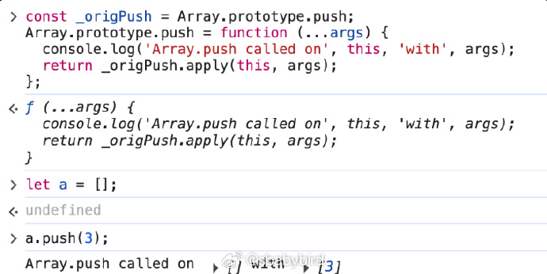
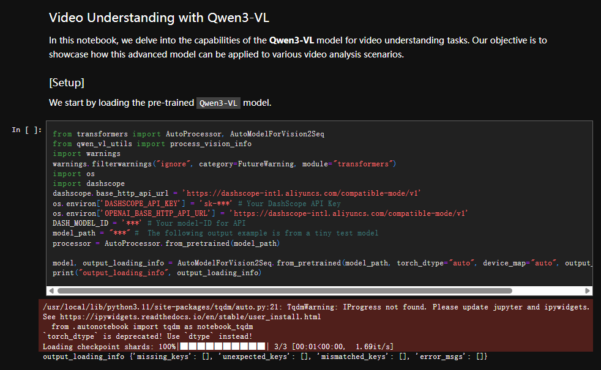
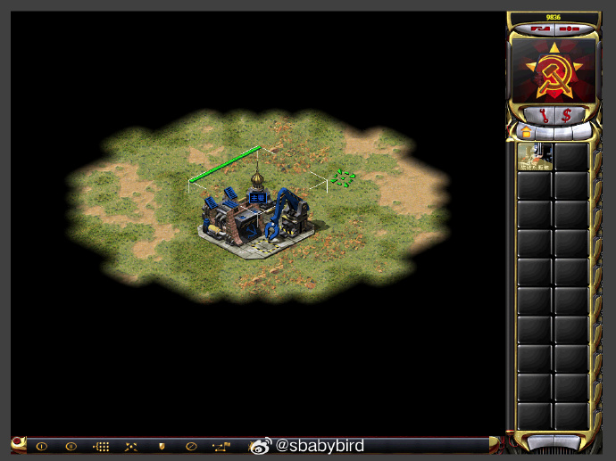
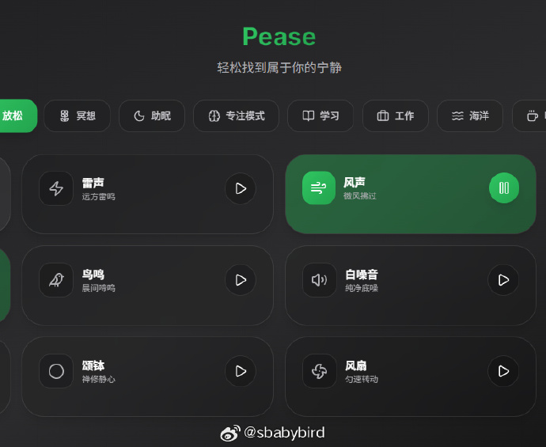
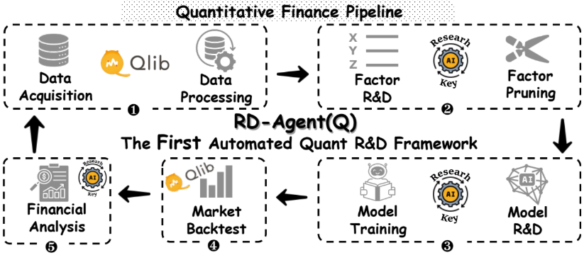

# 机器文摘 第 152 期

### 构建逆向工程专用浏览器

[reverse-engineering-browser](https://nullpt.rs/reverse-engineering-browser)，作者详细记录了从简单浏览器扩展到分叉Chromium内核的完整历程，实现了隐身hook机制和高级逆向工程功能。

> 在AI蓬勃发展的时代，我的心仍然专注于AST转换、浏览器指纹识别和反机器人技术。但我的工作流程总是感觉很原始，需要手动筛选页面脚本、粘贴可疑片段到编辑器中，手工编写去混淆器。虽然有Webcrack和deobfuscate.io等工具，但端到端流程仍然缓慢且手动化。

核心要点:
- 从浏览器扩展到Chromium分叉的演进过程
- 解决内容脚本隔离、OOPIF、toString检测等技术挑战
- 实现隐身hook机制绕过反检测措施
- 集成去混淆、函数覆盖、指纹识别等高级功能

技术细节:
- Chrome DevTools Protocol (CDP) 的高级应用
- 自定义Chromium内核和CDP域开发
- OOPIF (Origin-Isolated iframes) 绕过技术
- 多层toString方法修补技术

实际应用:
- TikTok网站的数据收集分析
- Cloudflare Turnstile绕过
- FingerprintJS指纹捕获
- Canvas/WebGL指纹识别

### 上手 Qwen3-VL 的教程

[Qwen3-VL cookbooks](https://github.com/QwenLM/Qwen3-VL/tree/main/cookbooks)，阿里官方的一套练习使用 Qwen3-VL 的教程。

教程示例功能包括：
图文思维，看图推理，比如解题

还有计算机操作智能体、多模态编程、全场景识别、文档解析、精准目标定位、通用OCR及关键信息提取、3D定位、长文档理解、空间推理、移动端智能体、视频理解等。

### 在网页里完美复刻红警2的故事

[没有源代码，他用5年时间把红警2给重写了](https://zhuanlan.zhihu.com/p/1959574914458711924)，一个国外小哥在没有源码的情况下，使用 ts 重写了 红警2 。

[进入这个网址可以直接玩](https://www.ra2web.com/)，我试了一下，体验非常牛逼。

### 在线收听放松背景音

[pease](https://pease.day/) 是一个极简的环境音混音器（Ambient Sound Mixer），可以自由混合雨声、海浪、风声、咖啡厅、篝火、钢琴等 12 种自然声音，帮助你在工作、学习、冥想或睡眠时进入平静和专注的状态。

特色亮点：
• 🎛️ 自由混音：支持多音源叠加与音量独立调节
• 💾 PWA 支持：安装后可离线使用
• 🎨 毛玻璃界面：深浅色主题自适应
• ⏱️ 定时功能：可设置播放时长
• 🔗 分享配置：可生成分享链接，传递你的专属混音

### 微软出品的研发智能体

[RD-Agent](https://github.com/microsoft/RD-Agent)，一个让 AI 能够自己做科研的系统——能提出问题、设计实验、验证结果、总结规律，整套科研流程都能自动化执行。

> 研发 (R&D) 对于提升工业生产力至关重要，尤其是在人工智能时代，研发的核心主要集中在数据和模型上。我们致力于通过 R&D-Agent 实现这些高价值通用研发流程的自动化，让 AI 驱动数据驱动的 AI。

## 订阅
这里会不定期分享我看到的有趣的内容（不一定是最新的，但是有意思），因为大部分都与机器有关，所以先叫它“机器文摘”吧。

Github仓库地址：https://github.com/sbabybird/MachineDigest

喜欢的朋友可以订阅关注：

- 通过微信公众号“从容地狂奔”订阅。

