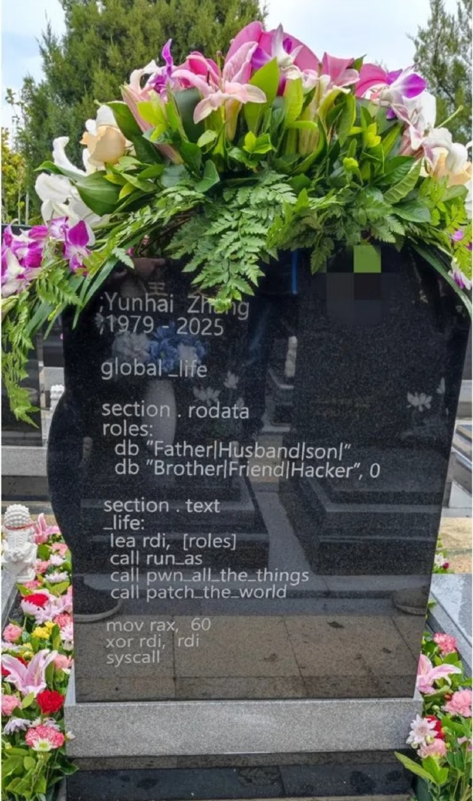
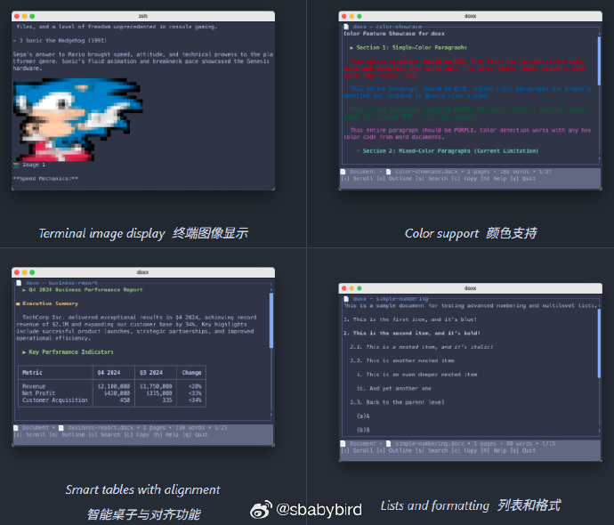
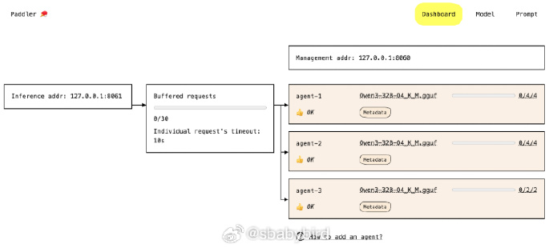
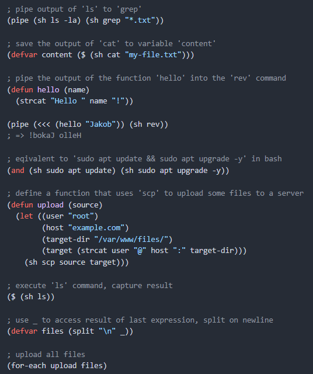

# 机器文摘 第 153 期

### 电饭锅传数据

最近流传一个待证实的传说，使用电饭锅可以助力两台手机设备之间数据传输的速度（主要用于新机迁移时）。

推测是电饭锅内胆的金属产生了“法拉第笼”效应，屏蔽了外界信号干扰，提升了手机信号强度？

我没有做测试的条件，目前还在怀疑中。

但第一个想到这个点子的人，当时是什么精神状态？

具体讨论来自这个推：https://x.com/skaas777/status/1977201633256726833

### 信息安全专家张云海的墓碑

张云海（1979-2025）是绿盟科技天机实验室的负责人，该实验室专注于漏洞挖掘、分析与利用技术研究。 

其研究领域包括操作系统、应用软件、基础组件以及安全防御与对抗技术等，并致力于挖掘和分析漏洞，曾获得微软缓解绕过赏金计划奖励。 

近期有网友发出了其墓碑照片，碑文为一段汇编代码。

这段代码结合了汇编语言和幽默元素，以一种风趣的方式描述了一个人在家庭、社会和技术领域的多重角色。

同时通过模拟汇编语言的执行流程，表达了对生活的总结：从出生（程序启动）到承担角色（函数调用），再到最终离开（程序退出）。

### 基于终端的 word 文件预览工具

[doxx](https://github.com/bgreenwell/doxx)，用于 Word 文件的快速终端原生文档查看器。查看、搜索和导出 .docx 文档，而无需离开命令行。

支持图片、文本颜色、表格、公式等富文本信息显示。 ​​​

### 用于 LLM 私有部署的负载均衡平台

[Paddler](https://github.com/intentee/paddler) 是一个开源的 LLM 负载均衡器和服务平台。它允许您在自己的基础架构上运行推理、部署和扩展 LLM，从而提供卓越的开发者体验。

主要特性：
- 通过内置的 llama.cpp 引擎进行推理
- LLM 特定的负载平衡
- 通过可动态添加的代理工作，允许与自动缩放工具集成
- 请求缓冲，支持从零主机扩展
- 动态模型交换
- 内置 Web 管理面板，用于管理、监控和测试

### 基于 Rust 的 LLM 学习项目

[nanochat](https://github.com/karpathy/nanochat)，不到 8000 行代码，完整实现了从训练到推理的 LLM 全流程。

项目主要特点：
- 用 Rust 实现了高效的 tokenizer 训练  
- 在 FineWeb 语料上预训练 Transformer LLM，并多维度评估核心指标  
- 中期训练结合用户-助手对话、选择题、工具调用等多样任务  
- 监督微调（SFT）后，模型在多项世界知识（ARC-E/C、MMLU）、数学（GSM8K）、代码（HumanEval）测试中表现优异  
- 可选用“GRPO”算法进行强化学习（RL），提升数学题解答能力  
- 轻量化推理引擎支持 KV 缓存、简单预填充/解码，集成 Python 沙箱工具，同时提供 CLI 和类 ChatGPT 网页 UI  
- 生成统一的 Markdown 报告，方便总结、打分和游戏化体验  

### Shell 脚本的 Lisp 解释器

[Redstart](https://github.com/gue-ni/redstart)，是一个用 C++ 编写的轻量级 Lisp 解释器，专注于 Shell 脚本编写。它能够将 Lisp 的强大表达能力与 Unix Shell 的实用性相结合：您可以运行命令、捕获输出、在进程之间进行管道传输，同时仍然使用 Lisp 语法进行逻辑和结构编写。您可以将其视为用 Lisp 而不是 Bash 编写 Shell 脚本。

有了这个，可以使用 Lisp 语言编写 Linux 的 Shell 脚本了。

## 订阅
这里会不定期分享我看到的有趣的内容（不一定是最新的，但是有意思），因为大部分都与机器有关，所以先叫它“机器文摘”吧。

Github仓库地址：https://github.com/sbabybird/MachineDigest

喜欢的朋友可以订阅关注：

- 通过微信公众号“从容地狂奔”订阅。

