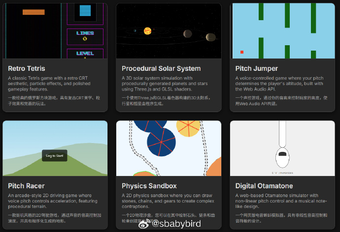
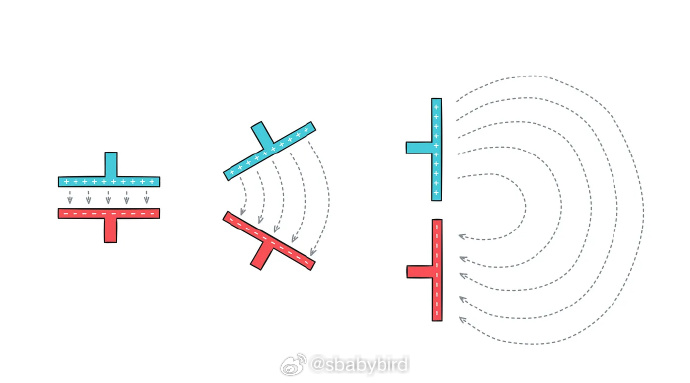
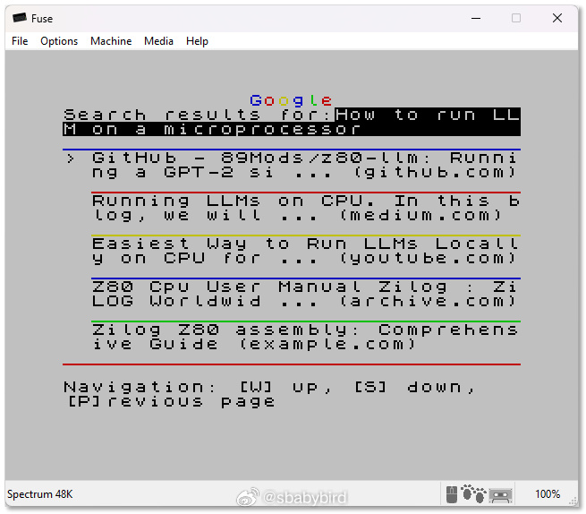
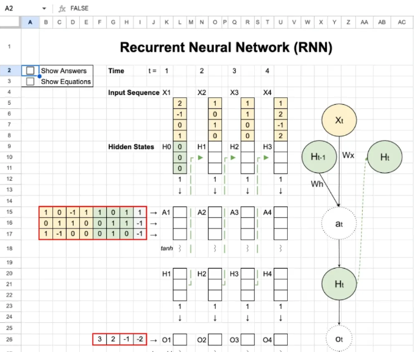

# 机器文摘 第 154 期

### 多语言环境版本管理器

[asdf](https://github.com/asdf-vm/asdf)，一个多语言版本管理器，通过单一命令行工具统一管理多种语言的运行时版本，适合多技术栈的开发者和团队。

主要功能：
1. 支持多种语言，包括 Node.js、Python、Ruby、Go 等，统一管理版本；
2. 项目级版本隔离，通过配置文件指定运行时，避免全局冲突；
3. 插件系统扩展，支持社区维护的数百种工具和语言；
4. 一键安装和切换，命令简洁，减少手动配置时间；
5. 跨平台兼容，运行于 Linux、macOS 和 WSL，适配多种开发环境；
6. 与 CI/CD 集成，简化自动化脚本中的环境设置。

项目通过脚本快速安装，文档清晰，几分钟内可配置多种语言环境，非常适合需要在多语言项目间高效切换的开发者提升生产力。

### Google 的 Gemini-cli 助手给我编程

我最近开启了一个项目：[完全使用 Google 的 Gemini-cli 助手给我编程](https://sbabybird.github.io/Gemini-Engineering-Experiments/projects/)，用网页实现一些小游戏、小 demo。

初衷只是为了探索一下自己一点儿都不干，所有任务都交给 AI （包括写文档、提交 git 仓库等），看看能做到何种程度。

使用体验如下：

1. AI 完全可以胜任制作一些不那么复杂的小系统，前提是你能把需求提明白。
2. 开局先让 AI 写文档并分析需求，非常有助于保持项目方向不会偏差太远。
3. AI 有时候会重复陷在一个错误里爬不出来，这个时候不要较劲，用指令强行让他换个思路干。

附图是我让它做的几个 Demo，完成度不算太高，但是有效果。

### 一个真正免费的在线 AI 图片生成网站

[AI图像生成器](https://freeaiimage.net/zh/)，这个在线 AI 图像生成网站，貌似是免费的，可以免费生成和编辑图片，用的是 Qwen 系列模型，质量不错，还支持一键抠图。 ​​​

### 无线电是如何工作的

[Radios, how do they work?](https://lcamtuf.substack.com/p/radios-how-do-they-work)，一篇有趣的科普文。

无线电通信在现代电子技术中扮演着关键角色，但对于业余爱好者来说，其背后的理论却难以理解。

我们当然了解大概的概念：我们了解频率，或许也能解释幅度调制和频率调制之间的区别。

然而，大多数人却难以清晰地理解什么是好的天线，或者接收器如何能够调到特定频率而忽略其他一切。

本文比较生动形象地解释了相关的技术原理，比如什么是“调幅”、什么是“调频”。等等。

### 让一台 8bit 旧计算机上网

[旧电脑挑战社区](http://occ.sdf.org/)是一小群爱好者，他们每年聚集在一起体验新旧事物。

今年有位博主刚提交了他的新“挑战”，[在一台 ZX Spectrum 电脑上浏览现代网页](https://0x00.cl/blog/2025/occ-2025/)（使用谷歌搜索，访问 Hackernews 等）。

ZX Spectrum 的图像分辨率为 256x192 像素 ，显示空间非常有限，调色板由 8 种颜色组成。

### 用 Excel 学 RNN

[Recurrent Neural Network in Excel](https://www.byhand.ai/p/recurrent-neural-network-spreadsheet)，Tom Yeh教授作品，他还有一系列的Excel学AI的相关作品。

## 订阅
这里会不定期分享我看到的有趣的内容（不一定是最新的，但是有意思），因为大部分都与机器有关，所以先叫它“机器文摘”吧。

Github仓库地址：https://github.com/sbabybird/MachineDigest

喜欢的朋友可以订阅关注：

- 通过微信公众号“从容地狂奔”订阅。

