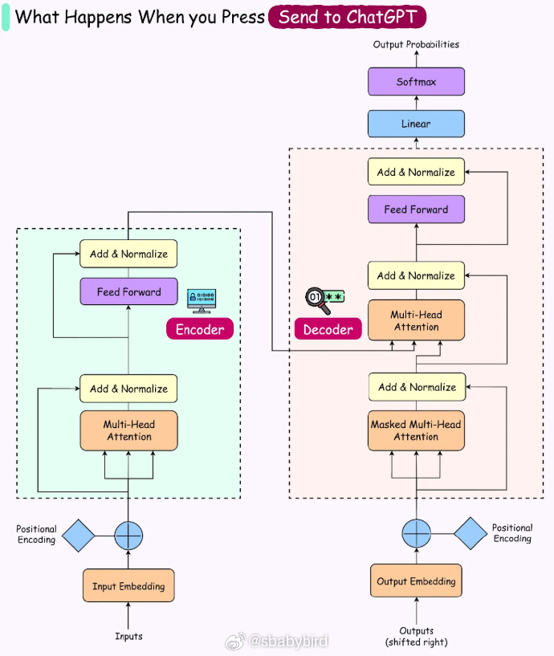
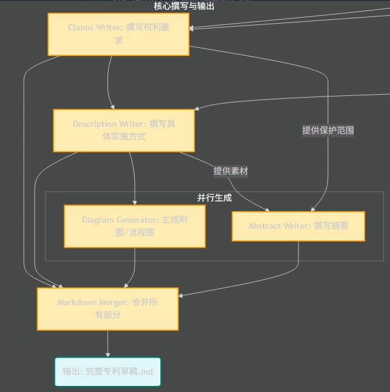
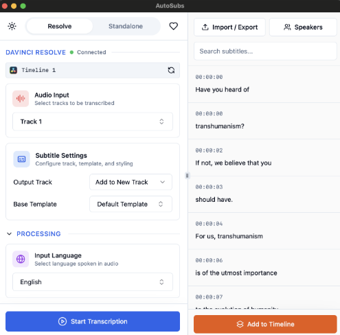
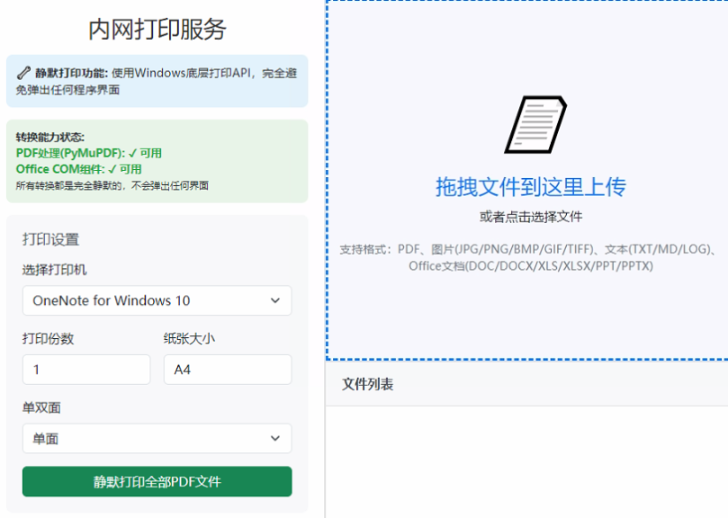
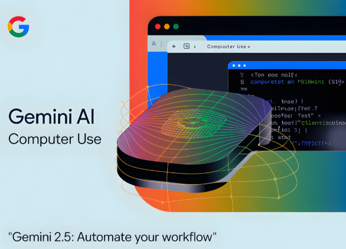
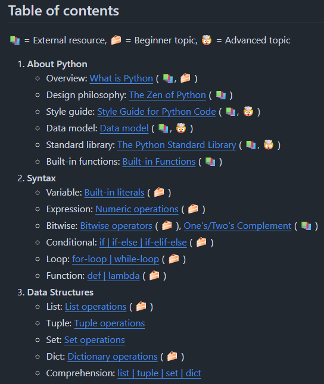
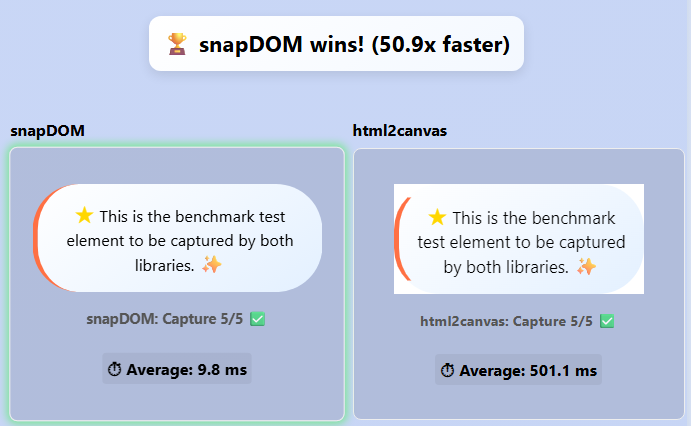

# 机器文摘 第 155 期

### 当你在 ChatGPT 中按下“发送”按钮时，实际会发生什么？

[《What Actually Happens When You Press ‘Send’ to ChatGPT》](https://blog.bytebytego.com/p/what-actually-happens-when-you-press)，ChatGPT 由 OpenAI 开发，代表着人类与人工智能交互方式的一次重大飞跃。它摒弃了固定的命令或僵化的搜索查询，让用户能够用自然流畅的语言，就各种主题展开对话。这种便捷的交互方式使 ChatGPT 成为数百万用户的常用工具，无论是在学习、头脑风暴、编程求助还是日常问题解决方面，它都能发挥作用。

这个简单的界面背后隐藏着一套强大的技术。

其核心是一个基于 Transformer 的语言模型，该模型经过海量文本训练，能够预测序列中的下一个单词或标记。过去几年，这些模型已经从基本的文本生成器发展成为能够推理、遵循指令、使用工具并实现个性化交互的复杂系统。模型规模、训练方法、服务基础设施和安全技术的进步，使得向全球用户实时提供响应成为可能。

本文将深入探讨您点击 ChatGPT 的“发送”按钮后实际发生的情况。整个流程始于浏览器发出的安全请求，随后进行上下文准备、分词、模型推理和流式传输。我们将探讨系统如何在需要时调用外部工具、应用多层安全机制、使用可选内存进行个性化设置，以及如何通过性能优化来确保大规模运行下的快速响应。

### 能帮你申请专利的智能体

[PatentWriterAgent](https://github.com/ninehills/PatentWriterAgent)，根据用户提供的技术资料，自动撰写专题申请提案文稿。

主要特性：
- 现有技术检索；
- 自动生成流程图和摘要；
- 输出完整的专题申请文稿；

### 开源字幕自动生成软件

[AutoSubs](https://github.com/tmoroney/auto-subs)，一键生成高质量字幕，同时支持自动识别不同说话人，自动为每个说话人分配颜色标签，支持英文翻译和多种自定义样式。

主要特性：
- 一键快速转录音视频内容，支持多种语言；
- 自动识别并标记不同说话人，用颜色区分；
- 内置现代化字幕编辑器，可精细调整时间和文本；
- 与 DaVinci Resolve 深度集成，直接发送字幕到时间线；
- 独立模式支持处理任意音视频文件，无需剪辑软件；
- 灵活的样式控制，支持多行显示和单独设置说话人样式。

### 内网打印机共享软件

[PrinterService](https://github.com/cp9no1/PrinterService)，一个简单易用的内网打印解决方案，通过浏览器即可上传文件并打印，无需复杂配置。

打印者只需访问网页即可上传提交自己需要打印的文件进行打印，免去了安装打印驱动的麻烦，解决了各种操作系统跨平台的兼容问题。

主要特性：
- 支持内网打印，兼容多种网络环境；
- 自动将Word、Excel、PowerPoint、PDF等多种文件格式转换为PDF，保证打印效果一致；
- 支持文件拖拽上传，操作简单直观；
- 提供文件预览和管理功能，方便查看和删除待打印文件；
- Web界面适配各种设备，随时随地访问打印服务；
- 程序后台运行，启动后系统托盘显示打印机图标，操作更便捷。

### Google 开源的浏览器自动化工具

[Computer Use Preview](https://github.com/google-gemini/computer-use-preview)，谷歌开源的浏览器自动化工具，只需要用普通话告诉它想做什么，AI 就能自动帮你操控浏览器，完成各种复杂操作。

能自动在浏览器里帮你完成点击、输入、滚动等操作。

应用场景：
- 自动填表 ： 求职时要在多个招聘网站填简历？让 AI 一键搞定
- 比价购物 ： 想买东西不知选哪家？让它帮你对比各平台的价格和评价
- 数据收集 ： 需要整理行业数据？它能自动从不同网站抓取信息
- 测试网站 ： 做网站开发的话，可以让它模拟用户操作自动测试

依赖 [Playwright](https://playwright.dev/) 项目操纵浏览器，需要 Gemini 模型的 API，不过既然是开源的，理论上可以稍作改动使用自己的本地大模型。

### 终极 Python 学习指南

[Ultimate Python study guide](https://github.com/huangsam/ultimate-python)，大部分学习资源直接以代码的形式提供，可以边写/改代码边学习，内容只涉及 Python 自带的内部库。

> 本存儲庫集合了不同題目的獨立模組範例，而每個模組可以獨立在普通 終端機（Terminal），IDE（如PyCharm）或者瀏覽器（如Repl.it）中運行。範例中的註解都經過精心編寫，引導讀者逐步了解程 式流程。在不刪除主例程（main)並在修改後成功運行大前題下，我鼓勵讀者修改源代碼作練習。

虽然现在 AI 编程已经比较普遍了，但如果想要深入开发的话，掌握语言本身的基础使用技能还是很有必要。

### 快速精准的网页截图神器

[snapdom](https://github.com/zumerlab/snapdom)，能快速且精确地将网页上的任何 HTML 元素截取为高质量、可缩放的 SVG 图片，完全保留原始元素的样式、字体、背景图片、伪元素（pseudo-elements）甚至是 Shadow DOM（一种封装于DOM元素内部的独立DOM结构，用于组件隔离和样式保护）。

此外，它还能轻松导出为各种常见的位图格式和 canvas。

## 订阅
这里会不定期分享我看到的有趣的内容（不一定是最新的，但是有意思），因为大部分都与机器有关，所以先叫它“机器文摘”吧。

Github仓库地址：https://github.com/sbabybird/MachineDigest

喜欢的朋友可以订阅关注：

- 通过微信公众号“从容地狂奔”订阅。

