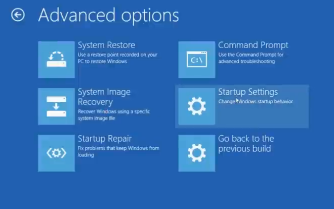
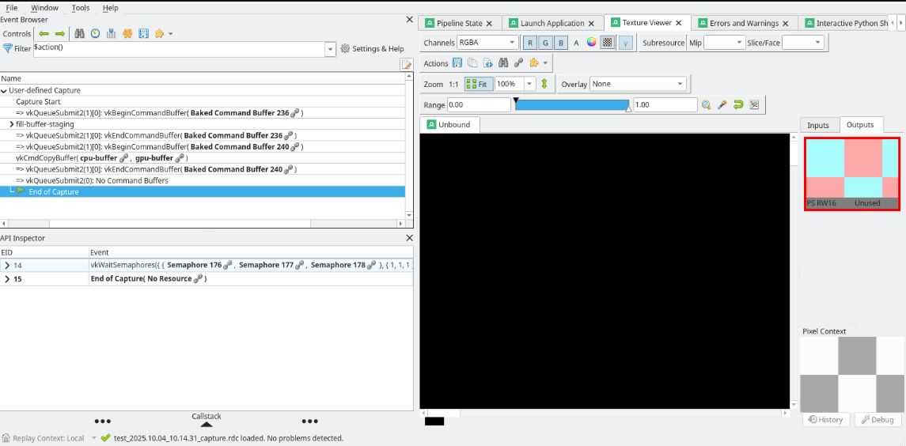
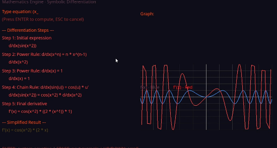
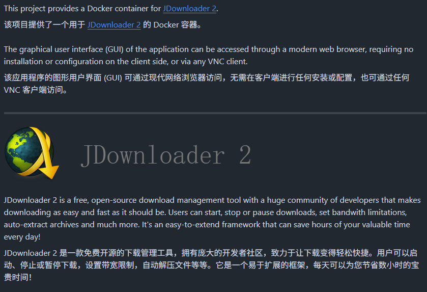
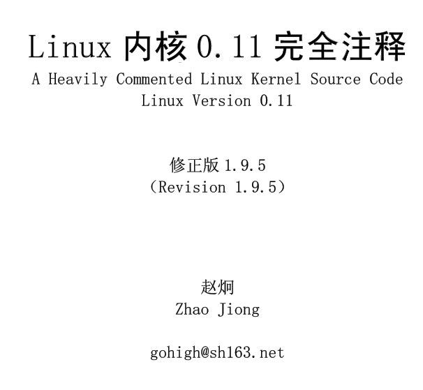

# 机器文摘 第 156 期

### 怎样在 Windows10 或者 11 上使用 Windows8 的驱动

[让您的 Roland/Edirol 设备在 Windows 10 系统下正常运行的终极指南](http://forum.cakewalk.com/The-ultimate-guide-to-get-your-RolandEdirol-devices-to-work-with-Windows-10-Updated-m3267234.aspx)。

如果有老旧的设备，厂商不再更新驱动程序，但是希望能够在 win10 或 win11 系统中使用的话。可以试试这个方法：

前提：这个设备具有 win8或win8.1 的驱动程序。

操作步骤：
1. 关闭 win10 或 win11 的强制驱动签名要求，具体可参考文章中给出的操作指引。
2. 修改驱动程序安装文件下的 .inf 文件，用记事本打开，将其中描述对支持的操作系统限制部分文本，修改为win10、win11 版本号即可。文中有具体描述。

此方法得以发现，起先是因为我有一台老旧的 MIDI 设备，功能一切正常，但是厂商 Roland 不在更新他的驱动（早就停产了），但是又不忍心丢弃，而且设备确实很好用。

查找到外网论坛上有人在 2015 年就挖掘出了这个方法，亲自动手试用了一下，效果不错。 唯一的风险是关闭了 Windows 的强制驱动签名后可能会导致一些安全和兼容性问题，但是我还可以接受。

帖子里，作者将 Roland 骂了一番，浏览量惊人，拯救了很多拥有该设备的人，但是厂商貌似并没有改进此事，继续不吭声。貌似现在连 MIDI 键盘的新品也不想出了。

### 以计算优先的思维方式学习 GPU 编程

[A case for learning GPU programming with a compute-first mindset](https://themaister.net/blog/2025/10/05/a-case-for-learning-gpu-programming-with-a-compute-first-mindset/)，初学者进入GPU编程领域，常被“Hello Triangle”这类复杂且冗长的图形渲染示例绊倒，耗费数周调试才能显示简单图形，令人望而却步。

2025年，单纯从传统图形渲染入门已不合时宜。本文作者主张从“计算优先”角度切入GPU编程，先掌握compute shader（计算着色器）和调试工具RenderDoc，深入理解GPU如何执行代码，再逐步引入光栅化流水线，避免一开始面对庞大复杂的图形API。

相比CUDA、OpenCL，作者推荐使用Vulkan的计算功能作为入门，因其兼顾计算与图形，且配合中间抽象层（如作者自用的Granite）降低入门门槛。

通过RenderDoc捕获与调试，结合SPIR-V与GLSL反编译、shader替换调试，能够高效定位并解决复杂并行计算中的问题。

文章详细阐述了GPU计算的执行模型——工作组与子组的层次结构，以及不同厂商硬件的子组大小差异，帮助读者建立正确的性能思维。

文中还介绍了如何使用缓冲区设备地址、描述符（descriptors）管理资源，说明了Vulkan绑定模型的基本工作原理及其在Granite中的实现细节，同时演示了如何借助VK_EXT_descriptor_buffer扩展简化描述符管理。

作者通过实例展示了将ShaderToy的图形着色器移植为计算着色器，拓展了计算着色器的应用边界。

接下来，作者建议逐步深入学习原子操作、无锁编程、共享内存、子组操作、纹理采样、图像处理、内存一致性与多工作组通信等关键技术，掌握API同步与CPU-GPU流水线优化，最终再回到光栅化图形渲染，完成从计算到图形的全面能力构建。

这篇文章为GPU编程的新手提供了一条极具实践意义的学习路径：抛弃传统图形渲染的繁琐，从计算着色器与强大调试工具入手，循序渐进掌握GPU的真正能力。

### 开源微积分工具包

[Mathh](https://github.com/shubhu121/Mathh)，一款用于符号微积分的 Windows 桌面应用程序，具有逐步解答和交互式功能 。

不仅能一步步展示求导过程，还能将多种函数的导数曲线在二维图形中直观对比，甚至支持自定义函数输入。更妙的是，每一步计算都会标明所用的微分法则，帮助理解推导逻辑。

使用 C++17 和 SDL2 进行构建。

主要特性：
- 自定义公式输入 ：交互式输入您自己的公式；
- 逐步解答 ：查看带有数学符号的详细计算过程；
- UTF-8 支持 ：完全支持 Unicode，包括希腊字母（∂、π、α）和数学符号（⋅、√、∫）；
- 交互式菜单 ：启动时选择操作；
- 多个示例 ：每种模式的预加载表达式；
- OpenGL 绘图 ：所有模式下的实时图形；
- 边界输入 ：设置定积分的自定义积分边界；

### “高级生成式AI开发者”课程

[进阶：“面向开发者的生成式 AI”学习路线](https://www.skills.google/paths/183)，谷歌推出的免费学习路线：“生成式 AI”学习路线侧重于技术领域，专为应用开发者、机器学习工程师和数据科学家量身打造。

### Docker 部署 JDownloader 2 下载器

[Docker container for JDownloader 2](https://github.com/jlesage/docker-jdownloader-2)，只需一条命令就能完成部署，通过浏览器直接访问使用 JDownloader 2 完整的下载功能。

并且提供远程控制功能，支持 VNC 协议连接，还可以通过手机随时随地管理下载任务。

除此之外，还内置了 Web 文件管理器，方便管理已下载好的文件。

想要在服务器或 NAS 上部署一个强大的下载器的朋友，可以看下这个工具。

### 关于 Linux 内核的经典学习书籍

[《Linux 内核 0.11 完全注释》](https://mirror.math.princeton.edu/pub/oldlinux/download/clk011c-1.9.5.pdf)，一本老书，对 Linux 早期操作系统内核(v0.11)全部代码文件进行了详细全面的注释和说明，旨在使读者能够在尽量短的时间内对 Linux 的工作机理获得全面而深刻的理解，为进一步学习和研究Linux 系统打下坚实的基础。

虽然所选择的版本较低，但该内核已能够正常编译运行，其中已经包括了 LINUX 工作原理的精髓，通过阅读其源代码能快速地完全理解内核的运作机制。

## 订阅
这里会不定期分享我看到的有趣的内容（不一定是最新的，但是有意思），因为大部分都与机器有关，所以先叫它“机器文摘”吧。

Github仓库地址：https://github.com/sbabybird/MachineDigest

喜欢的朋友可以订阅关注：

- 通过微信公众号“从容地狂奔”订阅。

