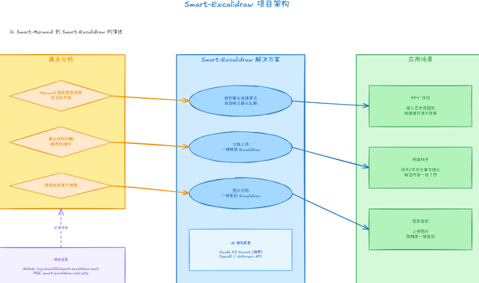
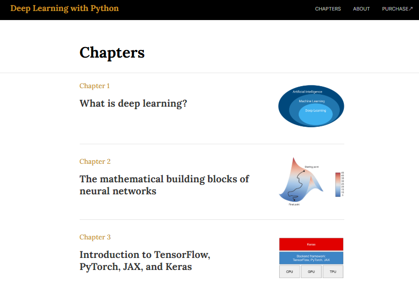

# 机器文摘 第 157 期

### 借助 AI 画流程图

[Smart Excalidraw](https://github.com/liujuntao123/smart-excalidraw-next)，输入一句话，AI自动生成专业级流程图。

主要特性：
- AI驱动生成，支持20多种图表类型，包括流程图、架构图、时序图、ER图、思维导图等，AI会根据你的描述自动选择最合适的类型；
- 独创连接算法，自动计算最佳连接点，确保箭头走线清晰，不会出现乱糟糟的交叉；
- 完美集成 Excalidraw，生成的图表完全基于 Excalidraw 格式，可以在画布上自由编辑、调整样式、添加细节；
- 开箱即用，只需配置一个 AI API 密钥就能开始使用，所有配置保存在本地浏览器，隐私安全有保障。

适合做技术文档、PPT制作、问题分析、图表复刻等场景。

###  webGPU 做 MMD 渲染

[Reze Engine](https://reze.one/)，V 站上有网友分享的直接用 webGPU 做的 MMD 渲染器。

> 不用 threejs 或者 babylonjs ，直接用 webgpu api 写 pipeline 和 shader ，第三方库只有一个 ammojs 物理引擎。 ​​​

### 基于B站的桌面听歌应用

[biu](https://github.com/wood3n/biu)，基于 Bilibili API 的跨平台桌面音乐播放器。

主要特性：
- 🔎 支持 Bilibili 音乐/视频综合搜索与播放
- 🎼 支持登录 Bilibili 并获取收藏夹信息
- 🎧 高品质音频播放，优先拉取更高码率音频流（如无损 Flac，192K/Hi-Res）
- 🧩 轻量界面，内置深色主题，同时可自定义部分主题样式，细腻的滚动与动效体验
- 💿 系统托盘与最小化隐藏（Windows），便捷控制播放
- ♻️ 自动更新（electron-updater），始终保持最新体验

### 深度学习入门教程最新版

[《Deep Learning with Python》](https://deeplearningwithpython.io)，致力于培养深度直觉——理论与思维模型结合实战编程，让你真正理解背后的“为什么”。

书中采用现代技术栈：Keras 3 提供高效、框架无关的API，推荐配合 JAX 实现顶尖性能和可扩展性，PyTorch 和 TensorFlow 同样支持。内容免费开放在线，方便随时更新和学习。

### 2小时完全从0训练26M的小参数GPT

[minimind](https://github.com/jingyaogong/minimind)，此开源项目旨在完全从0开始，仅用3块钱成本 + 2小时 即可训练出仅为25.8M的超小语言模型MiniMind。

MiniMind系列极其轻量，最小版本体积是 GPT-3 的 1/7000，力求做到最普通的个人GPU也可快速训练。

项目同时开源了大模型的极简结构-包含拓展共享混合专家(MoE)、数据集清洗、预训练(Pretrain)、监督微调(SFT)、LoRA微调、直接偏好优化(DPO)、强化学习训练(RLAIF: PPO/GRPO等)、模型蒸馏等全过程代码。

### HN 上发现的单词拼图游戏

[tiledwords](https://tiledwords.com/)，这个单词拼图的游戏挺好玩，它的灵感来自拼布和填字游戏等图块放置棋盘游戏。您可以旋转和移动图块以重建损坏的填字游戏。

目前每天有数百名玩家，并且还在不断增长。作者和他的妻子每天忙着创造关卡。

## 订阅
这里会不定期分享我看到的有趣的内容（不一定是最新的，但是有意思），因为大部分都与机器有关，所以先叫它“机器文摘”吧。

Github仓库地址：https://github.com/sbabybird/MachineDigest

喜欢的朋友可以订阅关注：

- 通过微信公众号“从容地狂奔”订阅。

