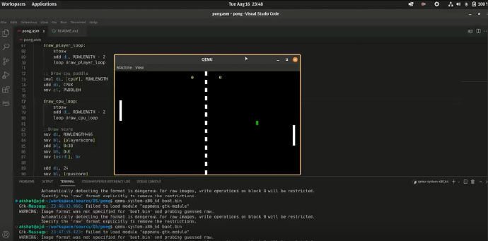
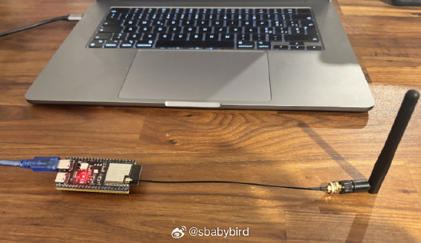
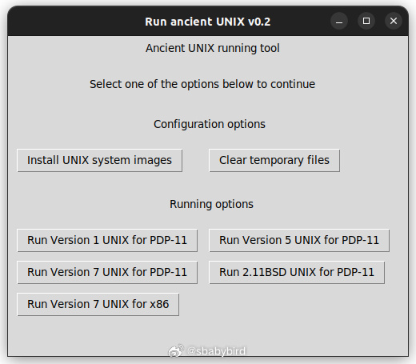
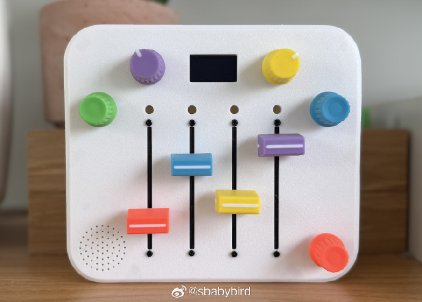

# 机器文摘 第 158 期
### 在 512 字节的启动扇区内写一个可运行的游戏

[引导扇区里运行的 pong](https://akshatjoshi.com/i-wrote-a-pong-game-in-a-512-byte-boot-sector/)，开发者 Akshat Joshi 在本文中介绍了一个极客风格的技术挑战项目：在仅 512 字节的磁盘引导扇区中实现一个完整的 Pong 游戏。

该项目完全不依赖操作系统、驱动或库，仅使用 x86 汇编语言、BIOS 中断和直接内存操作。

技术实现原理：
- 使用 VGA 文本模式（80×25，模式 03h），通过直接写入视频内存 0xB800 实现画面绘制。
- 利用 BIOS 中断进行输入检测（int 0x16）和屏幕控制（int 0x10）。
- 球的运动逻辑简单高效，AI 根据球的 Y 位置实时追踪。
- 通过 BIOS 定时器（地址 0x46C）控制帧率，避免 CPU 空转。
- 颜色循环通过修改属性字节实现背景色切换。

*需要说明的是，现在的新主板很可能已经不再提供老式的 BIOS 支持，转为提供 UEFI 来取代传统 BIOS，所以以上代码是不能在特别现代的 PC 上运行的*

### 通过 Wi-Fi 侦测物体运动

[ESPectre](https://github.com/francescopace/espectre)，这个项目提出一个天才的想法，利用 Wi-Fi 信号的频谱波动，检测家中的移动（无需摄像头，无需麦克风）。

工作原理如下：

当有人在房间里走动时，他们会“干扰”路由器和传感器之间传输的 Wi-Fi 信号。这就像你把手放在手电筒前，看到影子发生变化一样。

ESP32-S3 设备“监听”这些变化，并了解是否有运动。

你需要 ：
一个价值约 10 欧元的设备（ESP32-S3）+ Home Assistant 或 MQTT 服务器 + ESP-IDF 开发工具

设置时间 ：
30-45 分钟（首次设置，包括 ESP-IDF 设置）。

- 无需机器学习训练 ：开箱即用，兼容数学算法
- 提取的 10 个特征 ：统计特征、空间特征和时间特征
- 实时处理 ：ESP32-S3 硬件上的低延迟检测
- 机器学习基础 ：这些特征可以作为收集带标签数据集的基础，用于训练机器学习模型以执行高级任务（人数统计、活动识别、手势检测）。

### 体验古早的 UNIX 操作系统

如果对古早的 UNIX 操作系统有兴趣，但是苦于无法体验的话。

这个项目[Run ancient UNIX](https://github.com/felipenlunkes/run-ancient-unix)的内容可以让你在现代的硬件环境上运行古老版本的 UNIX 操作系统。

该仓库的内容允许旧版本的 UNIX （ 古代 UNIX ）在现代类 Unix 系统（Linux、FreeBSD、macOS 等）上轻松运行。

目前，您可以运行以下版本的 UNIX：
- 适用于 PDP-11 的 UNIX 版本（在 PDP-11 模拟器上运行）
- 适用于 x86 的 UNIX 版本，由 Robert Nordier 移植到 x86 架构的 UNIX 7 版本 （最初于 1999 年移植，并在 2006-2007 年进行了修补）。

### 硬核老爸为女儿DIY开源合成器

[《我为女儿组装了一台合成器》](https://bitsnpieces.dev/posts/a-synth-for-my-daughter/)一文作者因女儿想学“太空音乐”，直接花4周手搓一台带光敏键盘、可换波形的迷你合成器——代码开源、成本不到一张机票。

全程3D打印外壳、Arduino编程，还贴心配了图形化音色编辑器。

女儿一句“像星星在唱歌”，让无数网友破防：技术最高级的浪漫，是把宇宙装进孩子的手心。

硬件特性：
- 内置合成器模块 + 扬声器
- 速度、音量、音阶、音高和乐器控制
- 一块带有视觉反馈的 OLED 屏幕 + 一只跳舞的熊猫（能显示）
- 定制 PCB 和 3D 打印外壳

### 目前电脑上最好用的语音输入法

[闪电说](https://shandianshuo.cn/)，“闪电说”输入法，设计挺巧妙的。

用 ctrl 加 win 作为快捷键进行激发。

用的时候会把大模型下载到本地，速度识别非常的快，而且非常的精准，没有任何的延迟。

我在移动端早就习惯了语音输入的方式，在电脑端一直没有合适的语音输入法，现在感觉是时候切换试试了。

*不过编程还不行，如果需要输入大量的字母和符号，感觉还不够方便*

## 订阅
这里会不定期分享我看到的有趣的内容（不一定是最新的，但是有意思），因为大部分都与机器有关，所以先叫它“机器文摘”吧。

Github仓库地址：https://github.com/sbabybird/MachineDigest

喜欢的朋友可以订阅关注：

- 通过微信公众号“从容地狂奔”订阅。

