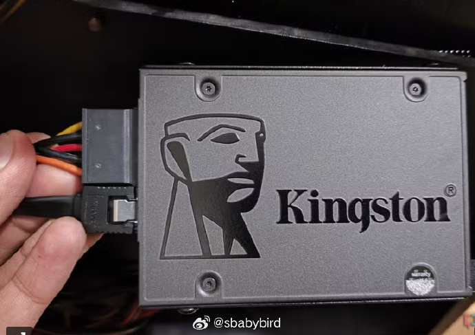
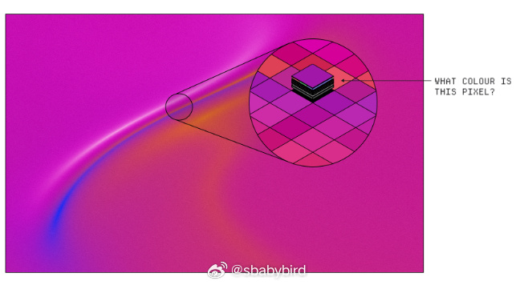
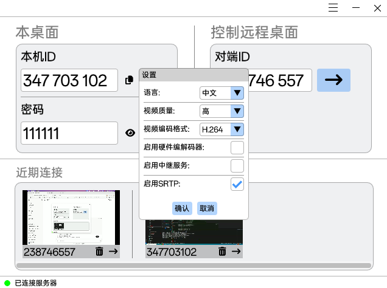
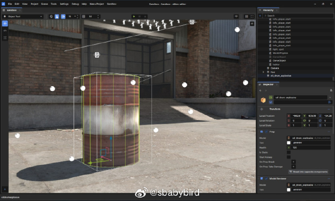
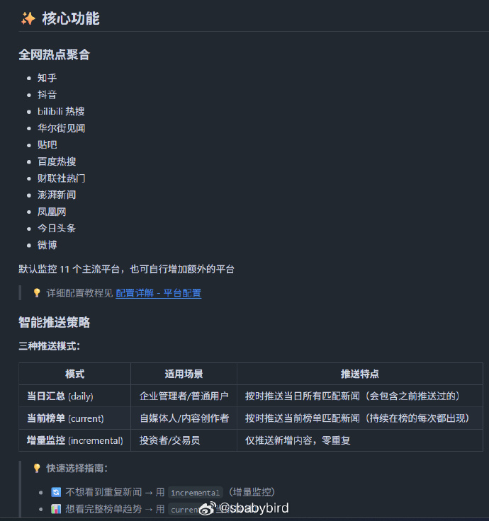

# 机器文摘 第 159 期

### 为什么固态硬盘不能作为数据长期存储设备

[你抽屉里那些没电的 SSD 正在慢慢丢失你的数据](https://www.xda-developers.com/your-unpowered-ssd-is-slowly-losing-your-data/)，SSD 几乎已经取代了硬盘作为主存储。它们比机械硬盘快好几个数量级，更方便，功耗更低。

不过，如果你也用 SSD 做冷存储，期待抽屉里的硬盘多年后依然能完美运行，那你可能需要重新考虑策略。

如果你可靠的 SSD 长时间断电，可能会损坏或丢失数据。这也是为什么许多用户不认为 SSD 是可靠的长期存储介质 ，更倾向于使用硬盘、磁带或 M 光盘。

与磁化旋转盘以存储数据的硬盘不同，SSD 会修改 NAND 闪存单元中的电荷以表示 0 和 1。NAND 闪存即使在断电后仍能保留底层晶体管中的数据，类似于其他形式的非易失性存储器。

不过，关键在于 SSD 在无电的情况下能保存数据的时间长度。即使是最便宜的 SSD，比如带 QLC NAND 的，完全断电后也能安全存储大约一年的数据。

更昂贵的 TLC NAND 可以保存长达 3 年的数据，而 MLC 和 SLC NAND 分别可在无电源存储下保存 5 年和 10 年。

只要你用消费级 SSD 作为电脑的主存储，这就没问题。你很可能在电池的 P/E 周期用尽之前就要更换硬盘了。

然而，对于长期存储来说，依赖 SSD 存在风险，因为它们如果多年断电，可能会丢失数据。

这种数据丢失可能发生在 1 到 3 年不等的时间里，因此使用替代存储介质并投资备份系统应是你的优先事项。

*亲身经历，我的一块固态的移动硬盘，一年没加电，所有数据丢失了*

### 一篇讲解 GPU “着色器”编程的文章

[当你只有 X 和 Y 坐标时，如何绘制高保真图形](https://www.makingsoftware.com/chapters/shaders)，着色器是简单程序，在 GPU 上并行运行，目标是计算单个像素的值。但每个着色器程序实际上只做一件事： 告诉他像素的 x 和 y 位置 ，然后他告诉你这个像素的颜色。

那么，人们到底是怎么用一个 X 和 Y 坐标就能做出如此疯狂的高保真图形的？

本文将这个问题的答案尝试写的深入浅出一些。

> 简短的回答是数学 。而详细的回答，不幸的是，还涉及一些数学。

### 基于 Web 的开源远程桌面控制软件

[crossdesk](https://github.com/kunkundi/crossdesk)，一款支持 Web 客户端访问的轻量级跨平台远程桌面软件。

CrossDesk 是 MiniRTC 实时音视频传输库的实验性应用。MiniRTC 是一个轻量级的跨平台实时音视频传输库。它具有网络透传（RFC5245），视频软硬编解码（H264/AV1），音频编解码（Opus），信令交互，网络拥塞控制，传输加密（SRTP）等基础能力。

同时支持 Windows、macOS 和 Linux 系统，轻量化的设计，资源占用低、运行速度快。

除此之外，还支持 Docker 部署自托管，所有数据和连接更加安全放心。

### 又一个游戏引擎开源了

[s&box](https://github.com/Facepunch/sbox-public)，是一款现代游戏引擎，基于 Valve 的 Source 2 和最新的 .NET 技术构建，提供了一个现代直观的游戏编辑器。 ​​​

### 开源版今日热榜（头条）

[TrendRadar](https://github.com/sansan0/TrendRadar)，告别信息过载，AI 助你看懂新闻资讯热点，简单的舆情监控分析 - 多平台热点聚合+基于 MCP 的AI分析工具。

监控35个平台（抖音、知乎、B站、华尔街见闻、财联社等），智能筛选+自动推送+AI对话分析（用自然语言深度挖掘新闻：趋势追踪、情感分析、相似检索等13种工具）。

支持企业微信/个人微信/飞书/钉钉/Telegram/邮件/ntfy/bark/slack 推送，30秒网页部署，1分钟手机通知，无需编程。

支持Docker部署⭐ 让算法为你服务，用AI理解热点。

*稍加改动应该可以服务于量化投资、信息监控等领域*

## 订阅
这里会不定期分享我看到的有趣的内容（不一定是最新的，但是有意思），因为大部分都与机器有关，所以先叫它“机器文摘”吧。

Github仓库地址：https://github.com/sbabybird/MachineDigest

喜欢的朋友可以订阅关注：

- 通过微信公众号“从容地狂奔”订阅。

