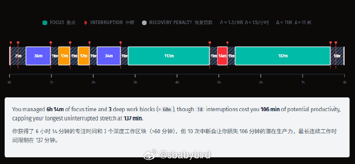
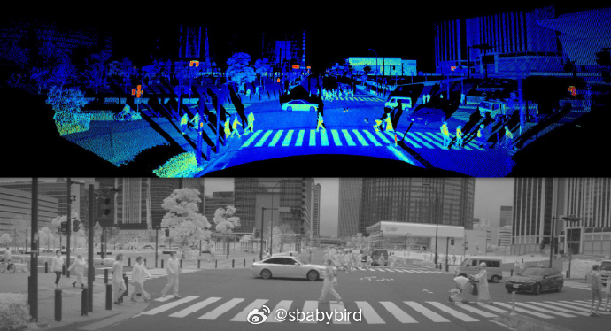
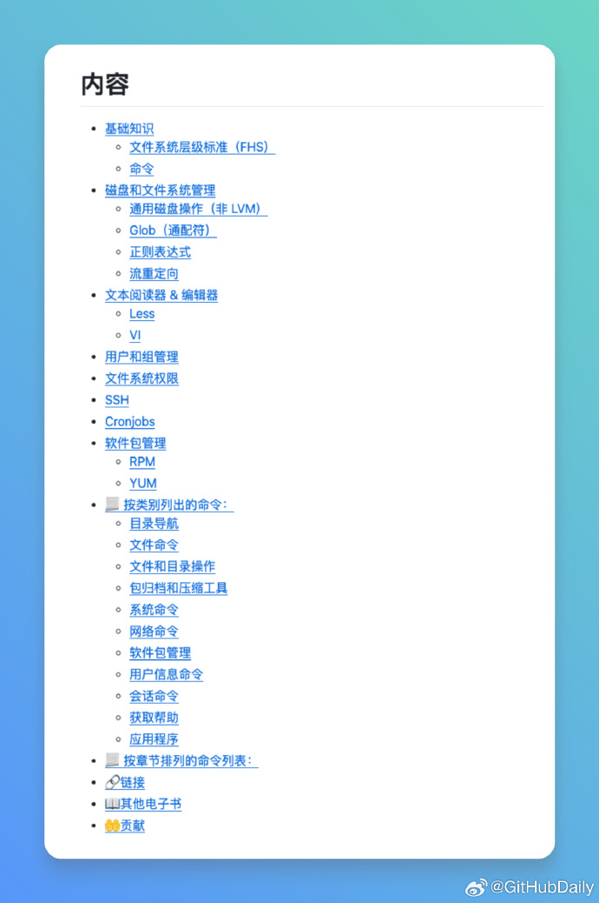
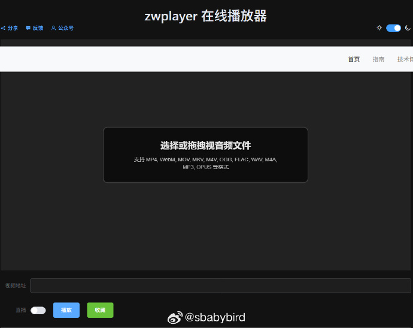

# 机器文摘 第 160 期

### 运用数学评估当工作被打断时的损失

[三个参数如何决定你的工作日质量](https://justoffbyone.com/posts/math-of-why-you-cant-focus-at-work)，这篇发表于个人技术博客的深度分析，将知识工作者最头疼的"无法专注"问题转化为可量化、可模拟的数学模型。

作者以三个希腊字母参数重构了Paul Graham十六年前提出的"制造者时间表"理论：λ（每小时打断频率）、Δ（恢复时间）和θ（最小有效工作块），并通过泊松过程模拟了数百个工作日的随机事件流。

文章的技术价值在于其朴素的仿真方法论——无需复杂算法，仅凭λ的随机采样、Δ的累积惩罚和θ的阈值判断，就能复现出符合真实研究数据的专注力分布。

当λ=2（每小时2次打断）、Δ=20分钟时，模型显示：单日获得三个以上60分钟深度工作块的概率仅14%；而当λ升至学术界观测到的15（每4分钟一次活动切换）时，热力图彻底灰化，深度工作容量归零。

这种从微观机制到宏观统计的连贯推演，揭示了为什么Microsoft 2025年研究指出"重协作用户每2分钟被打断一次"的后果如此致命。

作者对真实数据的引用尤为扎实：整合了González & Mark的3分05秒活动切换研究、Iqbal & Horvitz的10-16分钟恢复时间结论，并亲自构建了可交互的模拟器。

最终提出的优化框架兼具理论美感与实践智慧：将λ从3降至2，可使成功概率提升5倍；将θ从90分钟拆分为30分钟子任务，能在相同打断环境下将完成率从0%提升至可行；而Δ的缩短则依赖于"任务面包屑"等认知卸载技术。

总结成白话的经验就是：第一，尽量不要被打断，第二将工作尽量拆解成可以独立更小时间段完成的子任务（如30分钟）。

### 一文读懂汽车激光雷达的技术内核

[《关于汽车激光雷达的一切》](https://mainstreetautonomy.com/blog/2025-08-29-all-about-automotive-lidar/)，这篇发布于Main Street Autonomy的技术长文，堪称汽车激光雷达领域的"工程拆解手册"。

作者以测距（Ranging）与测向（Bearing）两大核心功能为主线，系统梳理了脉冲飞行时间、调幅、调频连续波（FMCW）及视差法四种测距原理的物理本质与工程权衡，并深入对比了固态阵列与机械扫描在测向实现上的技术路线差异。

文章的技术深度体现在对底层器件的微观剖析：从SPAD（单光子雪崩二极管）与APD（线性雪崩光电二极管）的I-V特性曲线差异，到VCSEL、边发射激光器与光纤激光器的性能成本矩阵；从1550nm波长"允许更高功率却可能 cumulative 损伤角膜"的眼安全悖论，到早期Velodyne HDL-64E因手工粘贴16块激光电路板导致的角度校准偏差。

这些细节揭示了激光雷达从实验室样机到车规量产间隐藏的工程鸿沟。

尤为可贵的是，作者并未止步于技术原理，而是进一步归纳了行业典型问题：SPAD探测器的距离偏移（range walk）、旋转编码器的迟滞误差、多激光雷达共存时的热效应累积风险等。

### 经典 va 合成器模拟

[gearmulator](https://github.com/dsp56300/gearmulator)，基于摩托罗拉 56300 系列 DSP 的 90 年代末至 2000 年代经典 VA 合成器的模拟。

The Usual Suspects团队正以逆向工程手段，将摩托罗拉DSP56300系列处理器从硅片架构还原为比特级精确的软件仿真，让Access Virus、Nord Lead、Waldorf Q等传奇硬件合成器在VST插件中重现其原始音色DNA。

DSP563xx是90年代中期专为虚拟模拟合成设计的24位定点数字信号处理器，其指令集、内存布局与外设寄存器均无公开文档。团队需从EPROM固件中反汇编机器码，通过逻辑分析仪捕获硬件总线时序，再构建周期精确的C++仿真核心。

目前 Access Virus A/B/C/TI系列与Waldorf Microwave XT的仿真器不仅通过了原厂ROM的自检，更在盲测中让资深制作人难辨真伪。

项目采用LGPL协议开源，提供多种格式（VST、VST3、CLAP、AU、LV2）以及多种作系统（Windows、MacOS、Linux）支持。 

根据原始硬件合成器的能力，甚至模拟器也有“效果”版本，可以作为音频效果插件处理外部音频信号，而非作为乐器插件。

### Linux 命令学习电子书

[101 Linux commands](https://github.com/bobbyiliev/101-linux-commands)，开源电子书，通过 101 个实用命令带你系统掌握 Linux 命令行操作。

内容涵盖文件管理、文本处理、进程控制、网络诊断、系统监控等实用场景，每个命令都有真实案例演示。

提供多种格式阅读，包括在线网页版、PDF 和 ePub 电子书，还支持通过 Docker 在本地运行。

### 基于网页的音视频播放器

[zwplayer](https://www.zwplayer.cn/videoplayer.html#/) 是一款强大且免费的在线音视频播放器，无需下载，打开即用。

无论是网络视频链接，还是您电脑里的本地文件，只需拖拽或粘贴，即可享受流畅的播放体验。

主要特性：
- 超低延时 WebRTC、无插件 RTSP、HLS、FLV、DASH 等各类流协议
- 拖拽播放主流格式的本地视频和音频文件
- 任意片段循环播放（AB循环），让您可以自由选择视频片段进行重复精看，适合语言学习、乐器练习、舞蹈分解等场景
- 直播流实时录制 + 点播视频任意片段录制并下载到本地，轻松保存精彩瞬间
- 双外挂字幕（支持 .srt/.bcc/.vtt/.json）
- 章节标记快速跳转
- 最高4倍音量增益，声音小也能听清
- 丰富实用的全局快捷键（空格暂停、左右箭头快进快退、上下箭头调音量等）

> 隐私保护：您的播放记录、收藏夹、录制下 来的视频文件，全部只保存在您自己的浏览器本地，我们绝不上传任何数据，真正做到隐私安全。

## 订阅
这里会不定期分享我看到的有趣的内容（不一定是最新的，但是有意思），因为大部分都与机器有关，所以先叫它“机器文摘”吧。

Github仓库地址：https://github.com/sbabybird/MachineDigest

喜欢的朋友可以订阅关注：

- 通过微信公众号“从容地狂奔”订阅。

