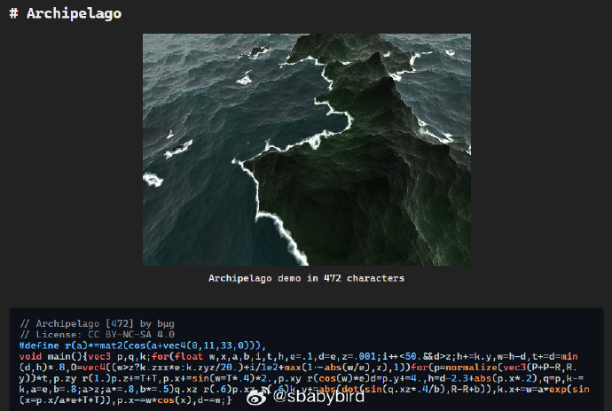
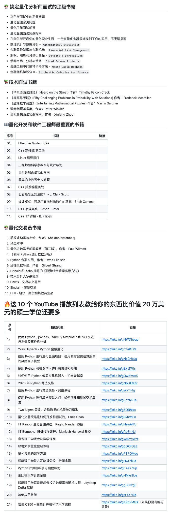
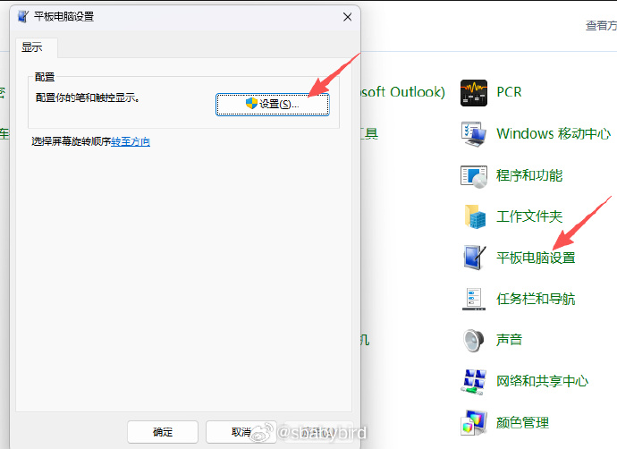
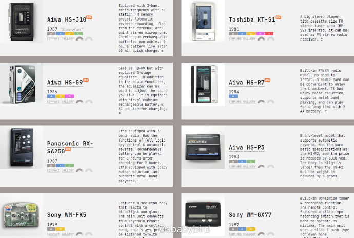
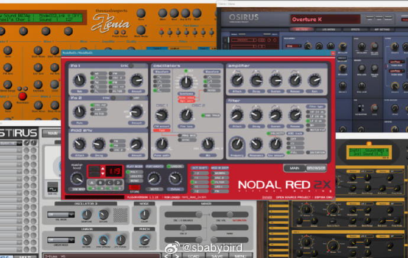

# 机器文摘 第 161 期
### 关于 AI 的一个贴切比喻
近期在微博上看到一段关于 “AI 是新时代的火枪”的比喻，感觉比较贴切，摘录下来，来自微博网友[挨踢牛魔王](https://weibo.com/3207410361/QhKDuyXZ7)。

> AI就是新时代的火枪。
>
> 火枪出来的时候，是完全比不上弓箭的。 
> 首先，适应性非常差，一下雨、受潮，火枪就不行了。
>
> 其次，用起来非常麻烦，要装药，装铁砂，打火，半天才能打一发。
> 等你打出一发的时候，别人都射了好几箭了。
> 动不动还炸膛，风险很高。
> 
> 其三，准确度非常差。
> 你看那些讲英国殖民时代的电影，都是一群英国龙虾兵排队拿着火枪对轰，都不隐蔽的。
> 为什么？
> 准确度太差，子弹打出去都是乱飞，只能排队进行射击，才能保证火力覆盖。
> 
> 尽管看起来都是缺点，但是火枪有一个优点。
> 它不需要人来发力，它不挑人，随便什么人拿一把火枪，简单的训练就能上。
> 而弓箭不行，英国的长弓手，是要训练很长时间，保证营养，才能拉开长弓。
> 并不是随便什么人都能拉开长弓的。
> 
> 这样的好处是什么？
> 用火枪的人，节省了体力，还可以干别的，挖战壕，侦查等等。
> 
> 就凭着一点优势，火枪不断改进，颗粒火药，膛线，子弹封装，模块化，经过上百年的改进，最终完全战胜了弓箭。
> 
> AI也是这样，现在刚出来没几年，缺点非常多。
> 但是它有一个优点，就是节省你的脑力，无论画图，还是写代码，经过简单的训练就能搞出一个东西。
> 
> 现在发展太快了，用不了上百年的改进，实际大模型火了就2-3年，已经在很多领域占据一席之地了。
> 最终AI一定会替代原来的技能，就像火枪替代弓箭一样。
> 这会重塑企业的整个组织结构，形成各种新的打法。

其实汽车和马车最开始的时候也是类似，汽车动不动就熄火出故障，几个人伺候着才能走。但是等技术成熟以后，爆发出来的优势，很快就淘汰了马车。

### 图形编程极限艺术

512字节能做什么？

想象一下：用不到一条推文的字数，生成会发光的山脉、跳舞的小人、飘浮的岛屿。

这篇 [微型GLSL演示深度解析](https://blog.pkh.me/p/48-a-series-of-tricks-and-techniques-i-learned-doing-tiny-glsl-demos.html) 展示了如何用数学暴力将体积光、SDF、IK动画压缩至推文长度。

作者不是靠删减功能，而是发现更优雅的物理公式——比如用1除以距离就能模拟真实的光散射，用矩阵旋转的巧妙组合实现等距视角。

最有趣的是，这些极客把GPU bug变成了优化机会，把迭代次数直接当成阴影算法。每个演示都是一场字节的极限运动，展现了编程作为数字艺术的极致魅力。

每一个演示都是一场工程举重：通过L-∞范数简化距离场、用迭代次数生成轮廓、以域扭曲函数$exp(sin(x))$雕刻地形。

这不是代码压缩的技巧堆砌，而是将实时渲染还原为代数问题的思维体操。

### SVG 比你想象的更强大

[SVG 就是你需要的一切](https://jon.recoil.org/blog/2025/12/an-svg-is-all-you-need.html)

作者展示了一个20年前用SVG开发的真菌网络交互文章，至今仍在现代浏览器中完美运行。

SVG不仅支持嵌入JavaScript实现参数调节、数据重算，还能作为纯静态文件通过DOI永久引用。

文章结合"持久性、来源、权限、空间"四个维度，论证了SVG如何成为可重复科研的理想载体——无需服务器，无需复杂框架，一个文件即可让读者在你的论文中"玩"数据。

来源（Provenance）上，其纯文本特性支持git diff级溯源；

权限（Permission）上，数据与处理逻辑分离的架构天然契合现代数据治理模型；

位置（Placement）上，矢量空间的本体属性使其成为地理空间可视化的理想载体。

这种将格式特性与学术基础设施需求精准映射的思维，展现了技术选型中的系统级思考。

最具前瞻性的是，作者指出浏览器算力20年间的指数级增长，使得在SVG中实现完整数据分析 pipeline（从原始数据清洗、统计建模到交互式参数调优）已成为可能。

这与当前推崇的Jupyter、Marimo等计算 Notebook 形成互补——SVG无需服务器端 kernel，纯静态部署即可实现计算可重复性，极大降低了科研成果的分享与复现门槛。

文中真菌网络案例的交互实现（前进/后退/视角切换）仅占数KB，却提供了远超静态图表的语义密度。

这种"计算轻量化"路径，对开放科学基础设施的去中心化演进具有启示意义。

### 量化交易学习资源大全

[Quant-Developers-Resources](https://github.com/cybergeekgyan/Quant-Developers-Resources)，这个开源项目，整理了一份详尽的量化开发与交易入行指南。

涵盖了从数学基础、随机微积分、编程语言到算法交易的核心知识点，并按面试要求进行了分类。

### Win11 多显示器触控屏的设置

最近给 Win11 外接了一块触控显示器，以为只能当普通副屏，因为一直不会配置，触摸点击的区域总是在主屏，完全没法用。

直到我找到正确的设置方式，这块触控屏才真正“醒过来”，体验直接翻倍。

关键步骤只有一个：
进入：控制面板 → 硬件和声音 → Tablet PC 设置 → 选择你的触控屏 → 设置（Setup）
然后按提示在对应屏幕点一下，就完成“触摸映射”了。

配置完之后的变化非常大：
- 触控屏可以独立操作，不再影响主屏
- 浏览网页、翻资料比鼠标自然太多
- DAW（比如 Studio One）里推推子、调 EQ 超顺手
- 把触控屏当成“巨型快捷面板”放工具栏、聊天软件、OBS 控制台效率爆炸

原来只是一个简单设置的问题，却直接让我多了一块“真正能操作的控制屏”。
如果你也有触控显示器强烈建议试试这套配置，说不定你也会像我一样意外收获一个新神器。

### AI 编程智能体的通用提示词

觉得 AI 编程智能体的效果不好？也许是你的提示词有问题。

[AGENTS.md](https://github.com/agentsmd/agents.md)，这个开源项目，旨在为 AI 编程智能体提供一份专属的“操作手册”。

将面向人类的快速入门指南，与面向机器的构建步骤、测试指令和代码规范彻底分离，互不干扰。

核心逻辑非常清晰：在项目根目录创建一个 Markdown 文件，专门告诉 AI 如何构建、如何测试以及遵循什么样的代码风格。

广泛兼容目前主流的 AI 编程工具，包括 VS Code、Cursor、Windsurf、Aider 以及 GitHub Copilot 等。

只需新建一个 `AGENTS.md` 文件，填入项目概览、测试命令和安全注意事项即可。

支持在大型项目中嵌套使用，比如在子目录放置不同的配置文件，AI 会自动读取最近的指令，非常灵活。

### 一个磁带随身听的网站

[WalkmanLand](https://walkman.land/)，这个网站自称 "最完整的便携式磁带播放器数据库"，整理了上个世纪 80、90 年代流行的磁带随身听相关的资料。

主要服务于Walkman收藏爱好者、复古音频设备玩家。

内容包括各种品牌和型号的随身听外观、参数介绍，和相关附件设备（耳机、电池）以及技术概念的详细解释。

### 经典 va 合成器模拟

[gearmulator](https://github.com/dsp56300/gearmulator)，基于摩托罗拉 56300 系列 DSP 的 90 年代末至 2000 年代经典 VA 合成器的模拟。

The Usual Suspects团队正以逆向工程手段，将摩托罗拉DSP56300系列处理器从硅片架构还原为比特级精确的软件仿真，让Access Virus、Nord Lead、Waldorf Q等传奇硬件合成器在VST插件中重现其原始音色DNA。

DSP563xx是90年代中期专为虚拟模拟合成设计的24位定点数字信号处理器，其指令集、内存布局与外设寄存器均无公开文档。团队需从EPROM固件中反汇编机器码，通过逻辑分析仪捕获硬件总线时序，再构建周期精确的C++仿真核心。

目前 Access Virus A/B/C/TI系列与Waldorf Microwave XT的仿真器不仅通过了原厂ROM的自检，更在盲测中让资深制作人难辨真伪。

项目采用LGPL协议开源，提供多种格式（VST、VST3、CLAP、AU、LV2）以及多种作系统（Windows、MacOS、Linux）支持。 根据原始硬件合成器的能力，甚至模拟器也有“效果”版本，可以作为音频效果插件处理外部音频信号，而非作为乐器插件。

## 订阅
这里会不定期分享我看到的有趣的内容（不一定是最新的，但是有意思），因为大部分都与机器有关，所以先叫它“机器文摘”吧。

Github仓库地址：https://github.com/sbabybird/MachineDigest

喜欢的朋友可以订阅关注：

- 通过微信公众号“从容地狂奔”订阅。

