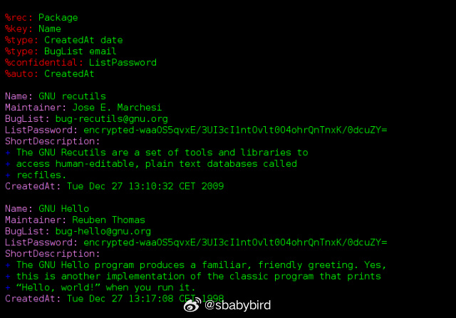
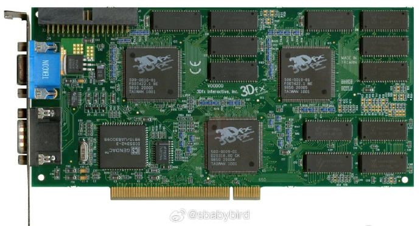
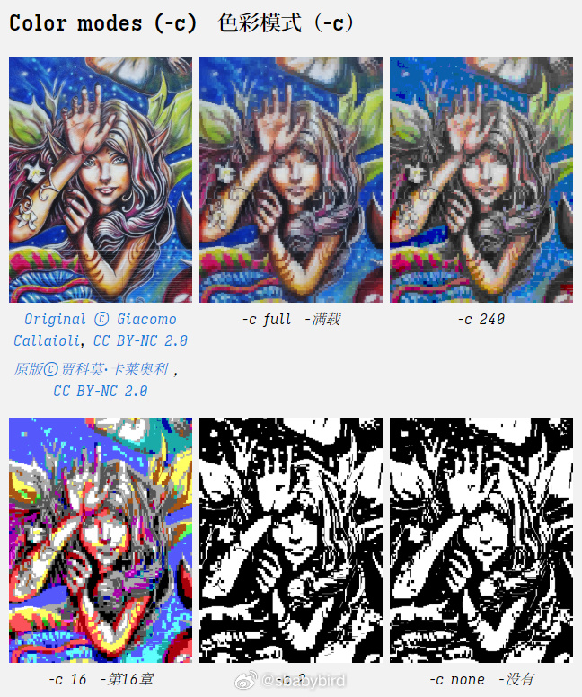
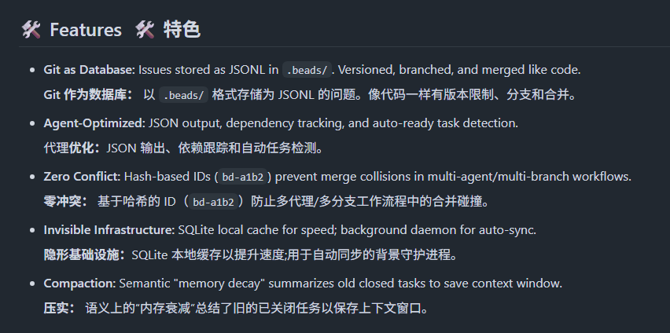
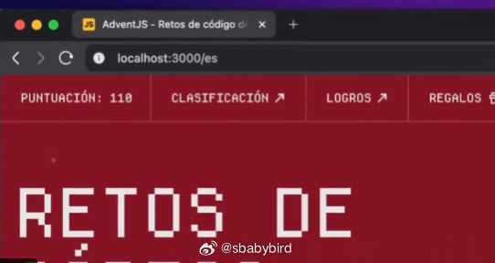
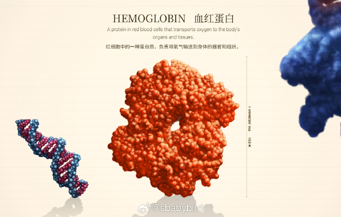

# 机器文摘 第 162 期

### 用记事本管理数据库？


[GNU Recutils](https://www.gnu.org/software/recutils/)是一个被严重低估的数据管理范式创新。

它摒弃了传统数据库的二进制黑箱与SQL抽象层，将数据存储为人类可直接编辑的纯文本记录（recfiles），却在完整性约束、类型系统、关系运算等核心数据库特性上毫不妥协——这是一种“温和专制主义”的设计哲学：既保证机器可读性，又强制人类可理解性。

其技术架构呈现出精妙的分层设计：底层是类似CSV但富含元数据的纯文本格式，字段类型系统覆盖从整数、实数到正则表达式自定义类型；中间层提供C库librec与shell工具链，支持联结、聚合、加密等高级操作；顶层与Emacs深度集成，实现导航、折叠、类型驱动编辑等IDE级体验。

特别值得注意的是其选择性字段级AES加密机制，允许在明文数据库中嵌入敏感数据，兼顾透明性与隐私保护。

主要特性：
- 纯文本存储：数据就是普通文本，每行一条记录，格式简单到老人都能看懂
- 完整数据库功能：支持主键、唯一约束、外键关联、分组排序、加密字段
- 无痛版本控制：git diff直接显示数据变更，协作透明无黑箱
- 跨世纪兼容：20年后打开依然可读，不怕技术过时

### 现代图形 API 的设计太复杂了


[游戏卡顿的元凶？这位图形大牛说：API设计错了](https://www.sebastianaaltonen.com/blog/no-graphics-api)，作者Sebastian Aaltonen拥有30年图形编程经验，参与过《刺客信条》引擎、Unity核心渲染、Unreal Engine优化，现在运营手游公司HypeHype。

他发现一个怪现象，现代图形API（DirectX 12、Vulkan、Metal）承诺高性能，却让游戏开发更慢、游戏运行时更卡。

这些API已经10岁了，设计初衷是解决10年前的老显卡问题。但今天的GPU像统一内存、直接访问，硬件本身已很灵活，API的复杂抽象反而成了累赘。就像手机拨号早已自动化，电话公司还在让你转分机、填表格。

传统API像"瑞士军刀"，有16种工具（shader类型）、10种刀柄（缓冲区），还要提前申请使用许可（PSO预编译）。

而作者理想的API像一把"简单螺丝刀"——只需三个函数：分配内存、传数据指针、启动计算。Unity/Unreal引擎团队为适配这些复杂API，写了数万行代码做"翻译层"，卡顿和bug大都来自这层翻译。

如果采纳这种极简设计，游戏加载时间能从几十秒缩短到几秒，卡顿（stutter）减少90%，小团队也能做出3A级画面。因为开发者不再浪费时间在"给显卡填表"，而是专注创造内容。

这不是纸上谈兵。文章后半部分给出了具体实现方案：如何用64位指针直接访问GPU内存，把材质切换从50行API调用变成1次指针传递。NVIDIA的CUDA因极简设计统治AI训练，图形API也该如此进化。

一句话总结：别再让显卡驱动当"中介"，让CPU和GPU直接对话，游戏才能又顺又快。

### 命令行里直接看图


[Chafa](https://hpjansson.org/chafa/)，一个在终端命令行里看图的工具。

有了 Chafa，你现在可以在你最喜欢的终端模拟器上舒适地观看非常合理的图片和动画。

主要特性：
- 支持大多数流行的图像格式，包括动画 GIF。
- 输出至所有流行的终端图形格式：Sixels、Kitty、iTerm2
- 将多个可选区间的 Unicode 符号组合，以实现最佳输出。
- 支持全屏字符，例如中文、日文、韩文。
- 字形可以从 Freetype 支持的任何字体文件（TTF、OTF、PCF 等）加载。
- 多种色彩模式，包括真彩色、256 色、16 色以及简单的 FG/BG。
- 支持大多数现代和经典终端及终端模拟器。

### 基于一张图片直接生成 3D 模型


[TRELLIS.2](https://github.com/microsoft/TRELLIS.2)，微软推出的一款开源（开放权重，MIT 许可）图生 3D 模型。

给一张图片，就能生成带纹理与 PBR 材质的 3D 模型。

模型有 4B 参数，采用 flow-matching 的 Transformer（DiT），并用一种叫 O‑Voxel 的稀疏体素表示来处理复杂拓扑，比如开放的表面、非流形或内部结构。

最高支持 1536³ 分辨率。

### AI Agent 编程记忆力提升项目


[beads](https://github.com/steveyegge/beads)，这是个给 AI coding agent 做“长期记忆/任务记忆”升级用的项目。

它把 agent 在一个代码库里发现的 TODO、Bug、子任务、依赖关系等，用“图结构的 issue tracker”记录下来。

让 agent 能跨多轮对话/多次上下文压缩后，仍然按正确顺序推进长链路任务，而不是堆一堆容易腐烂的 markdown 计划。

### 快速分享你的本地 Web 服务


[cloudflared](https://github.com/cloudflare/cloudflared)，几秒钟内将你的 localhost 分享给任何人。

通过一个在全球可访问的 HTTPS URL！

```bash
$ brew install cloudflared
$ cloudflared tunnel --url <你的本地域名>
```

这是 ngrok 的一种替代方案，无需注册、完全免费。 ​​​

### 直观展示地球生命体的大小


[size-off-life](https://neal.fun/size-of-life/)，生命的尺度。

用很直观的手绘图片比较生物的大小，里面的 60 副插画全是手绘的。

从 dna 到最大的生物，对比展现生命的不同形态大小。 ​​​

## 订阅
这里会不定期分享我看到的有趣的内容（不一定是最新的，但是有意思），因为大部分都与机器有关，所以先叫它“机器文摘”吧。

Github仓库地址：https://github.com/sbabybird/MachineDigest

喜欢的朋友可以订阅关注：

- 通过微信公众号“从容地狂奔”订阅。

