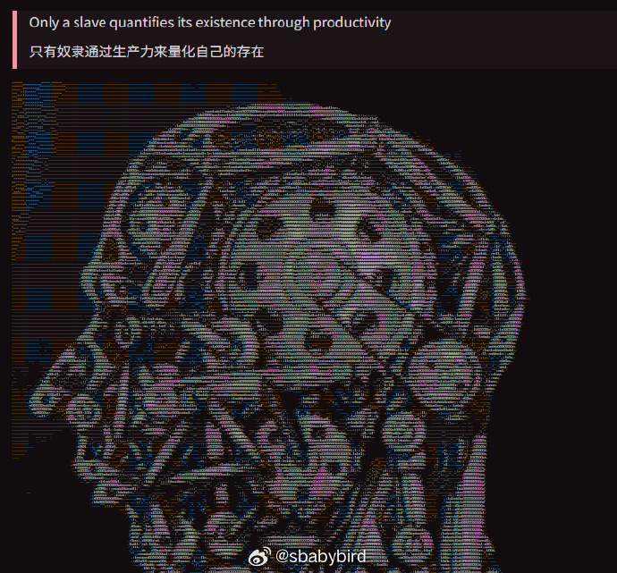
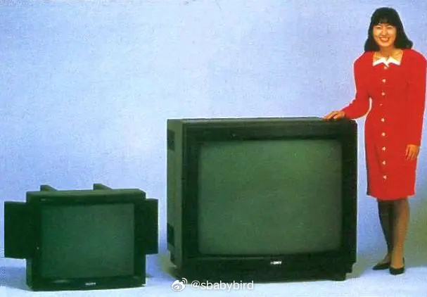
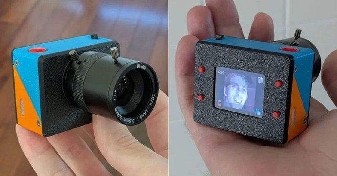
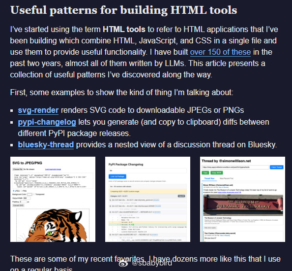
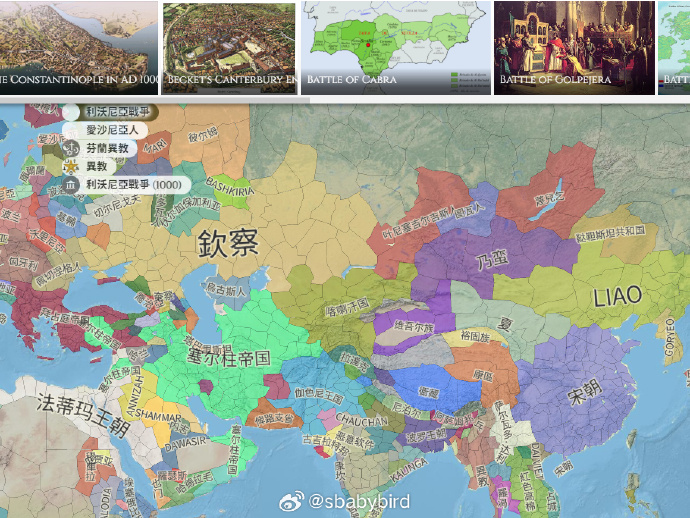
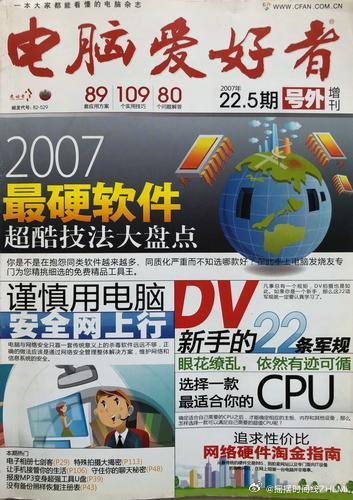

# 机器文摘 第 163 期

### 反"奋斗文化"宣言

[不要把自己活成一部机器](https://armeet.bearblog.dev/becoming-the-machine/)，这篇博客像一记耳光，打醒了被社交媒体奋斗文化洗脑的创业者。

作者刚从硅谷顶级孵化器毕业，看多了Twitter上那些表演：凌晨5点打卡、在奇葩地方写代码、"不够努力就失败"的毒鸡汤。他说自己曾经也信这套——直到发现自己差点变成一台只会线性输出的机器。

奋斗文化把成功简化为"工作时长"这种可炫耀的输入，却避谈真正的产出。它诱惑你相信：只要把自己变成24小时运转的齿轮，就能抵达某个更好的地方。但机器不会学习、不会拐弯、不懂游戏规则。

别当锤子，当手术刀。真正的竞争力是"敏捷"——快速试错、战略性偷懒、找到最高效而非最辛苦的路径。你的目标可以是KPI，但你的"意义"不该被KPI绑架。

不要因为不够“卷”而焦虑。

### 史上最大的 CRT 电视有多大？

[最大的 CRT 电视](https://dfarq.homeip.net/the-biggest-crt-ever-made-sonys-pvm-4300/)，答案是索尼在 1989 年生产的 PVM-4300 ，屏幕具有 43 英寸的大小（虽然显像管尺寸实际上是 45 英寸，但是索尼在宣传上是 43 英寸）。

它是一台传统的 CRT，能配合空中信号，但像当时许多大型电视一样，采用了一种称为 IDTV 的技术来提升画质。“ID”代表“改进定义”。

IDTV 电视机有缓冲区，可以存储连续帧并插值，而不是像传统 CRT 电视那样隔行扫描。它们还配备了检测运动和进行图像稳定的电路，以进一步增强图像质量。

PVM-4300 的价格约为索尼当时第二昂贵型号的 8 倍，后者配备 29 英寸屏幕。这主要是因为 PVM-4300 必须手工制造。

2024 年 12 月 22 日，[YouTuber Shank Mods 发布了一段视频](https://www.youtube.com/watch?v=JfZxOuc9Qwk)，讲述了索尼 PVM-4300 的故事以及他如何获得这台设备。

### 用鼠标做个照相机

[光电鼠标制作的相机](https://petapixel.com/2025/11/13/this-guy-built-a-compact-camera-using-an-optical-mouse/)，一位男子利用光电鼠标自制了一台小型相机。 ​​​

鼠标底部那个发红光的小眼，本来是用来检测桌面移动的。这位Reddit大神Dycus花了65小时，给它加上镜头、屏幕和保存功能，外壳还是3D打印的。成品像个迷你拍立得，能存48张照片。

900像素，连手机前置摄像头的零头都不到。但博主说："Game Boy相机粉丝都懂，要的不是清晰度，是灵魂。"确实，低像素有种抽象艺术感，人脸变成马赛克艺术，风景变成印象派油画。

### AI 编程时代，怎样快速制作网页小工具

[不用装软件，几百行代码就能做出实用工具？](https://simonwillison.net/2025/Dec/10/html-tools/)，这篇文章是技术作家Simon Willison的"HTML工具开发秘籍"。

他用两年造了150+个小工具，发现最高效的方法不是用React、装npm包，而是把HTML/CSS/JS全塞进一个文件，从CDN拉依赖——就像做"数字瑞士军刀"。

现代浏览器本身就是超级平台。用PasteJSON转YAML、浏览器里跑OCR、甚至用Pyodide执行Python数据分析，这些功能都不需要服务器，纯前端就能搞定。

关键在于利用浏览器API：剪贴板操作、localStorage存密钥、CORS调用公开API、WebAssembly跑编译代码。

他用ChatGPT/Claude等AI助手直接生成这些工具，拒绝React等需要编译的框架，确保生成的代码能直接复制粘贴就用。

比如用Claude的Artifacts功能，输入"做个SVG转PNG工具，不要用React"，几分钟就得到可运行的单文件。

他甚至让AI查看自己之前的工具代码，在此基础上迭代新功能。

这意味着任何人都能快速制作解决特定问题的网页工具，无需部署、没有服务器成本、即改即用。

文章给出的例子包括：从图片提取文字、批量重命名文件、分析Python包版本差异等。每个工具都开源，代码几百行内，GitHub Pages就能托管。

把浏览器当成"无限插件平台"，用AI写代码，用剪贴板和URL做数据接口，你就是自己的软件工程师。

### 上帝视角看人类历史

[Chronas](https://chronas.org/)，把整个人类历史，做成了一张可以随手拖拽的【Google 地图版时间线】。

​​把 5000 年左右的全球历史，压缩成一张可拖拽的世界地图，加一根时间轴，从公元前到 20 世纪都能随时切换。

它把国家疆界、人口、宗教、文化、迁徙、重要事件、统治者信息都铺在一张图上，目前累计数据点超过 5000 万个。​​

时间滑块一拉，地图会立刻变成对应年份的世界格局，再点任意一个区域，就能在侧边栏展开对应的维基百科条目，等于「地图 + 知识库」一体化。

### 1993~2022 年《电脑爱好者》共30年合集

[1993~2022 年《电脑爱好者》共30年合集](https://pan.baidu.com/s/1LZaAOejOjOa4H_vwFVu1uQ?pwd=dn30)，上世纪九十年代初学电脑为数不多的信息来源。

几乎期期必读，很多电脑技巧、应用秘籍都是在这个杂志学到的。

## 订阅
这里会不定期分享我看到的有趣的内容（不一定是最新的，但是有意思），因为大部分都与机器有关，所以先叫它“机器文摘”吧。

Github仓库地址：https://github.com/sbabybird/MachineDigest

喜欢的朋友可以订阅关注：

- 通过微信公众号“从容地狂奔”订阅。

