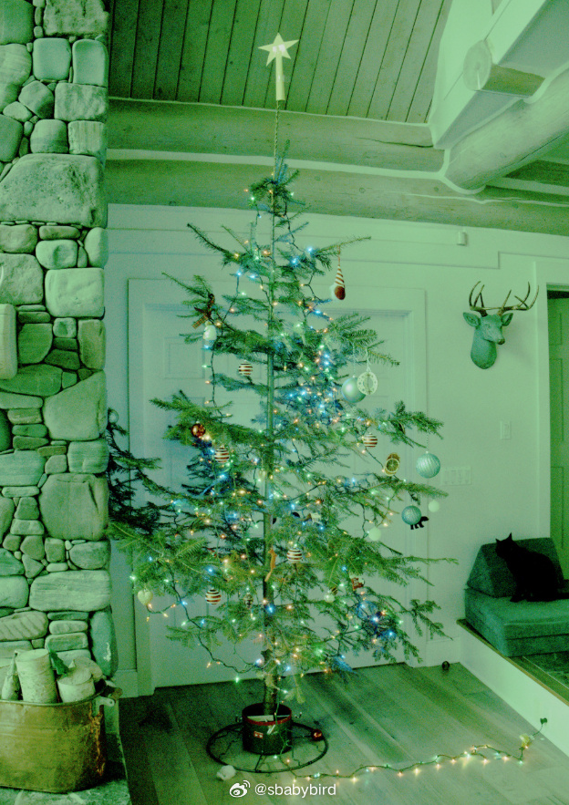
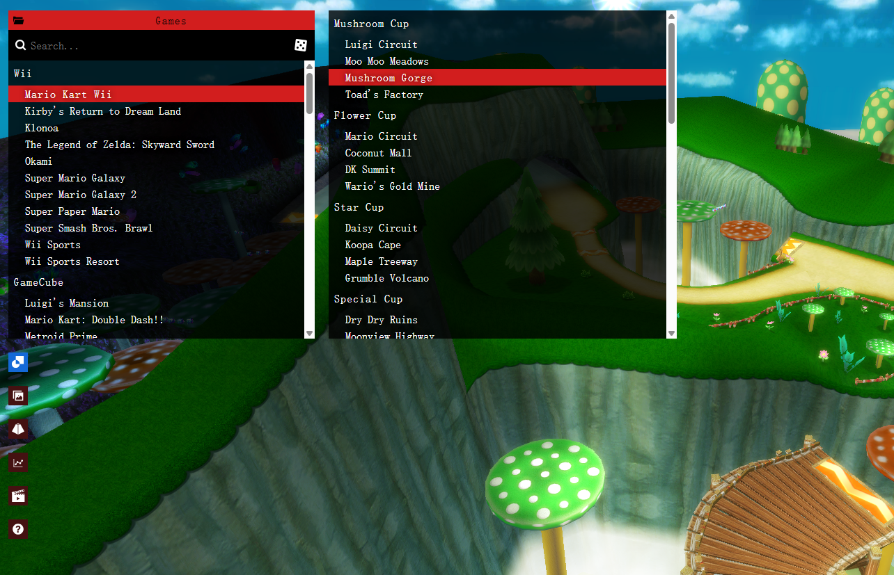
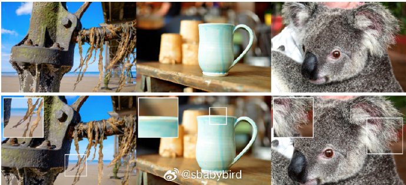
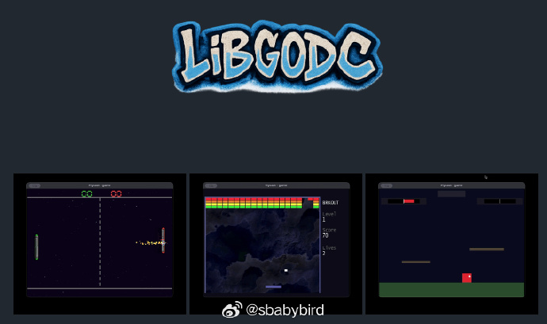
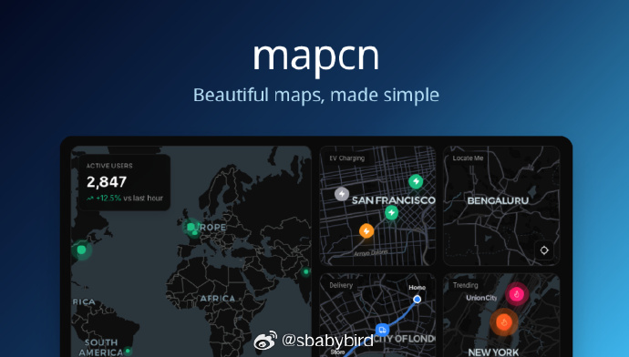

# 机器文摘 第 164 期
### 照片背后的"数字暗房"有多复杂？

我们平时用手机拍摄的照片都是 JPEG 格式的，专业相机和部分高端摄影手机具有“RAW”的存储格式。

一般是指“未经处理的”，直接从影像传感器上获取的“一手”信息。

据说保留了更多的照片信息，可以挽回一部分曝光失败的照片，将画面色彩校正回来。

那么，原始的  RAW 数据到底什么样，又是经过哪些处理工序最终变成我们最终使用的 JPEG 格式的呢？

[这篇文章进行了简单科普](https://maurycyz.com/misc/raw_photo/)。

作者以一张他为圣诞树拍摄的照片为例，讲解了整个过程，并介绍了一些技术原理。

作者Maurycy从相机CMOS传感器直接提取原始数据，用12张中间态图像，完整复现了从"12位ADC数字灰泥"到"色彩斑斓的圣诞树"的完整数字处理管线。

文章的技术深度体现在对每一步物理与信号转换的精确量化：首先将14位ADC原始值（理论范围0-16382，实际仅使用2110-13600）进行黑电平扣除与线性拉伸，得到第一帧"灰泥汤"；继而揭示拜耳滤镜的RGGB排列如何导致每个像素仅捕获1/3色彩信息，需通过邻域插值完成"去马赛克"，该过程本质是空域滤波与频谱重建的折衷。最精妙的是对非线性亮度感知的揭示——人类视觉的韦伯-费希纳定律决定了sRGB必须采用2.4次方伽马曲线，否则线性量化会将90%的有效色调压缩至纯黑附近。

作者未止步于技术展示，而是通过"自身体素级调试"，暴露了相机内建算法的隐性决策：自动白平衡如何错误放大绿色通道（因拜耳阵列中G像素数量是R/B的两倍），而sRGB曲线处理如何意外导致高光去饱和（电影感正是由此而来）。

最终对比揭示，所谓的"未经编辑的JPEG"早已经历数十次隐含转换，RAW格式不过将算法选择权交还用户。这是一种技术民主化实践：当显示设备动态范围与生物视觉感知存在根本性错配时，没有"真实"图像，只有不同的"合理诠释"。

### 电子游戏关卡数字博物馆

[Noclip.website](https://noclip.website/)，一个电子游戏关卡数字博物馆。

收集了任天堂 Wii、GameCube、NDS 以及索尼 PS2、微软 Xbox 等游戏平台的若干游戏三维场景。

可以在网页中直接浏览场景画面，鼠标和键盘控制漫游。

### 又一个照片转 3D 模型

苹果最新开源3D 高斯泼溅模型[ml-sharp](https://github.com/apple/ml-sharp)几秒就能把照片转成 3D 场景。

### 现在可以用 go 语言给世嘉 Dreamcast 游戏机开发游戏了

[LiBGODC](https://github.com/drpaneas/libgodc)，Dreamcast 的 Go 运行时，使用 gccgo 和 KOS 实现。

专为 Dreamcast 限制设计的 Go 运行时取代了标准的 Go 运行时：内存 16MB，CPU 单核 SH-4，无作系统。提供垃圾回收、goroutine、通道以及核心运行时函数。

项目提供了简单样例：输入控制、屏幕绘图、VMU 屏幕显示等等。

### 免费且开源的地图组件

[mapcn](https://github.com/AnmolSaini16/mapcn)，漂亮的地图组件。100%免费，零配置，一个命令搞定。

- 渲染基于MapLibre GL
- 前端基于 Tailwind + shadcn/ui 
- 支持标记弹窗、路线绘制、缩放控件等功能。 ​​​

### 以动画的形式讲解深度学习神经网络

[Animated AI](https://animatedai.github.io/)，直观的动画可以看清楚卷积神经网络是如何提取图像特征到降维数据。

## 订阅
这里会不定期分享我看到的有趣的内容（不一定是最新的，但是有意思），因为大部分都与机器有关，所以先叫它“机器文摘”吧。

Github仓库地址：https://github.com/sbabybird/MachineDigest

喜欢的朋友可以订阅关注：

- 通过微信公众号“从容地狂奔”订阅。

