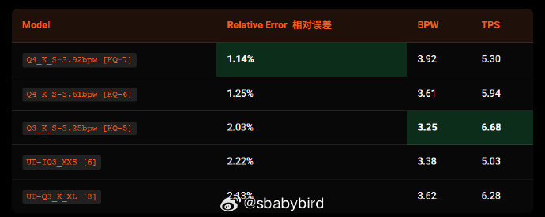
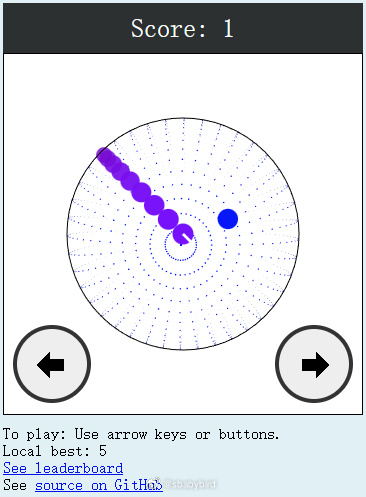

# 机器文摘 第 165 期

### 在树莓派上跑千问30b大模型

30B参数的Qwen3模型能在Raspberry Pi 5上实时运行？

[ByteShape这篇技术报告给出了肯定的答案](https://byteshape.com/blogs/Qwen3-30B-A3B-Instruct-2507/)。

通过ShapeLearn逐层量化技术，Q3_K_S-2.70bpw变体在16GB内存的Pi上跑出8.03 tokens/秒，保留94.18%的原始精度，聊天响应速度已超人类阅读节奏。

对比Unsloth和MagicQuant，ByteShape在速度-质量权衡曲线上全面占优：同样的精度下TPS更高，同样的速度下精度更好。

文章还揭示了GPU量化的反直觉真相——RTX 5090上4-bit是性能甜点，3-bit反而更慢！

### 球体上的贪食蛇

传统贪食蛇游戏都是在一个二维平面上的，[这个网页游戏将贪食蛇放在了一个球体上](https://kevinalbs.com/spherical_snake/)，通过控制前进方向去吃东西，玩法一样，就是操作起来要考虑更立体的方向了。 ​​​

### 基于大模型用自然语言生成信息图

[Infographic](https://infographic.antv.vision/)，新一代声明式信息图可视化引擎。

内置 200 多种信息图模板，涵盖图表、对比、顺序、关系等常见类型图，并提供手绘、渐变、图案等多种主题风格，以及允许自定义。

还集成了可视化编辑器，AI 生成的结果可以进一步调整，默认输出高质量 SVG 格式，方便后续编辑。

### 基于 Open-AutoGLM 的 Android 原生手机智能助手应用

[AutoGLM For Android](https://github.com/Luokavin/AutoGLM-For-Android) 是基于 Open-AutoGLM 开源项目二次开发的 Android 原生应用。它将原本需要电脑 + ADB 连接的手机自动化方案，转变为一个独立运行在手机上的 App，让用户可以直接在手机上使用自然语言控制手机完成各种任务。

核心特点：

🚀 无需电脑：直接在手机上运行，无需 ADB 连接
🎯 自然语言控制：用自然语言描述任务，AI 自动执行
🔒 Shizuku 权限：通过 Shizuku 获取必要的系统权限
🪟 悬浮窗交互：悬浮窗实时显示任务执行进度
📱 原生体验：Material Design 设计，流畅的原生 Android 体验
🔌 多模型支持：兼容任何支持 OpenAI 格式和图片理解的模型 API

### 一个开源桌面自动化操作Agent

[UI-TARS-desktop](https://github.com/bytedance/UI-TARS-desktop)，字节跳动发布的一个本地运行的桌面自动化代理。

它可以使用任何桌面应用程序，打开文件、浏览网站，并自动执行任务，无需云联接。

### 免费在线经典模拟器游戏

[emulatorgamer.com](https://emulatorgamer.com/zh-cn)，是一个专注于经典模拟器游戏的网站

为用户提供各种经典模拟器游戏的在线畅玩，覆盖从红白机到PS等众多经典游戏平台的模拟器支持和游戏畅玩

网站支持的游戏平台极其丰富，包括任天堂系列（NES/Famicom、SNES、Nintendo 64、Game Boy Advance、Nintendo DS）、世嘉系列（Master System、Mega Drive、Game Gear、Saturn）、PlayStation以及Atari、Commodore等经典游戏机。

用户无需安装任何软件，通过浏览器即可直接运行这些经典模拟器游戏，实现了"零安装即开即玩"。

基于EmulatorJS技术构建，这是一个功能强大的网页前端模拟器项目。该技术采用WASM技术实现高性能解压，内置完整的压缩文件处理功能，支持7z、zip等格式的游戏文件直接解压运行。同时，项目支持多语言本地化，包括中文、英文、日文、西班牙语等多种语言，确保全球用户都能获得良好的使用体验。

网站界面简洁直观，游戏库分类清晰，用户可以根据游戏平台或游戏类型快速找到想玩的游戏。所有模拟器都经过优化，在大多数现代浏览器中都能流畅运行，无论是Chrome、Firefox还是Edge都能完美兼容。

### 跟  ChatGPT 聊了聊“扩散模型”和“宇宙虚拟说”

我说：扩散模型根据提示词和随机种子能把噪声“还原”成一副清晰的图像，这与宇宙是“虚拟的”理论有何关联，是否某种程度上能够作为一种佐证呢？

------
以下是 ChatGPT 说的：

这是一个非常有趣且富有启发性的联想！将扩散模型的生成过程与“模拟宇宙”理论进行类比，确实能激发深刻的哲学和科学思考。

我们可以从几个层面来分析这种关联和它是否构成“佐证”：

1. 核心相似性：从“潜在信息”中生成“现实”

这是两者最引人遐想的共同点：

· 扩散模型：它从一个纯随机噪声（看似无意义）开始，根据一个文本提示词（作为高层指导信息）和随机种子（作为具体化的初始条件），通过一个训练好的复杂模型（即“物理定律”），逐步“去噪”，最终生成一幅符合提示词描述的、细节丰富的清晰图像。
  · 关键要素：潜在信息（提示词 + 随机种子）+ 确定性规则（神经网络模型）= 具体现实（图像）。
· 模拟宇宙假说：该假说认为，我们的宇宙可能是一个高级文明创造的模拟程序。在这个框架下，宇宙的“底层现实”可能并非我们感知的连续时空和物质，而是某种更基础的信息结构或计算状态（类似于“噪声”或“潜在代码”）。我们所感知的一切，是由这个程序的初始参数（类似“随机种子”）和底层物理定律（类似“神经网络模型”）实时渲染出来的。
  · 关键要素：底层信息/代码（计算状态）+ 物理定律（模拟程序规则）= 感知现实（宇宙万物）。

从这个角度看，两者都描述了一个过程：一个紧凑的、非直观的“信息内核”在固定规则的演化下，展开为我们所体验的复杂、连续的“现实”。

2. 可以作为思想实验的“弱佐证”

这种类比在启发性和哲学层面上，可以被看作一种有趣的“弱佐证”或“思想实验材料”：

1. 概念可行性证明：扩散模型的成功，在技术上演示了“从简单、高熵（混乱）的输入，通过复杂规则，生成高度有序、复杂且符合特定约束的虚拟世界”这一过程是完全可行的。它让“模拟假说”在直观上变得更可想象、更不荒谬。我们亲手创造了一个微观的、图像的“模拟宇宙”。
2. “压缩”与“渲染”：扩散模型本质上是其训练数据（整个图像分布）的“智能压缩版”。提示词就像是一个调用特定数据模式的“查询”，模型则实时“解压缩”或“渲染”出结果。这可以类比为：我们的物理定律，可能是这个宇宙“源代码”的一种高效“压缩”形式，宇宙的每一次演化都是对底层信息的“解压”。
3. 观测者依赖的“现实”：在扩散模型中，同一个随机种子，用不同的提示词会生成完全不同的图像。这暗示了“现实”（生成的图像）并非独立存在，而是与观测者/用户提供的“查询”或“意识框架”（提示词）密切相关。这与量子力学中“观测影响现象”以及哲学上“现实依赖于意识”的讨论产生了微妙的共鸣。

3. 重要的区别与不能作为“强佐证”的理由

尽管类比迷人，但必须清醒认识到它们之间存在根本差异，不能将其视为科学上的直接证据：

1. 目的性与无目的性：
   · 扩散模型：是一个有明确目的的工程系统——生成符合人类指令的图像。它有创造者（工程师），有训练目标（拟合数据分布）。
   · 宇宙：在模拟假说中，其“目的”未知（可能是科学实验、娱乐、遗产保存等）。但在标准宇宙学中，宇宙被认为是无目的的，其规律通过自然演化而来。
2. 底层本质不同：
   · 扩散模型：其底层是数学和代码，运行在硅基芯片上，过程完全可追溯、可中断。
   · 宇宙：即使是被模拟的，我们目前也无法知晓其“底层基板”是什么。我们所研究的一切“物理定律”，对于模拟内的我们来说，就是最底层的、不可逾越的规则。我们无法像查看模型权重一样去查看“宇宙源代码”。
3. “噪声”的性质：
   · 扩散模型：初始噪声是真正的随机或伪随机，是生成的起点和多样性来源。
   · 宇宙：如果宇宙是模拟的，其初始状态（如大爆炸奇点）可能并非“噪声”，而是精心设计或随机选择的初始条件。宇宙的量子涨落等随机性，可能是程序内建的随机函数，而非真正的“无意义噪声”。
4. 规模与复杂性：扩散模型生成的是一个静态的、有限的2D图像。而宇宙是一个动态的、包含无数相互作用和反馈循环的、具有层级涌现现象（如生命、意识）的4D时空连续体。其复杂性完全不在一个量级。

结论：是诗意的隐喻，而非科学的证据

· 作为佐证？ 从严格的科学实证角度来说，不能。证明宇宙是虚拟的，需要从宇宙内部找到可观测、可重复验证的“程序漏洞”或“底层比特结构”的证据，这与证明一个图像由AI生成是两回事。
· 作为深刻的哲学隐喻和思想启发？ 绝对是。扩散模型为我们理解“现实如何可能从信息中涌现”提供了一个绝佳的、直观的现代科技寓言。

它更新了柏拉图的“洞穴比喻”：我们不再是看着墙上的影子，而是成为了那个能够理解“影子”如何从“火”（模型）和“物体”（数据）中生成，甚至能自己操纵“火”来创造新“影子”的洞穴哲学家。

最终，扩散模型更像是“模拟假说”的一件精美的 艺术品 或 教学模型 ，它展示了该假说的核心逻辑在技术上是如何运作的，从而丰富了我们的想象力，但它并非宇宙本身的“用户手册”。它提醒我们，我们所感知的“现实”可能具有更深层的、非直观的生成逻辑，这是我们进行科学和哲学探索时一个永远值得玩味的可能性。

## 订阅
这里会不定期分享我看到的有趣的内容（不一定是最新的，但是有意思），因为大部分都与机器有关，所以先叫它“机器文摘”吧。

Github仓库地址：https://github.com/sbabybird/MachineDigest

喜欢的朋友可以订阅关注：

- 通过微信公众号“从容地狂奔”订阅。

