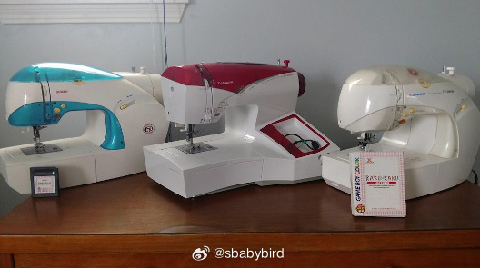
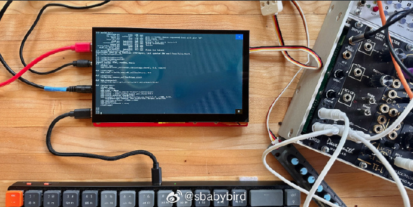
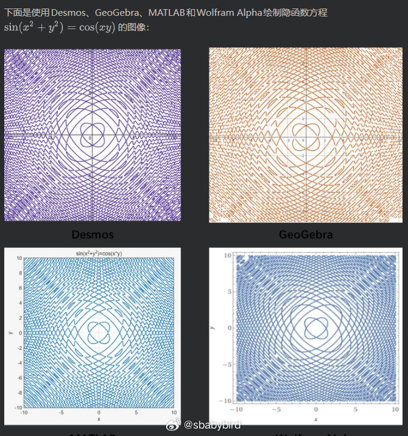

# 机器文摘 第 166 期

### 破解世界上最早的家用智能缝纫机

日本公司Jaguar （不是汽车那个），曾经发布过一款小巧的自动缝纫机，可以连接任天堂的 Game Boy 游戏掌机，让玩家进行图案设计和接近刺绣效果的缝纫。

这也许是世上首款家用的可以接受“打印”指令的缝纫机。

[《Edge of Emulation》这篇文章](https://shonumi.github.io/articles/art22.html)揭示了史上最离谱的游戏外设。

作者花费数千美元购入Jaguar JN-100/2000和Singer IZEK 1500三台缝纫机，破解了动态主从时钟切换、以0x14为零位的怪异Y坐标系统、128字节分包协议等重重谜题。

这是模拟器开发首次触及工业硬件领域——Mario主题刺绣、多段跳转缝合、EM-2000机械臂控制，所有功能在GBE+中完美重现。

项目不仅保存了数字文化遗产，更证明了逆向工程的力量能让20年前的"mad science"产品在虚拟世界永生。

### 开源多媒体创意电脑

[Tulip Creative Computer ](https://github.com/shorepine/tulipcc) 正在重新定义"便携式编程设备"的边界。

开机即进入Python REPL，没有操作系统打扰，575mA功耗续航数小时。

硬件搭载ESP32-S3、1024x600触摸屏、120振荡器AMY合成器、32硬件精灵与滚动背景层。USB键盘即插即用，WiFi联网后可访问Tulip World BBS分享作品。

它不是试图替代笔记本的瑞士军刀，而是一台专精于音乐、图形与文本创作的数字化身——开机即进入Python REPL，没有操作系统干扰，没有通知弹窗。

ESP32-S3芯片驱动1024x600触摸屏，AMY合成器提供120个立体声振荡器（支持FM、加法、减法合成及Karplus-Strong算法），LVGL图形栈实现32个硬件精灵与滚动背景层。

这种设计剥离了抽象层，让MicroPython代码能直接触达PWM波形生成与扫描线渲染，延迟以微秒计。

575mA的功耗搭配18650电池，续航数小时，而仅59美元的成品价与完整的开源硬件方案（PCB、BOM、贴片指南）。

### 用废弃软驱和软盘给孩子做一个“电视遥控器”

[软盘遥控器？这位老爸用20年前的技术"拯救"了孩子的电视时间](https://blog.smartere.dk/2026/01/floppy-disks-the-best-tv-remote-for-kids/)

作者发觉现在的电视遥控器对于孩子来说有些太过于复杂了，密密麻麻的按键，完全不知道怎样找到自己想看的节目。（事实上，对于成年人来说也是太复杂）

于是作者把目光投向早已废弃的软盘驱动器和软盘，他想到一个绝妙的点子。

插入软盘 → 机械咔哒声 → 播放一集动画片，没有自动播放，没有推荐算法，一次物理操作只看一个内容。

项目基于Arduino读取真实FAT文件系统，用ESP8266控制Chromecast，甚至解决了软盘马达启动时的数安培电流冲击问题。最妙的是设计理念：软盘可损坏，让孩子理解"数据会消失"；每张盘存单一节目，避免选择困难症。

### 奇函数图像是怎么绘制出来

[使用区间算数绘制任意二维隐式方程和不等式的图像](https://zhuanlan.zhihu.com/p/1988701719459284501)，文章从区间算数的基本概念和原理出发，一步步讲解如何使用区间算数绘制任意二维隐式方程和不等式的图像，并给出详细的JavaScript实现代码。

## 订阅
这里会不定期分享我看到的有趣的内容（不一定是最新的，但是有意思），因为大部分都与机器有关，所以先叫它“机器文摘”吧。

Github仓库地址：https://github.com/sbabybird/MachineDigest

喜欢的朋友可以订阅关注：

- 通过微信公众号“从容地狂奔”订阅。

