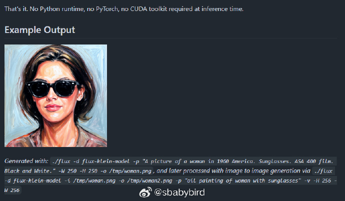
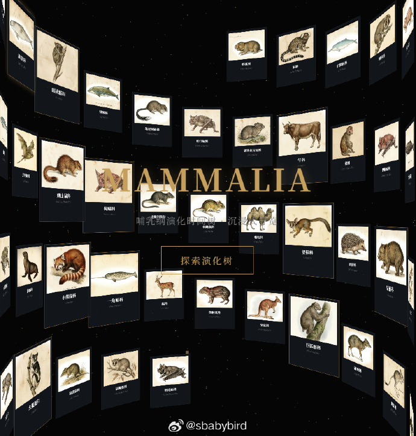
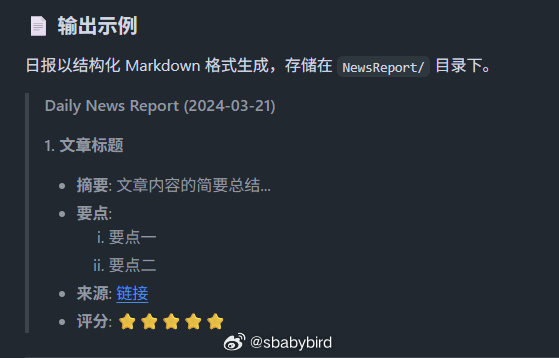
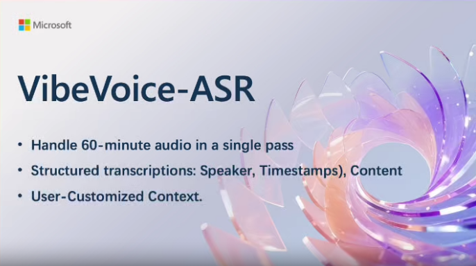
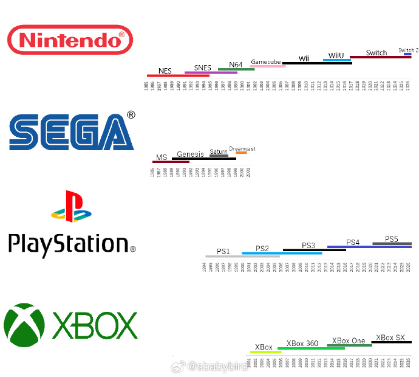

# 机器文摘 第 167 期
### ASCII 字符渲染的艺术

[ASCII](https://alexharri.com/blog/ascii-rendering)字符图像渲染的原理，是简单的把像素换算成字符吗？

这篇技术长文揭示了ASCII艺术生成中的一些背后原理（也许没有我们想象的那么简单）。

作者通过6维空间量化95个ASCII字符的形状特征，配合全局+方向性双重对比度增强，让旋转立方体的轮廓精度远超传统方法。

6个采样圆覆盖字符单元格，将T、L、O等字符映射为6D向量，精确捕获其视觉密度分布——T的上重下轻、L的左重右下、-的中部集中等特征被数值化编码；对比度增强上，提出双重机制——全局对比度通过归一化指数压缩增强区域差异，方向性对比度利用外部采样向量实现跨单元格的边界锐化，解决了传统超采样导致的"阶梯效应"；

通过5-bit量化缓存键（46K键空间）将k-d树查找优化至数毫秒，配合GPU六通道着色器管线（采样→外部最大→方向增强→内部最大→全局增强），在iPhone实现60FPS实时渲染。

### AI 使用纯 C 编写的文生图模型

[flux2.c](https://github.com/antirez/flux2.c)，文生图模型 FLUX2 的纯 C 实现。

纯用 AI 编写的开源项目，人类一行代码也没写。

> 作者说：即使代码是用 AI 生成的，我在引导设计、实现选择和正确性方面的帮助在开发过程中也至关重要。我学到了很多关于非简单项目和人工智能的经验。

推理时不需要 Python 运行时，不需要 PyTorch，也不需要 CUDA 工具包。

主要特性：
1. 零依赖 ：纯 C 语言实现，独立运行。BLAS 可选，可提升~30 倍加速（macOS 上的 Apple Accelerate，Linux 上的 OpenBLAS）
2. Metal GPU 加速 ：Apple Silicon Mac 
3. 文本转图像 ：根据文本提示生成图片
4. 图像对图像 ：根据提示转换现有图像
5. 集成文本编码器 ：内置 Qwen3-4B 编码器，无需外部嵌入计算

### 哺乳动物演化史

[Mammalia-tree](https://seanwong17.github.io/Mammalia-tree/)，一个沉浸式的 3D/2D 网页可视化项目，探索哺乳动物 2 亿年的演化。

首页的交互比较炫，点进去实际是一个大号的 xmind 思维导图，每个节点有详情介绍卡片。 ​​​

### 通过一个 Github 仓库熟悉 Agent 的“技能”（Skills）

[Erduo Skills](https://github.com/rookie-ricardo/erduo-skills) 是一个专门用于管理 AI Agent 智能技能的仓库。

它作为一个知识库和执行框架，使 Agent 能够执行自动新闻报道、数据分析等复杂任务。

每日日报 是一个高级技能，旨在自动从多个来源抓取、筛选并总结高质量的技术新闻。

该技能采用 Master-Worker 架构，包含智能调度器和专用子 Agent。

### 美观、开源、基于 WebGPU 的图表库

[ChartGPU](https://github.com/ChartGPU/ChartGPU) 是一个基于 WebGPU 构建的 TypeScript 图表库，实现平滑、交互式渲染——尤其是在数据量大时。

主要特性：
- 🚀 WebGPU 加速渲染，支持高帧率且数据量大
- 📈 多种系列类型：直线、面积、条形、散点、饼、烛台
- 🧭 内置交互功能：悬停高亮、提示、准星
- 🔁 通过 appendData（...）（ 笛卡尔系列）进行流媒体更新
- 🔍 X 轴缩放（内部手势+可选滑块 UI）
- 🎛️ 主题预设（“dark” |“light”） 以及自定义主题支持

### 微软开源超长语音识别模型

[VibeVoice-ASR](https://github.com/microsoft/VibeVoice)，一个 9B 参数的统一语音识别模型, 能单次处理长达 60 分钟的音频!

传统 ASR 模型都是把音频切成小片段分开处理, 这样做虽然简单但会丢失全局上下文, 说话人追踪也容易乱. VibeVoice 直接在 64K token 长度内一把梭, 60 分钟音频一次性吃下去.

而且它不只是转文字, 还能同时输出: Who（谁在说）+ When（什么时候说的）+ What（说了啥）. 相当于 ASR + 说话人分离 + 时间戳标注三合一, 直接输出结构化会议纪要.

另一个实用功能是支持自定义热词, 可以提前告诉模型一些专业术语、人名之类的, 识别准确率能大幅提升, 对医疗、法律、技术会议这种专业场景很友好.

架构上基于 Qwen2 Decoder, 28 层 3584 隐藏维度, 配合声学和语义双编码器 + 扩散头的设计. 支持中英双语, MIT 开源协议.

适用场景: 长会议转录、播客访谈处理、客服质检、在线课程字幕等等, 凡是需要分清"谁说了什么"的场景都能用上.

### 一款超实用的 AI 视频记录分析应用

[whisperVideo](https://github.com/showlab/whisperVideo)，一款超实用的AI神器 。

✨ 核心功能：
- 语音转文字 + 自动识别说话人
- 人脸和声音自动匹配，生成带名字的字幕
- "谁+何时+说了什么"全自动对齐可视化

💡 特别适合：

访谈剪辑 / 会议纪要 / 课程速览 / 纪录片素材整理

⏰ 长视频友好：

支持小时级素材，自动分段分场景，同一个人身份识别超稳！

🛠️ 技术流背书：

WhisperX转录 + Pyannote声纹分离 + SAM3人脸检测，多模态融合精准对齐
告别手动整理采访素材的痛苦！👏

### 几大家用游戏主机厂商所生产的各个游戏机的生命周期

reddit 上有人整理了任天堂、世嘉、索尼等几大主机厂商所推出产品的生命周期图，其中索尼的 PS4 和任天堂的 switch 周期最长，均已超过了十年且还在活跃。

## 订阅
这里会不定期分享我看到的有趣的内容（不一定是最新的，但是有意思），因为大部分都与机器有关，所以先叫它“机器文摘”吧。

Github仓库地址：https://github.com/sbabybird/MachineDigest

喜欢的朋友可以订阅关注：

- 通过微信公众号“从容地狂奔”订阅。

