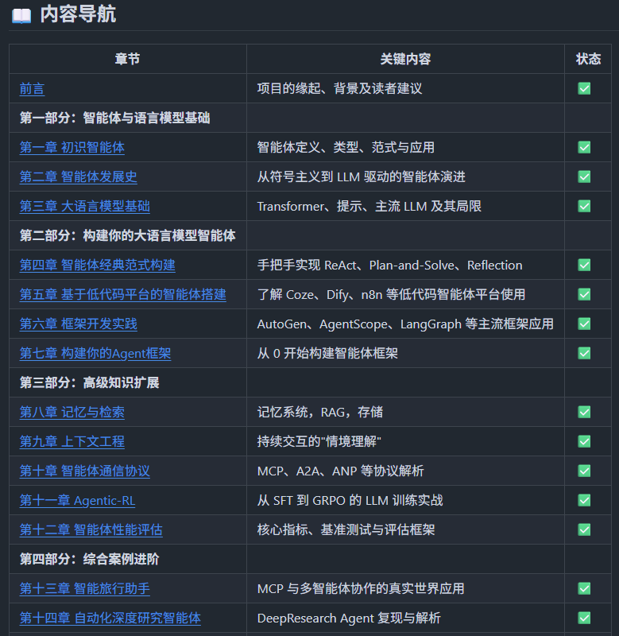
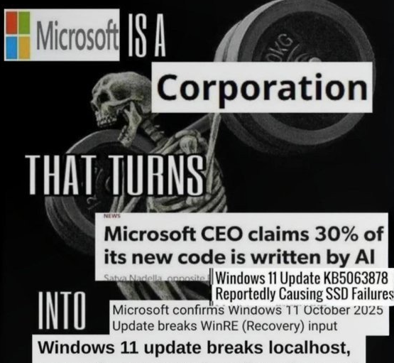
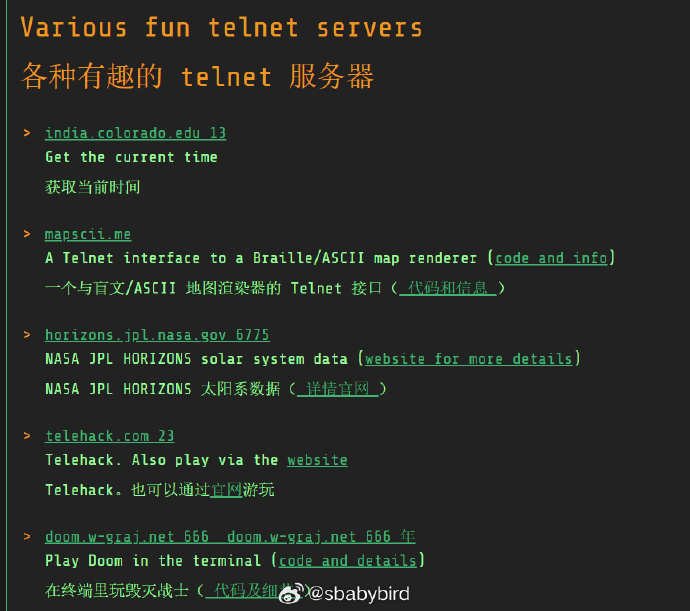

# 机器文摘 第 168 期
### AI 智能体（Agent）基础教程

[从零开始构建智能体](https://github.com/datawhalechina/hello-agents)，从零开始的智能体原理与实践教程。

> 如果说 2024 年是"百模大战"的元年，那么 2025 年无疑开启了"Agent 元年"。技术的焦点正从训练更大的基础模型，转向构建更聪明的智能体应用。然而，当前系统性、重实践的教程却极度匮乏。为此，我们发起了 Hello-Agents 项目，希望能为社区提供一本从零开始、理论与实战并重的智能体系统构建指南。
>
> 如今 Agent 构建主要分为两派，一派是 Dify，Coze，n8n 这类软件工程类 Agent，其本质是流程驱动的软件开发，LLM 作为数据处理的后端；另一派则是 AI 原生的 Agent，即真正以 AI 驱动的 Agent。本教程旨在带领大家深入理解并构建后者——真正的 AI Native Agent。教程将带领你穿透框架表象，从智能体的核心原理出发，深入其核心架构，理解其经典范式，并最终亲手构建起属于自己的多智能体应用。我们相信，最好的学习方式就是动手实践。希望这本教程能成为你探索智能体世界的起点，能够从一名大语言模型的"使用者"，蜕变为一名智能体系统的"构建者"。

无需下载，在线即可学习。

主要内容：
- 📖 Datawhale 开源免费 完全免费学习本项目所有内容，与社区共同成长
- 🔍 理解核心原理 深入理解智能体的概念、历史与经典范式
- 🏗️ 亲手实现 掌握热门低代码平台和智能体代码框架的使用
- 🛠️ 自研框架HelloAgents 基于 Openai 原生 API 从零构建一个自己的智能体框架
- ⚙️ 掌握高级技能 一步步实现上下文工程、Memory、协议、评估等系统性技术
- 🤝 模型训练 掌握 Agentic RL，从 SFT 到 GRPO 的全流程实战训练 LLM
- 🚀 驱动真实案例 实战开发智能旅行助手、赛博小镇等综合项目
- 📖 求职面试 学习智能体求职相关面试问题

### 让大语言模型帮你设计机器学习的模型

[plexe](https://github.com/plexe-ai/plexe)，从提示词构建机器学习模型。

只需要用人话说明 “想预测什么”、“输入是什么”、“输出是什么”，系统就会通过多智能体协作，自动完成数据分析、方案规划、代码生成、测试评估全流程。

支持 OpenAI、Anthropic、Ollama 等多种大语言模型提供商，还能自动推断数据结构或生成合成数据集。

另外内置 Ray 分布式训练，可以并行处理多个模型方案，大幅提速。

### 被 Windows 逼着迁移到 Linux

微软对 Windows 品质的摆烂态度，终于激怒了某些用户，这些人开始用脚投票，转而选用其他产品。

而 Linux 则是第一个选择。

[当 Windows 不再“好用”：一位开发者转向 Linux 的可行性与现实考量](https://www.himthe.dev/blog/microsoft-to-linux)，开发者 Bogdan 在其个人博客上发表了一篇文章，详细阐述了他作为一名拥有超过 20 年经验的 Windows 用户，最终决定转向 Linux 的心路历程。

作者的“压垮骆驼的最后一根稻草”是 Windows 的 24H2 更新。该更新导致其系统出现严重的图形渲染错误（作者形容为“视觉癫痫”），尤其是在 Chrome 浏览器窗口被其他窗口遮挡时。

这一问题在重装系统后依然存在，并被归因于 NVIDIA 驱动与微软系统 MPO（多平面覆盖）功能之间的不兼容。

除了这一重大 Bug，作者还列举了 Windows 的一系列“罪状”，包括：强制性的、在用户不知情的情况下自动安装并关闭应用的更新；

充斥于系统各处的 OneDrive 和 Edge 浏览器全屏广告；以及难以摆脱的 Copilot AI 助手和云账户绑定策略。

面对这些问题，作者最终选择了基于 Arch 的 CachyOS 发行版作为其新的主力系统。

他坦言，虽然 Linux 在传统印象中需要用户投入大量精力去查阅文档和论坛（too much work），但如今的 Windows  由于其层出不穷的问题和“反用户”的设计，也同样变得“太费劲”。

相较于被动地解决由系统更新带来的未知问题，他更愿意将精力投入到主动学习和配置一个可控的 Linux 环境中。

文章对 2026 年的 Linux 生态在多个领域的可用性进行了评估：
* 软件开发：作者认为 Linux 已成为“首选平台”，其拥有更强大的终端、原生包管理器以及原生的 Docker 支持。
* 游戏娱乐：得益于 Proton/Wine 兼容层的发展，绝大多数不含内核级反作弊系统的游戏都能在 Linux 上良好运行，AMD 显卡的性能甚至能与 Windows 持平。
* 内容创作：这是一个优劣参半的领域。虽然 DaVinci Resolve 和 Kdenlive 等专业视频剪辑软件已有原生版本，但行业标准的 Adobe 全家桶仍需通过 Winboat
 等兼容方案运行，体验存在妥协。
* 音乐制作：生态相对成熟，拥有 Bitwig Studio 等原生数字音频工作站，并且通过 PipeWire 音频服务器实现了比 Windows 更低的声音延迟。
* 通用使用：作者主观感受，在 Linux 上进行基本操作“快得多”，系统响应性更强。

### 现在还活着的一些 telnet 站点

基于文字的互联网可以令人兴奋、信息丰富且有趣。

通过 telnet，你可以体验上世纪90年代以文本交互为主的上网体验。

虽然现在已经几乎没人在使用 telnet 登录一些 BBS 站点了，但是仍然有一些爱好者再默默维护基于文本和终端进行互联网漫游的方式。

[Places to Telnet](https://telnet.org/htm/places.htm)这个站点里面记录了一些现存的 telent 站点，可以使用 telnet 命令登录体验，感受上世纪互联网上古时期的上网体验。

### 通过笔记本上的摄像头监控你的坐姿

[posturr](https://github.com/tldev/posturr)，这个软件有点儿意思，通过你的苹果笔记本上的摄像头监控你的坐姿，发现你出现驼背等不正确、不健康坐姿时，就会强行把屏幕变模糊，以示提醒。

软件利用你 Mac 的摄像头和苹果的 Vision 框架实时监控你的姿势。 ​​​

主要特性：
- 两种追踪方法 ——使用你的摄像头（Vision Framework）或 AirPods 的动作传感器
- AirPods 运动追踪 ——使用 AirPods Pro、Max 或第三代 （macOS 14+） 在无摄像头的情况下跟踪姿势
- 渐进性屏幕模糊 ——温和的视觉提醒，姿势变差时会加剧
- 菜单栏控制 ——从菜单栏轻松访问设置、校准和状态
- 多显示器支持 ——适用于所有连接的显示器
- 注重隐私 ——所有处理都发生在你的 Mac 上本地

## 订阅
这里会不定期分享我看到的有趣的内容（不一定是最新的，但是有意思），因为大部分都与机器有关，所以先叫它“机器文摘”吧。

Github仓库地址：https://github.com/sbabybird/MachineDigest

喜欢的朋友可以订阅关注：

- 通过微信公众号“从容地狂奔”订阅。

