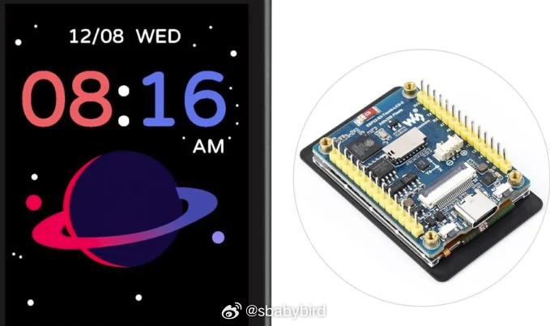
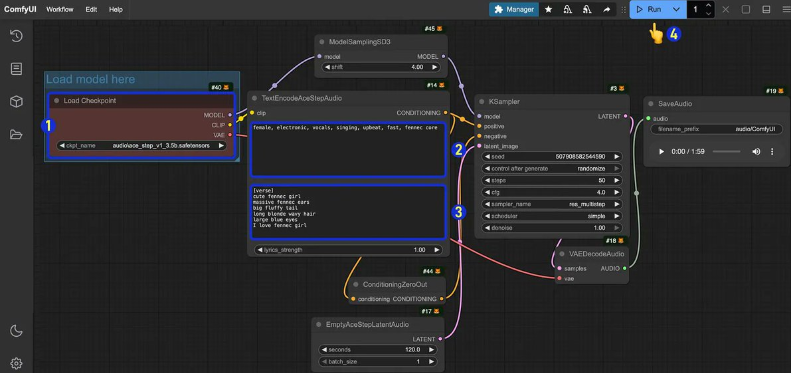
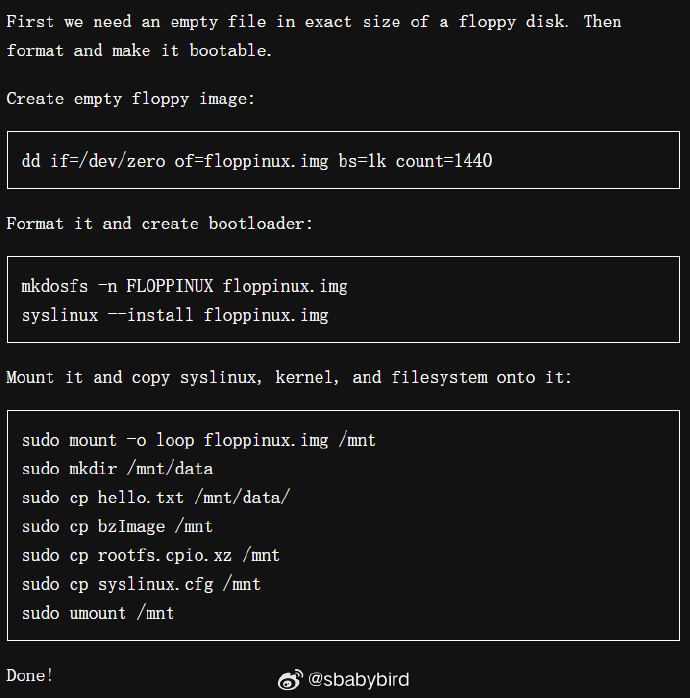
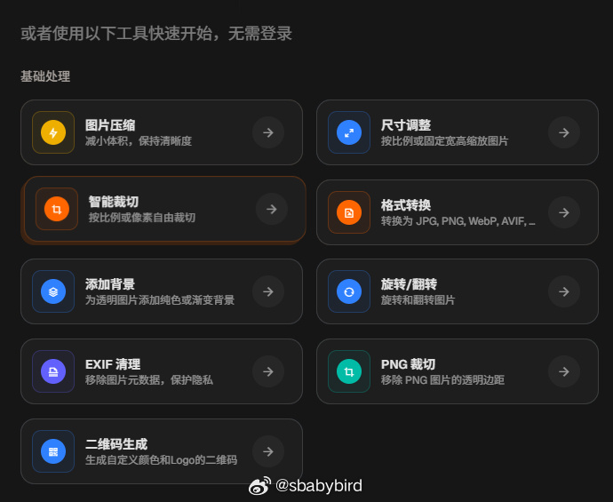
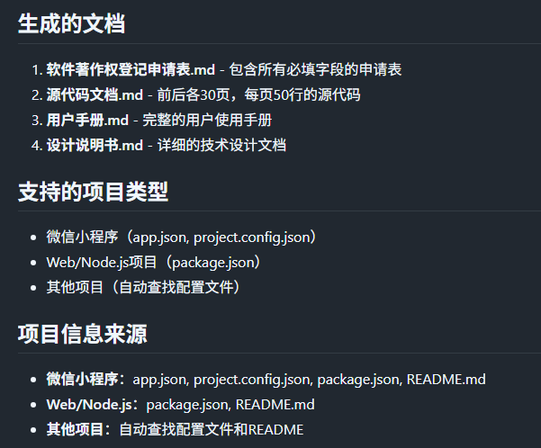
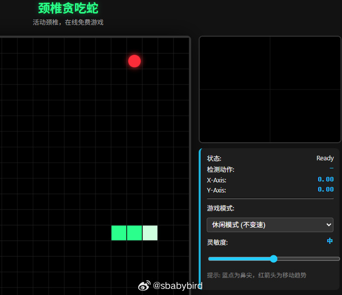

# 机器文摘 第 169 期
### 开源单片机图形操作系统

[MicroPythonOS](https://www.cnx-software.com/2026/01/29/micropythonos-graphical-operating-system-delivers-android-like-user-experience-on-microcontrollers/)，能否在单片机上实现“类安卓”图形界面与用户体验？

MicroPythonOS 的核心目标是克服传统微控制器在图形用户界面（GUI）方面的限制，为开发者提供一个拥有现代智能手机体验的平台。

它基于为微控制器高度优化的 Python实现——MicroPython 构建，使得 Python 开发者能够利用熟悉的语言快速构建复杂的交互界面。

其主要技术亮点包括：支持多点触控手势（如滑动解锁）、通知系统、应用启动器、应用抽屉和小部件等类安卓 UI 元素。

系统内嵌了网页浏览器、媒体播放器、终端和文件管理器等基础应用，并通过内置的应用商店/包管理器实现便捷的应用安装和 OTA（Over-the-Air）空中更新，大大提升了可维护性。

MicroPythonOS 的出现，对嵌入式开发领域具有重要的潜在影响。它有望赋能更广泛的开发者群体（特别是 Python 社区），让他们更容易地为 MCU 设备开发具备丰富交互性的应用，从而催生更多具备复杂本地 UI 的智能硬件产品。这在一定程度上填补了在裸机/RTOS 和全功能嵌入式 Linux 操作系统之间，对易用性、快速开发和图形化需求兼顾的市场空白。

然而，MicroPythonOS 也面临着微控制器固有的资源限制所带来的严峻挑战。内存（RAM）是最大的瓶颈，即便 MicroPython 本身已高度优化，一个包含 GUI 框架和多个应用的“类安卓”系统，仍然可能迅速耗尽典型 MCU（如 ESP32 系列）仅有数百 KB 的 RAM。CPU 性能也是关键，处理复杂的图形渲染、动画和多任务交互将对 MCU 的时钟频率造成巨大压力，用户体验的流畅性与响应速度将受到严峻考验。

此外，闪存存储空间和功耗管理也是需要重点考虑的因素，因为丰富的 UI 和功能往往意味着更大的存储占用和更高的能耗。

从工程实现来看，MicroPythonOS 选择 MicroPython 作为基础，是希望利用 Python 的易用性和开发效率来弥补 MCU 编程的复杂性。它可能采用了模块化的架构设计，以确保核心系统和应用能够按需加载，并高效利用有限的硬件资源。OTA 更新机制的集成，对于嵌入式设备在部署后的维护和功能迭代至关重要，体现了现代嵌入式系统开发的最佳实践。

硬件方面，MicroPythonOS 需要微控制器具备相对强大的 CPU、足够的 RAM（可能需要达到兆字节级别以提供流畅体验，而非数百 KB），以及集成或外接的显示控制器/驱动。文章提到 ESP32-S3 等芯片可能成为目标平台，这类芯片具备 Wi-Fi、蓝牙和一定图形处理能力，但即便如此，要实现“类安卓”的体验依然是一项严苛的任务。

### 开源音乐生成模型

[ACE-Step](https://github.com/ace-step/ACE-Step)，一个高效的开源音乐基础模型，旨在将商业级音乐生成在消费级硬件环境上应用。

主要特性：
- 商业应用：为创作者设计，你可将生成的音乐用于商业用途。
- 训练数据：专业授权的音乐曲目。
- 合成数据：通过先进的MIDI转音频技术生成高质量音频。
- 速度极快：在A100上，在2秒内生成完整歌曲，在RTX 3090上不到10秒。

### 一张软盘上的 Linux

[Floppinux](https://krzysztofjankowski.com/floppinux/floppinux-2025.html)，是一个长期项目，旨在将一个功能完整的 Linux 发行版压缩并运行在传统的 1.44MB 软盘上。

项目核心目标是创建一个能在上世纪 90 年代末至 21 世纪初期的个人电脑上运行的、可交互的 Linux 环境。其最低硬件要求是 32MB 内存（推荐 64MB 或更高）和  Pentium MMX 或更快的 CPU。

项目的主要技术约束来自软盘本身：1.44MB 的极端存储容量和极其缓慢的 I/O 速度。为应对这些挑战，开发者采取了多项策略：采用 Linux 6.6.6  内核，使用 Buildroot 工具链构建整个系统，并将根文件系统设计为高度压缩的 SquashFS 格式，在启动时整体加载到 RAM 中，以最大程度地减少启动后的软盘访问。

通过将 initramfs 压缩到 500KB 以内，并在软盘上使用 SquashFS 格式的根文件系统，整个 Linux 环境——包括  BusyBox（提供最小用户态工具集）、uClibc（轻量级 C 库）、nano 编辑器和 FTP  客户端——得以全部塞进一张软盘。

系统启动后，根文件系统会被完全加载到内存中，此举有效地绕过了软盘的低速 I/O问题，使得系统在启动完成后能够提供一个相对流畅的交互体验。将一个相对现代的 Linux 内核（6.6.6）适配到老旧硬件上，同时保持如此小的体积，是该项目的一大技术亮点。

它为理解 Linux启动过程、构建最小化系统以及嵌入式系统的资源管理提供了宝贵的实践案例。尽管其功能主要限于实验和教育，但 Floppinux无疑是一项激动人心的技术成就，它不断推动着“在有限中实现无限”的边界，并激励着人们探索软件在不同硬件平台上的更多可能性。

### 批量处理图片的工具站

[PictureKit](https://picturekit.app/zh)，是一个批量处理图片的工具网站。

可以让你在浏览器中，完成各种图片处理任务，包括：压缩、裁剪、尺寸调整、背景修改、Exif信息清理、水印边框增加等。

所有操作均在本地完成，你的数据不会上传至别处，隐私无忧。

可以建立工作流批量处理大量同类任务。

### 自动生成软件著作权申请材料

[chinese-copyright-application-skill]​(https://github.com/na57/chinese-copyright-application-skill)，用于生成中国软件著作权申请材料的完整工具包。支持从项目代码、文档等自动提取信息，生成软件著作权登记申请表、源代码文档（前后各30页）、用户手册和设计说明书。适用于微信小程序、Web应用、移动App、桌面应用等各类软件项目。

功能特性：
- 自动分析项目结构和配置文件
- 支持微信小程序、Web/Node.js等多种项目类型
- 自动提取项目信息（名称、版本、描述、功能特性等）
- 生成符合中国版权保护中心要求的申请材料
- 支持自定义输出目录

### 颈椎贪食蛇

[Sneck](https://sneck.1link.fun/)，一个颈椎友好型游戏，Sneck ，取 Snake （贪吃蛇）和 Neck 颈椎的意思。

玩法就是经典贪吃蛇，只是你需要用你的头去控制。

正坐在屏幕前，开始游戏之后，只需要上下左右移动头部即可控制贪吃蛇，

作者称自己最多玩到了 500 分。

游戏需要用户授权浏览器开通页面的摄像头权限。

## 订阅
这里会不定期分享我看到的有趣的内容（不一定是最新的，但是有意思），因为大部分都与机器有关，所以先叫它“机器文摘”吧。

Github仓库地址：https://github.com/sbabybird/MachineDigest

喜欢的朋友可以订阅关注：

- 通过微信公众号“从容地狂奔”订阅。

