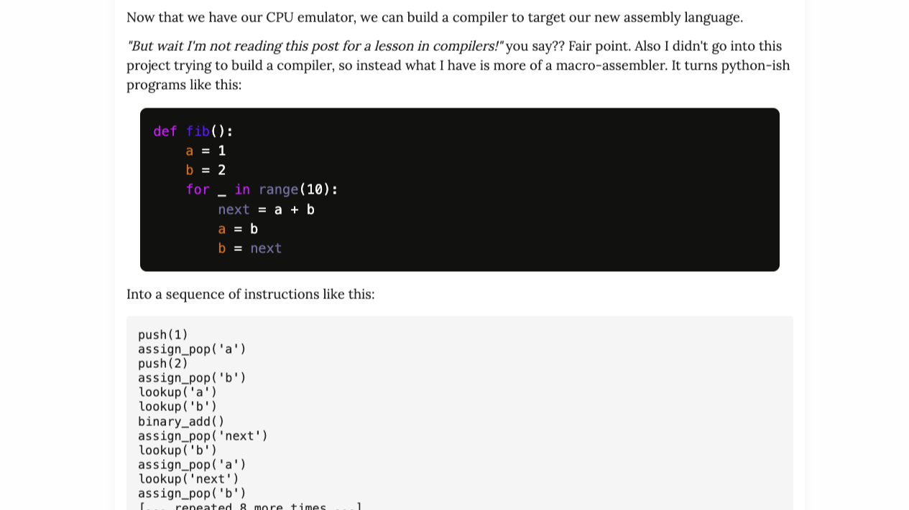
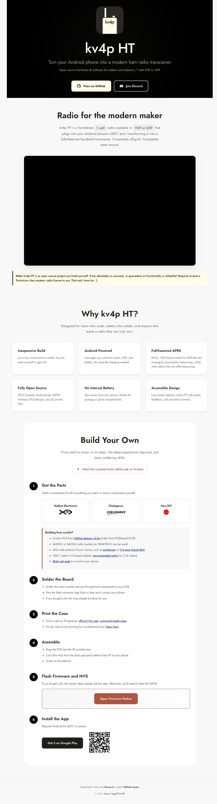
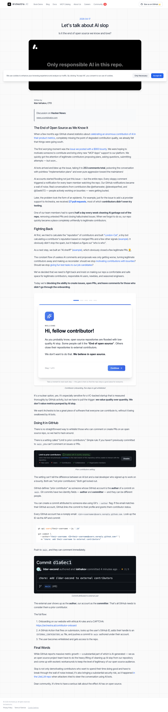

# 机器文摘 第 170 期

### 自进化的智能体框架

[GenericAgent](https://github.com/lsdefine/GenericAgent)，一个极简、可自我进化的 LLM Agent 框架，核心代码仅约 3K 行，通过 9 个原子工具构成 Agent Loop。

这个项目的设计哲学很有意思：不预设技能，靠进化获得能力。每完成一个任务，GenericAgent 会自动将执行路径固化为可复用的 Skill，形成一个持续生长的专属技能树。也就是说，它在使用的过程中会变得越来越"懂你"。

技术上看，它的上下文窗口不到 30K Tokens（其他 Agent 动不动 200K-1M），靠的是信息密度最大化的设计——不是往里塞更多内容，而是让每段内容都更有用。分层记忆系统（L0-L4）从元规则一直管理到会话归档，类似人类大脑的短期到长期记忆的转化机制。

更狠的是，项目作者声称该仓库的一切内容（从 git init 到每一条 commit message）均由 GenericAgent 自主完成——他们说从未打开过终端。这种"自举"式的宣称很难验证，但至少说明这个框架在自驱动任务执行上做得相当彻底。

从工程实现来看，"进化为 Skill"的机制是一个关键创新——它不是靠预定义的插件体系来扩展能力，而是让 Agent 在完成任务过程中自主总结最佳路径，将经验固化为可复用的 SOP。这种做法比传统插件机制更灵活，但对任务分拆和模式识别的准确度要求极高——如果学歪了，坏习惯也会被固化下来。

### 用正则表达式写国际象棋引擎

[Regex Chess](https://nicholas.carlini.com/writing/2025/regex-chess.html)，Google 研究科学家 Nicholas Carlini 做的一个项目：用 84,688 条正则表达式实现了一个 2 层极小极大搜索的国际象棋引擎。

这听起来像是一个"纯粹为了好玩"的恶搞项目，但背后藏着令人拍案叫绝的工程智慧。

作者实现了一个"分支无关的 SIMD 指令集"——整个计算机的状态是一个长字符串，所有操作（压栈、出栈、变量赋值、条件分支）都通过正则查找替换来完成。程序就是一个按顺序执行的 84,688 次正则替换循环，没有 if/else、没有循环、没有函数调用。

最漂亮的设计是 SIMD 多线程处理。利用正则全局替换的特性，可以同时处理多个线程状态。生成兵的走法时，一次 Fork 操作将所有兵分配到不同线程，并行检查所有可能的走法——这相当于只用一次遍历就处理了全部棋子。在传统编程语言里你会写一个 for 循环，在正则的世界里你用一种更本质的方式实现了并行。

当然，代价也很高。初始版本走一步棋需要 30 分钟，经过大量优化（删除中间变量、压缩状态字符串、优化匹配模式）后缩短到 1-10 秒。而这一切只是因为正则表达式引擎本质上是线性状态机，做不了真正的循环控制。作者将循环全部展开，这就是 84,688 这个数字的来源。

从更宏观的角度看，这个项目有意思的地方在于：它证明了正则表达式不仅仅是文本匹配工具，它可以是一种计算模型。虽然对于任何实际用途来说这都不是一个好方案（谁会用一个跑 10 秒才能走一步的象棋引擎呢），但它展示了什么是"计算"的底层本质。

### 把安卓手机变成业余无线电收发器

[KV4P HT](https://www.kv4p.com/)，一个完全开源的手持收发器项目。核心概念：将一个小巧的硬件模块通过 USB-C 插入安卓手机，利用手机的屏幕、GPS、电池、扬声器和麦克风，变成一个 1 瓦特的 VHF/UHF 对讲机。

硬件部分是一个装有 ESP32 微控制器和 SA818 射频模块的定制 PCB，软件方面有安卓 App 和 ESP32 固件，全部开源（GPL v3）。

技术实现上最有趣的是信号链路：手机麦克风拾音 → Opus 音频编码 → USB 串口发给 ESP32 → I2S 输出到射频模块发射。接收时则反向。此外还支持 APRS（业余无线电分组通信），包括短信和 GPS 位置信标——大多数手持对讲机只支持信标，不支持短信功能。

从工程角度看，这个项目最值得学习的是"资源复用"的思路。为什么要在设备里塞一块屏幕、电池和 GPS？你的手机已经有这些了，而且比任何嵌入式的方案都好。把通信的射频部分独立出来，其他都用现成的手机资源——这比传统的完整对讲机设计更轻巧、更便宜、更容易升级（换手机就等于升级了屏幕和 GPS）。

不过也需要看到它的局限：1 瓦特的发射功率决定了通信距离有限（传统 5W 对讲机的一半左右），而且没有内置电池，会消耗手机电量。另外需要业余无线电执照才能在合法频率使用。

### 十几块的智能门铃，任何人都能让你家的门铃响

[Anyone on the Internet Can Ring Your Doorbell](https://www.abgeo.dev/blog/anyone-can-ring-your-doorbell)，一篇安全研究文章，作者从 Temu 买了一款约 12 美元的"Smart Doorbell X3"，然后发现了一系列触目惊心的安全漏洞。

核心发现链如下：门铃使用明文 HTTP + 弱签名机制（硬编码的 SHA1 盐值，所有设备相同）→ 签名可伪造 → 设备 ID 可枚举（格式固定，后 6 位递增）→ 可以伪造门铃通知 → 可以静默将设备转移到自己账户 → 可以劫持主人的通话并发送任意视频画面。甚至通过 UART 调试接口可以直接提取家庭 WiFi 密码。

这几乎是一个教科书级别的物联网安全失败案例，且每个环节都是从业十几年的工程师一眼就能看出问题的那种：

不做 HTTPS 是第一个信号。设备绑定时后端不验证请求的真实来源是第二个。使用硬编码签名字符串而不是真正的密钥管理是第三个。所有设备共享同一个签名盐，这意味着攻破一台就等于攻破整个产品线。更糟糕的是，设备 ID 是可枚举的整数序列，给批量攻击提供了便利。而生产固件中保留完整的 UART 调试 shell，则让物理攻击变得毫无门槛。每一个漏洞单独看都不至于致命，但串联起来就形成了从固件到后端的全链路崩溃。

读完最大的感受是：物联网安全的核心不在于用了多强的加密算法，而在于**信任模型的设计**——你要信任什么、不信任什么、在哪里设立边界。这篇文章里的设备在几乎所有关键边界上都选择了"信任"。

### 用 Git 的 --author 标记阻止 AI Bot 垃圾

[We stopped AI bot spam in our GitHub repo using Git's –author flag](https://archestra.ai/blog/only-responsible-ai)，一个开源团队分享的真实经验——他们如何用 Git 的 `--author` 标志配合 GitHub 的"限定历史贡献者"设置，来阻止 AI Bot 在仓库里刷垃圾评论和 PR。

他们的一个悬赏 issue 被 AI Bot 灌到 253 条无意义评论，一个简单的功能需求收到了 27 个未测试的 PR。团队每周要花半天时间清理这些垃圾。

解决方法绝妙地利用了 GitHub 的一个行为细节：GitHub 判断一个用户是否是"历史贡献者"的标准，是该用户的 GitHub 账号是否为 `main` 分支某次 commit 的 **author**。而 `git commit --author=` 允许你以别人的身份创建 commit——你作为 committer，外部用户作为 author。这样一推，GitHub 就自动把该用户识别为了贡献者，解除了评论/PR 的发言限制。

他们为此搭建了一个完整的 onboarding 流程：用户访问一个页面，填写伦理 AI 使用声明 + 通过 CAPTCHA 验证 → GitHub Action 自动创建一个以该用户为 author 的 commit → 用户自动获得贡献者身份。

这个技巧有意思的地方在于，它是对 GitHub 平台规则的一次"非预期利用"。Git 的 author 和 committer 字段分离原本是为了记录代码的原始来源（比如补丁的提交者可能不是作者），但被巧妙地用作了身份授权机制。这对任何维护开源项目的人都很有参考价值——你不需要自己造一个复杂的身份系统，GitHub 已经给你提供了工具，只是用法不是官方的"预期用法"而已。

### 一个点击游戏如何揭示你被监视的真相

[Click (2016)](https://clickclickclick.click/)，荷兰艺术团体 Moniker 制作的一个浏览器互动艺术实验。表面上是一个简单的点击游戏——页面上只有一个绿色按钮，点击它来解锁成就。但你不知道的是，网站正在暗中观察你的一切行为。

总共有 128 个成就，解锁方式远不止点击按钮。当你把窗口移到屏幕右侧时、当你在键盘上打字时、当你的浏览器窗口失焦时、当你进入全屏时、当你的设备方向改变时——每一个你以为是"私密"的操作，都被网站默默记录并转化为一个成就表情符号。网站用心理学实验报告的口吻描述你的每一步操作："受试者花了 11 秒第一次点击按钮。""受试者的机器有 12 个 CPU 核心。""新受试者已进入。欢迎。"

这个项目最初是 2016 年作为"We Are Data"巡回展览的一部分推出的。技术实现上使用了 Socket.IO 长连接 + RxJS 数据流，实时追踪用户的浏览器事件（点击、右键、滚轮、拖拽、键盘、窗口变化、全屏、设备方向等），并通过纯前端的 cookie 持久化成就进度。

十年后的今天来看这个项目，感觉有点微妙。2016 年它还是一个让人警醒的艺术实验——"看，你在被监视！"而到了 2026 年，这种被监视已经成为日常。每一个 App、每一个网站、每一次交互都在采集你的行为数据，区别只是有没有用成就系统把它包装成游戏而已。从这个角度看，Click 反而成了一个时间胶囊，封存了我们曾经还能对此感到惊讶的时期。

## 订阅
这里会不定期分享我看到的有趣的内容（不一定是最新的，但是有意思），因为大部分都与机器有关，所以先叫它"机器文摘"吧。

Github仓库地址：https://github.com/sbabybird/MachineDigest

喜欢的朋友可以订阅关注：

- 通过微信公众号"从容地狂奔"订阅。

