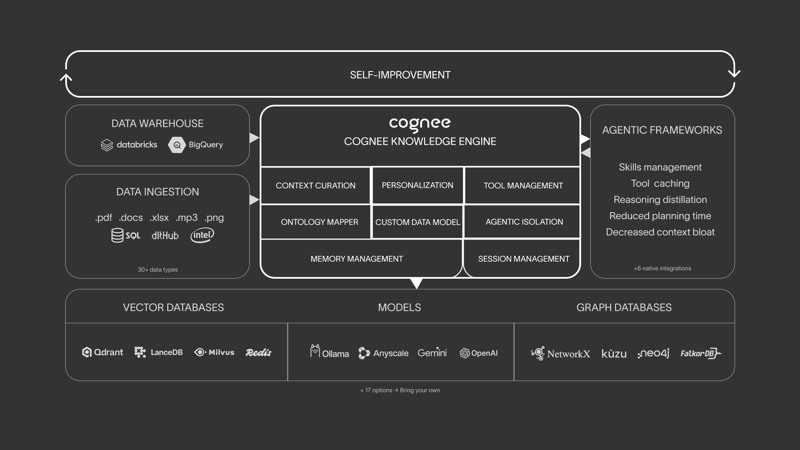
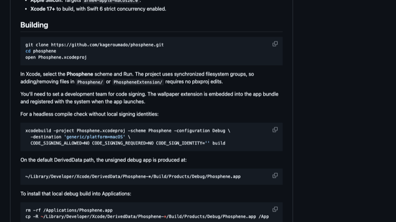
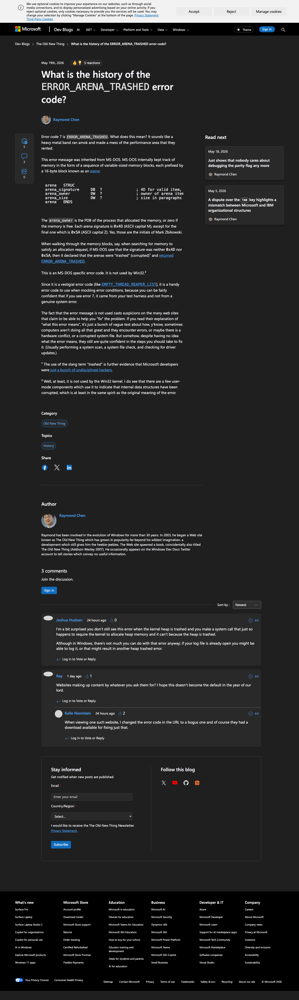
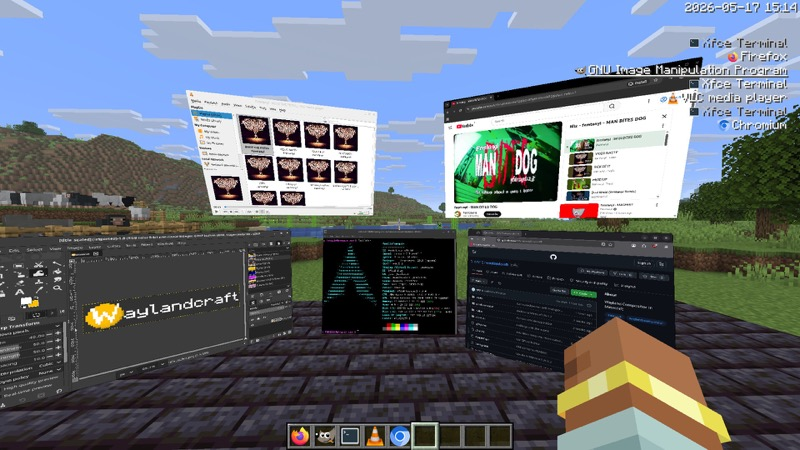
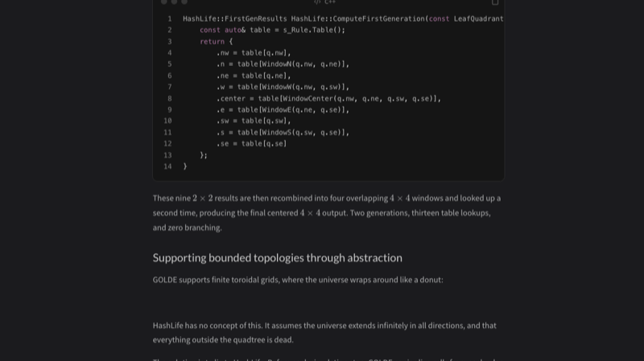

# 机器文摘 第 171 期

### Cognee：让 AI Agent 拥有长期记忆

[Cognee](https://github.com/topoteretes/cognee)（⭐17,476），一个开源的 AI Agent 记忆管理框架，核心能力是把杂乱的数据自动组织成可检索的记忆网络。

接入方式极简——`pip install cognee` 后就拿到了一个"记忆控制平面"。支持任意格式数据（文本、代码、对话记录、结构化数据），系统会自动构建知识图谱 + 向量索引，让 Agent 可以进行语义检索和关系推理。与其他记忆方案最大的不同在于它同时保留了"语义"和"结构"两层信息：向量索引做模糊匹配，知识图谱做精确关联推理，这在需要跨会话维护上下文的 Agent 场景中非常实用。

从技术实现上看，它的数据管道分为几个阶段：摄入（ingestion）将原始数据分块 → 嵌入（embedding）生成向量表示 → 图谱构建（graph construction）提取实体和关系 → 检索（retrieval）提供混合查询接口。整个过程约 6 行代码可完成配置。

有意思的地方在于它的"记忆进化"机制：新的数据会自动与已有记忆建立关联，而不是简单地追加到历史记录尾部。这更像人类记忆的运作方式——不是线性堆叠，而是不断建立新的连接。

### Screenbox：基于 VLC 内核的现代开源播放器

[Screenbox](https://github.com/huynhsontung/Screenbox)（⭐3,754），一个基于 libVLC 的现代开源媒体播放器，Windows 平台独占。核心卖点很简单：VLC 的解码能力 + 现代 UI。

Screenbox 直接用 WinUI 3 重写了界面，吃上了 Fluent Design 的全部特性：亚克力背景、Mica 材质、深色/浅色主题、触摸手势操作。启动速度是 VLC 的 2-5 倍，空闲时内存占用不到 50MB。代价是它去掉了 VLC 的大部分附加功能（转码、录制、滤镜等），只保留纯粹的播放体验。

技术上它的做法很聪明——不重新造解码轮子，而是直接复用 libVLC 的底层能力，只替换 UI 层。这对用户来说是最好的方案：你不用担心格式兼容性（VLC 支持的 200+ 格式它都支持），同时又享受到了现代应用的交互体验。支持字幕自动加载、播放列表、网络流（HTTP/RTSP/m3u8）、Chromecast 投屏。

唯一遗憾的是仅限 Windows——macOS 和 Linux 用户用不了。

### 10 块钱的 token 跑出一篇论文

一个开源项目（PaperFactory 或同类实现），做的事情简单粗暴：给一个研究方向，自动完成文献检索、idea 生成、实验代码编写、实验运行，最终输出一篇完整的 LaTeX 论文。

整个管道的 token 消耗约 300K，使用 DeepSeek 级别的模型成本仅约 10 元人民币。工作流分为四个阶段：① 文献检索（arXiv/Semantic Scholar API 搜索相关论文）→ ② Idea 生成（LLM 根据文献提出 3-5 个研究假设）→ ③ 实验（自动生成 Python 代码并在容器中运行）→ ④ 论文输出（将结果填入 LaTeX 模板并编译为 PDF）。

在实际效果方面，它的产出大概相当于本科生中期报告的水平——结构完整、格式规范，能跑出可复现的实验结果，但缺乏真正的洞见和深度。引用的文献可能有"幻觉"（引用不存在的论文），结论也经常是"显而易见的改进"。它不能替代真正的科研，但对于"快速验证一个研究方向是否可行"，或者"从零到初稿的搭架子"这个环节，确实能让时间从数周缩短到一两天。

从工程角度看，这个项目最有价值的设计不是论文质量本身，而是它证明了"AI 辅助研究"的成本可以低到几乎免费——让更多人有机会快速探索自己不熟悉的领域，而不需要在初期投入大量时间和精力。

### 几张照片，几分钟，一个 3D 世界

一个 GitHub 上的开源项目（姑且称其为 image-blast），核心能力令人瞠目：输入一张照片，输出一个可自由探索的 3D 世界——带有物理效果的网格、背景、环境光照和空间音频。一张图片进去，一个世界出来，全程几分钟。

技术原理上，它结合了单目深度估计（MiDaS/DPT 模型预测逐像素深度）和神经渲染（3D Gaussian Splatting 风格的新视角合成）。输入图片 → 预测深度 → 构建点云/网格 → 对遮挡区域进行纹理补全和生成 → 输出可交互的 3D 场景。用户可以在生成的场景中自由旋转、缩放、漫游。

哥分享时配了一句评论："今天，整个一个行业都失去了意义。"虽然有点夸张，但对这些年花了大量时间学习 3D 建模的人来说，看着一张照片在几分钟内变成可探索的 3D 世界，确实很难不感到震撼。它不会取代专业的 3D 建模工作流，但它清晰展示了一个方向：内容创作的边界正在被 AI 以前所未有的速度推平。

### Deno 2.8 发布

[Deno 2.8](https://deno.com/blog/v2.8)，于 5 月 22 日发布，官方称之为"迄今为止最大的次要版本"。这次更新最大亮点是一口气新增了 5 个子命令，覆盖日常开发中让人头疼的几个环节。

`deno audit fix` 可以自动修复依赖中的已知漏洞，扫描 npm 包的 CVE，自动升级到最近的已修复版本——那些需要大版本跳动的会单独列出，交给你自己判断。`deno bump-version` 则直接接手了版本号管理：`deno bump-version patch` 一键更新 deno.json 里的版本字段，workspace 模式下还会同步修改所有成员包的交叉引用。`deno ci` 专为 CI 环境优化，通过提前缓存和并行下载来提速。`deno pack` 将项目打包成可分发的 .tar.gz，`deno transpile` 则是不运行直接转译 TypeScript 到 JavaScript。

其他值得注意的变化包括：Deno 现在默认解析 npm: 导入（之前需要显式写 npm: 前缀）、`deno compile` 支持交叉编译（macOS 上直接编译 Windows/Linux 二进制）、以及 OpenTelemetry 的 GA。V8 升级到 14.9，带来了不小的性能提升。

从工程角度看，这次更新的方向很清晰：Deno 在解决从"能运行"到"好用"之间的最后一公里问题。Node.js 开发者迁移的最大障碍从来不是语法兼容性，而是配套工具链的成熟度——版本管理、依赖审计、CI 集成、打包分发，这些才是日常流转的核心环节。

### GitHub 3800 仓库被恶意 VSCode 扩展攻破

GitHub 确认了一起影响约 3800 个仓库的安全事件，起因是 VSCode Marketplace 上的恶意主题扩展 `Material Theme - Free`。这个伪装成流行主题的扩展在安装后，会静默读取 VSCode 本地存储的 GitHub OAuth token，然后利用这些 token 向用户有写权限的仓库推送恶意代码。

攻击链如下：安装扩展 → 扩展读取 GitHub OAuth token（从 VSCode 的 `github.authentication.getSession` 或系统密钥链）→ 通过 GitHub API 向受感染仓库 push 恶意脚本 → 恶意代码进一步传播。攻击目标主要是加密货币项目和基础设施代码库，目的是窃取 secrets 或植入后门。恶意代码隐藏在主题配置文件的深层嵌套中，经过 Base64 编码和多段 eval() 执行来躲避静态检测。

GitHub 和微软已下架涉事扩展，清理了受感染仓库的 commit，并自动轮换或撤销了受影响的 token。GitHub 同时加强了 Marketplace 的审核流程，包括更严格的代码签名和静态分析。

这个事件的核心教训其实很老套但依然值得重复：**VSCode 扩展拥有对你开发环境的完全访问权限**。一个主题扩展理论上可以读取你本地存储的任何 token。这不是技术漏洞，而是信任模型的边界问题——你选择了信任 Marketplace 的审核，而审核没有覆盖到恶意代码。建议使用 fine-grained PAT 替代 OAuth token，并定期审查已安装的扩展，特别是不知名的主题和工具类扩展。

### 逆向 Apple macOS Sequoia 视频壁纸

[Phosphene](https://github.com/kageroumado/phosphene)，一个彻底逆向 Apple macOS Sequoia 视频壁纸格式的开源项目。它将 Apple 私有的 `.hvec` 打包格式解码为标准 MP4，让你能在任何设备上使用这些动态壁纸。

技术实现上，Apple 将视频壁纸存储为一种名为 HVCP（HEVC Protected）的自定义格式，内部使用 CMBlockBuffer（CoreMedia 的内部容器）加 AES-128-CBC 加密。Phosphene 通过从系统服务的内存中 dump 出对称密钥——好消息（对逆向者来说）是所有壁纸共享同一个 AES 密钥，且密钥以可读字符串形式存在于二进制文件中——然后逐个解密分段、提取 HEVC NAL 单元，最终封装为标准 MP4。

从工程角度看，这个项目最有趣的发现是 Apple 的客户端 DRM 做得有多薄弱：密钥硬编码在 `AppleVideoWallpaperService` 的二进制文件中，没有使用 T2 或 SEP 硬件保护，任何有 root 权限的用户用 `strings` 都能提取出来。这再次印证了"客户端 DRM 几乎总是脆弱的"这一老生常谈——Apple 这次只做了基本的混淆，而非真正的安全防护。

项目用 Swift 构建，在 macOS 上作为一个菜单栏应用运行，提供预览和导出功能。所有 Sequoia 内置的视频壁纸都已被解密并可供下载。

### 技术考古：ERROR_ARENA_TRASHED 错误码的来历

[Raymond Chen 在《The Old New Thing》](https://devblogs.microsoft.com/oldnewthing/20260519-00/?p=112339)中讲述了 `ERROR_ARENA_TRASHED`（错误码 0x7E / 126）的来历。这个听起来像重金属乐队名字的错误码，实际上来自 1983 年的 MS-DOS 2.0。

在 DOS 时代，内存以"arena"（竞技场）的形式组织——一系列可变大小的内存块，每块前面有一个 16 字节的 arena header。这个 header 包含一个签名字节（`0x4D` = M 或 `0x5A` = Z，代表"Middle"和"Z"——Z 取自 Mark Zbikowski 的姓名首字母）、进程 ID 和大小。当程序写越界或使用已释放指针时，arena header 中的数据被覆盖，DOS 遍历链表时发现签名不是 M 也不是 Z，就宣布 arena 被"trashed"（捣碎）了。

这个错误码在 Win32 中已不再使用，但微软出于向后兼容的坚持，一直将它保留在 `winerror.h` 中。从 Windows 1.0（1985）到 Windows 11（2025），40 年来这个定义从未被移除。Raymond 特别讽刺了那些声称能"修复"此错误的网站——它们根本不知道这个错误码已经没人用了，只是用一堆模糊的描述塞满页面，然后推荐你运行系统扫描和驱动更新。

Raymond 文章里还透露了一个有趣的细节：arena 签名的 M/Z 标记并非随意选择——它们是 Mark Zbikowski 的姓名首字母。这种藏在系统内部的"签名"彩蛋，在早期微软代码中并不罕见。

### 在 Minecraft 里跑一个 Wayland 合成器

[WaylandCraft](https://modrinth.com/mod/waylandcraft)（又名 WaylandMC），一个在 Minecraft 内实现的 Wayland 合成器 Fabric 模组。注意：这个模组**只支持 Linux**，macOS 和 Windows 无法运行。它可以在 Minecraft 的方块世界中渲染真实的 Wayland 客户端窗口（比如 weston-terminal），并将键盘和鼠标事件转发回去。

技术实现路径：模组通过 UNIX socket 与外部 Wayland 客户端通信，使用 wl_shm 共享内存接收帧缓冲（RGBA8888 像素数据），然后逐像素映射到 Minecraft 的地图物品（Map Item）纹理上。每帧都在 Minecraft 的 Tick 循环中完成：处理 Wayland 事件 → 读取帧缓冲 → 更新纹理 → 渲染到世界。

性能表现……怎么说呢，就像你期待的一样：帧率约 1-3 FPS（受限于 Minecraft 的 20 TPS 硬上限），延迟几百毫秒，分辨率限制在 256×256 像素。只能运行最简单的客户端，不支持 OpenGL 加速。纯技术演示，没有实际用途。

但这正是它有趣的地方。这个项目证明了"任何图灵完备的环境都可以实现 Wayland 合成器"这一概念——Minecraft 的方块世界作为一个运行时环境，竟然能完整实现一个显示服务器协议。从纯粹的黑客精神角度来说，这比很多"实用的"项目更值得一看。代码完全开源（MIT 许可证），如果你想在 Minecraft 里跑一个真正的 Linux 终端，这就是你的入场券。

### GOLDE：用现代 C++ 模拟无限的生命游戏宇宙

[GOLDE](https://ryanjk5.github.io/posts/GOLDE/) 是一个用现代 C++ 编写的元胞自动机编辑器和模拟器，核心能力是模拟"数万亿代"的生命游戏演化。作者 Ryan Keane 坦言自己八个月前才开始学 C++。

GOLDE 的核心算法是 HashLife，由 Bill Gosper 发明。不同于逐细胞迭代的朴素模拟，HashLife 将宇宙表示为一种"带缓存的四叉树"：每个节点缓存自己未来若干代的状态，相同的子模式永不重复计算。一个 2048×2048 的宇宙可以瞬间跳跃 512 代，对于像 Breeder 这种不断扩张的模式，HashLife 能跳过的世代数以数十亿计。

实现上有几个巧妙的设计：四叉树节点使用规范化指针（canonical），相同节点地址相同，比较两个树是否相等只需要比较指针；`IsEmpty` 缓存让滑翔机飞过空白宇宙时几乎不产生额外开销；整个结构完全不可变（所有子节点指针都是 `const`），这使得缓存和线程安全变得简单。

作者特别强调了现代 C++ 在实现中的角色：`std::unordered_map` 管理节点缓存，constexpr 支持编译期计算的静态节点，以及 C++23 的 `std::mdspan` 用于处理二维数组视图。对于担心原始指针安全性的读者，文章提到整个四叉树的不可变设计意味着"一旦创建，永不修改"，因此裸指针实际上是安全的——这个取舍值得思考：不是所有裸指针都是坏的，只要你能通过架构设计保证其安全性。

## 订阅

这里会不定期分享我看到的有趣的内容（不一定是最新的，但是有意思），因为大部分都与机器有关，所以先叫它"机器文摘"吧。

Github仓库地址：https://github.com/sbabybird/MachineDigest

喜欢的朋友可以订阅关注：

- 通过微信公众号"从容地狂奔"订阅。

