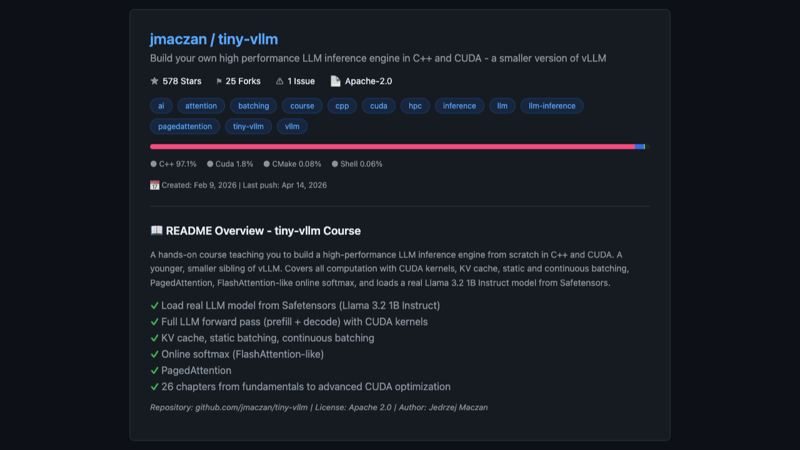
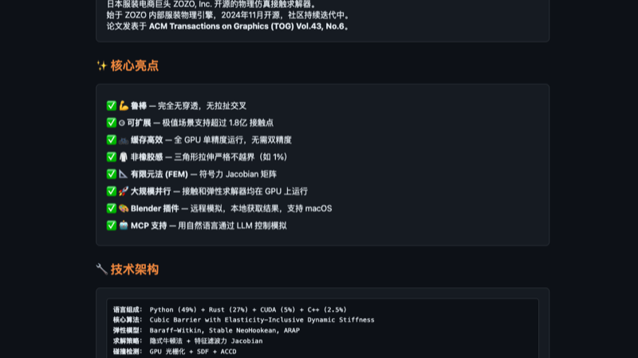
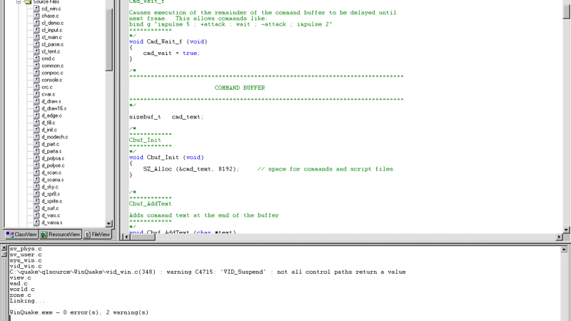
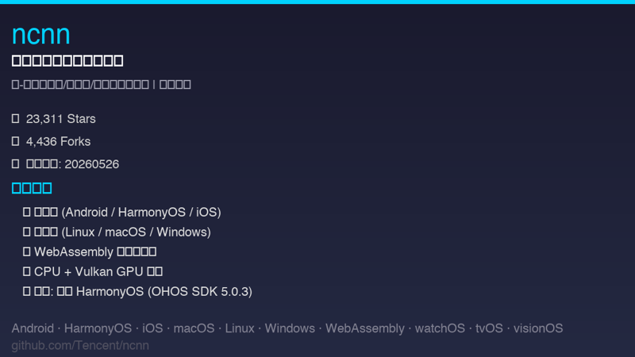
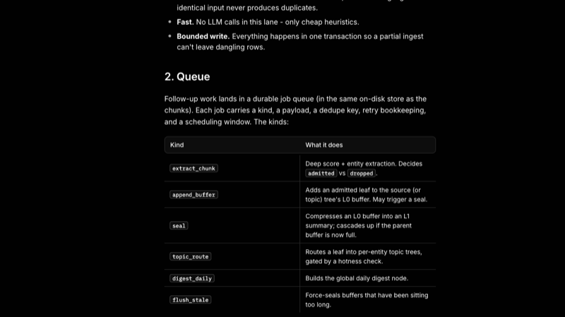
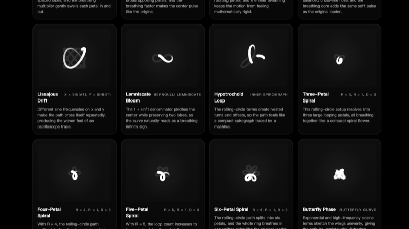
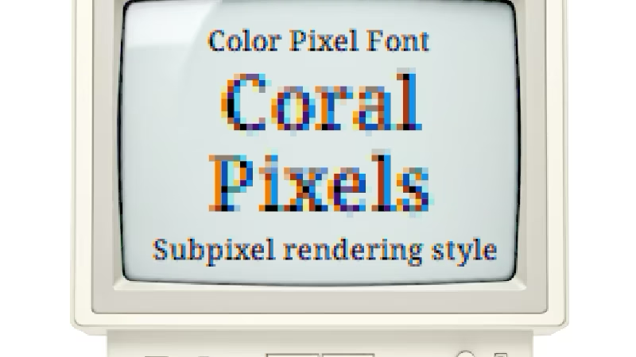

# 机器文摘 第 172 期

### 从零开始，手写一个 LLM 推理引擎

[tiny-vllm](https://github.com/jmaczan/tiny-vllm)（⭐578），一个用 C++ 和 CUDA 从零开始构建高性能 LLM 推理引擎的教学项目。核心卖点不是"又快又省"，而是"带你亲手实现它"。

项目的起点非常朴素——从解析 Safetensors 文件格式和浮点数原理开始，逐步深入到 RMSNorm 并行归约、RoPE 位置编码、SiLU 激活函数等 CUDA kernel 的手写实现。作者 Jędrzej Maczan 把整个课程拆成了 26 个章节，涵盖 Prefill、Decode、KV Cache、Static Batching、Continuous Batching、PagedAttention 和 Online Softmax（FlashAttention 风格）。代码组成 97.1% C++、1.8% CUDA，单依赖（nlohmann/json），干净得像教学示范。

从工程角度来看，这个项目最有价值的地方不是它能跑多快（虽然确实跑了 Llama 3.2 1B Instruct），而是它把 vLLM 这类生产级推理引擎的内部机制从"黑盒"变成了"可理解的系统"。作者在内存管理和 GPU 编程技巧方面的讲解风格干脆利落——比如那个 column-major 到 row-major 的转置技巧已经在 Paged Out! 杂志上发表过。

局限性也很明显：578 星说明它还没被广泛关注，项目偏向教学而非生产部署，没有 Python API 包装，没有模型分发机制。但对于想理解 LLM 推理引擎内部机制、或者想提升 CUDA/HPC 编程能力的开发者来说，这是一份难得的"从零到一"路线图。

### 把设计大厂的审美 DNA 喂给 AI Agent

[garden-skills](https://github.com/ConardLi/garden-skills)（⭐6,736），ConardLi 开源的一套 AI Agent Skills 集合，核心组件是一个包含 **25 种品牌级设计风格**的 `web-design-engineer` skill。

用 AI 生成网页最大的痛点是什么？千篇一律的蓝紫渐变、Inter 字体、圆角卡片——一眼就能看出是 AI 做的。garden-skills 解决这个问题的方式不是让你选模板，而是把 Pentagram、Linear、Aesop、彭博终端等顶级设计语言的视觉 DNA 编码成 Agent 可消费的结构化配方文件。

每种配方是一份约 50 行的 Markdown 文件，包含完整的色板（使用 oklch 色彩空间——感知均匀，不同色相同亮度下视觉亮度一致）、字体体系（Inter Tight + Geist Mono 而非系统默认）、间距规约（4/8/12/16/24/40/64/96 体系）和"签名动作"。更关键的是每份配方都有"禁忌清单"——Aesop 风格下你绝不会看到紫粉渐变，Linear 风格下不会有假 Logo 墙。

从技术上看，这个项目本质上是"设计知识的工程化编码实验"。它遵循 SKILL.md 规范，兼容 Claude Code、Cursor 等主流 Agent 框架，采用渐进加载机制避免一次性读取全部 25 个配方。25 种风格按 7 大学派组织：编辑/极简（Apple HIG、Aesop、MUJI）、信息架构（Pentagram、彭博终端、Edward Tufte）、现代工具（Linear、Vercel、Raycast）、动效实验（Field.io、Active Theory）、粗野原始（Are.na、Balenciaga）、温暖人文（Mailchimp、Stripe Press、Headspace）、特殊风格（Y2K 复古未来主义、中古世纪现代主义）。

不足在于这些配方是通用的"设计语气"而非定制化品牌指南——如果你的产品有自己的设计系统，直接套用 Linear 风格反而会失去品牌辨识度。

### 服装电商倒逼出的工业级物理引擎

[ppf-contact-solver](https://github.com/st-tech/ppf-contact-solver)（⭐3,838），日本服装电商巨头 ZOZO（没错，就是那个卖衣服的 ZOZO）开源的高性能物理仿真接触求解器，论文发表于 ACM TOG（SIGGRAPH Asia 2024）。

核心任务非常具体：解决布料、绳索、软体在仿真中碰撞穿透的问题。ZOZO 需要高保真的服装试穿仿真来支撑电商业务，而物理仿真中接触面的穿透是长期困扰行业的痼疾——布料太薄，传统算法一不留神就穿模。

技术上有两个独创设计值得关注。一是**三次方势垒函数**——接触刚度从零开始随间隙缩小逐渐增大，不像传统二次方势垒那样"立即满刚"，避免了数值伪影。二是**特征滤波力 Jacobian**——利用奇异值分解和闭式特征分解直接计算投影后的力导数，避免了 9×9 稠密矩阵的数值分解开销。全 GPU 单精度流水线，单场景可处理超过 1.8 亿个接触点，三角形拉伸严格不越界（1% 上限）。

项目提供了完整的 Blender 5.0+ 插件、Python API 和 MCP（LLM 接口），支持 Docker 和原生部署。Apache 2.0 许可对商业友好。一个服装公司为了解决自己的问题，做出了一篇 SIGGRAPH 论文级别的工业级物理引擎，这种"有真实需求驱动"的开源项目往往比学术界的玩具代码扎实得多。

### 在 2026 年，重现 1997 年编译 Quake

[Let's compile Quake like it's 1997!](https://fabiensanglard.net/compile_like_1997/) 是一篇 Fabien Sanglard 写的有趣技术考古文章。他尝试在 2026 年重现 1997 年编译 Quake 的完整流程。

过程曲折得令人发笑：装 Windows NT 4.0 → 装 Visual C++ 6.0 → 获取 q1source.zip → 首次编译失败（缺 MASM 汇编器 ml.exe）→ 装 Service Pack 5 → 装 MDAC 数据访问组件 → 装 Processor Pack → 终于编译成功。每一步都踩在时代的技术轨迹上：VC++6 还在用 .dsw/.dsp 项目格式（不是 .sln），Michael Abrash 的手写汇编优化需要 MASM 汇编器，NT4 双 CPU 需要重装更换 HAL 文件。

最有意思的地方在于，作者指出原始 Quake（quake.exe/vquake.exe）其实是用 NeXT + DJGPP 交叉编译的，WinQuake/GLQuake/QuakeWorld 才是用 Windows NT + VC++ 编译的。当时 Intel 的编译器（ICC）在 Quake 的优化上比微软的 VC++ 快不少，但微软的 Processor Pack 拉近了差距——历史总是比想象中复杂。

这篇文章并非教你在现代编译 Quake（那太简单了），而是让读者实实在在感受 1997 年一个游戏开发者的工作环境。没有 Stack Overflow，没有 GitHub Issues，调试全靠 printf 和直觉——那种"赤裸裸的工程感"在今天的开发体验中已经几乎消失了。

### 腾讯 ncnn 正式支持 HarmonyOS

[ncnn](https://github.com/Tencent/ncnn)（⭐23,311）是腾讯开源的移动端高性能神经网络推理框架，2026 年 5 月发布的版本（20260526）首次正式支持 HarmonyOS（鸿蒙系统）。

支持细节很具体：提供 CPU 和 Vulkan GPU 两种后端，静态库和动态库两种形态，覆盖 armeabi-v7a、arm64-v8a、x86_64 三种架构，基于 OHOS SDK 5.0.3 交叉编译。构建方式与 Android NDK 类似，通过 `ohos.toolchain.cmake` 完成。

新版本同时新增了不少底层优化：Vulkan 后端的 FlashAttention 和 RotaryEmbed 算子、ARM 后端的 SDPA 实现和 BF16 优化 GEMM、x86 后端的 AVX512BF16 路径，以及 benchncnn_llm 大模型评测工具。从一个侧面反映出端侧推理正在向大模型靠拢——手机上跑 LLM 已经不是概念，是真需求。

### 开源的「个人 AI 超级智能」

[OpenHuman](https://github.com/tinyhumansai/openhuman)（⭐29,776），TinyHumans AI 基于 Rust + Tauri 构建的开源个人 AI 系统。核心创新在于**记忆树（Memory Tree）**——接入 Gmail、Notion、GitHub、Slack 等 118+ 工具后，每 20 分钟自动拉取新数据，经过标准化、分块、评分后构建为来源/主题/全局三级摘要树，全部存于本地 SQLite 和 Obsidian 兼容的 Markdown 仓库中。

它还附带一个**桌面吉祥物**——会唇形同步说话的动画角色，能作为真实参与者加入 Google Meet，具备 idle/thinking/listening/talking/surprised/dreaming 等多情绪状态，以及"子意识循环"（不使用时也在后台思考和执行任务）。

29k 星说明这个方向确实戳中了大量开发者的需求——大家想要的不只是一个 Chatbot，而是一个真正能记住自己上下文的 AI 助手。不过 GPL-3.0 许可限制了商业集成，且 118 个数据源的接入配置本身就是一个不小的工程。

### 开源语音模型家族大集合

[MOSS-TTS Family](https://github.com/OpenMOSS/MOSS-TTS)（⭐2,633），MOSI.AI 与 OpenMOSS 团队推出的开源语音与声音生成模型家族，包含五个独立可用的模型：旗舰 TTS（8B 参数，支持零样本语音克隆和 31 种语言）、口语对话生成（多说话人超长对话，在客观指标上超越豆包和 Gemini）、文本到音色设计（无需参考音频即可生成音色）、流式实时语音代理（TTFB 仅 180ms）和音效生成（48kHz，最长 30 秒）。

底层基于自研的 MOSS-Audio-Tokenizer（1.6B 参数，300 万小时训练数据），将 24kHz 音频压缩至 12.5fps，32 层 RVQ 支持 0.125~4kbps 变比特率。支持 PyTorch、llama.cpp、SGLang 和 mlx-audio 四种后端部署，提供在线 API 和完整的微调教程。

在 Seed-TTS-eval 基准上，中文 SIM 达到 79.62%（开源最优），英文 WER 低至 1.84%。最难得的是这个家族架构非常清晰——不试图用一个模型解决所有语音任务，而是拆解为 5 个专化模型，每个解决一个具体问题。中文社区对语音模型的需求一直很大，MOSS-TTS 的发布填补了高质量开源中文 TTS 的空白。

### 21 种加载动画，21 条数学曲线

[Math Curve Loaders](https://github.com/Paidax01/math-curve-loaders)（⭐一个低调的收藏级项目），一个基于数学曲线的加载动画集，收录了 21 种纯前端实现的粒子轨迹动画。涵盖玫瑰线、利萨茹曲线、内旋轮线（万花尺）、伯努利双纽线、心形线、蝴蝶曲线、阿基米德螺线和傅里叶波形。

每种动画带有实时预览、数学公式说明和可拷贝的代码片段，支持参数实时调节（缩放、频率、呼吸量）。零外部依赖，纯 HTML/CSS/JavaScript，中英双语界面。

这类项目的价值不在于代码量——每张卡片就那么几行——而在于它以一种"可交互"的方式展示了数学曲线的视觉之美。如果你的应用需要一个与众不同的 loading 动画，这里就有 21 个随手可用的选项。

### 像素字体的文艺复兴

《[A few interesting modern pixel fonts](https://unsung.aresluna.org/a-few-interesting-modern-pixel-fonts/)》是 Marcin Wichary 的一篇文章，在 Hacker News 上获得了 415 分。介绍了四个风格各异的现代像素字体项目：

**Analog Mono** 修复了 90 年代 VCR 和影碟机上经典像素字体基线过低、导致下行字母（g、j、y 等）上提的设计缺陷——这不是一个新字体，而是对一个"设计错误"的修正。

**Coral Pixels** 将当年 CRT 显示器亚像素渲染产生的彩色边缘伪影内化为字体的视觉特征，现已登陆 Google Fonts。这种"把 bug 变 feature"的思路在字体设计中并不常见。

**Two Slice** 仅有 2 像素高，挑战了字体可读性的极限——坦白说，它"勉强可读"，但在 2 像素的空间里塞进一个可识别的字母，这件事本身就很工程。

Vercel 出品的 **Geist Pixel** 则是矢量像素字，强调生产级排版品质——字距、度量、垂直对齐等"看不见的功夫"才是像素字体真正成熟的关键。它伪装成像素字，但底层是矢量，放大不模糊。

## 订阅
这里会不定期分享我看到的有趣的内容（不一定是最新的，但是有意思），因为大部分都与机器有关，所以先叫它"机器文摘"吧。

Github仓库地址：https://github.com/sbabybird/MachineDigest

喜欢的朋友可以订阅关注：

- 通过微信公众号"从容地狂奔"订阅。

