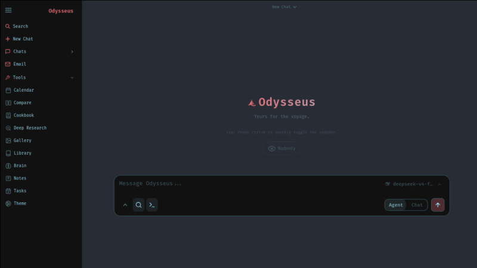
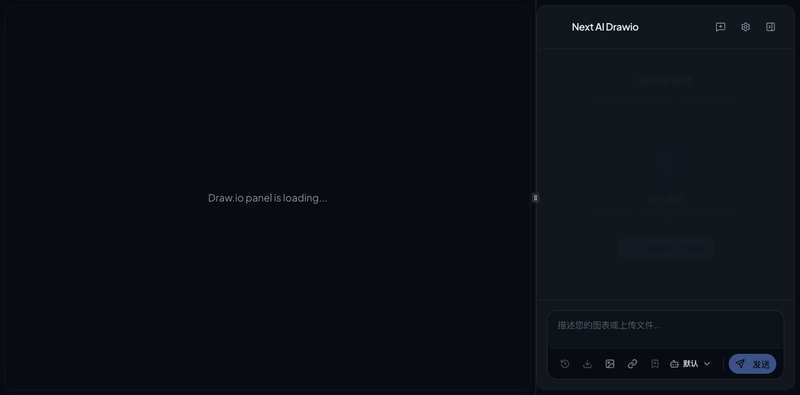
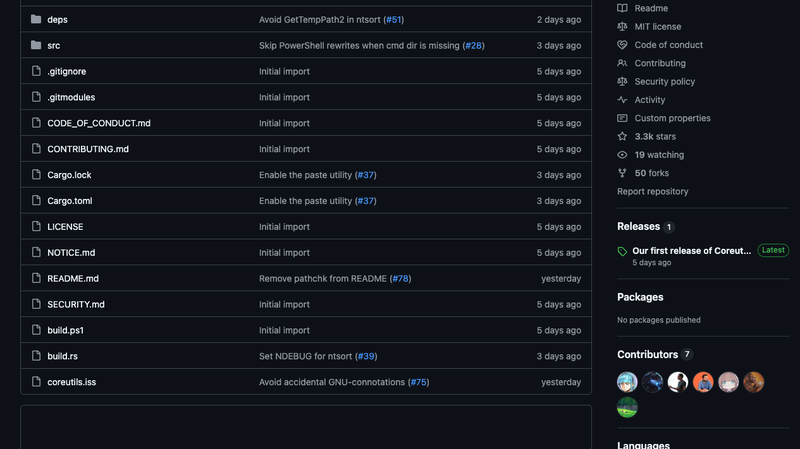
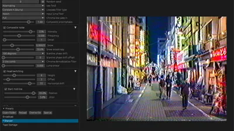
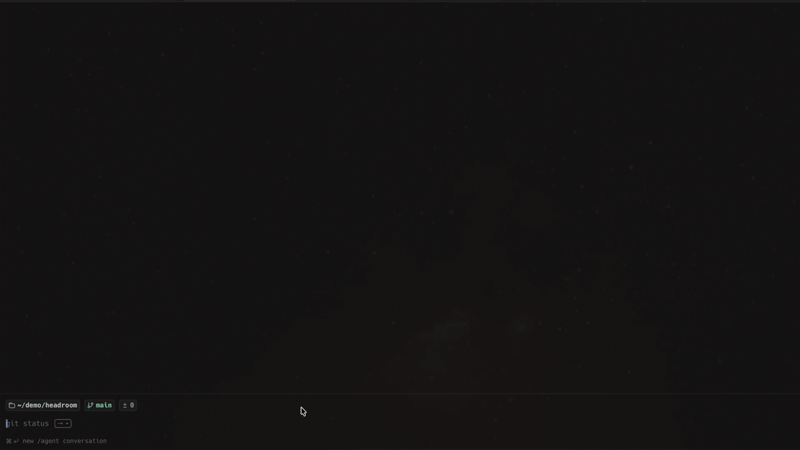
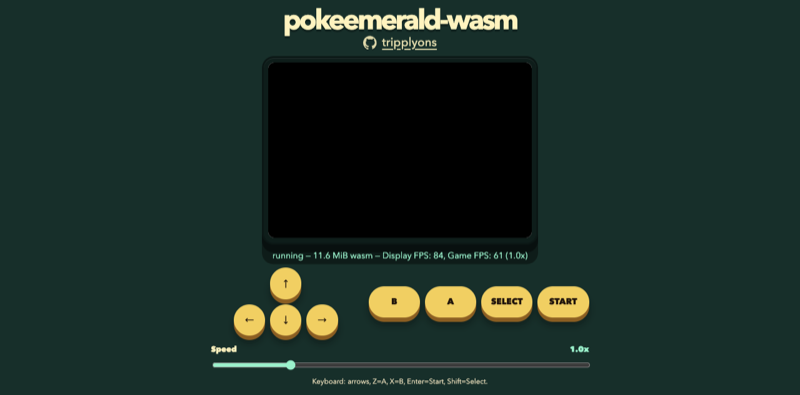
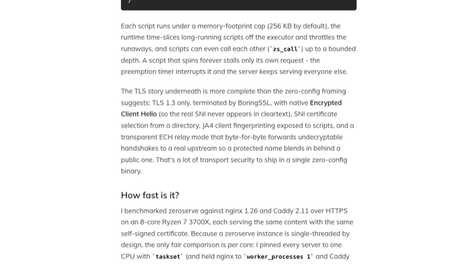
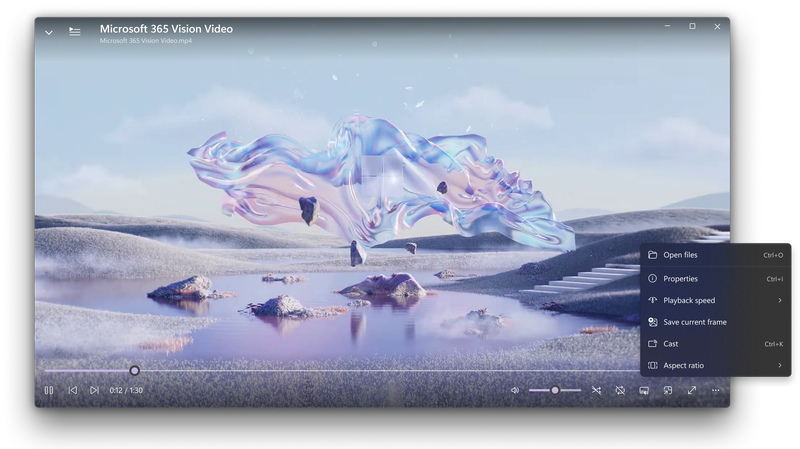
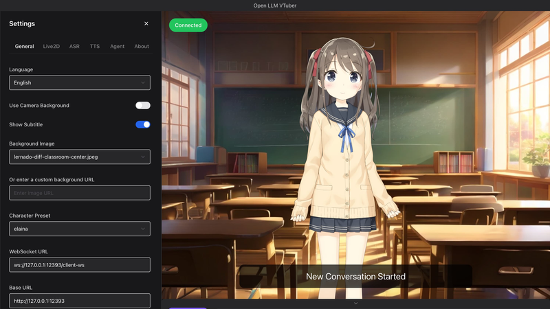

# 机器文摘 第 173 期
### 自托管的 AI 工作空间

[Odysseus](https://github.com/pewdiepie-archdaemon/odysseus)，一个完全自托管的 AI 工作空间，上线一周狂揽 5.9 万星。它把聊天、Agent、深度研究、邮件、日历、笔记全部打包进一个可自部署的服务里。

它不像 ChatGPT 或 Claude 那样只提供聊天窗口。Odysseus 更像一个"本地 AI 操作系统"——有 Agent（基于 opencode，支持 MCP 协议和文件/Shell/记忆工具）、有 Cookbook（自动扫描你的硬件，推荐合适的本地模型并一键下载启动）、有深度研究能力（多步骤自动研究，生成可视化报告）、甚至还内置了邮箱和日历。前端的实现方式也挺有意思——纯手写 vanilla JS，没有框架没有构建工具，一个 index.html 加 app.js 就是全部前端。

不过功能多也意味着复杂度高。Agent 模式下本地小模型（4k/8k context）负担很重——工具 schema、技能、记忆、文档一起挤在有限的上下文里。Cookbook 在多机器/多 GPU 环境下的可靠性也参差不齐。开源社区近万的 Star 说明大家对"自托管 AI 工作空间"的需求真实存在，但离一个没动手经验也能用顺手的成熟产品还有距离。

### 用自然语言画架构图

[next-ai-draw-io](https://github.com/DayuanJiang/next-ai-draw-io)，一个基于 Next.js 的开源项目，你用自然语言描述，它就能生成 draw.io 架构图、流程图、思维导图。GitHub 上已经有 3.1 万星。

它的实现思路是：通过 Vercel AI SDK 调用 LLM，AI 生成 draw.io 格式的 XML，渲染到嵌入的 draw.io iframe 中。最有意思的是它的 VLM（视觉语言模型）验证循环——AI 生成 XML 后，系统会对渲染结果截图，用另一个视觉模型验证布局是否合理、元素有没有重叠，如不合格则重试。这解决了纯文本生成可视化内容时最常见的"语法对了但看起来一团糟"的问题。

工程上也有一些认真的考量：SSRF 防护（对私有 IP 段的严格阻止）、完整的 undo/redo 历史（IndexedDB 本地快照）、MCP 服务器支持（让 Claude Desktop 等客户端能直接调用它的图表生成能力）。从工程角度来看，这是一个把 AI 集成进既有工具（draw.io）的优雅范例——不是造新轮子，而是给已有工具装上了自然语言接口。

### Windows 上的 Unix 原味命令

[microsoft/coreutils](https://github.com/microsoft/coreutils)，微软官方维护的 Windows 版 Unix coreutils。不是通过 WSL 模拟，而是原生的 Windows 二进制，通过 WinGet 一键安装就能在 cmd 或 PowerShell 里用 `cat`、`ls`、`find`、`grep` 等几十个 Unix 命令。

它的实现基于 uutils/coreutils——用 Rust 而非 C 重写的 coreutils。微软将其 fork 并通过 git submodule 引入，做了 Windows 原生的适配。最有技术亮点的是 `find` 命令设计了一个"双语启发式调度"：如果参数看起来像 DOS 语法（`/C`、`/I`），自动路由到 DOS 兼容版；如果像 GNU 语法（`-name`、`-type`），路由到 GNU 版。同一个 `find` 命令，两边的人都觉得是自己的。

目前还在 preview 阶段，仅 16 次提交。不支持 `chmod`、`chown` 等 POSIX 概念，也不支持信号相关命令。但如果你在纯 Windows 环境工作又习惯了 Unix 命令行，这个工具可以让你的日常工作干净不少——至少不用为了一个 `cat` 去装整个 WSL。

### 信号级的电视雪花模拟

[Ntsc-rs](https://ntsc.rs/)，一个用 Rust 写的高精度 NTSC/VHS 伪影模拟器。它不是简单地在画面上叠加噪点，而是从底层物理信号出发，模拟 NTSC 编码、调制、解调、传输损耗和磁带机械特性的完整信号链。

大多数视频滤镜（比如 Red Giant Universe VHS）用 LUT 和简单叠加来"看起来像"VHS。ntsc-rs 走的是完全不同的路线——它把 RGB 转成 YIQ 色彩空间，用 IIR 数字滤波器模拟色度带宽限制，用 Simplex 噪声的分形布朗运动生成复合信号噪声，甚至模拟了 VHS 磁头切换时的水平偏移和磁带速度对亮度/色度截止频率的影响。

性能上也很认真：核心算法用 Rust 实现并对 SIMD 做了针对性优化（4/6/8 行并行），使用 `rayon` 进行画面行的并行处理。它提供了 Adobe After Effects 插件、OpenFX 插件（DaVinci Resolve/Vegas）以及独立的桌面应用。如果你是做影视后期或复古效果，这个工具比常见的 VHS 滤镜认真得多。

### 给 LLM 的上下文做胃缩小手术

[Headroom](https://github.com/chopratejas/headroom)，一个本地运行的上下文压缩层，能把发送给 LLM 的工具输出、日志、RAG 数据等压缩 60-95% 的 token，同时保持回答质量。本周 GitHub 趋势榜第一（1.5 万星）。

它有六种不同的压缩算法应对不同场景：SmartCrusher 用 Kneedle 算法 + SimHash 去重处理 JSON 数组、LogCompressor 识别结构化日志做去重和异常优先保留、SearchCompressor 对 grep 结果做自适应采样。最精妙的设计是 CCR（可逆压缩）——压缩后的原始数据用 SHA256 哈希存储在本地，LLM 可通过 `headroom_retrieve` 工具按需还原。这就让压缩变得"无损"——需要的时候可以随时找回被压缩掉的内容。

但它也有一个很有意思的保守设计：CodeCompressor 虽然实现了，但默认几乎不触发。如果提示词包含 "analyze/review/fix/debug" 等关键词，所有代码都不压缩。设计者的理由是"代码几乎总是用户想处理的内容，压缩函数体会消除用户需要的部分"——这是比技术实现更重要的 UX 判断。

### 100k FPS 的宝可梦绿宝石

[Pokemon Emerald Ported to WebAssembly](https://pokeemerald.com/)（268 分 HN）。这个项目把 GBA 的《宝可梦绿宝石》从 C 源码（基于 pret/pokeemerald 反编译项目）重新编译成 WebAssembly，让游戏在浏览器中原生运行——不需要模拟器。

100k FPS 的秘诀在于：它不是运行 GBA 模拟器（模拟器需要逐条解码指令），而是把游戏源码直接编译成 Wasm。游戏循环直接操作 Wasm 线性内存，一个帧步进只需微秒级。JavaScript 端实现了一个完整的软件渲染器，直接读取 Wasm 内存中的 VRAM/调色板/OAM 寄存器，用 Canvas 2D 绘制画面。在 "unlimited" 模式下，一个 requestAnimationFrame 周期内尽可能多地运行帧处理，单帧耗时 <0.01ms，一秒钟就能跑 10 万帧。

当然，这是有代价的——为了达到这个帧率，移除了音频处理，渲染器也不是 100% GBA 硬件精确。但它展示了一个很有趣的工程思路：有时候"直接编译到目标平台"比"通过模拟器运行"更高效。

### 零配置 + eBPF 脚本的 Web 服务器

[Zeroserve](https://su3.io/posts/introducing-zeroserve)（HN 182 分），一个用 Rust 写的、基于 io_uring 的高性能 Web 服务器。它的理念很激进：没有配置文件——你把 eBPF 程序作为"配置文件"放进网站 tarball，每个请求上这些程序会以用户态沙箱的方式运行，实现路由、鉴权、限流、反向代理等一切逻辑。

作者认为传统服务器（nginx/Caddy）的问题在于行为分散在两个层：声明式指令 + 脚本运行时。Zeroserve 只有一层——程序即配置。eBPF 程序按文件名排序链式执行，共享每个请求的元数据 map。提供的辅助函数包括 SHA-256、HMAC、JSON 解析、token bucket 限流、AWS SigV4 签名，甚至完整的 OIDC Authorization Code + PKCE 流程——纯静态网站也能做"用 Google 登录"。

基准测试显示它在小文件静态服务上领先 nginx 约 17%，在 eBPF 脚本中间件场景领先 nginx Lua 约 50%，但在大响应反向代理场景落后 nginx 约 38%。项目由实习生级别的开发者 Heyang Zhou 一人完成（38 次 commit），处于早期阶段，且依赖 Linux 特有的 io_uring 和 eBPF，macOS/Windows 无法直接运行。

### 穿上 Fluent Design 外套的 VLC

[Screenbox](https://github.com/huynhsontung/Screenbox)，一个基于 LibVLC 引擎、用 UWP 构建的开源媒体播放器。它的核心卖点是颜值——Fluent Design 全面应用，丙烯酸材质、Mica 背景、流畅动画，和 Windows 10/11 的原生设计语言无缝融合。

它继承了 VLC 的全面格式支持（MKV、MP4、FLAC、HDR10、杜比视界），启动速度和资源占用比 VLC 还轻快。UWP 原生特性带来了手势操作、画中画模式、系统媒体控件集成（SMTC）、一键截图保存视频帧等现代交互。快捷键也做了符合现代习惯的调整——数字 1-4 快速切换窗口尺寸，类似 YouTube。

局限也很明显：UWP 框架意味着它只能在 Windows 10/11 和 Xbox 上运行。微软正逐步向 WinUI 3 / Windows App SDK 迁移，UWP 处于维护模式。如果追求跨平台，VLC 原生客户端或者 IINA（macOS）才是合理选择。但在 Windows 上，如果你想找一个既漂亮又继承了 VLC 解码能力，还支持触控的播放器，Screenbox 是目前最好的选择。

### 和 AI 做语音交互的桌面伴侣

[Open-LLM-VTuber](https://github.com/Open-LLM-VTuber/Open-LLM-VTuber)，一个开源的语音交互 AI 桌面伴侣。它把 ASR 语音识别、LLM 对话、TTS 语音合成、Live2D 虚拟形象串联成一条完整的交互链路，且支持完全离线本地运行。

技术架构是模块化设计的典范：ASR（支持 sherpa-onnx、Faster-Whisper、FunASR 等多种引擎）、LLM（支持 Ollama、OpenAI、Anthropic、Gemini、DeepSeek 以及各种本地 HuggingFace 模型）、TTS（支持 sherpa-onnx、Edge TTS、MeloTTS、GPTSoVITS、CosyVoice 等），每个环节都可以独立替换。语音打断功能也很实用——系统通过判断是用户正在讲话还是 AI 自己在发声，不需要耳机也能避免 AI 听到自己的声音。此外还提供了触控反馈、桌面宠物模式（透明背景置顶）、视觉感知（摄像头/屏幕截图）等增强体验。

值得注意的是项目正处于 v1→v2 重写的关键阶段，长期记忆功能在 v2.0 重构中，v1 不再新增功能。Live2D 的示例模型有商业使用限制，开发者需要注意。整体来说，这是一个帮你把 LLM 从"终端里的对话"变成"桌面上会说话的小伙伴"的开源解决方案。

## 订阅
这里会不定期分享我看到的有趣的内容（不一定是最新的，但是有意思），因为大部分都与机器有关，所以先叫它"机器文摘"吧。

Github 仓库地址：https://github.com/sbabybird/MachineDigest

喜欢的朋友可以订阅关注：

- 通过微信公众号"从容地狂奔"订阅。

