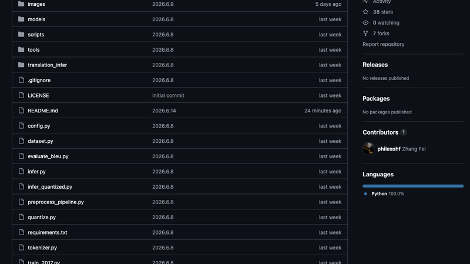
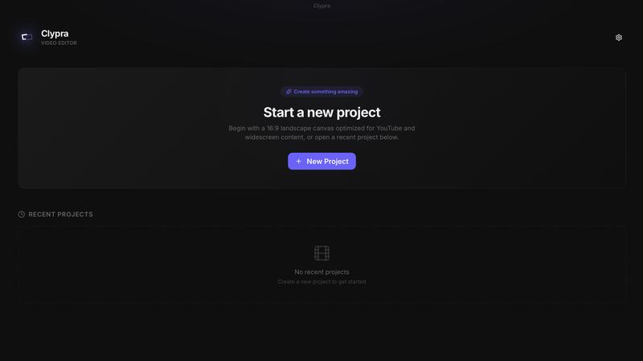
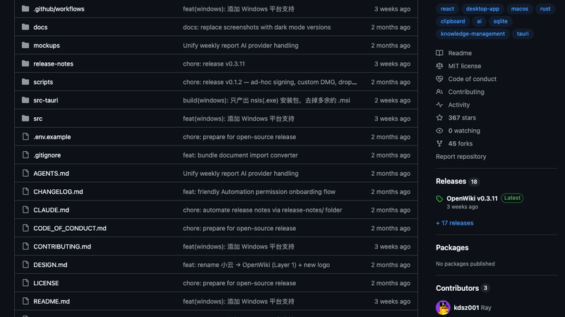
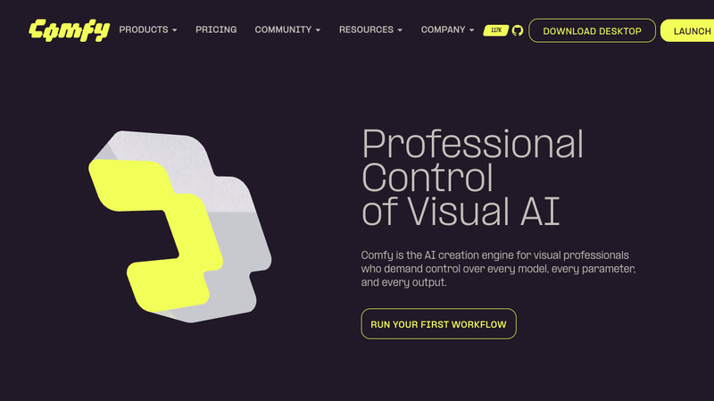
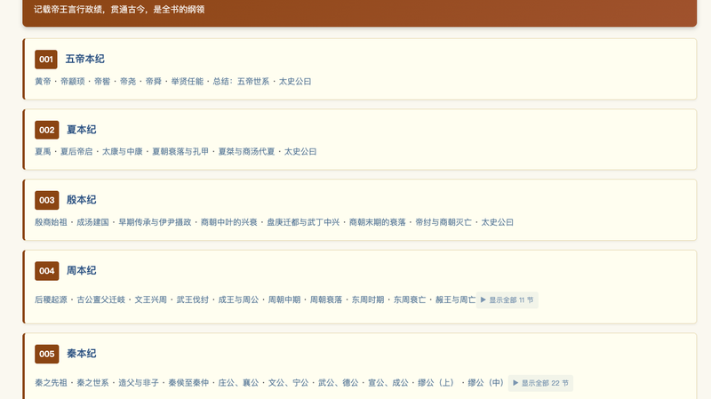
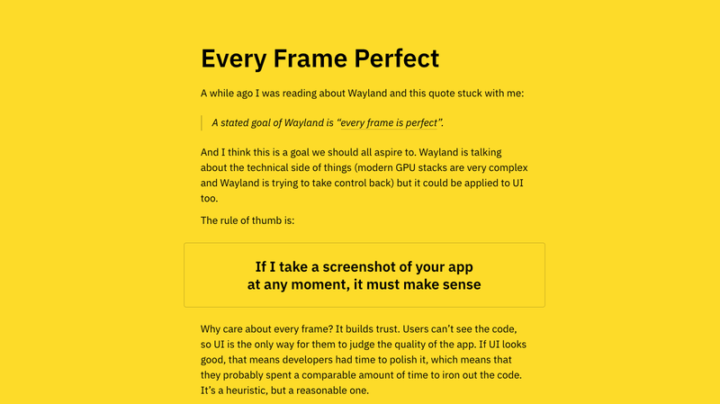
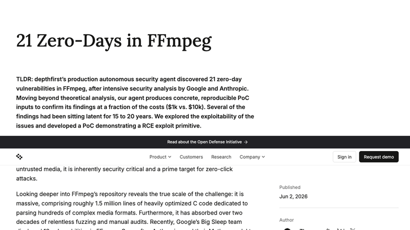
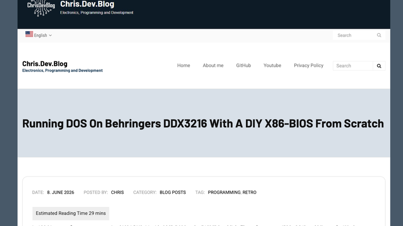
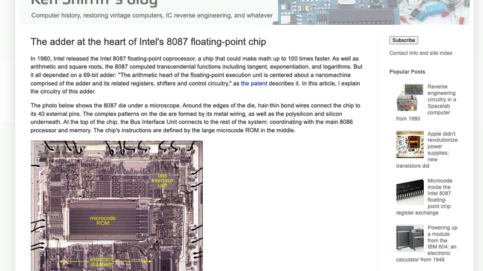
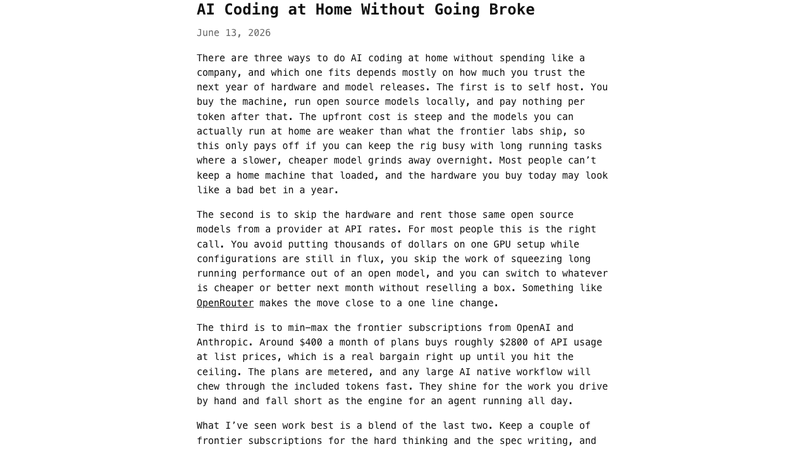

# 机器文摘 第 174 期
### 从零手写 Transformer

[transformer-zh-en](https://github.com/philexohf/transformer-zh-en)（⭐38），一个纯手写 Transformer 论文《Attention Is All You Need》、实现中英机器翻译的教学项目。不依赖 nn.Transformer 库，从零实现多头注意力、位置编码、掩码机制等全部组件。

在 4070 Ti 上训练 11 个 epoch，100 万句对，BLEU 达到 36.87。代码结构清晰：模型 4 层（d_model=384）、统一 BPE 分词器（SentencePiece 32K，中英共享词表）、完整的量化/推理/部署工具链。编译后的 FP16 模型仅 102MB，可直接分发。

从工程实现来看，项目最有意思的设计是双训练脚本方案——一份是优化过的现代版（AMP 混合精度 + Cosine Warmup + AdamW），另一份保留了论文原版训练逻辑作为参考对照。这种"新旧对比"的设计比单纯的教学代码更有价值：读者可以直观看到 2017 年原版训练方法和 2026 年工程优化之间的差异。

局限也明显：仅 53.5M 参数和 128 token 长度限制了翻译质量的天花板，Post-LN 架构在深层网络时不如 Pre-LN 稳定，且数据仅来自单一 WMT 来源。不过作为学习《Attention Is All You Need》的配套实操项目，它比市面上大多数论文复现更完整、更易上手。

### 免费本地化的剪映替代

[Clypra](https://github.com/AIEraDev/Clypra)（⭐1,941），一个仅 7 周就快速攀升的开源视频编辑器。用 Tauri + React + TypeScript 打造，核心目标是让 CapCut/剪映 Pro 的付费高级功能全部本地免费化。

技术栈上走了一条轻量路线：Tauri 2 的 Rust 壳让安装包只有 9-15MB（对比 Electron 方案的 80MB+），FFmpeg 作为 sidecar 提供编解码能力，Zustand 管理多轨时间线状态。支持帧级修整、音频波形可视化（Peak + RMS + mirrored 显示）、胶片条预览和文字叠加（20+ 字体）。

站在对比的角度看，它和 LosslessCut（无损切割工具）、Olive（专业 NLE）、Shotcut 等开源视频编辑器定位不同——Clypra 明确瞄准的是"剪映 Pro 代餐"这个生态位，而不是和 DaVinci Resolve 竞争。MIT 许可证也比 GPL 更友好。

当前阶段基础剪辑功能已可用，但特效/转场/滤镜尚在路线图中，音频处理也相对基础（无混音、音量包络线）。461 个 commits 中的 451 个来自同一位开发者 AIEraDev，bus factor 较高。

### 复制即收藏，AI 帮你整理

[OpenWiki](https://github.com/kdsz001/OpenWiki)（⭐367），基于 Tauri 2 + React + Rust 的开源桌面知识管理工具。核心创新在于"先捕获后整理"的交互模式。

平时你复制内容（文本/图片/URL）时，桌面会自动弹出一个保存窗口，10 秒后自动消失。你只需要决定留不留，剩下的分类、整理、关联全交给 AI 后台处理。AI 会分两阶段编译知识库：先评估内容是否值得入库（只保留概念、方法论、技术原理等有长期价值的内容），再分析新内容与现有知识库的关联——是创建新 Wiki 页面还是更新已有页面。

技术实现上有几个值得注意的设计：Rust 后端的 AI 引擎（`ai/wiki_engine.rs`）用两阶段 Prompt 控制知识编译质量；SQLite 本地存储保证隐私优先；知识图谱通过 TF-IDF 余弦相似度自动构建页面间关联；支持 Claude、OpenAI、Gemini 和本地模型（Ollama、LM Studio）多种 AI 后端。

值得注意的是它提供了"注意力分析"功能——每周一键生成 7 维度洞察报告（信息饮食、遗忘墓地、盲区、行动建议等），用户点赞或忽略后 AI 逐渐学习偏好。如果你也是那种"收藏了一堆东西但从没整理过"的人，OpenWiki 的交互设计可能正好戳中了痛点。

### ComfyUI 开始走下极客神坛

ComfyUI 最近一口气发了三个更新，单独看每个都是功能增强，连在一起看就是一个清晰的战略转身。

首先是 **App Mode**。以前你用 ComfyUI，打开就是满屏节点和连线，跟看电路图似的。现在一键切换到 App Mode，节点图被隐藏，只暴露核心输入/输出界面——你选好模型、填好参数、点生成，就像用一个普通 App 一样。技术实现基于 Vue 3 + Pinia 状态机，输入输出选择通过 Builder 模式配置后持久化到工作流 JSON。

其次是 **ComfyHub**，一个建立在 registry.comfy.org 之上的节点/模型/工作流市场，把过去"git clone + 拖拽文件夹"的安装方式降级为一键操作。内置三种数据库模式（本地缓存 / 远程实时 / 频道缓存）适配不同网络环境。

最后是 **DeepSeek R1 推理模型集成**，通过 Partner Nodes（API 节点）系统让 ComfyUI 可以调用云端推理模型的能力。

从用户角度来看，这三个更新构成了一个完整的分层：零基础用户用 App Mode，中级用户用 ComfyHub 安装插件，高级用户操作底层节点图并用 R1 辅助推理。ComfyUI 不想只做极客玩具了。

### 让《史记》变成可交互的知识网络

[史记知识库](https://github.com/baojie/shiji-kb)（⭐2,100），一个把 57 万字《史记》变成可交互知识网络的深度知识工程。14,065 个实体、3,198 个事件、7,637 条关系全部结构化。

技术上最有意思的是其"四层语义递进模型"：结构语义（校勘、段号、句间关系）→ 图谱语义（实体标注、事件提取）→ 知识语义（本体构建、逻辑推理）→ 应用语义（矛盾检测、模式发现）。整条管线不是传统 NLP 程序，而是一套 SKILL 文档驱动的 AI Agent 管线——每步对应一份结构化自然语言文档（SKILL），AI Agent 读 SKILL → 执行 SKILL → 产出结果。这种"用文档代替代码"的方法论让管线可读性极高，学者可以直接阅读并验证每个处理步骤的合理性，而无需理解编程语言。

目前已发现的高价值矛盾包括：项羽东城斩首数在不同篇章相差 1000 倍、太子丹之死年代差 4 年、长平之战 40 万降卒的数字反常等。

产品端的亮点是"史记地铁图"——130 条历史线路 × 3,197 个事件站点，1,876 个跨章换乘站（同一事件出现在不同篇章），全部用纯前端 SVG 实现。22 类实体语法高亮（人名红色、地名绿色、官职蓝色……）让原文阅读体验大幅提升。

局限在于前端加载 130 章全文数据较慢，约 1.3% 的事件因记载模糊无法推断精确公元年，且标注规范仍在动态演进中。

### 一句话生成架构图

[next-ai-draw-io](https://github.com/DayuanJiang/next-ai-draw-io)（⭐31,894），一个把 LLM 和 draw.io 深度集成的项目。你只需要用自然语言描述需求，AI 就能生成完整的 draw.io 可编辑图表（架构图、流程图、思维导图），生成后还能在 draw.io 编辑器中继续手动/拖拽调整。

技术实现的核心机制在 `/api/chat` 端点中。System Prompt 约 1900 tokens，包含完整的 draw.io XML 结构规范、7 条边路由防重叠规则、4 种工具定义（`display_diagram` / `edit_diagram` / `append_diagram` / `get_shape_library`）。AI 通过工具调用生成 mxCell XML，实时流式渲染到画布上。还有一个 VLM（视觉语言模型）验证环节，对渲染后的图表截图做质量检测。

有意思的设计是增量编辑：AI 可以通过 `edit_diagram` 工具做小范围修改（搜索-替换模式），只改目标元素而不重新生成整幅图。同时每次编辑前自动保存快照，可以随时回滚。

项目支持 14+ 模型提供商（OpenAI、Claude、Gemini、DeepSeek、Ollama 等），并提供 MCP 服务器，可以集成到 Claude Desktop、Cursor、VS Code 等 AI 编码工具中。

不过 Web 版的 PDF 导出受限（iframe 中无法正常工作），非视觉模型无法处理图片上传，且 AI 生成的 XML 受输出长度限制（约 8K tokens），复杂图标需要多次 `append_diagram`。

### 每一帧都完美

Nikita Prokopov（tonsky.me）写了一篇关于 UI 动画品质的短文 [Every Frame Perfect](https://tonsky.me/blog/every-frame-perfect/)，在 HN 上获得 481 分。核心观点借用了 Wayland 显示协议的核心理念：无论何时截图你的应用，画面都必须合理、完美。

文章列举了几个典型案例：Safari 表单项的占位文本从中间动画但光标从左位置开始——两个组件不同步，破坏了信任感；Apple Photos 的裁剪模式切换中图片瞬间到位但裁剪边框动画过渡，造成"好像有什么变了"的错觉；YouTube 矩形移动动画的表现则让作者感叹"技术超越了程序员的掌控"。

虽然篇幅不长，但 Nikita 点出了一个容易被忽视的问题：很多人只关注起始状态和结束状态好不好看，却不在乎中间过渡过程是否合理。而用户真正感受到的，恰恰是这些中间帧。

### 21 个 FFmpeg 零日漏洞

[depthfirst](https://depthfirst.com/research/21-zero-days-in-ffmpeg) 安全团队用 AI Agent 在 FFmpeg 中发现了 21 个零日漏洞。他们构建了一个安全专用 Agent，和通用编码 Agent 不同——先做威胁建模（理解架构、识别暴露的解析器入口），再并行分支测试多种假设，跟踪执行路径验证输入是否到达易受攻击的 sink 点。

9 个已分配 CVE，12 个内部跟踪。漏洞类型以 Heap Buffer Overflow 居多（12 个），其次是 Stack Overflow、Integer Overflow 等。最老的漏洞可追溯到 2003 年和 2005 年的代码，分别潜伏了 23 年和 20 年。最危险的是 RTP AV1 Depacketizer 漏洞（DFVULN-127），仅需 183 字节的攻击包即可实现远程代码执行，无需认证。

从安全实践角度看，这次研究的价值不在于发现了多少漏洞，而在于方法论上的突破：AI 安全 Agent 能以 $1k 的成本发现 Google Big Sleep（$？）和 Anthropic Mythos（$10k）遗漏的漏洞。对于 FFmpeg 这种有 150 万行 C 代码、经历了 20 多年不间断 fuzzing 的项目来说，这说明传统的基于覆盖率的 fuzzing 已经无法覆盖所有攻击面。

### 在调音台上跑 DOS

Chris（chrisdevblog.com）在 Behringer DDX3216 数字调音台里发现了一颗 AMD Elan SC300（386 SoC）处理器，于是产生了一个"不合理但合法"的想法——[从零写一个 BIOS，让它运行 DOS](https://chrisdevblog.com/2026/06/08/running-dos-on-behringers-ddx3216-using-a-diy-x86-bios/)。

挑战接踵而至：找不到现成的 BIOS 源码（联系了 PC Engines 和 Phoenix，资料都丢了），只能从 Reset Vector 开始手写；外置 UART 需要逆向硬件电路找出片选逻辑；LCD 不含字库 ROM，用 AI（Gemini）生成了 8×8 点阵 ASCII 字体；CF 卡默认 PCMCIA 模式，需要通过 Card Information Structure 切换到 TrueIDE Mode。

最终结果：MS-DOS 6.22 卡在 INT 0x15 中断调用上（原因未查明），但 FreeDOS v1.4 成功启动进入 Shell。总耗时约 3 周。

作者出生于 90 年代，第一台电脑是 486。32 年后，他在一台调音台的 386 上跑起 DOS——这不是有什么实际用途的项目，但极客的浪漫从来就不需要"用途"来证明。

### 40 年前的 FPU 加法器

Ken Shirriff（righto.com）又做了一次精彩的芯片逆向——这次是 [Intel 8087 浮点协处理器中的 69 位加法器](https://www.righto.com/2026/06/intel-8087-adder-reverse-engineered.html)。8087 于 1980 年发布，是 x86 浮点运算的始祖，其设计直接影响了 IEEE 754 浮点标准的制定。

Ken 逆向发现的核心设计是 69 位曼彻斯特进位链加法器（4-bit 分块 + 进位跳跃）。"曼彻斯特进位链"这个技术的命名源自 1959 年曼彻斯特大学 Atlas 计算机，本质是利用 Generate/Propagate/Delete 三信号的并行计算，让进位以电信号速度（而非逻辑门速度）传播。

有意思的工程细节是 NMOS 工艺约束下的设计取舍：预充电技术（进位线预充到 5V 代表无进位，NMOS 管拉低到地代表有进位）、进位跳跃（4 位一组，组内全 Propagate 时跳过整组）、以及 69 位而非 64 位的设计（3 个舍入位 + 1 个加倍位 + 1 个符号位）。

和 Pentium 时代才普及的 Kogge-Stone 加法器相比，8087 的曼彻斯特进位链在复杂度与性能之间取得了精妙的平衡——以最少的晶体管获得了足够快的速度。

### 花$2000不破产在家跑AI编码

两篇同日登上 HN 首页的文章探讨了同一个问题：[在家跑 AI 编码，怎么不破产？](https://stephen.bochinski.dev/blog/2026/06/13/ai-coding-at-home-without-going-broke/)

Stephen Bochinski 的文章是概念性的，提出三条路径（自托管硬件 / API 按需付费 / 订阅高端模型），推荐混合方案——用前沿模型做"硬思考"和写 spec，用 API 调用开源模型填代码。他估算 $1,000/月可以产出 20 人团队一个月的成果。

iMil 的实战帖则给出了具体配置：[RTX 5080 (16GB) + RTX 3090 (24GB) = 40GB 合显存](https://imil.net/blog/posts/2026/rtx-5080-+-rtx-3090-setup-80+-tok-s-on-qwen-3.6-27b-q8/)，搭配 Asus X570-Pro 主板（支持 PCIe 拆分为 2x8），Qwen 3.6 27B Q8_0 GGUF 模型实测 80-91 tok/s。关键优化是 MTP（Multi-Token Prediction）推测解码和 llama.cpp 的 tensor 级别多 GPU 分摊。

几个工程细节值得注意：NCCL 关闭后性能反而更好（两张不同代 GPU 无法启用 P2P 直连）；`-ts 2,3` 参数按 3090:5080 = 2:3 分配负载；KV 缓存 Q8 量化后统一管理。即使 40GB 合显存也远不够跑 Opus/Sonnet 级别的大型模型。

## 订阅
这里会不定期分享我看到的有趣的内容（不一定是最新的，但是有意思），因为大部分都与机器有关，所以先叫它"机器文摘"吧。

Github仓库地址：https://github.com/sbabybird/MachineDigest

喜欢的朋友可以订阅关注：

- 通过微信公众号"从容地狂奔"订阅。

