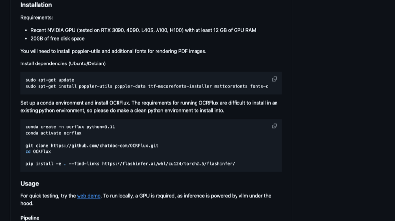
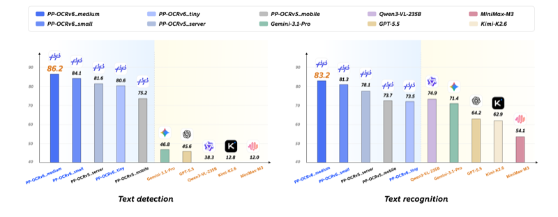
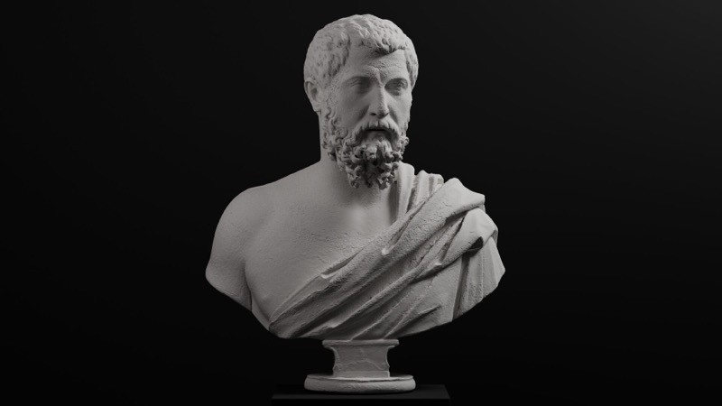
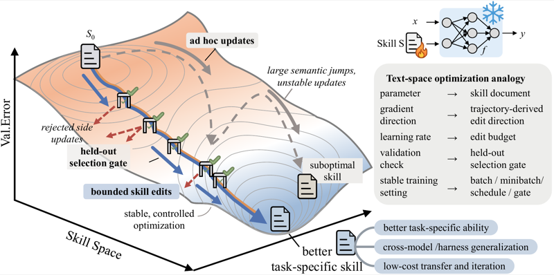
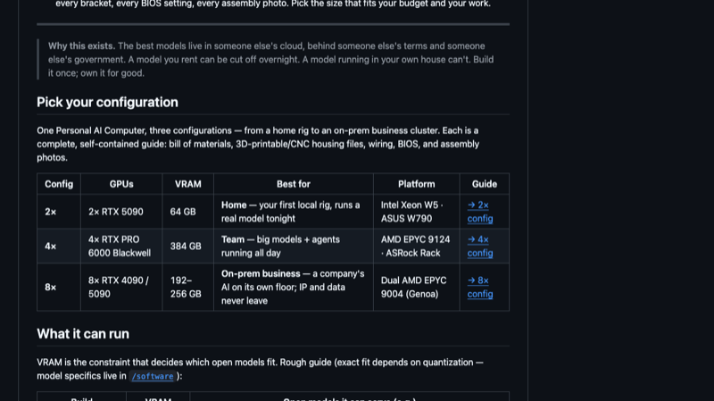
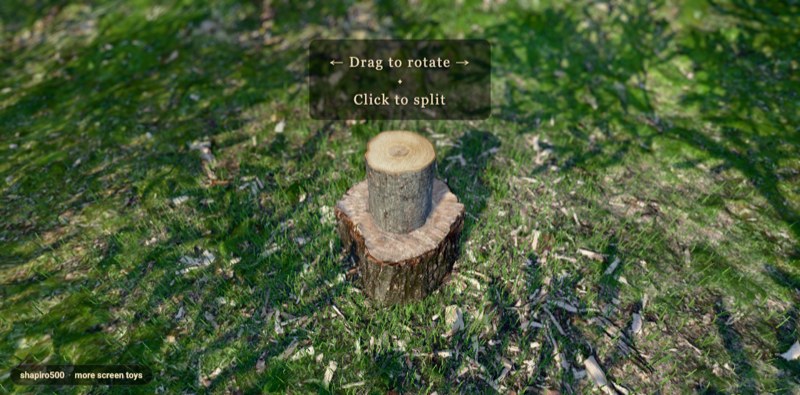
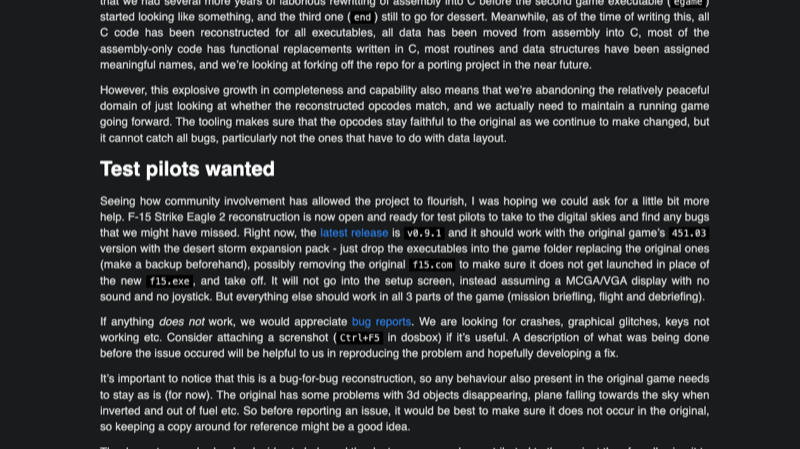

# 机器文摘 第 175 期
### 让 AI 像最懒的资深工程师一样写代码

[Ponytail](https://github.com/DietrichGebert/ponytail)（⭐ 43.2k），一个让 AI 编程 Agent 写更少代码的技能包。核心思想很直白：让 AI 像公司里最懒的资深工程师一样思考——能少写就少写，能不写就不写。项目上线不到一天就涨了一万多颗星，势头比很多 AI 产品还猛。

它的机制是一套六层决策阶梯，AI 在写任何代码前依次过这六个问题，停在第一个成立的台阶：这东西真的需要存在吗？标准库能搞定吗？浏览器原生特性行不行？已安装的依赖能用吗？一行代码能解决吗？都不行才写最小能跑的版本。实测效果挺有说服力——在 real-world 项目（FastAPI + React）上用 Claude Code 跑 12 个真实功能 ticket，代码量平均减少 54%，token 消耗减少 22%，成本降 20%，而且安全测试通过率 100%。

目前 Ponytail 支持 14 种主流 AI 编程 Agent，包括 Claude Code、Codex、Cursor、GitHub Copilot 等。安装也很简单，Claude Code 用户一条 `/plugin install ponytail@ponytail` 就能用。不过效果挺依赖场景——在明显过度工程的需求（日期选择器从 404 行降到 23 行）上表现惊人，在代码已经很精简的场景上几乎没变化。而且某些推理模型可能因为"思考阶梯"反而多花 token，算是取舍。说到底，这个项目解决的不是"AI 写不出好代码"的问题，而是"AI 写太多代码"的问题——和行业主流方向正好相反，这本身就挺有意思。

### 开源最佳 PDF 识别模型

[OCRFlux](https://github.com/chatdoc-com/OCRFlux)（⭐ 2.5k），ChatDOC 团队开源的 PDF 转 Markdown 工具。基于 Qwen2.5-VL-3B 微调，3B 参数在 GTX 3090 上就能跑，支持跨页合并段落和表格——这在开源方案里是第一个做到的。

技术实现分三阶段：先用 pdftoppm 把 PDF 渲染成 PNG，调用 VLM 模型逐页转成 Markdown；再用 LLM 检测相邻页面中哪些元素需要合并（跨页段落/表格检测 F1 达 0.986）；最后是跨页表格的合并（TEDS 0.950）。官方基准测试中单页解析 EDS 达 0.967，远超 olmOCR-7B（0.872）和 MonkeyOCR（0.780）。

不过也看到一些局限。项目目前还是 v0.1.0 Alpha 阶段，仅 21 次 commit，社区还比较小。在线 Demo 已经下线，缺乏直观的产品截图。而且 3B 模型逐页推理，长文档处理时间不短。但就 PDF OCR 这个场景来说，这是目前开源方案里效果最好的选择之一，特别是如果你有跨页内容合并的刚性需求。

### 一个 1.5MB 的浏览器 OCR 模型

[PP-OCRv6](https://www.paddleocr.ai/main/version3.x/algorithm/PP-OCRv6/PP-OCRv6.html)，百度 PaddleOCR 发布的最新版。1.5M 参数的 tiny 版本能直接塞进浏览器跑，单图识别最快 97 毫秒。最让人意外的是，它在逐字识别上的准确率居然反超了 GPT-5.5（64.2%）、Gemini-3.1-Pro（71.4%）和 235B 参数的 Qwen3-VL（74.9%）。

1.5M 参数能做成这样，靠的是几条技术线。一是 PPLCNetV4 MetaFormer 骨干网络，每层解耦成 TokenMixer + ChannelMixer，参数极少。二是结构重参数化（RepDWConv），训练时三分支增强表达能力，推理时合并成单分支零额外开销。三是知识蒸馏——tiny 从 medium 模型（34.5M 参数）蒸馏学习，用 1/23 的参数吸收了大模型的知识。浏览器端通过 PaddleOCR.js（ONNX Runtime Web）部署，支持 WASM 和 WebGPU 后端，M4 芯片上推理只要 0.35 秒。

这里的信号挺明显：在传统 OCR 这个被很多人认为"已经被 AI 大模型取代"的任务上，专用小模型用 1/150 的参数反超大模型——不是靠更强的通用能力，而是靠更好的任务专门化。所以并不是所有任务都适合用大模型解决，尺寸小、速度快、可本地部署的传统方案在某些场景里反而更有竞争力。

### 全是字符的网页"视频"

[ASCILINE](https://github.com/YusufB5/ASCILINE)（⭐ 2.1k），一个让你在网页上"放视频"但不包含任何 video 标签的工具。页面里没有视频文件，每一帧画面都是在 Canvas 上实时重绘的彩色文本字符。360p、30FPS 的水平，足够让你认出画面内容。

实现机制是三层架构：Python 后端用 OpenCV 解码视频，NumPy 把灰度值映射到 93 级 ASCII 字符调色板，颜色按精度量化；通过 WebSocket 把二进制帧传到前端；浏览器用 Canvas 逐字符渲染。最精巧的部分是自适应帧编码器——每帧自动从 RAW、ZLIB、DELTA 三种编码中选体积最小的。静态画面时 DELTA 编码只传变化像素，带宽节省可达 375 倍；高动态场景也从未超过原始 RAW 大小。

不过这不是一个能替代常规视频播放的方案。黑白模式下细节损失严重，彩色模式（pixel mode）也只到 360p 水平。设计定位是局域网或同机使用，不适合大规模分发。但它确实展示了"纯文本渲染视频"这件事能做到什么程度——绕过 autoplay 限制、零 GPU 需求、可对"视频"应用任意 CSS 滤镜，这些是常规 video 标签做不到的。更适合的场景可能是 IoT 弱网设备、或者想做点不一样视觉效果的项目。

### 从零手写的 C++ 路径追踪渲染器

[Luz](https://github.com/themartiano/luz)（⭐ 324），一个纯手工打造的 C++20 路径追踪渲染器。最让人惊讶的是它零第三方依赖——从数学向量到路径追踪渲染管线，从图像编码到降噪算法，全部手写实现。没有 OpenGL、没有 Vulkan、没有 CUDA，甚至连 PNG 编码器都是自己写的（使用 stored DEFLATE blocks 实现无依赖写入）。

功能上它一点也不"玩具"：蒙特卡洛路径追踪、BVH 加速（Binned SAH 构建 + packed mesh BVH + near-first 遍历）、自适应采样（基于置信区间判断收敛）、NFOR 风格的 feature-buffer 降噪、大气散射、焦散光子映射、完整 ACEScg 场景线性渲染管线。连图像输出格式都支持 BMP、PNG、TIFF 三种，全是手写的读写器。项目 624 次提交，非常活跃，还带了自己的场景文件格式和 Blender 导出器。

324 颗星不算多，但代码质量令人印象深刻。作者在图形学上的功底很深，每一行代码都没有"黑盒"，从零开始构建了完整的渲染管线。如果你对路径追踪的内部实现感兴趣，Luz 是一个极佳的学习资源——因为在没有第三方库的情况下，你必须真正理解每一行代码在做什么。

### 让 Agent 技能自我进化

[SkillOpt](https://github.com/microsoft/SkillOpt)（⭐ 8.5k），微软亚洲研究院联合上交、同济、复旦开源的技能优化工具。核心思路很直接：把 Agent 的自然语言技能文档当作可训练的参数，通过迭代优化来提升技能质量——不修改模型权重，只改那份提示文档。项目理念叫做 "Train the procedure, not the weights"。

做法仿照了深度学习的训练流程：前向传播（Agent 用当前技能执行任务）→ 反向传播（分析失败轨迹，提出编辑补丁）→ 梯度聚合（语义相似的编辑合并）→ 梯度裁剪（只应用 top-K 个编辑）→ 参数更新（应用编辑到技能文档）→ 验证早停（只在 held-out 验证集提升时才接受更新）。在 6 个基准 × 7 个目标模型 × 3 个执行框架的全部 52 个测试单元中，SkillOpt 全部最佳或并列最佳。以 GPT-5.5 为例，Direct chat 提升 +23.5 分，Codex 代理循环 +24.8 分。

还有一些有意思的设计：Textual Learning Rate（控制每步最大编辑数，类似梯度裁剪防止过冲）、Slow Update（epoch 边界做纵向对比，防止灾难性遗忘）、Rejected-edit Buffer（被拒绝的编辑存入缓冲区供长期参考）。由于优化产物就是一份 Markdown 技能文档，跨模型迁移天然可行——在一个模型上优化好的技能，直接迁移到同系列的其他模型甚至跨框架（Codex ↔ Claude Code）仍然有效。安装也很简单，`pip install skillopt` 即可。

### 卖椅子的公司出了个 AI 工作站开源指南

[Autonomous Computer](https://github.com/autonomous-ai/autonomous-computer)（⭐ 236），卖人体工学桌椅的那个 Autonomous 推出的 AI 工作站搭建指南。MIT 开源许可证，从零件选购到组装、系统配置，全部配实拍照片。三种配置覆盖全场景：家用 2×RTX 5090（64GB VRAM）、团队 4×RTX PRO 6000（384GB）、企业 8×4090/5090（192-256GB）。

这个指南的细致程度让人印象深刻：64 张装配过程照片、34 张准备阶段照片、23 步装配指南、3D 打印/CNC 加工用的 STL 和 STEP 文件、BIOS 针对多 GPU 的调优指导、甚至连主板手册和 BMC 文档 PDF 都直接附在了仓库里。软件方面目前标注了 Ollama/vLLM/llama.cpp 但不完整，硬件部分已经很成熟了。

从商业角度看，Autonomous 在电商站上也卖 AI 工作站整机，这套开源指南可以看作 DIY 版本——你把源文件下载了自己装，省了装配费。不过 2×5090 的配置算下来也得 1.5 万美元往上，并不便宜。但如果你确实有自建本地 AI 工作站的需求，这是目前你手头能拿到的最详实的硬件搭建参考，每颗螺丝每根线缆都有照片，确实做到了"有手就能跟着装"。

### 打开网页就能玩的逼真小游戏

[screen.toys](https://screen.toys)（by Gavin Shapiro），一系列打开网页就能玩的物理模拟小游戏。全套 7 款：劈柴模拟器（3D 场景里转视角劈木头）、Chess 2（把棋子像炮弹一样扔向对方）、Road Trip（让汽车瀑布般砸向奶牛场而奶牛毫发无伤）、Poms（打字召唤博美犬冲出来爆炸）、Splitshift 滑动拼图、Five Penguins 音乐可视化工具、shapiro500 VJ 派对背景视觉。

GitHub 上有人问"为什么要写这个"，作者的回答是"就是想做个游戏"。每款游戏都只用 Canvas 渲染，没有框架依赖，即开即玩。Chess 2 和 Poms 特别适合作为派对破冰——Chess 2 的物理效果出奇地真实，Poms 配合重金属音乐效果极佳。Five Penguins 和 shapiro500 则在娱乐之外有实用价值（音乐会/派对现场视觉）。在 AI 生成内容的时代，看到一个人认真做这些"没什么用但很好玩"的东西，反而比读一篇 AI 产品分析文章更能让你想打开浏览器体验一下。

### 在线打鼓

[Virtual Drumming](https://www.virtualdrumming.com)，一个免费在线乐器模拟网站。核心是架子鼓模拟器，支持键盘、鼠标、触摸三种交互方式，内置了 Travis Barker、John Bonham、Lars Ulrich 等知名鼓手的定制鼓组套装。除了架子鼓，还有钢琴模拟器（带录音功能、和弦/音阶自动演奏）和鼓机音序器（8 种鼓组音色）。

有意思的是 Custom Drums 模式——你可以从零搭建自己的架子鼓，选择 40 种鼓腔外观、3 种鼓皮、3 种金属件颜色，而且有游戏经济系统，通过使用逐步解锁新装备。还提供了 7 个不同的演出场地，把打鼓这件事做成了一个小型 RPG 式的体验。网站每月还有虚拟鼓手比赛。页面设计风格略显陈旧，但功能质量超出预期，对架子鼓入门学习来说是个不错的免费练习工具。

### 给 DOS 空战游戏做 C 代码重构

[F-15 Strike Eagle II 逆向工程项目](https://neuviemeporte.github.io/f15-se2/2026/06/20/needyou.html)，对 Microprose 1989 年出品的 DOS 经典空战游戏进行逐 bug 的 C 源代码重建。历时 4 年多，发布了 v0.9.1 版本，所有可执行文件（加载器/设置/任务选择/3D 飞行引擎/任务讲评/图形驱动）的 C 代码重建已经全部完成。

项目在技术上踩了不少有意思的坑。原游戏使用 MS C 5.1 编译器编译，这个 1989 版编译器有很多令人哭笑不得的"魔性"行为：同样的 C 代码因编译顺序不同会生成不同的汇编；volatile 关键字形同虚设；用最大优化编译会直接导致游戏崩溃。作者开发了一套自研工具链（mzdiff/mzmap/mzsig 等）来做指令级比对。到 2026 年初引入 LLM 自动生成 C 代码后，效率大幅提升——之前几个月才能完成一个模块，现在几天就能搞定。

最打动人的是作者在这个项目上的情怀。他在 90 年代高中时期就尝试过打印反汇编清单来研究这个游戏，20 多年后终于完整地走完了整个逆向过程。项目现在进入公开测试阶段，正在招募 DOS 测试飞行员帮忙找 bug。作为技术考古案例，它记录了 16 位 DOS 时代编译器特性、逆向思路演变和现代 AI 工具如何改变复古软件考古的面貌——这是靠技术文档和 AI 都讲不了的故事，只有做过的人才能讲出来。

## 订阅
这里会不定期分享我看到的有趣的内容（不一定是最新的，但是有意思），因为大部分都与机器有关，所以先叫它"机器文摘"吧。

Github仓库地址：https://github.com/sbabybird/MachineDigest

喜欢的朋友可以订阅关注：

- 通过微信公众号"从容地狂奔"订阅。

