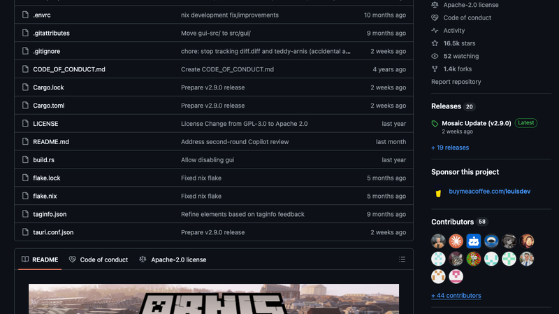
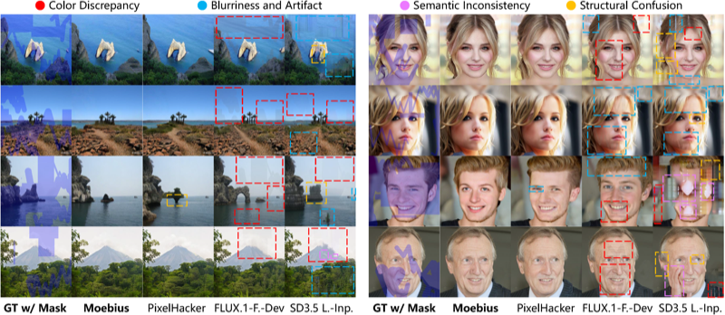
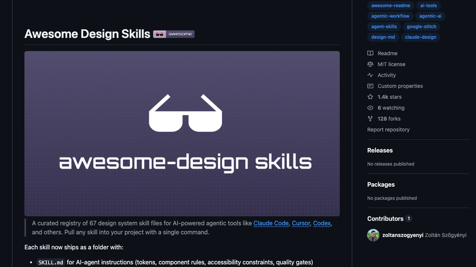
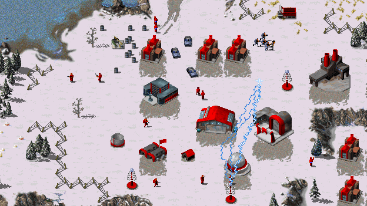
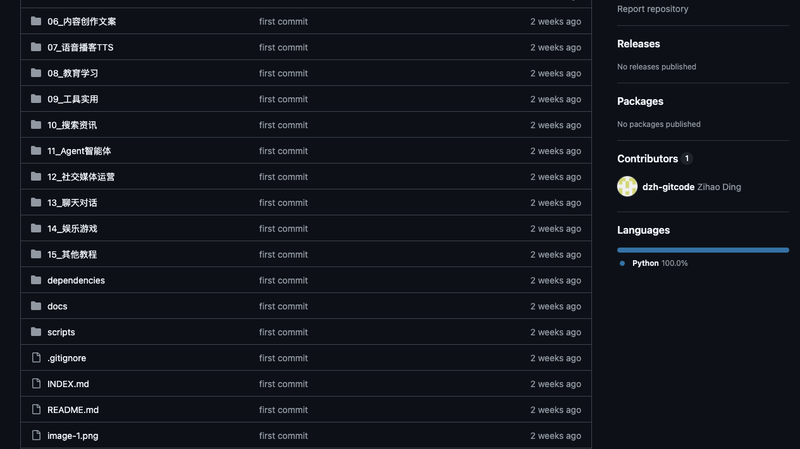
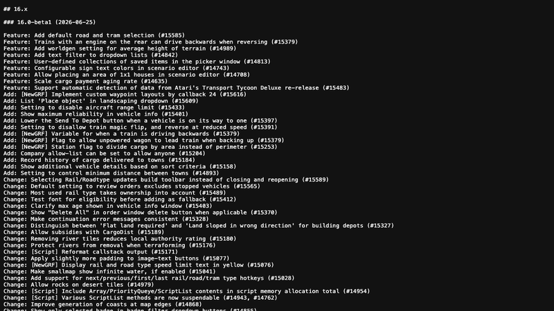
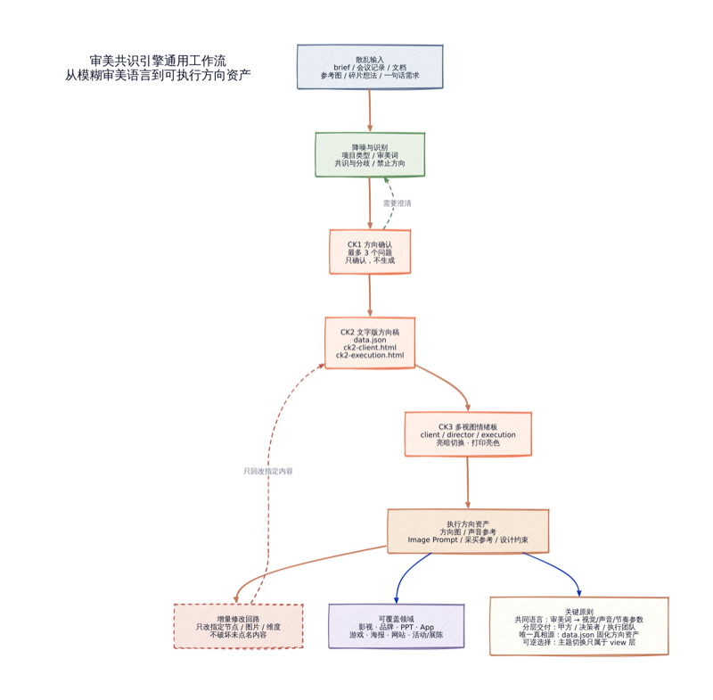

# 机器文摘 第 176 期
### 把真实世界搬进 Minecraft

[Arnis](https://github.com/louis-e/arnis)（⭐ 16.5k），用 Rust + Tauri 构建的开源桌面工具，能根据 OpenStreetMap 地理数据将真实世界的任何位置生成为可游玩的 Minecraft 世界。城市街区、乡村小镇、自然景观——你家门口那条街、上学的校区、某座山、某片湖，都能一键搬进你的游戏。

核心工作流很有意思：用户在地图上框选区域 → 通过 Overpass API 从 OSM 获取地理数据 → 获取对应区域的数字高程模型海拔数据 → 使用体素化算法（dda-voxelize）将地理数据转换为 Minecraft 方块 → 用 fastanvil/bedrockrs_level 写入世界文件。支持 Java Edition 1.17+ 和 Bedrock Edition，提供图形界面和命令行两种方式。数据从 OpenStreetMap 来，建筑、道路、地形、水系、植被都有高度还原。

从工程实现上看，这个项目把 Rust 的地理计算生态用得很透——geo crate、rayon 数据并行、fastnbt 高性能 NBT 读写，全部塞进一个 Tauri 桌面应用里。最新 v2.9.0 版本（2026年6月）已经支持 GLTF 模型导入，Web 版本（MapSmith）直接在浏览器内生成，无需安装。

需要注意的是，生成的 Minecraft 世界精度取决于 OSM 数据质量。城市中心区域数据丰富，建筑和道路还原度很高；偏远地区则只有地形骨架。另外 16.5k 星对于这样一个垂直场景的工具来说增长异常快——五天内又多了 400，AWS 官方博客、Tom's Hardware、Hackaday 都报道过。

### 0.22B 参数的"小钢炮"硬刚 FLUX

[Moebius](https://github.com/hustvl/Moebius)（⭐ 399），ECCV 2026 论文的官方实现，来自华中科技大学 + VIVO AI Lab。0.22B 参数的图像局部重绘（Inpainting）框架，以不到 FLUX.1-Fill-Dev（11.9B）2% 的参数，在 6 个基准测试上持平或超越它。推理速度 26ms/step，比 FLUX 快约 15 倍。

核心架构创新是 LλMI（Lambda Multi-Query Inpainting）模块。它将传统注意力机制中与空间分辨率二次相关的 Query-Key 计算，替换为固定大小的线性 λ 矩阵——Key 先被压缩成一个 dim_k × dim_v 的紧凑上下文矩阵，Query 直接与这个矩阵相乘。空间复杂度从 O(n²) 降到 O(n)。同时通过知识蒸馏，从更大的 PixelHacker 教师模型中多粒度吸收推理能力。

这让我想起 PP-OCRv6 那篇的内容——在明确定义的任务上，专用小模型用 1/150 的参数反超大模型，靠的不是更强的通用能力，而是更好的任务专门化。Moebius 进一步证明了这一点：在图像修复这个足够聚焦的任务上，通过聪明的架构设计 + 知识蒸馏，完全可以以不到 2% 的参数达到工业级 SOTA。26ms/step 意味着消费级 GPU 甚至某些边缘设备都能跑。

不过这只是个研究原型，不是产品化工具。代码和权重虽已开源，但 599 行 Python、13 次 commit，离开箱即用还有距离。但信号很清晰：Scaling Law 不是一切。

### AI 替你操作剪映

[jianying-editor-skill](https://github.com/luoluoluo22/jianying-editor-skill)（⭐ 2,192），一个能让 AI Agent 自动操作剪映（JianYingPro）的技能包。用自然语言描述剪辑需求，AI 就能自动完成从写文案、配音、加字幕、选音乐、上特效到最终导出的整套流程。

技术实现上，核心依赖是 `pyJianYingDraft`——一个能直接读写剪映 `.draft` 草稿文件的 Python 库，免去 GUI 操作。AI 配音用 Edge-TTS，网页动效用 Playwright 录制 Canvas/Three.js 画面转视频素材，录屏后自动分析点击位置加缩放关键帧和红圈标记。支持 Antigravity、Trae、Claude Code、Cursor 等主流 AI 编辑器。

限制也很明显：Windows + 剪映 5.9 是最佳组合，macOS 仅实验性支持且不支持自动导出，6.0+ 弹窗太多导致自动化失效。CapCut 国际版不兼容。最终渲染仍依赖剪映本身。

这个 Skill 的设计思路有意思：它没有试图替代剪映，而是在剪映之上加了一层 AI 指挥层。"叠加而非替代"的架构选择，让它规避了重新实现视频编辑器的巨大工程成本，把精力集中在"自然语言 → 剪辑指令"这个翻译层上。对于符合条件的人来说，这是目前最实用的 AI 视频剪辑方案。

### 给 AI Agent 一份设计说明书

[awesome-design-skills](https://github.com/bergside/awesome-design-skills)（⭐ 1,436），一个收集了 67 个 DESIGN.md 设计系统文件的注册中心。背后是 Google Stitch 推出的 **DESIGN.md 规范**——一种让 AI Agent 读得懂、用得了的设计系统文件格式。

每个设计技能包含两个文件：`SKILL.md` 是给 AI 看的"怎么做"（品牌色板、字阶、间距、组件规则、WCAG 2.2 AA 可访问性），`DESIGN.md` 是给人看的"为什么这么设计"（设计意图、Token 参考、实现说明）。两者互补，共同构成完整的设计系统规范。有了它，AI 编码助手读到项目的 `SKILL.md` 就不需要瞎猜配色了。

生态已经在扩展：有 `typeui.sh` 命令行工具可以一键拉取设计系统，有浏览器扩展可以从任意网站提取样式生成 DESIGN.md，还有日语本地化版本（796⭐）扩展了 CJK 排版支持。收集的 67 个设计技能覆盖了从玻璃拟态、复古到 shadcn、Material 等各种风格。

这个规范解决了一个真实痛点：AI 生成的 UI 总是"看起来不对"，因为 Agent 不知道你的设计系统长什么样。DESIGN.md 提供了一个极轻量的格式约定，让设计系统变成 AI 可读的规格说明书。

### 经典 RTS 引擎的 16.9k 星之路

[OpenRA](https://github.com/OpenRA/OpenRA)（⭐ 16.9k），自由开源（GPL-3.0）的实时战略游戏引擎，重制 Westwood 经典 RTS——Command & Conquer: Red Alert、Tiberian Dawn 和 Dune 2000。不是模拟器，是从零重写的原生引擎。纯 C#（79.1%）编写，SDL + OpenGL 跨平台渲染，原生支持 Windows/macOS/Linux/\*BSD，内置联机对战。

30,830+ commits、活跃开发近 18 年、昨天还有 commit。核心贡献者 pchote 一人提交了 7,489 次 commit。模块化引擎 + Mod SDK 架构，支持自定义模组和 Lua 脚本，正在积极开发 Tiberian Sun 支持，已集成 C&C Remastered Collection 的高清资源。

用 C# 写游戏引擎在传统游戏开发中算少数派，但 OpenRA 的实践说明了 .NET 在跨平台游戏引擎上的可行性——它不需要 WINE 或者虚拟机，直接用原生代码跑经典游戏。如果你玩着 Red Alert 长大，OpenRA 已经把那些青春记忆移植到了现代操作系统上，而且比以前更好（现代分辨率、完整的多人对战、活跃的 Mod 社区）。

### 269 个 Dify 工作流模板

[dify-workflows](https://github.com/dzh-gitcode/dify-workflows)（⭐ 54），一个整理好的 Dify 工作流模板集合，涵盖 15 个类别、269 个 `.yml` 格式的 DSL 文件。翻译语言处理、图像绘画多模态、知识库文档处理、代码开发、数据分析、内容创作文案、语音播客 TTS、Agent 智能体……几乎覆盖 Dify 所有应用场景。

每个 `.yml` 文件是 Dify 原生 DSL 格式，在 Dify 平台「从 DSL 导入」即可直接使用。配套的 `dependencies/` 目录还包含股票数据（akshare）、TTS（Edge TTS）、AI 绘画（即梦/Gemini）等完整的后端 API 服务代码，可独立部署。还有 `sanitize_check.py` 自动扫描 API Key 等敏感信息、`deduplicate_workflows.py` 去重工具。

54 颗星不算多，但这个集合的价值在于覆盖面和质量——不是随手丢进去的，而是系统性地按类别组织，每个模板都经过了实际测试。如果你在用 Dify 做项目，想参考别人怎么搭工作流的，或者想找个模板快速上手某个场景，这个仓库值得收藏。

### 全球无防护摄像头的实时地图

[IP Crawl](https://ipcrawl.com)（非开源），一个"全球公开网络摄像头的动态地图集"，由 Alec Armbruster 创建。持续扫描公网 IPv4 地址空间，发现和编录那些在毫无防护地暴露的摄像头流。当前规模：14,131 个摄像头端点入库，2,359 个当前在线，覆盖 120 个国家。

工作原理不复杂但执行得彻底：容器化定时任务遍历公网 IP 空间，对已知的摄像头流端点（如 `/snapshot.cgi`、`/ISAPI/Streaming/channels/1/picture` 等常见路径）发送 HTTP/RTSP 请求。成功获取图像 → 入库；失败 → 交叉查询 Shodan；完全失联 → 自动删除。用户查看时，后端按需重新探测并通过代理转发图像，源 IP 完全隐藏。内置图像分类管线自动屏蔽不适当内容。

技术细节上，前端 Nuxt 4 + Nuxt UI，部署在 Cloudflare Workers 的 $5/月计划上，启动日峰值 10,000+ 并发和 300 万请求。扫描的摄像头中海康威视占 11%、D-Link 占 4.3%，最多的是端口 554（RTSP）和 80（HTTP）。项目公开声明从不尝试认证暴力破解或漏洞利用。

14,000 多台摄像头暴露在公网上没有保护——这个数字本身就是个信号。安全建议很简单：如果你家的摄像头能在外网访问，检查一下有没有默认密码，或者干脆关闭外网访问。

### OpenTTD 16.0 来了

[OpenTTD 16.0-Beta1](https://www.openttd.org/)（⭐ 8k），基于《运输大亨豪华版》的开源模拟经营游戏，社区维护超过 20 年，32,872 次提交。最新 16.0 版本（6 月 25 日发布）带来了一个旗舰特性：**列车倒车行驶**——尾部带车头的列车现在可以倒车行驶了。

这个 20 年的老游戏，更新力度让人意外。16.0 还带来了更好的地图生成（平均地势高度控制、海岸线优化、沙漠岩石）、下拉列表文本过滤（所有下拉菜单加搜索）、NewGRF 收藏集（可自定义保存物品集合）、多人游戏中公司可设为任何人都可加入。修复了约 60+ 个 bug，包括长期存在的多人游戏列车碰撞不同步问题。

用 C++ 编写，CMake 构建，支持 Windows/macOS/Linux，甚至通过 Emscripten 支持 WebAssembly 浏览器版。丰富的 NewGRF Mod 生态和 GameScript 脚本系统，让它的可玩性远超商业版原版。如果你曾经在《运输大亨》里花掉整个下午规划铁路网络，OpenTTD 应该还在你的硬盘上。16.0 值得再打开看看。

### 把"高级一点"变成可执行代码

[Moodboard Alignment / 审美共识引擎](https://github.com/zhlmi/moodboard-alignment)（⭐ 31），来自开发者 zhlmi。它不生成好看的图片，解决的是更根本的问题：怎么不让"高级一点""有质感"这类话毁掉一个项目。

在影视、品牌、App 设计中，审美沟通经常停留在模糊词——"高级""质感""电影感""温暖""干净""年轻化"。这些词直接交给执行团队，完全不能指导设计或 AI 生成。Moodboard Alignment 的工作流把它们拆成六个维度：`emotion / motion / color / composition / style / sound`，然后通过 CK1 → CK2 → CK3 的 Checkpoint 流程生成可确认、可执行的 HTML 情绪板。CK1 只确认方向，输出核心调性 + 最多 3 个确认问题；CK2 生成情绪板初稿供逐元素确认；CK3 锁定终稿并输出执行指南。

核心洞察是：审美沟通的困难不在于"审美能力差"，而在于审美描述缺少**可反驳的中间状态**。你说"高级一点"，甲方说"不够高级"，没法推进。但有了六维拆解和 Checkpoint 流程，对话就有了可讨论的结构。31 颗星说明它还很早期，但解决的问题是真实的——任何参与过创意项目的人都经历过那种"高级一点"的噩梦对话。

## 订阅
这里会不定期分享我看到的有趣的内容（不一定是最新的，但是有意思），因为大部分都与机器有关，所以先叫它"机器文摘"吧。

Github 仓库地址：https://github.com/sbabybird/MachineDigest

喜欢的朋友可以订阅关注：

- 通过微信公众号"从容地狂奔"订阅。

