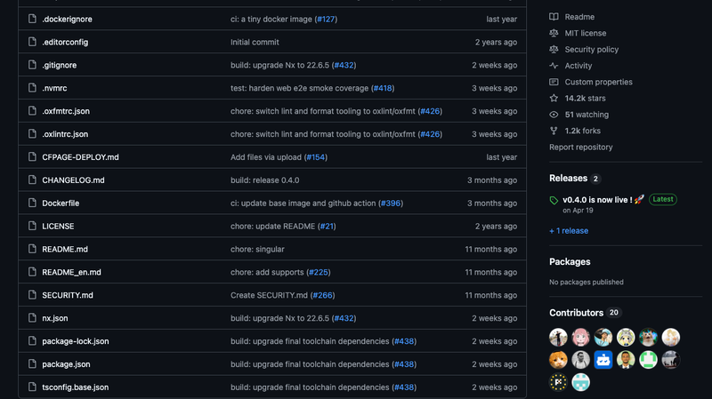
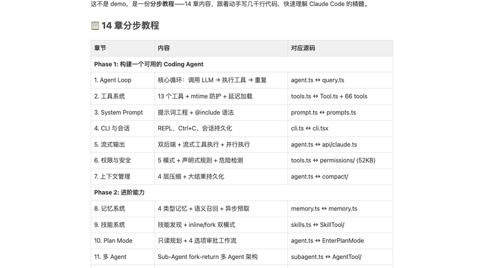
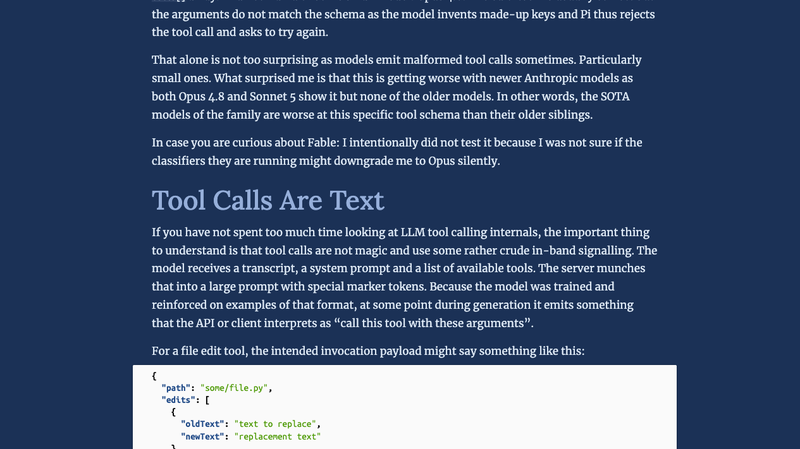
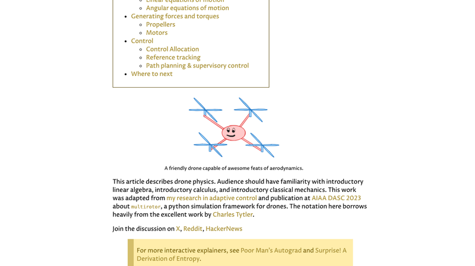
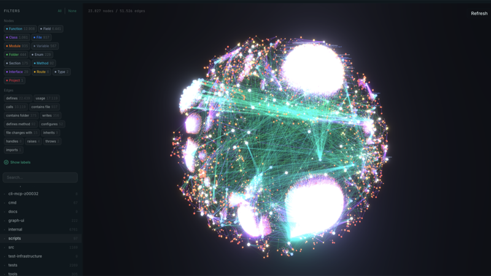
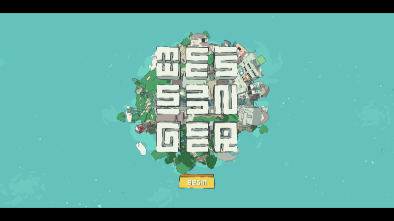
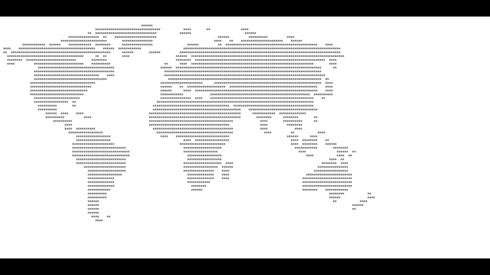

# 机器文摘 第 177 期
### 微软把 Linux 容器塞进了 WSL

[WSL Container 公测版](https://devblogs.microsoft.com/commandline/wsl-container-is-now-available-for-public-preview/)，微软在 Build 2026 上宣布的新功能——把 Linux 容器直接集成到 WSL 中，无需 Docker Desktop。

技术实现上，WSL Container 不依赖 Docker 引擎，而是由 WSL 内核通过 Linux 原生容器技术（cgroups、namespaces）直接管理容器生命周期。命令接口 `wslc.exe` 与 Docker CLI 高度相似：`wslc run -d -p 80:80 nginx`，基本上肌肉记忆直接上手。

配套的新文件系统采用 virtiofs，Windows 文件访问性能提升 2 倍；新网络模式 consomme 让 Linux 网络流量走 Windows 网络栈，兼容 VPN 和代理等企业网络环境。还支持 `--gpus all` 参数直通 NVIDIA CUDA。

不过这只是公测版，还没有 Docker Compose 支持（微软称"正在调研"），也没有可视化 GUI。但对于不需要复杂编排的场景——比如本地开发、CI 环境——WSL Container 意味着不再需要启动 Docker Daemon，也省去了企业环境里的 Docker Desktop 商业许可费用。

这其实是微软"WSL 是最好的 Linux 发行版"策略的延伸：让 Windows 成为最好的 Linux 开发平台，与其让开发者离开，不如在 Windows 上把 Linux 生态做透。

### Drawnix：14k Star 的开源一体化白板

[Drawnix](https://github.com/plait-board/drawnix)，一个把思维导图、流程图、自由绘画整合到一块画布上的开源白板工具，由 PingCode（Worktile）团队孵化，14,210 Star。

它的核心亮点在架构层面——基于 Plait 画图框架构建，采用插件化架构。底层 Plait 引擎不依赖特定 UI 框架，核心与视图层分离，理论上能同时服务 Angular 和 React 应用；上层通过 `withMind`、`withDraw` 等函数向 PlaitBoard 实例注入功能插件，类似 Slate 的插件模式。

功能层面最有意思的是 Markdown 一键生成思维导图和 Mermaid 语法转流程图。写一段 Markdown 标题层级，点一下就能看到可视化的大纲结构；Mermaid 代码块直接渲染为可编辑的流程图。这些功能对习惯用文本表达结构的开发者来说很顺手。

不足之处也很明显：当前版本没有在线实时协作，缺少 SVG/PDF 导出，也还没有内置模板库。项目处于 Dawn 正式版发布前的密集迭代期，功能在快速补充中。

### 4300 行代码复现 Claude Code 核心

[Claude Code From Scratch](https://github.com/Windy3f3f3f3f/claude-code-from-scratch)，一本开源电子书兼可运行项目，用约 4300 行 TypeScript（或 3800 行 Python）从零复现了 Claude Code 的核心架构。

它涵盖了 Agent Loop、13 个工具系统（含并行执行 + mtime 防护）、4 层上下文压缩、5 种权限模式、基于技能的 Agent 系统、MCP 集成等 Claude Code 的关键组件。分成 14 章分步教程，每章对照 Claude Code 的真实 50 万行源码，讲解"它怎么做的 → 我们怎么简化的"。

从工程视角看，项目清晰地展示了 Agent 系统的核心循环：`while(true)` 中，调用 LLM → 执行工具 → 重复，直到任务完成。只读工具标记为并发安全，在 API 流式响应期间自动并行执行，实现 2-3 倍的加速。工具系统的设计哲学是"错误是数据，不是异常"——任何阶段的错误都转换为带 `is_error: true` 的 tool_result 返回给模型，让模型自我纠正。

当然它只是教学项目，距离生产级还差得远——工具数仅 13 个（Claude Code 有 66+），权限系统大幅简化，没有 GUI 也没有自动化测试。但作为理解现代 Coding Agent 工作原理的入门材料，很难找到比它更清晰的。

### C&C Generals 原生态移植到 Apple Silicon

[Command & Conquer Generals: Zero Hour 原生移植到了 Apple Silicon Mac、iPhone 和 iPad](https://github.com/ammaarreshi/Generals-Mac-iOS-iPad)，无需模拟器，完整战役/遭遇战/将军挑战模式全部可玩，HackerNews 热榜 327 分。

渲染管线相当壮观：DirectX 8 → DXVK → Vulkan → MoltenVK → Metal。从 2003 年的 DirectX 8 图形调用一路翻译到 Apple Metal，跨了 23 年、4 个渲染 API。游戏引擎本身重新编译为 ARM64 二进制，没有模拟层开销。

更有意思的是构建过程——这个移植是 Claude Code（使用 Fable 模型）和人类工程师协作完成的。README 明确说明"工程代码由 Claude Code 编写，真机测试和迭代指导由 Ammaar Reshi 完成"。项目还开放了一套移植工程日志，记录了每个失败模式、根因和修复方案。这大概是目前公开的、用 AI 代码生成完成的规模最大的游戏移植项目之一。

已知问题包括 iOS 上长时间游玩内存占用约 3GB+ 会被系统杀死、后台恢复偶尔崩溃、需要自己拥有 Steam 版游戏提取资产。

### 更好的模型，更差的工具

Armin Ronacher（Flask 框架作者、Sentry 联合创始人）在他的博客上发表了一篇值得细读的文章：[Better Models: Worse Tools](https://lucumr.pocoo.org/2026/7/4/better-models-worse-tools/)。

他发现 Anthropic 的最新模型（Opus 4.8、Sonnet 5）在执行自定义工具 schema 时，表现反而比旧模型（Opus 4.5）更差。在新模型生成的 JSON 调用中，凭空"发明"不存在的键名——`requireUnique`、`in_file`、`forceMatchCount` 等，导致工具调用被拒绝。

他分析的根本原因：Claude Code 的客户端设计得非常"宽容"，包含大量容错机制（参数别名映射、静默过滤未知键、类型转换等），模型被训练得"差不多就行"，没有压力去精确遵守 schema。当切换到不同的工具 harness 时，模型越"聪明"，它的先验概率就越顽固地倾向于 Claude Code 的工具格式。

从工程角度看，这是一篇对 AI 编程工具封闭化趋势的尖锐批评。如果你的自定义工具格式和模型 post-training 阶段看到的格式有差异，就是在对抗模型的先验概率。Armin 直言这改变了他对 strict grammar-constrained decoding 的看法——如果最新模型解决问题更强但遵守 schema 更差，那么在 harness 层面必须提供更强的保证。

### 代码级无人机物理教程

[Drone Physics](https://iahmed.me/post/drone-physics/)，一篇系统性的四旋翼无人机动力学技术教程，从坐标系定义到电机转速计算，完整推导了多旋翼无人机的 12 状态变量运动方程。

文章覆盖了四个板块：飞行器描述（6-DOF 模型 + NED 坐标系 + Tait-Bryan 欧拉角）、动力学方程（运输定理推导 + 刚体运动学）、力与力矩生成（螺旋桨推力模型 + BLDC 电机微分方程 + 转动惯量计算）、控制系统（控制分配矩阵 + 级联 PID + 路径规划）。

作者 Ibrahim Ahmed 是范德比尔特大学的 PhD，研究方向是自适应容错控制与强化学习。文章内置了交互式 3D 欧拉角滑块演示，可以看到 Yaw→Pitch→Roll 的顺序旋转对机身朝向的影响。转动惯量部分把无人机分解为"球体机身 + 圆柱辐条 + 端点点质量电机"的物理模型，然后应用平行轴定理叠加计算——这种实物到物理模型的简化方法对工程实践很有启发。

文章发表于 2024 年 1 月，最近更新于 2026 年 6 月 25 日（不到两周前），作者一直在维护。如果想理解 PX4/ArduPilot 这类飞控的底层原理，或者想自己写无人机仿真代码，这几乎是最佳的技术入门读物之一。

### 毫秒级索引整个代码库的 MCP 服务器

[codebase-memory-mcp](https://github.com/DeusData/codebase-memory-mcp) 是 GitHub Trending 本周榜首，26k Star 的高性能代码智能 MCP 服务器。

它用纯 C 编写，以单一静态二进制发布，零依赖。核心思路是将代码库预索引为持久化知识图谱——索引完成后释放内存，查询时次毫秒级响应。支持 158 种语言（9 种有语义级解析），Linux 内核 2800 万行代码完整索引只需 3 分钟。

技术实现上，采用了多阶段流水线：tree-sitter AST 解析 → 定义提取 → 调用关系提取 → 配置提取。运行时所有处理在内存中完成（LZ4 HC 压缩读取 + 内存 SQLite + Aho-Corasick 多模式匹配），最后一次性写入磁盘持久化。

知识图谱包含 11 种节点类型（Project、File、Class、Function 等）和 19 种边类型（CALLS、IMPLEMENTS、DATA_FLOWS、SIMILAR_TO 等），支持 Cypher 式图查询和 BFS 遍历。AI Agent 调用 5 次结构化查询约消耗 3400 tokens，而逐文件搜索约 41.2 万 tokens——99.2% 的 token 节省，这在 API 计费时代是质的区别。

局限也很明显：纯 C 实现（不是内存安全的语言）、Hybrid LSP 仅 9 种语言有语义级解析、二进制体积较大、不可变索引无法实时反映代码编辑中的变更。

### Messenger：画风治愈的浏览器小游戏

[Messenger](https://messenger.abeto.co/)，一款由 Abeto 工作室制作的免费 WebGL 送货小游戏，玩家在微型卡通渲染星球上扮演信使，为居民递送信件和包裹。

画风是第一吸引力——卡通渲染风格，色彩明亮鲜艳，被媒体形容为"Jet Set Radio 遇上马里奥银河"。BGM 是舒缓的 Lo-fi 音乐，整体氛围轻松治愈。整个游戏用 Three.js + Svelte 5 构建，美术管线用到了 Houdini + Blender + Substance 3D，后处理管线包含 Bloom、SMAA 抗锯齿、景深、God Rays 等效果。游戏约为 15-30 分钟可通关，支持在线多人同服。

这类"入口极轻"的网页游戏越来越受欢迎并非偶然。打开浏览器即玩，无需任何下载安装，URL 就是传播入口。Three.js/WebGL 生态成熟后，小团队（Messenger 仅 3 人核心团队）也能做出主机级的视觉品质。它们更像是"可以直接走进去的插画"，美感和体验本身就成了传播力。

### 用 445 字节画一张可识别的世界地图

[World Map in 500 bytes](https://www.experimentlog.com/blog/building-a-world-map-with-only-500-bytes)，一个代码高尔夫项目——将 8523 字节的 ASCII 文本世界地图压缩到 445 字节。

最反直觉的发现是：填充陆地比仅保留轮廓压缩效果更好。直觉上轮廓更简洁，但填充陆地产生了大量 `**********` 式的重复序列，deflate 压缩算法非常擅长处理重复运行的字符串。稀疏的海岸线轮廓充满间隔，反而对压缩不友好。

作者从 2019 年的 JS1k 版本（~1KB）开始，经过裁边、去水点、保留填充陆地等优化，加上 deflate-raw 压缩，将数据砍到 445 字节。浏览器端用原生的 `DecompressionStream('deflate-raw')` 解压后渲染。整个 HTML 文件共 846 字节。

还有一个有趣的细节：作者尝试用 OpenAI Codex 辅助优化，但 AI 没有主动提出"去掉海洋字符、裁掉边距"这类优化方向。核心的工程洞察——选择压缩算法最爱的表示形式——仍然是人类完成的。

## 订阅
这里会不定期分享我看到的有趣的内容（不一定是最新的，但是有意思），因为大部分都与机器有关，所以先叫它"机器文摘"吧。

Github 仓库地址：https://github.com/sbabybird/MachineDigest

喜欢的朋友可以订阅关注：

- 通过微信公众号"从容地狂奔"订阅。

