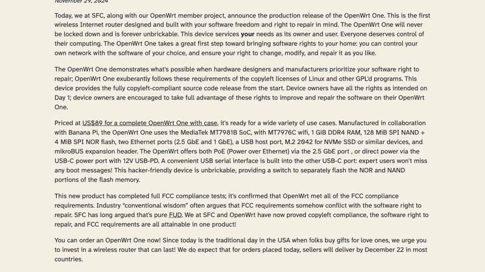
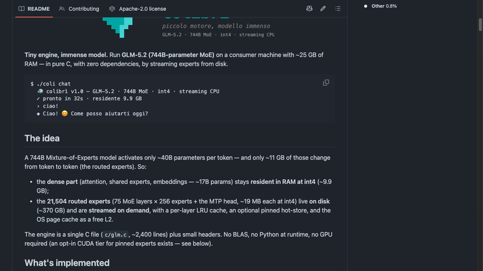
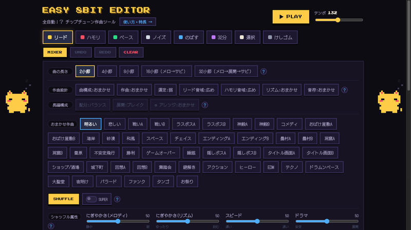
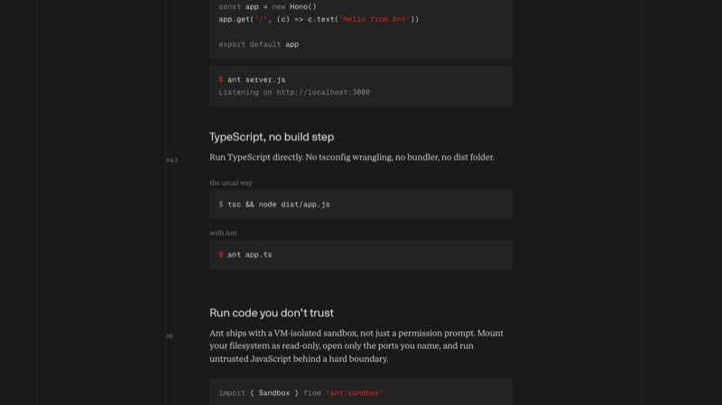
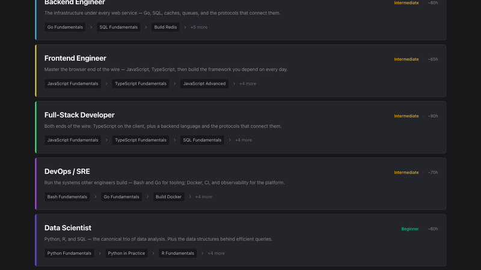
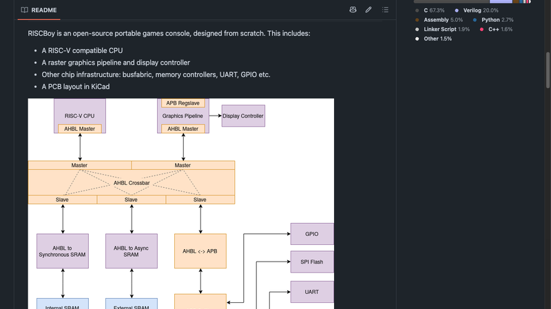
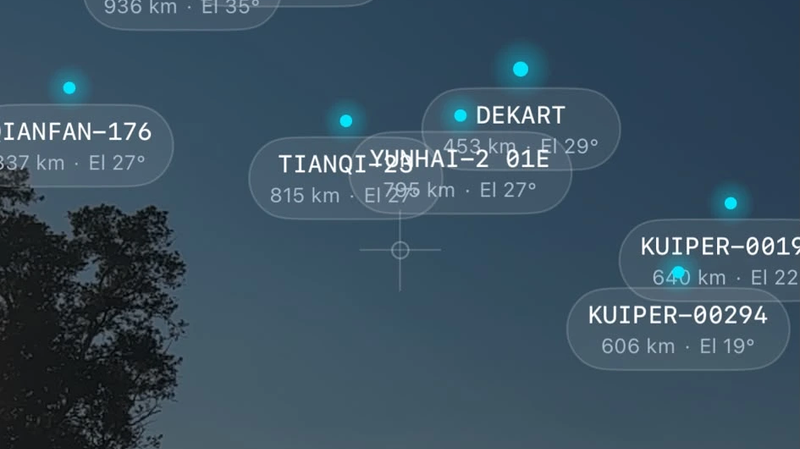
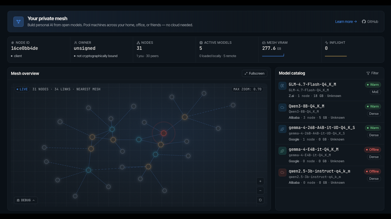

# 机器文摘 第 178 期

### 比官方还官方的 OpenWrt 路由器

[OpenWrt One](https://www.indiegogo.com/projects/openwrt-one)，由 Software Freedom Conservancy（SFC）背书、Banana Pi 代工、OpenWrt 社区成立 20 周年之际推出的首款官方参考硬件路由器，售价 $89。

规格在一年前就公开了——MediaTek MT7981B（Filogic 820）、1GB DDR4、WiFi 6、双网口（2.5G + 1G）、M.2 NVMe 扩展。最值得说的设计是双启动方案：128MB NAND 跑主系统 + 4MB NOR 做恢复系统，一个开关切过去就能从 NOR 启动救砖，基本杜绝了变砖风险。

电路图将公开释放，引导链（TF-A + U-Boot）和内核全部上游。SFC 直接参与 GPL 合规监督，这意味着它不像市面上那些"基于 OpenWrt"的商业路由器——代码不是发了一个版本就不管了，而是会持续跟 OpenWrt 主线同步。

从工程角度来看，$89 的定价很有意思。它不是性能旗舰（同价位的硬路由 MT7986A 方案其实更猛），而是"社区第一板"——不可变砖设计、完全开源、上游优先。对 OpenWrt 开发者来说，这是第一个可以放心往 trunk 提交代码而不用担心厂商不跟进的参考平台。

### 一个可以在笔记本上跑 744B 大模型的推理引擎

[colibrì](https://github.com/JustVugg/colibri)，一个纯 C 编写的大模型推理引擎，目标是在约 25GB 内存的普通电脑上跑 GLM-5.2 744B MoE 模型，不需要 GPU。发布仅 11 天即获得近 4000 Star。

通常 744B 参数意味着需要数块 H100 才能推理。colibrì 的切入点是：744B MoE 每 token 只激活约 40B 参数，密集部分（attention、共享专家）只有 ~17B，以 INT4 常驻 RAM 只需 9.9GB；而 21,504 个路由专家（~370GB）存在磁盘上，按需流式加载。

技术上最吸引人的是 MLA 注意力机制的应用——它会将 KV 缓存压缩 57 倍，同时利用 GLM-5.2 自带的 MTP 多头预测头实现投机解码（单次前向传播产生 2.2-2.8 个 token）。还有学习型热专家缓存，自动记录路由模式来加速冷启动。

实测数据有点两极分化：冷启动只有 0.05-0.1 token/s，但在 Apple M5 Max（128GB 统一内存）上能到 1 token/s。每秒一个 token 不算快，但对一台没有 GPU 的消费级笔记本来说，这已经是一个突破——它证明了"用磁盘换显存"这条路走得通。

### 选个主题点一下，8bit 音乐就出来了

[EASY 8BIT EDITOR](https://amix-design.com/tl/tool-s-8bit/)，一个日本设计团队 AMIX 做的在线芯片调音乐（chiptune）编辑器，完全免费，无需注册，浏览器打开即用。

它的核心功能就是一个 SHUFFLE 按钮——从 48 种主题曲风（战斗、洞窟、EDM、和风、大圣堂、舞踏会等）里选一个，点 SHUFFLE，AI 就自动生成一段 8bit 风格的音乐。还配了 7 个属性滑块（旋律热闹度、节奏密度、速度、戏剧性、明暗、钩子强度、平滑度）和编曲设计面板（曲构成、配分、展开等），让你在自动生成的基础上做调整。

此外，它可以用 WAV 格式导出成品，也支持 MIDI 和 JSON 格式的保存/加载。商用许可也是开放的——做游戏音效或 YouTube 背景音乐可以放心用。

从技术上看这是一个 React SPA，所有音频合成在浏览器端完成，不上传任何数据到服务器。对于独立游戏开发者或需要快速出 8bit 音效的人来说，它比配置 FL Studio + 插件要快得多。

### macOS 用户等了一年了的输入法自动切换

[InputSource Pro](https://github.com/runjuu/InputSourcePro)，一个 macOS 上的开源输入法自动切换工具，3,365 Star，Swift 编写，GPL-3.0 协议，可以通过 Homebrew 安装。

它的核心功能很直接：为每个应用设置默认输入法，还能在浏览器里按不同网站分别设置。比如 VS Code 里自动切英文、微信里自动切中文、GitHub 网页自动英文、知乎自动中文。切换应用时输入法自动跟随，不再需要手忙脚乱按 Caps Lock。

还有一个细节值得提——"应用感知标点模式"，在代码编辑器或终端中使用中文输入法时自动输出英文标点，不然写代码时「;」变成「；」真的很烦。

macOS 的输入法切换一直是个痛点，系统没有提供按应用记忆输入法的功能。InputSource Pro 用 macOS 辅助功能 API 监听应用焦点切换，通过 TISInputSource 系列 API 操作输入法，再通过 Accessibility API 获取浏览器当前标签页 URL 来实现网站级切换。纯 Swift 原生实现，546KB 代码量，没有 Electron 的重量包袱。

### 只有 8.6MB 的 JavaScript 运行时，启动比 Node 快 6 倍

[Ant](https://antjs.org)，一个完全从零自研的 JavaScript 运行时，核心引擎 Ant Silver 不是 V8/JSC/SpiderMonkey 的封装——解析器、JIT 编译器、GC、对象模型全部手写。74% C + 6% Zig，二进制体积只有 8.6MB，冷启动 5.4ms。

从数据上看，它的二进制是 Node 的 1/14，Bun 的 1/7，冷启动时间是 Bun 的 2 倍、Deno 的 4.5 倍、Node 的 5.8 倍。内置的包管理器 `ant i` 安装速度比 npm 快 40 倍（155ms 装完 Hono）。

最有特色的设计是硬件级沙箱——通过 KVM/Hypervisor.framework 实现真正的硬件隔离，比 Deno 的权限提示更严格。这听起来有点过度设计，但如果考虑 serverless 场景下运行不受信的第三方代码，硬件级隔离确实有意义。

不过目前只有 411 Star，还是一个人的项目。引擎本身通过 WinterTC 标准兼容测试和 ECMAScript compat-table 1511/1511，但生态和稳定性还需要时间检验。

### 把 Redis、Git、数据库从零到一造一遍

[Ship That Code](https://shipthatcode.com)，一个主打"不写教程，直接造系统"的动手编程教学平台，提供 80+ 门从零构建课程。

课程覆盖范围很广——从 Storage（Build Redis、Build a Database）、Tooling（Build Git、Build a Text Editor）到 Compilers（Build a Programming Lang）、Systems（Build a Container Runtime、Build a Shell、Build an OS Kernel），再到 Graphics（Build a 3D Renderer、Build a Ray Tracer、Build a Game Engine）和 ML（Build a Neural Network）。

每门课都支持多种语言实现，比如 Build Redis 可选 Python/Go/Rust。学习流程是"读说明 → 写代码 → 运行 → 看测试结果"，所有代码在隔离沙箱里运行和验证。平台还分了 14 条职业路径（后端工程师 ~80h、前端 ~65h、DevOps/SRE ~70h），按"基础→中级→高级"渐进。

这类"learn by building"的平台并不罕见（CodeCrafters 等），Ship That Code 的区别在于课程覆盖面更系统化：不是零散的几个项目，而是从存储到网络到分布式系统的完整体系。如果真能把 80 门课都走一遍，对系统编程的理解会比读十本书来得扎实。

### 从零设计一台开源掌上游戏机

[RISCBoy](https://github.com/Wren6991/RISCBoy)，由 Luke Wren 从零设计的开源便携游戏机，在 iCE40-HX8k FPGA（仅 7680 LUTs）上实现了一个完整的游戏系统。

它有一个自研的 RISC-V CPU 核心 Hazard5——5 级流水线、RV32IMC 指令集，通过了 riscv-formal 形式化验证。GPU 是 GameBoy Advance 风格的 2D 瓦片图形管线，支持仿射变换（旋转/缩放）。PCB 用 KiCad 设计，4 层板，兼容 65 美元的低成本打样。

作者自己说这是"来自平行宇宙的 GameBoy Advance，在那个宇宙里 2001 年就有了 RISC-V"。736 次提交、从 2018 年断断续续开发到现在。这不是一个"想做产品"的项目——它更像一个硬件设计师写给童年的情书，用 FPGA 和最开放的指令集，重新想象掌上游戏机应该长什么样。

### 举起手机看 15,000 颗卫星飞过头顶

[Orbit](https://nagylukas.github.io/orbit.html)，一个 iPhone 上的 AR 卫星追踪器，由独立开发者 Lukáš Nagy 打造，免费 + Pro 内购。

举起手机，AR 界面会在摄像头画面上叠加卫星位置、行星、星座线和太空碎片。ISS 和天宫空间站有脉冲光环指示，屏幕边缘有箭头指引画外的物体。还有 2D 世界地图和 3D 地球视图、过境预测（计算卫星下次可见的时间和方向）、15,000+ 卫星编目（可按类别/国家/高度/倾角筛选），以及历史航天器博物馆。

背后的技术很简单：轨道数据来自 Celestrak TLE（双行轨道根数），用 SGP4 传播器在本地计算卫星位置，用设备粗略位置 + 方向传感器算过境。全部本地计算，不上传数据，隐私友好。

唯一的问题是它仅支持 iOS，且目前评分还不多（新上架 App）。对天文爱好者或航天迷来说，这是一个能让你直观感受头顶有多少东西在飞的 app——那些光点和线条的背后，是人类花了半个多世纪送到轨道上的一切。

### 用 P2P 网络把多台电脑的 GPU 拼起来跑大模型

[Mesh LLM](https://meshllm.cloud)，一个基于 Rust 的分布式 AI 推理系统，利用 iroh（QUIC 协议的 P2P 网络层）把多台机器的 GPU 和内存池化，对外暴露一个兼容 OpenAI API 的端点。

支持两种网格模式：router 模式按模型路由请求到不同节点，split 模式（Skippy 分层拆分）将一个大模型拆到多个节点上协同推理。支持 72+ 种已认证模型（Qwen、Llama、DeepSeek、GLM、Gemma、Mistral 等），兼容 CUDA、ROCm、Vulkan、Metal 和 CPU。

它和 exo（"在你能拿到的所有设备上跑 LLaMA"）有相似之处，但 Mesh LLM 更强调异构设备池化和插件生态——它有 MCP、HTTP、推理和网格事件四种插件系统，还有专门的 `mesh-llm goose/claude/opencode` 代理集成命令。

一个值得关注的设计是实验性 MoA（Mixture of Agents）模式——设置 `model: "mesh"` 后，提示词会被广播到网格中所有模型并行处理，然后选择一个最佳响应。这意味着你可以在不同设备上跑不同模型，让它们"竞争"回答，选最好的那个。

### 把人生目标变成 CLI 游戏

[Earth Game](https://github.com/skorotkiewicz/earth-game)，一个纯离线的命令行工具，把人生目标转化成游戏化的"任务"（Quests）。Python 标准库 + SQLite，零外部依赖，完全离线，无账号系统。

核心理念很克制：不评分、不推荐、不分析。只有五个维度（connection、production、mindset、health、awareness）和五大驱动（curiosity、passion、purpose、autonomy、mastery）。工作流是"描述角色 → 创建任务 → 开始任务 → 执行下一步 → 每周反思"。同时提供 CLI 和本地 Web UI（http://127.0.0.1:8765，启动时带随机 token）。

最有意思的设计是"单一当前任务"——你一次只能专注于一个任务，切换需要确认。还有"开环管理"：快速记录和关闭"干扰项"，不打断当前主线。

GitHub 上才 20 个 Star，但作者的设计思路很清晰——不是又一个 Notion 模板或 GTD 套件，而是给喜欢终端的极简主义者的一个小工具。它不做规划，只做记录和提醒，自洽而优雅。

## 订阅
这里会不定期分享我看到的有趣的内容（不一定是最新的，但是有意思），因为大部分都与机器有关，所以先叫它"机器文摘"吧。

Github 仓库地址：https://github.com/sbabybird/MachineDigest

喜欢的朋友可以订阅关注：

- 通过微信公众号"从容地狂奔"订阅。

