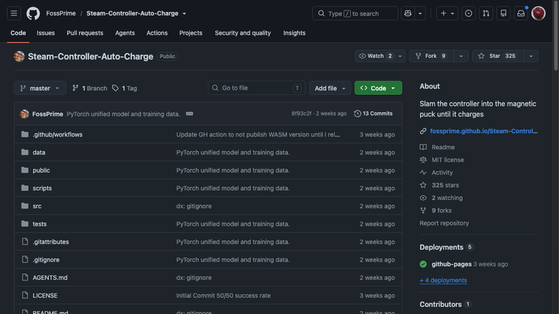
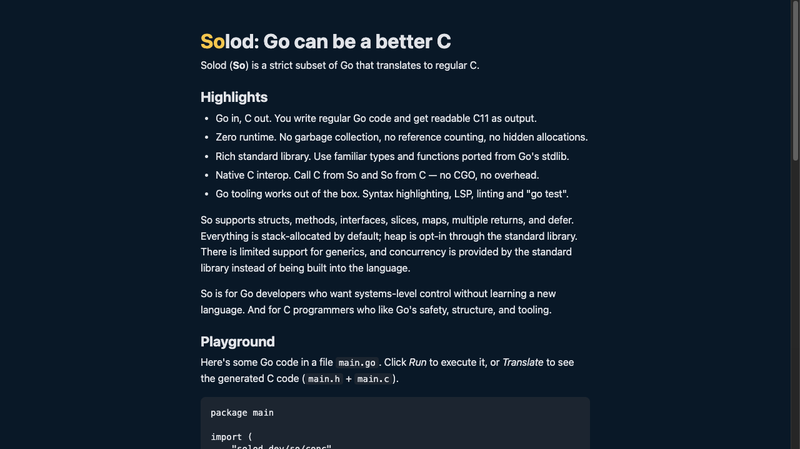
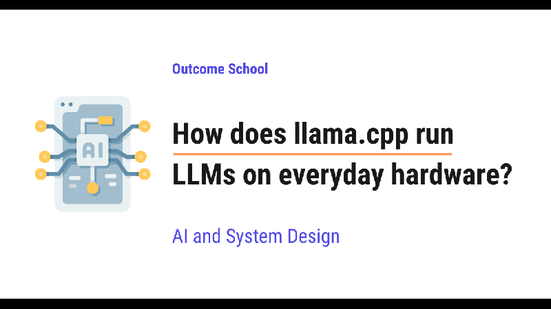
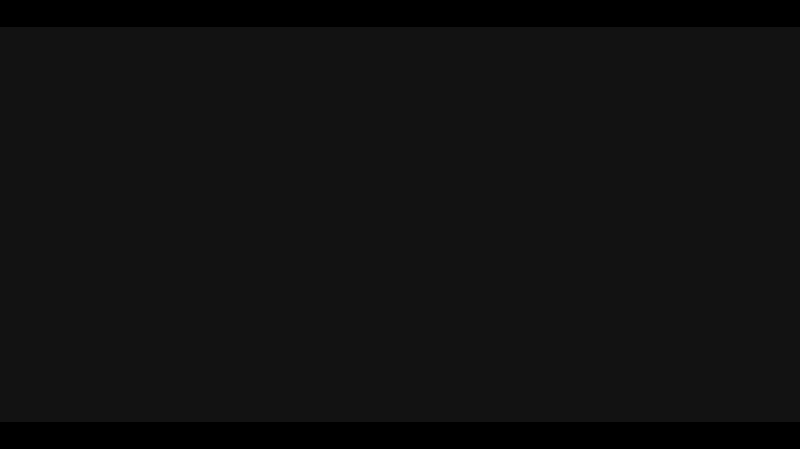
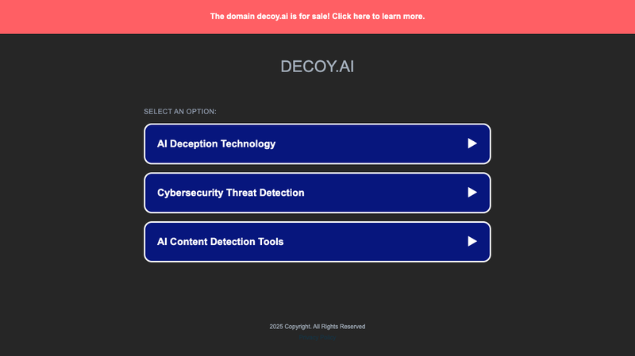
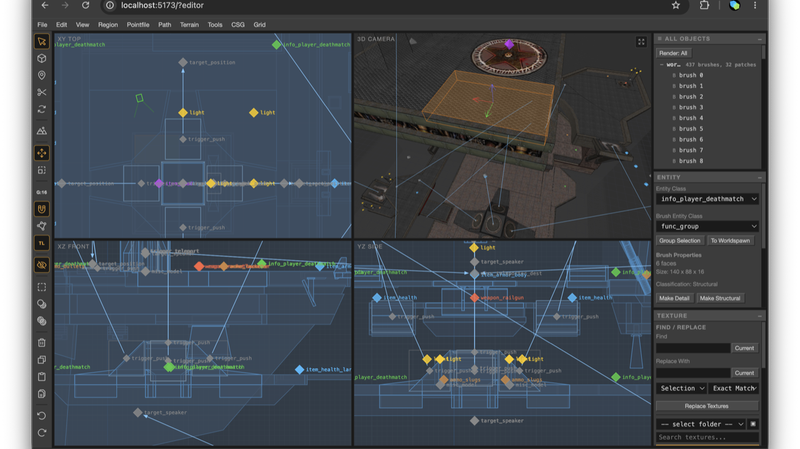
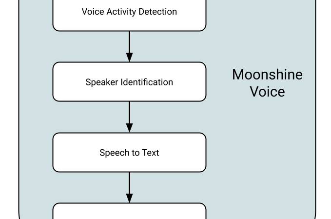
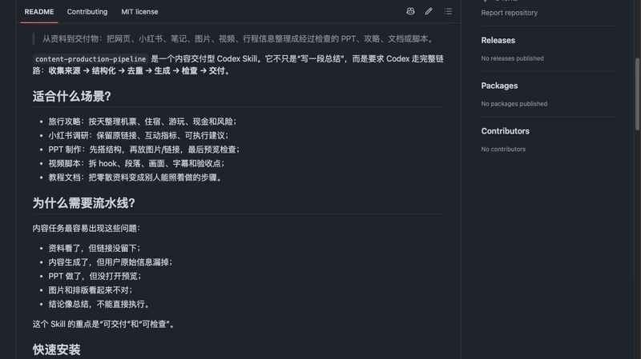
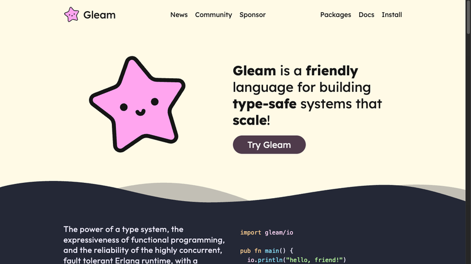
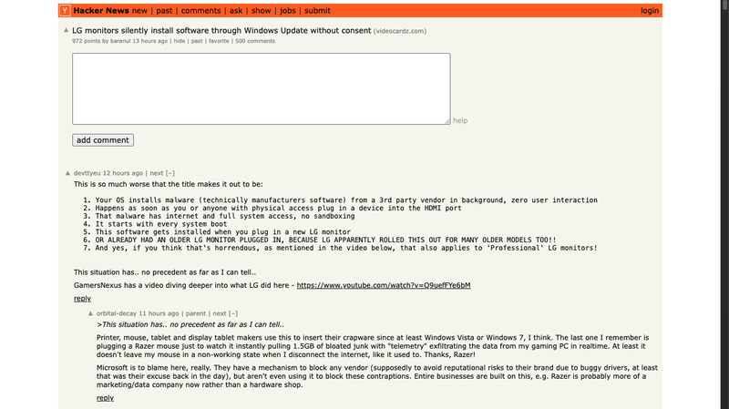

# 机器文摘 第 179 期

### Steam 手柄通过震动自己爬到充电座上

[Steam Controller Auto-Charge](https://github.com/FossPrime/Steam-Controller-Auto-Charge)，一个纯运行在浏览器端的开源项目，用摄像头和 WebHID 让 Steam Controller 靠自己的触觉马达"爬"到磁吸充电底座上。

原理分为三块：计算机视觉部分使用 OpenCV.js，通过俯拍摄像头捕捉手柄和充电座位置，用 Lucas-Kanade 光流法做追踪；控制部分通过 WebHID 协议直接连接 Steam Controller，向双 LRA 线性马达发送 70Hz 非对称触觉脉冲，让手柄朝着充电座方向蠕动；还有 PID 闭环控制，150px 以内自动降速缓爬，避免撞歪。最新 commit 还加了 Rust/WASM 的 CNN 做避障。

作者说这是一个"愚蠢的、浪费时间的"项目，但我觉得它恰好展示了 Web API 能做到什么——OpenCV.js、WebHID、WebAssembly 组合在一起，在浏览器里就能完成从视觉识别到硬件控制的完整闭环。不需要装任何软件，打开网页就能让手柄自己找充电座。开源 MIT 协议，325 Star。

### 用 Go 语法写零运行时 C 代码

[Solod](https://solod.dev)（简称 So），一个把 Go 代码翻译成可读 C11 的编译器。由 Anton Zhiyanov 开发，982 Star。

它的卖点很明确：写 Go 语法的代码，输出的是人能看懂的 C。零运行时——没有 GC、没有引用计数、没有隐式分配，所有内存默认栈分配，堆分配需要显式 opt-in。原生 C 互操作不需要 CGO，零开销。Go 工具链直接用——LSP、语法高亮、`go test` 都直接支持。

这到底是什么场景下需要？当你想要 Go 的表达力（结构体、接口、切片组合）和 C 的可移植性（嵌入式、系统编程、WebAssembly）时。Solod 输出的 C11 代码是能直接读懂的，不像其他转译器那样变成一团乱码。当然也有局限——它是 Go 的严格子集，很多 Go 特性（goroutine、channel、反射、map）都不支持。

### llama.cpp 怎么在普通电脑上跑大模型的

[How does llama.cpp run LLMs on everyday hardware?](https://outcomeschool.com/blog/how-does-llama-cpp-run-llms-on-everyday-hardware)，一篇由 Amit Shekhar 撰写的技术博客，来自 @蚁工厂 的微博推荐。

这篇博客把 llama.cpp 的核心技术讲得挺清楚。关键路径是：量化将 16-bit 权重压缩到 4-bit，7B 模型从 14GB 降到约 4GB，精度损失极小。通过 K-quant 分块量化加缩放因子的方式，配合 GGUF 单一文件格式打包量化权重、架构配置和分词器。再用 mmap 内存映射按需加载，启动几乎瞬间完成。CPU 计算通过 SIMD（AVX/NEON）做单指令多数据并行，也可以把部分层扔给 GPU。

对于不搞 ML 底层的开发者来说，这是一篇值得花 10 分钟读的科普——它解释了为什么现在一个普通笔记本也能跑本地大模型。

### 给开发者的打字测试工具

[HaxxorWPM](https://haxxorwpm.0s.is/)，一个面向开发者的打字速度测试工具，区别在于它不是拿普通英语单词来测你，而是用终端命令。

提供了 23 种模式覆盖开发全场景：Git 命令、Docker 操作、Python 代码、Vim 快捷键，甚至还有 Obfuscated Perl、IOCCC C、Malbolge 和 Movie Hacker 这种玩梗模式。每个字符独立着色——绿色正确、红色错误、删除线多余、半透明遗漏，精确到首个错误标记。实时显示 WPM、准确率、命令数、错误数四维统计。还有个排行榜，按键盘布局和型号区分。

界面是终端美学风格—深色渐变背景、红黄绿三色窗口栏、绿色 `$` 前缀。对需要经常在终端里打命令的开发者来说，练顺手了确实能省时间。

### Decoy Font：用 AI 生成防抄袭的混淆字体

[Decoy Font](https://decoy.ai)，一个用 AI 生成防抄袭混淆字体的项目。HN 上拿了 557 分。

简单来说，它给每个字母生成多个视觉相似的变体——比如字母"a"可以自动替换成看起来完全一样的"假 a"，但文字识别（OCR）和字体度量系统会识别出差别。这让截图/PDF 里的内容即使被截取，也很难被直接识别或抄袭。每个用户的字体变体是唯一的，造成了一种"视觉数字水印"的效果。

实现方式是用 StyleGAN 架构在字母形空间生成流形相近的变体，保证人眼看不出区别但机器能区分。每个字体文件包含每个字符的多个形变版本，在渲染时根据密钥动态替换。

### 在浏览器里编辑和玩 Quake 3 地图

[Q3Edit](https://q3edit.netlify.app/)，一个完全运行在浏览器中的 Quake 3 地图编辑器，64 分 Show HN。

编辑器用 WebGL2（从零构建渲染管线，没有用 Three.js）实现，四个视口：XY/XZ/YZ + 3D。q3map 编译器（id Software 原版 C 源码）通过 Emscripten 编译成 WASM 在浏览器端做 BSP/VIS/Light 编译。ioquake3 也被编译成了 WASM，所以编辑好的地图可以直接在浏览器中运行和测试。用 fflate 在浏览器端解压 PK3 纹理包。所有计算在客户端完成，零后端依赖。

一个浏览器应用把 Quake 3 地图编辑的全流程——编辑、编译、运行——都在浏览器里闭环了，不需要装任何工具。这无疑展示了 WASM 的可移植性。不过浏览器端的编译速度比本地慢，复杂地图的 Light 编译可能需要等一会儿。

### Moonshine Micro：0.8 美元的芯片上运行的完整语音流水线

[Moonshine Micro](https://moonshine-ai.github.io/moonshine)，一个在 0.8 美元的 RP2350 MCU（树莓派 Pico 2 那块芯片）上运行的完整离线语音流水线，RAM 占用约 470KB。

三个核心组件：TinyVadCNN（2 万参数 int8 模型做语音活动检测）、SpellingCNN（100 万参数 MobileNetV2 风格的孤立词识别，51 类）、还有神经双音子合成（RVQ 解码 + WORLD-lite 声码器 @ 16kHz，1.8MB 音色包）或者更轻量的 Klatt 格式合成器（零依赖）。所有推理完全离线，MIT 许可。

Pete Warden（TensorFlow Micro 创始人）参与的项目。目前只支持英文孤立词识别（不是连续语音），但能在几毛钱的芯片上跑一个完整的语音交互闭环，边界清晰明确。

### 内容生产流水线

[codex-skill-content-pipeline](https://github.com/AuClarke/codex-skill-content-pipeline)，一个用 Codex Skill 构建的内容生产流水线，来自 @Barret李靖 的微博推荐。

核心设计是定义一个标准化的内容生产流程：收集原始素材 → 标准化为结构化笔记（日期、主题、地点、来源、事实、建议）→ 根据交付物类型生产内容 → 验证质量。交付物可以是 PPT、Markdown 指南、视频脚本、社交媒体内容等。

本质上是把 AI Agent 的内容生产工作流开源出来——用 Codex 的自定义 Skill 机制定义了一套标准化步骤，把"把素材变成交付物"这件事模板化了。这在当前 AI 辅助内容生产的趋势下是一个很实用的参考架构。

### Gleam 语言从 GitHub 迁移到了 Tangled

[Gleam](https://gleam.run)，一门运行在 BEAM 上的静态类型函数式语言，它的官方主仓库从 GitHub 迁移到了 [Tangled](https://tangled.org) 平台，HN 192 分。

Tangled 是一个基于 AT Protocol（即 Bluesky 的协议）的下一代社交代码协作平台，联邦化、开源、支持 stacked PR（Jujutsu）和 microVM CI。Gleam 是 Tangled 至今获得的最重要的项目入驻。

传统观点认为"GitHub 的地位不可动摇"，但 Gleam 的迁移说明至少有一小部分开源项目在认真考虑去中心化代码托管。——Gleam 社区原本就是"非公司拥有"的理念，这与 Tangled 的去中心化和开源自治理念高度契合。

### LG 显示器通过 Windows Update 静默安装 McAfee

一个值得关注的技术新闻：LG 显示器通过 Windows Update 的驱动分发机制，向用户静默推送安装 LG Monitor App Installer，首次启动就展示 McAfee 广告。HN 上 968 分，GamersNexus 也做了深度调查（29 分钟视频）。

技术细节：这是通过 Windows Update 的驱动更新通道分发的，不需要用户任何交互就能自动安装。新旧型号（从 1 天到 3 年的都有影响）。安装的应用拥有完整系统权限和网络权限，没有沙箱限制。GamersNexus 因此退货了他们新买的 LG 34GX900A-B。

HN 社区普遍认为根本问题在 Microsoft——Windows Update 的审核机制没有发挥应有的作用，让这种明显不是驱动的"驱动"通过了审核通道。LG 有长期黑历史（电视内置广告、德克萨斯总检察长诉讼等）。

这其实是硬件厂商在用户设备上增加后门通道的一个典型案例。

## 订阅
这里会不定期分享我看到的有趣的内容（不一定是最新的，但是有意思），因为大部分都与机器有关，所以先叫它"机器文摘"吧。

Github 仓库地址：https://github.com/sbabybird/MachineDigest

喜欢的朋友可以订阅关注：

- 通过微信公众号"从容地狂奔"订阅。

