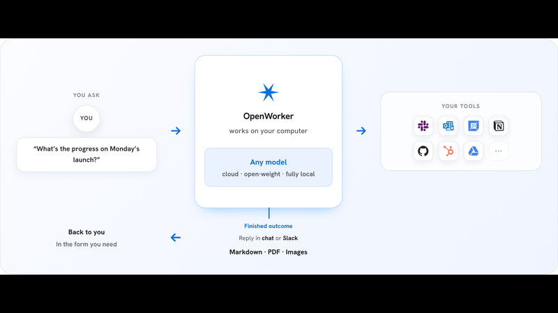
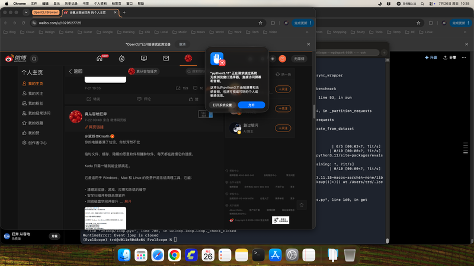
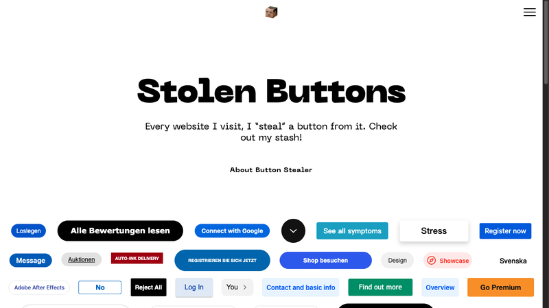
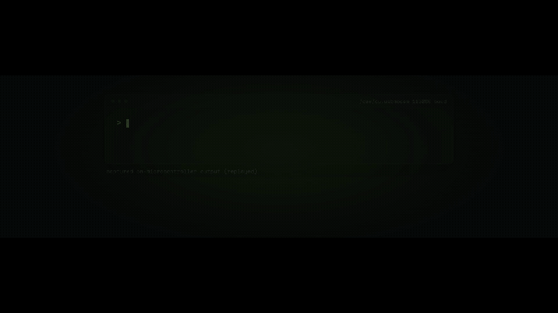
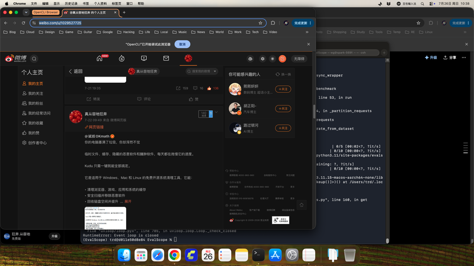
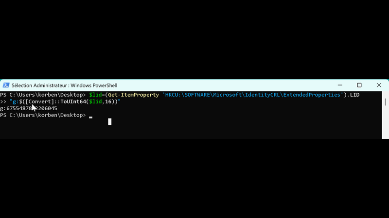
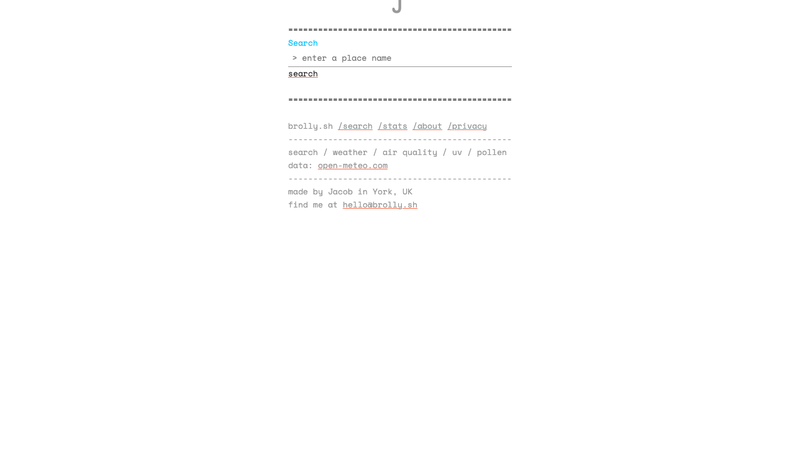
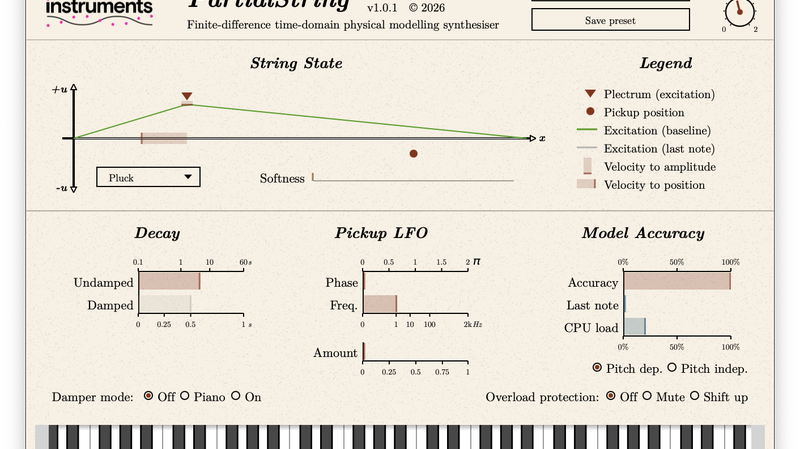

# 机器文摘 第 180 期

### 吴恩达的 OpenWorker：AI Agent 从聊天框走向交付件

[OpenWorker](https://github.com/andrewyng/openworker)，吴恩达最近发布的开源项目，一个定位为"AI 同事"的桌面级 Agent 框架。发布仅一周即获得 5,100 Star。MIT 许可证。

它的核心思路很直接：不止停留在对话层面，而是直接产出文档、回复 Slack、更新日历、处理 Jira 任务。架构是 Tauri 桌面壳 + React GUI + Python Agent 引擎（TurnEngine 自治循环），支持 25+ 工具连接器。模型无关，支持 OpenAI/Anthropic/Gemini/DeepSeek/千问/GLM/Kimi 等 15+ 提供商，也能接入本地 Ollama。

最有意思的设计是 TurnEngine——不是简单的 ReAct 循环，而是一个面向任务的自洽引擎，可以长期运行、恢复执行、处理中断。这跟 Cursor/Devin 那种"帮写代码"的 Agent 不太一样——它更像一个能并行处理多项工作的数字同事。

### Kudu：免费开源版的 CCleaner

[Kudu](https://github.com/AdventDevInc/kudu)，一个免费开源跨平台系统清理工具，1,609 Star，MIT 许可证。被称作开源替代 CCleaner 的靠谱选择。

它能清理浏览器、游戏、应用和系统的缓存，也带恶意软件扫描（YARA WASM 签名引擎）。支持 GUI 和 CLI 双模式，CLI 可输出 JSON 用于脚本化。清理规则用 JSON 文件定义，扩展性强。最新版 v1.45.0（2026-07-21），技术栈是 Electron 41 + React 19 + TypeScript + Vite 7。

跨平台支持 Windows、macOS、Linux，而且不是那种"一键安装全家桶"的清理工具。它的设计哲学是"做减法"——清理规则透明、操作可逆、不适合的系统组件会明确标注不建议清理。

### Stolen Buttons：一个从互联网上偷按钮的网站

[Stolen Buttons](https://anatolyzenkov.com/stolen-buttons)，一个网页艺术项目——Anatoly Zenkov 每访问一个网站，就"偷"一个按钮（Button UI 元素），收集在这个页面上展览。HN 上 594 分。

页面上展示了他从各种网站偷来的按钮：GitHub 的绿色 "Save" 按钮、Reddit 的 "Reply"、Twitter 的蓝色发推按钮……每个按钮下面标注了"偷窃"日期和来源。还有一个 Chrome 扩展 Button Stealer 可以自动完成偷窃，734 Star。

你可能会问这是不是恶意——按钮不会被移除或替换，只是复制样式存到他的页面上。一个完成度很高的互联网幽默项目。

### 在 8 美元的微控制器上跑 2890 万参数的大模型

[ESP32-AI](https://github.com/slvDev/esp32-ai)，一个在 8 美元的 ESP32-S3 微控制器上运行 28.9M 参数 LLM 的项目。HN 上 85 分。

核心创新是 Google Gemma 的 Per-Layer Embeddings（PLE）设计。传统方案把嵌入表存在 RAM 里，2500 万参数的嵌入表根本塞不进微控制器的 512KB SRAM。PLE 的设计把嵌入表存在慢速闪存中，每 token 只需从闪存随机读取约 6 行（约 450 字节），耗时仅 0.12ms。这使得微控制器能容纳相当于上一代方案 110 倍的参数量。

实测数据：端到端生成速度约 9.5 tok/s（int8 优化头），4-bit 量化后模型仅 14.9MB，闪存分区还剩 685KB。这个速度对于跑一个简单的对话模型来说已经可用了。

### 晶体管动画：用粒子模拟电流的流动

[Semiconductor Animations](https://brandonli.net/semisim/animations)，一个基于半导体物理方程实时模拟载流子运动的交互式 Java 模拟器，Show HN 137 分。

展示 9 个晶体管动画，覆盖 BJT、MOSFET、JFET 三种类型，分三组：基础模型、含扩散、带探针测量。视觉语言是蓝色代表电子、红色代表空穴、白色闪光代表复合事件。核心基于漂移-扩散模型做实时物理模拟，Web 版轻度演示 + 桌面版完整功能（含 IGBT/SCR 等复杂器件），已上架 Steam。

对于学半导体物理的人来说，这是一个比教科书直观得多的学习工具——你可以亲眼看到载流子如何在半导体中漂移和扩散，而不是靠想象。

### 安防摄像头登录页里藏着一个 GitHub Token

一个值得关注的安全事件：某安防摄像头品牌在登录页面的 HTML 源码中，嵌入了一个拥有 GitHub 组织管理员权限的 token。HN 上 596 分。

这不是偶然——摄像头通过 Windows Update 推送固件更新，登录页面的某个 API 调用中使用了一个硬编码的 GitHub 访问令牌。更严重的是这个令牌是 GitHub 组织的管理员级别权限，理论上可以访问和修改该组织的所有仓库。这意味着攻击者如果发现这个 token，可以篡改固件仓库、注入后门、然后通过 OTA 更新分发到所有设备。攻击面是完整的供应链级别。

问题本质不在于摄像头本身，而在于两个常见的安全错误：硬编码凭证和在前端暴露过多权限的 token。Tom's Hardware 和 Ars Technica 都有详细报道。

### GDID Windows：切断那个即使挂了 VPN 也在追踪你的标识符

[No-GDID](https://github.com/Korben00/no-gdid)，一个 Windows 开源工具，用于阻断微软的 GDID（Global Device ID）跟踪机制。HN 上 112 分。

GDID 是什么：一个 64 位的 MSA Device PUID，绑定微软帐户，存储在注册表中。即使是 fresh install 的新系统、即使你挂了 VPN，这个 ID 也会通过 CDPSvc → Device Directory Service → DoSvc 这条链路向微软服务器上报。三态架构：wlidsvc 签发 PUID、CDPSvc 注册到 Device Directory Service、DoSvc 上报到 Azure Monitor。

删除注册表项的方法是临时性的——重启服务或打开微软商店后，原值会从服务器重新下载。所以这个工具的缓解方案是直接禁用 CDPSvc/CDPUserSvc/DoSvc 三个服务，同时在 hosts 文件中屏蔽 5 个 DDS/DO 端点。

对于在意 Windows 隐私的用户来说，这是一个值得了解的工具。不过也要注意禁用这些服务可能会影响某些 Windows 功能（比如商店下载、跨设备同步）。

### Brolly：一个纯文字的天气预报网站

[Brolly](https://brolly.sh)，一个纯文字的天气预报网站，Show HN 136 分。作者 Jacob Sax，来自英国约克。

设计理念极简：纯文字、移动端优先单列布局、所有状态编码在 URL 中可分享、使用 `#` 柱状图做降雨可视化、ASCII 折线图做温度趋势、花粉热力图。没有任何图片、图表库、广告。数据源是 open-meteo.com（30+ 气象模型），后端 Go + PocketBase，自定义 LRU 缓存。前端纯 HTML/JS/CSS，无框架。

灵感来自 plaintextsports.com——一个纯文字体育比分网站。Brolly 是同一个理念的天气预报版本。当大多数天气网站越来越花哨（雷达动画、3D 地球、可交互地图）的时候，Brolly 选择了另一个方向：给你最需要的信息，用最快的方式。

### 一个旧专利启发的三边拉链

[Y-zipper](https://news.ycombinator.com/item?id=49054039)，一个受到 1982 年旧专利启发的三边拉链发明，HN 上 199 分。

普通拉链只能拉开或拉合两个边。三边拉链可以让三个边在一个拉链头上联动——想象一下一个三角形的口袋，一个拉链头就能同时打开或关闭三条边。发明者从一份 1982 年的旧专利中找到灵感，用现代材料和制造工艺重新实现。

这种拉链的应用场景可能是背包的快速开合口、帐篷的通风设计、或者是一些需要快速展开/收纳的户外装备。目前还不清楚是否有量产计划，但它展示了"从专利库里捡宝"的创新思路——很多老专利受限于当时的制造工艺无法实现，放到今天就可行了。

### 为 Playdate 掌机从零写一个 3D 渲染器

[Building a Tiny 3D Renderer for a Tiny Handheld](https://saffroncr.itch.io/katavatis)，Cristina Ramos 为 Panic 的 Playdate 掌机编写的从零开始的 3D 软件渲染器，服务于游戏 KATAVATIS。

Playdate 的硬件参数极其有限：ARM Cortex-M7 @168MHz、400×240 1-bit 黑白显示屏、无 GPU。在这上面跑 3D 是自讨苦吃——但作者做到了。技术实现：加载 Quake BSP 地图文件（复用 TrenchBroom + ericw-tools），PVS 可见性裁剪大幅降低渲染开销。纯 CPU 软件渲染管线：顶点变换 → 裁剪 → 透视校正纹理映射 → 16-bit 深度缓冲 → 1-bit Bayer 抖动输出。视觉方向选择了 1-bit 卡通渲染风格（参考 Obra Dinn + Jet Set Radio）。关键优化包括半分辨率渲染（200×120→400×240）和自定义 ARM Cortex-M7 汇编数学函数。

在黑白屏掌机上跑 3D 这件事本身就很有趣——不是因为实用，而是因为"不应该能跑"。作者用极具创意的方式解决了性能瓶颈。

### PartialString：FDTD 物理建模弦合成器

[PartialString](https://differentinstruments.com)，一个基于 FDTD（有限差分时域法）的物理建模弦合成器插件，由 Christian Baker（Different Instruments）开发，免费（PWYW），支持 AU/VST3。

核心原理是用 FDTD 在时域中实时求解一维波动方程，将弦离散化为位移点阵列，模拟拨弦振动的传播与拾音。支持 10 复音、拾音器 LFO（可达音频速率）、可调衰减/制音器、精度控制。作者的学术背景来自爱丁堡大学 Stefan Bilbao 团队（2009 年 MSc）。

大部分人可能用不到插件式的弦合成器，但这个项目有趣的地方在于它把几十年前的物理模拟算法（FDTD 最初用于电磁场模拟）搬到了实时音频 DSP 里。原理很简单：弦就是一根一维的波动方程，边界条件决定音色。但能做到实时、低延迟、10 复音的插件，体现了作者在 DSP 工程上的功底。

## 订阅
这里会不定期分享我看到的有趣的内容（不一定是最新的，但是有意思），因为大部分都与机器有关，所以先叫它"机器文摘"吧。

Github 仓库地址：https://github.com/sbabybird/MachineDigest

喜欢的朋友可以订阅关注：

- 通过微信公众号"从容地狂奔"订阅。

