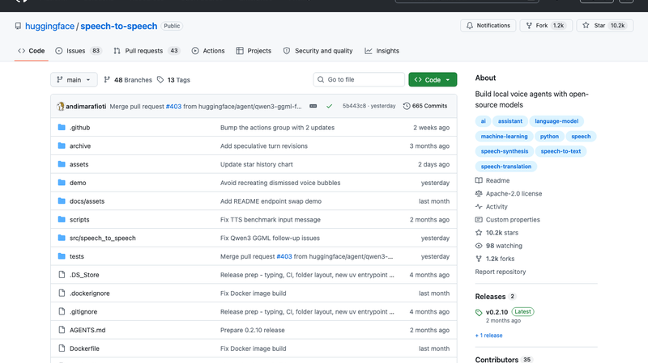
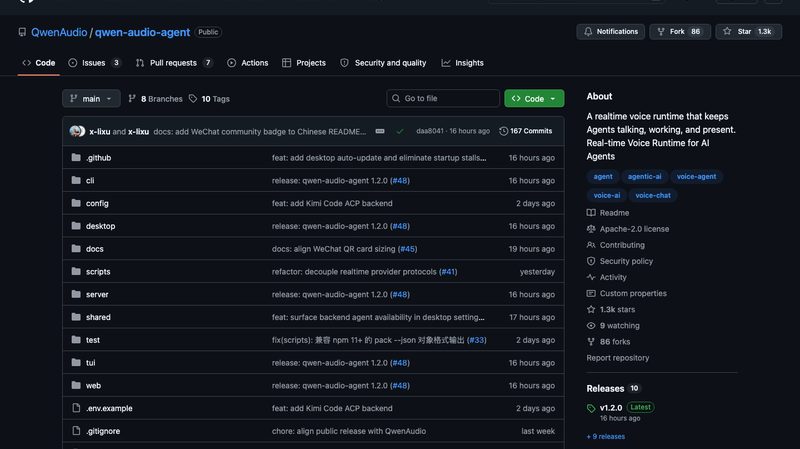
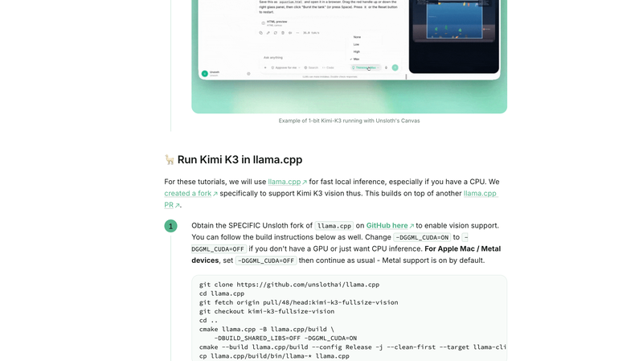
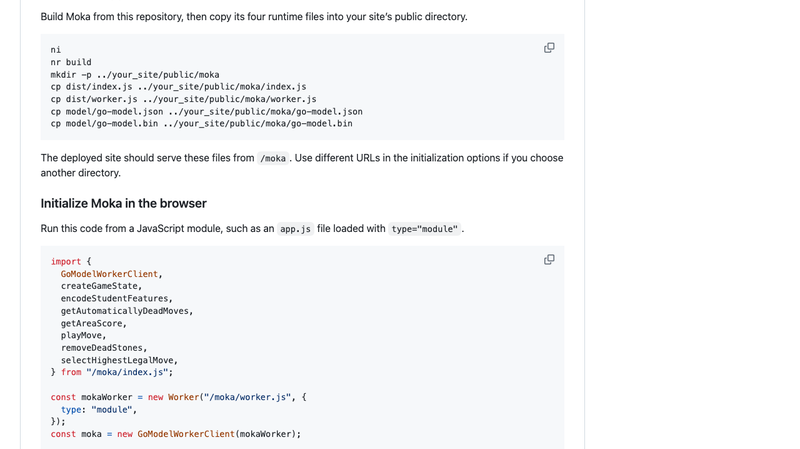
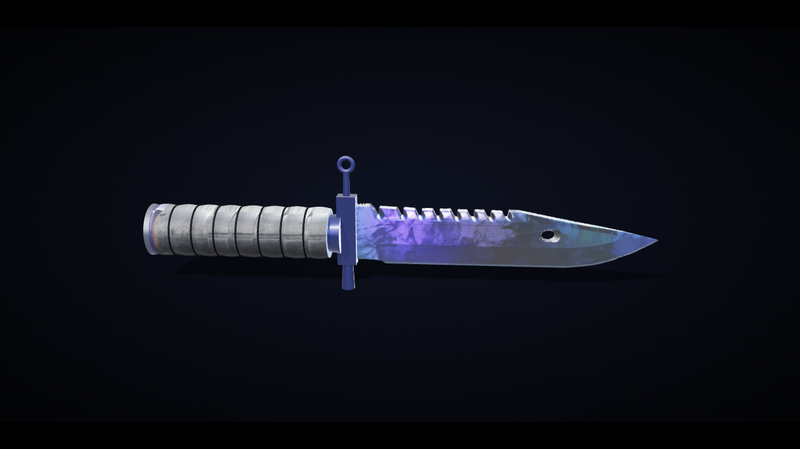
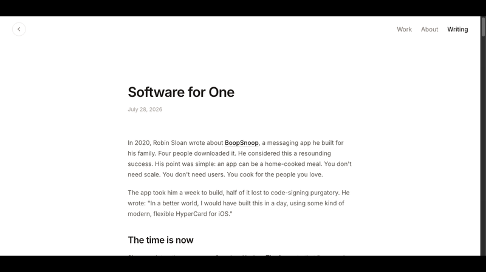
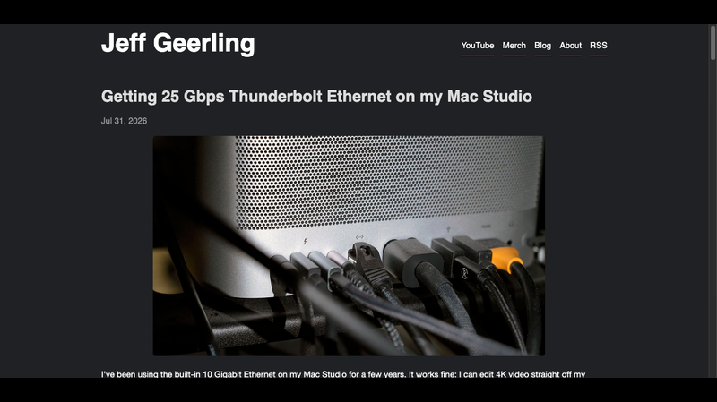
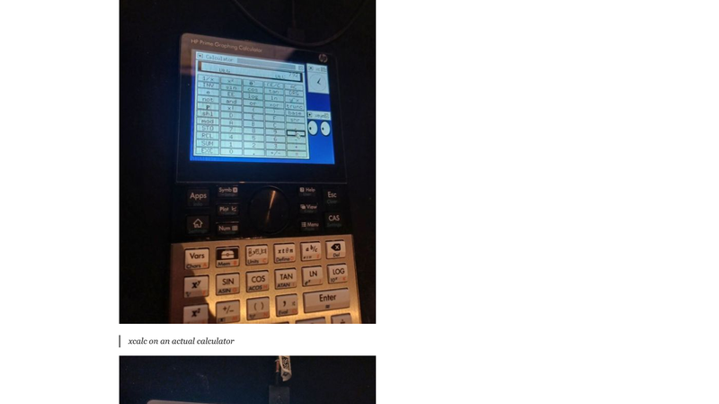
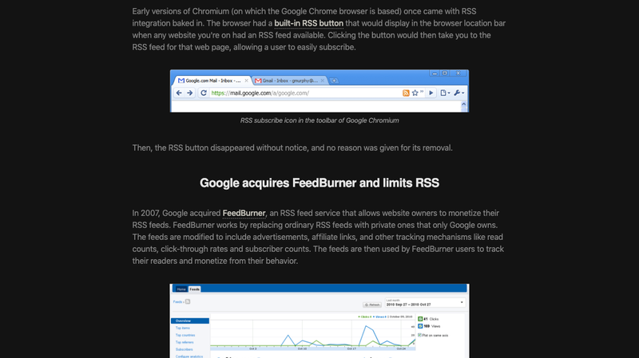

# 机器文摘 第 181 期

### Hugging Face 的开源语音智能体框架：让 AI 开口说话

[Hugging Face speech-to-speech](https://github.com/huggingface/speech-to-speech)，一个低延迟的模块化语音智能体框架，10.2k Star，Apache-2.0，活跃维护中（v0.2.10，昨天还有提交）。

流水线很清晰：麦克风音频 → VAD（语音活动检测）→ STT（语音识别）→ LLM（大模型）→ TTS（语音合成）→ 播放音频。每个组件独立线程 + 队列，可以自由替换：STT 默认用 Parakeet TDT，也支持 Whisper、Faster-Whisper、MLX、Paraformer；LLM 支持 OpenAI 兼容 API、transformers、mlx-lm，可接 vLLM、llama.cpp、HF Router；TTS 默认 Qwen3-TTS，也支持 Kokoro、Pocket TTS、ChatTTS、MMS。对外暴露 OpenAI Realtime 兼容的 WebSocket/WebRTC API。

几个值得注意的设计：支持 4 种运行模式 + WebRTC、工具调用双路径、CancelScope 打断机制——用户随时可以打断 AI 说话，还有推测性轮次来减少延迟。官方背书：已经跑在数千台 Reachy Mini 机器人上。

延迟方面 README 很诚实：LLM 单次前向传播是最大的延迟源，不承诺绝对毫秒数。降延迟的手段是全程流式、关掉思考（reasoning_effort none）、Qwen3-TTS 用 GGML/6bit 量化、VAD 轮转参数、即时打断。还附带了官方 benchmark 脚本（TTFT/RTF/首块音频）可以自行复测。

中文支持开箱即用：Whisper/Paraformer + Qwen3-TTS/ChatTTS，`--language zh` 就行。

### Qwen-Audio-Agent：给 Agent 装上耳朵和嘴巴

[Qwen-Audio-Agent](https://github.com/QwenAudio/qwen-audio-agent)，阿里 2026-07-28 开源的实时语音运行时，1.3k Star，Apache-2.0，Node.js 实现。

核心价值一句话：给你的 OpenCode、OpenClaw、Codex、Claude Code 等 Agent 加上"耳朵和嘴巴"，让你像打电话一样跟它们协作——你边说边想，它边听边干活。支持随时打断、追问、取消，结果自动回到对话。

架构分三层：L1 实时前台（Qwen Audio 3.0 Realtime + WebUI/TUI/macOS 桌面悬浮球）；L2 网关协调层（Voice Gateway + TaskManager 状态机 + ACP 适配器，前台只暴露 6 个工具，非阻塞请求流）；L3 可选持久执行层（固定后台 Agent Session，复用你现有的工具/MCP/Skill/认证）。

和 OpenAI GPT-Live（2026-07-08 发布）对比很有意思：两者殊途同归——前台语音 + 后台深度工作并行。但 GPT-Live 是闭源模型族，内部委托 GPT-5.5，API 未开放；Qwen-Audio-Agent 是开源 Harness，语音模型只管听说路由，"做"交给 ACP 标准协议接入的任意 Coding Agent。生态开放是最大差异。

### Kimi K3 的 1-bit 量化：2.8 万亿参数压缩到 594GB

Unsloth 团队成功将月之暗面 2.8 万亿参数的 Kimi K3 模型，通过动态 1-bit 量化从 1.56TB 压缩到 594GB，体积缩减 62%，保留约 78.9% 的精度。

这意味着原本需要 8 张 H100 显卡集群才能跑起来的顶级模型，理论上可以在顶配 Mac Studio 等消费级硬件组合上运行。内存需求约 610GB（统一内存的顶配 Mac Studio 是 512GB，接近但还差一点；不过这个数字说明方向是对的）。

量化原理是动态 1-bit——不是简单的把权重全变成 1 bit，而是对关键层和敏感参数做动态调整，保留更多精度，PPL 从 baseline 的 2.5789 只劣化了很少。1-bit 量化在过去几年一直是"理论可行、工程难做"的方向，Unsloth 这次把 2.8T 参数的模型做到了 594GB，说明技术已经成熟到可以规模化应用。

### Moka：100KB 的围棋模型

[Moka](https://github.com/millionco/moka)，一个只有 100 多 KB 的围棋模型，专门用来下围棋。从 KataGo（类似 AlphaZero 的开源围棋程序）的对局中蒸馏出来。在线演示：million.dev/moka。

100KB 是什么概念？一个典型的 7B 参数大模型是 4GB+，Moka 只有它的十万分之一。它做对了什么：围棋是高度结构化的场景，把 KataGo 强大模型的能力压缩到"狭窄场景的小模型"——只用围棋一个场景，模型可以做得极小。

对于学习"怎样把一个强模型的能力压缩成某个狭窄场景的小模型"这件事，Moka 是一个绝佳的案例。它证明了模型蒸馏的威力：不需要每次都跑大模型，特定任务用几百 KB 的专用模型就够了。顺带一提，KataGo 这两天正和申真谞对弈。

### img2threejs：一张照片变成 Three.js 代码

[img2threejs](https://github.com/gkjohnson/img2threejs)，一张照片 → 程序化 Three.js 代码，无需网格、无需手动建模。v1.3 版本在几何重建、材质生成、验证和整体输出质量方面有重大改进。

演示里作者用了一张 CS2 M9 Bayonet | Doppler Phase 3 的参考图，直接生成了可动画的 3D 模型代码。技术路线是几何重建（从单张图推断形状）+ 材质生成（根据图像内容生成材质参数）+ 自动验证（渲染结果与原图对比）。

这类工具的价值在于把"3D 建模"的门槛大幅降低——以前你需要掌握建模软件、UV 展开、材质编辑器，现在只需要一张照片和一个 Codex 插件。当然，单张图片的几何重建天然有歧义（正面看不到背面），输出质量的边界也在这里，但作为原型工具已经非常好用。

### Software for One：只为一个人写的软件

[Software for One](https://awaxman11.github.io/blog/2026/07/28/software-for-one/)，Adam Waxman 的文章，HN 上 241 分。核心命题：AI 智能体让"只为一个人写的软件"首次成为主流可行——应用就像家常菜，用自然语言描述，agent 就帮你建出来。

作者在 6 个月里为自己做了 5 个应用：睡眠顾问计划应用（一周晚上建成）、奶昔随晨跑配比的健身应用（一个周末）、由比赛成绩而非年龄推导的马拉松计划、爵士和弦测验（一个晚上）、医疗记录缺口工具。技术栈 Next.js + Vercel + Tailwind + shadcn + Better Auth + Neon + Drizzle + Claude Code，成本约 $160/月。

核心观点：构建成本断崖式下降，想象力成为瓶颈；短暂（ephemeral）应用也没关系（睡眠应用用 4 个月就退役）；个人应用通用模式是"聚合多数据源 + LLM 生成洞察"（健身应用融合 Strava/Oura/Withings/FatSecret）；软件主权——无改版、无广告、无转型。

评论区 tptacek 高赞回复：他一个月自建了 7 个应用。质疑方认为"大多数人只要点一下就好用的便利"。这确实是这个时代最有趣的软件形态变化之一：软件从"给一百万人的产品"变成"给一个人的工具"。

### NAS 正在变得糟糕的十种方式

[NAS Compares](https://nascompares.com) 的文章《Ten Ways NAS Is Getting Enshitified》，HN 上 186 分，讲成品 NAS 从开放模块化节点沦为封闭"家电"的趋势。

十个论点：1）x86 平台焊死 LPDDR 内存，不可升级、坏一颗芯片换整板；2）中端机型仍配 1GbE，10GbE/5GbE 人为分层收高溢价；3）硬盘锁定（Synology 最甚）：第三方盘警告/禁建池/禁健康监控；4）集成小容量系统盘（eMMC/UFS/64GB M.2），挤占用户 NVMe 插槽、坏即整机报废；5）PCIe 通道削减：宣传 USB4/10GbE/4×M.2，实际走 Gen3 x1/x2；6）2-4 年旧硬件换型号重发，掩盖硅片年代、重置 MSRP；7）硬盘容量挤压：1/2TB 停产、16TB+ 优先云厂商，装满盘成本是机器 2-4 倍；8）无 DRAM SSD + NAND 通道减少，NAS 持续写入/重建池性能大跌；9）软件内存需求 2GB→4-8GB + 厂商用不知名内存；10）软件同质化：新兴品牌全用 Debian 套壳。

结论：成品 NAS 的 TCO 上升、DIY 差距拉大。买 NAS 之前值得读一下这篇文章，能帮你避开很多坑。

### 在 Mac Studio 上跑 25 Gbps 雷电以太网

一篇技术文章：如何在 Mac Studio 上实现 25 Gbps Thunderbolt 以太网，HN 191 分。

实现方式是用 Thunderbolt 转 25GbE 网卡（雷电 4 的带宽足够），配置后实测可以跑到 25 Gbps。文章详细讲了硬件选择、驱动安装、网络配置、以及实测性能数据。

对大多数用户来说 25GbE 是过剩的，但对有 NAS 高速互连、视频剪辑工作站、或者搞超算/ML 训练的人来说，Thunderbolt 生态让高速以太网变得容易获得——不需要换服务器网卡、不需要 PCIe 插槽，一根雷电线就搞定。

### Anime User Interfaces：动漫里的 UI 设计

[Anime User Interfaces](https://animeuis.tumblr.com/)，一个收集动漫中出现的用户界面的项目，HN 54 分。

动漫作品（尤其科幻题材）里的 UI 是很有意思的设计素材：攻壳机动队的全息界面、新世纪福音战士的驾驶舱 HUD、银翼杀手的未来霓虹招牌……这些虚构 UI 往往比真实产品的 UI 更敢想——全息投影、脑机接口、3D 空间操作。收藏这些界面不只是宅文化，更是对"界面设计还能长什么样"的想象力库。

对做界面设计、游戏 UI、或者纯好奇的人来说，这是个很轻松的浏览项目。

### 你的计算器能跑 Linux 吗？

[But can your calculator run Linux?](https://raymii.org/s/articles/But_can_your_calculator_run_Linux.html)，58 分 HN 帖，作者 Remy van Elst 亲自给 HP Prime G2 图形计算器移植了 Linux。

HP Prime G2（2018 年版）的硬件配置"强得离谱"：i.MX 6 UltraLite（ARM Cortex-A7）+ 256MB DDR3 + 512MB 存储 + 触摸屏——原机只跑 FreeRTOS，但硬件已经相当于一台小型嵌入式 Linux 机器。

怎么做到的：拆机（4 颗螺丝）→ USB 连接 → 按 RESET 同时短接 2 个焊盘 → 用 NXP 的 uuu 工具把 Linux 镜像直接引导进 RAM（不刷 NAND，原系统不丢）。作者修复了键盘驱动、触摸屏驱动（Ilitek ILI211X）、USB 串口死锁、RAM 引导上限从 15MB 提升到 130MB。成果：root 无密码登录 → startx 跑 X11（twm/xeyes/xclock/xcalc）→ 跑 Doom → 自带 tcc 编译器可机内写代码。

花絮：有人给 G2 移植了 UEFI + Windows 10，"在计算器上跑 Windows 的计算器 calc.exe"。跑不了 Linux 的计算器：TI-84+ CE（48MHz eZ80）、NumWorks（Cortex-M7）、Casio FX-CG50（118MHz SH7305）。

### Google 如何帮助摧毁了 RSS

[How Google helped destroy adoption of RSS feeds](https://openrss.org/blog/how-google-helped-destroy-rss)，Open RSS 团队的文章，HN 上 959 分（2024 年首发）和 382 分（2026 年重发）。

文章用"拥抱-扩展-扼杀"（Embrace, Extend, Extinguish）框架控诉 Google 反复利用 RSS 锁定用户后移除支持，时间线包括：Chromium 内置 RSS 按钮无声移除；2007 年收购 FeedBurner 后 2012 年关 API、2022 年砍服务；2013 年 7 月 1 日关闭 Google Reader（官方称"使用量下滑"，工程师称一直有人想杀它）；2013 年 Google Alerts 移除 RSS 后迫于抵制恢复；2017 年 12 月彻底关闭 Google News 的 RSS；Chrome RSS 扩展"误删"；2021 年宣布"带回 RSS"后无下文。

RSS 是开放协议的典型代表——它不属于任何公司，任何人都可以订阅任何来源。Google 作为最大的流量入口，通过一次次"集成然后关闭"的操作，客观上扼杀了 RSS 的普及。这个案例对今天的开发者有借鉴意义：当你把命运寄托在一个平台巨头对开放协议的"支持"上时，这个支持随时可能被收回。

## 订阅
这里会不定期分享我看到的有趣的内容（不一定是最新的，但是有意思），因为大部分都与机器有关，所以先叫它"机器文摘"吧。

Github 仓库地址：https://github.com/sbabybird/MachineDigest

喜欢的朋友可以订阅关注：

- 通过微信公众号"从容地狂奔"订阅。

