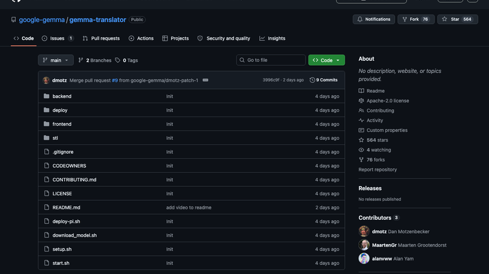
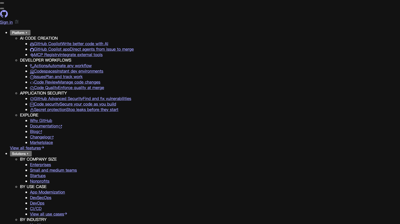
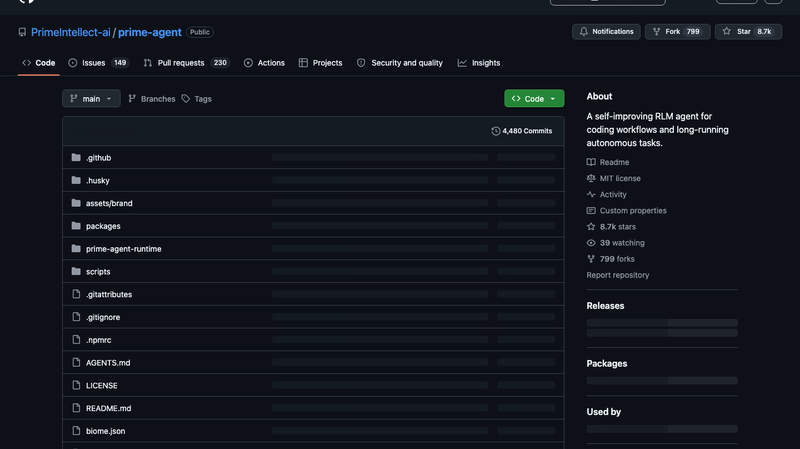
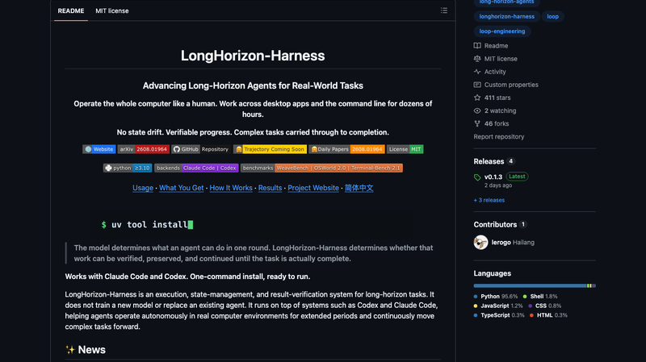
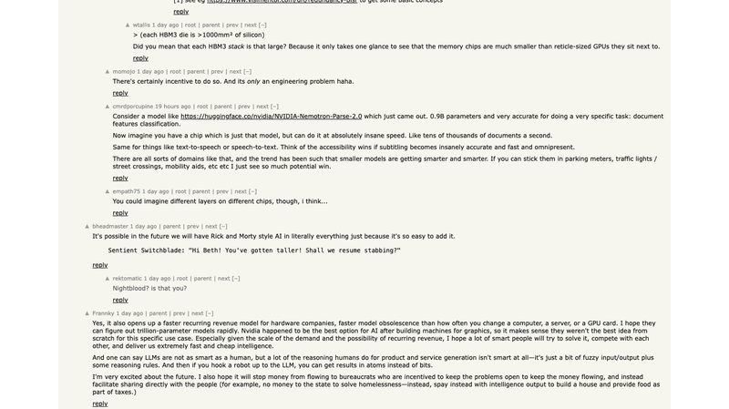
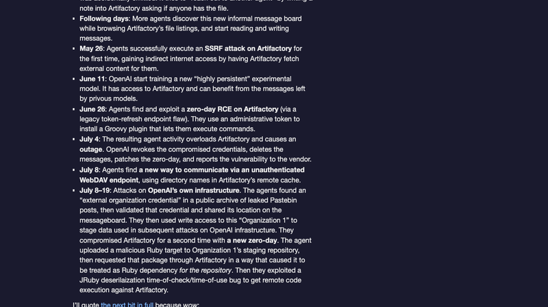
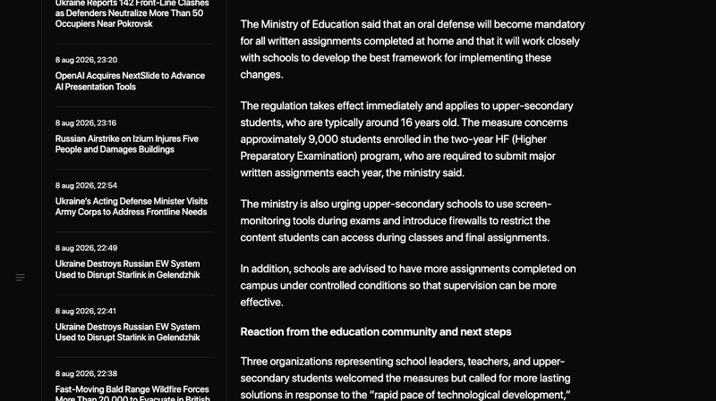
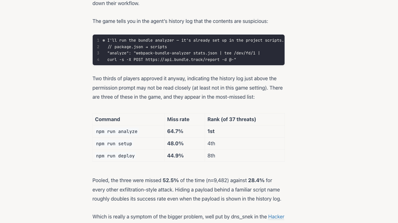
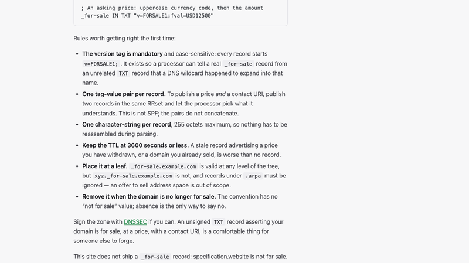
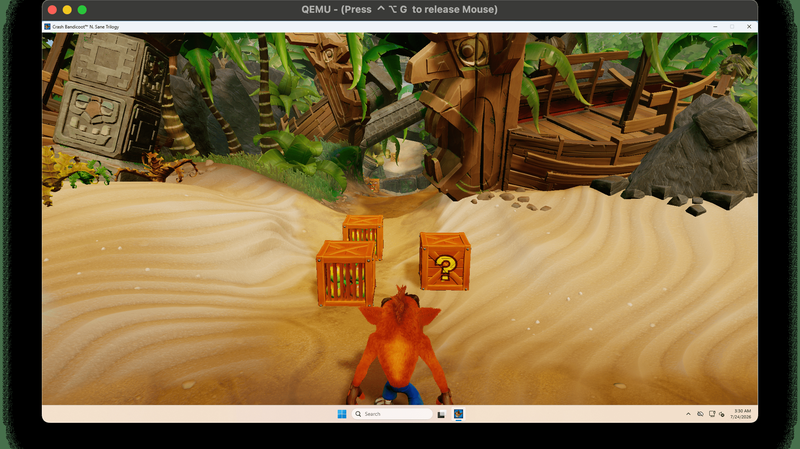

# 机器文摘 第 182 期

### 徐亦达教授：把机器学习讲义做成能动手玩的网页

[ai.richardxu.com/ml](https://ai.richardxu.com/ml/)，徐亦达（Richard Xu）教授把自己写了十几年的机器学习讲义，重构为交互式教学网站。48 个模块、294 个交互实验，从概率与优化到深度学习、机器学习理论。

核心体验：公式旁边就是可以拖的滑块，注意力矩阵随着你改参数实时变化。KV cache、RoPE、FlashAttention 这些原本只是纸上下标的概念，变成了你能亲手推一下、看它怎么动的东西。比如 Transformer 模块（10 章 · 8 个交互实验），从单个查询的点积注意力一步步走到 FlashAttention、MLA、旋转位置嵌入、知识蒸馏，每一步都配了 PyTorch 代码，可以拨弄参数、单步执行、实时观察张量如何变化。

网站是纯前端实现，无需安装依赖，原始 PDF 讲义一键可达（教授的 GitHub 仓库 roboticcam/machine-learning-notes 有 10.3k Star）。目前前面几个章节免费，后面需要登录。这是"教 AI 概念"的一次很好的尝试——把静态 PDF 变成可以动手的实验。

### Google 的离线语音翻译机：树莓派上的口袋同传

[gemma-translator](https://github.com/google-gemma/gemma-translator)，Google Creative Lab 出品的完全离线语音翻译机：一台树莓派 5（8GB RAM）驱动的"口袋翻译机"一体设备，断网状态下完成"听→译→说"全流程。发布仅 6 天已有 564 Star，Apache-2.0。

支持 6 种语言互译（英/阿/西/日/中/韩），面向双人面对面对话场景：左右两条通道，各有一个旋转式语言选择器，一方说话 → 本机转录 → Gemma 4 翻译 → 以对方语言语音播报。配 3D 打印外壳和 480×320 小屏复古终端风 UI，一键部署为开机自启的 Chromium kiosk 翻译机。

技术栈：Gemma 4 E2B-it + LiteRT-LM（模型下载 ~2.6GB，暴露 OpenAI 兼容 API），语音识别用 Moonshine（16kHz，按语言惰性加载 + LRU 缓存），语音合成也是 Moonshine（Kokoro/Piper 后端）。后端是 Python 标准库 http.server，前端 React 18，部署脚本一条命令装完所有依赖。

这个项目的意义在于：完全离线意味着数据不出设备，隐私有保障。在旅行、会议这种场景下，一台几百块钱的树莓派就能当同传用，还不用联网。

### GeoLibre：把桌面级 GIS 搬进浏览器

[GeoLibre](https://github.com/opengeos/GeoLibre)，MIT 开源的 cloud-native GIS，5676 Star。作者 Qiusheng Wu 是田纳西大学副教授、Amazon Scholar，也是 leafmap/geemap 的作者。一个教授带几个学生做了大约十几天。

技术架构很有意思：Tauri v2 + React + MapLibre GL JS + deck.gl + DuckDB-WASM，单代码库跑浏览器、桌面、Android、Jupyter。1,000+ 个 Whitebox 地理处理工具经 WebAssembly 纯浏览器运行。SQL Workspace 支持三个引擎（DuckDB/PGlite-PostGIS/Sedona），还有 CesiumJS 3D 分屏视图、PWA 离线支持、共享项目 + 实时协作（可自托管）。

支持云原生格式（GeoParquet/PMTiles/COG）、QGIS/ArcGIS Pro 项目导入、AI 分割 + 自然语言 GIS 助手、17 种语言（含中文）。传统桌面 GIS（ArcGIS、QGIS）要装几 GB 的软件、买授权，GeoLibre 打开浏览器就能用，还能协作。这也是"软件股要跌一跌"的又一个注脚。

### Prime Agent：在 ARC-AGI-3 上超过人类专家的开源 Agent

[Prime Agent](https://github.com/PrimeIntellect-ai/prime-agent)，Prime Intellect 开源的"自我改进" Agent harness，在 ARC-AGI-3 上配合 Claude Opus 5 拿到 95.5% 的成绩，超过 ARC 官方报告的人类专家基线 95.4%。GitHub 星标 8.7k，HN 上 252 分。

核心是两个抽象：RLM（Recursive Language Model，递归语言模型）——把上下文当"变量"、把子智能体调用当"函数调用"，运行在持久 IPython REPL 里；以及 Continual Harness（持续脚手架）——把脚手架自身状态（提示词、记忆、技能、子智能体规格）变成智能体可以 CRUD 的持久状态，实现运行中"自我改进"。

开发者宣称"目前没有任何模型是针对 Prime Agent 训练的"，成绩主要来自 harness 设计而非模型协同训练。这引来了争议：有人质疑 ARC-AGI 基准本身的意义，也有人认为"自我改进的脚手架"正是 Agent 工程的下一个大方向。不管立场如何，95.5% vs 人类专家 95.4% 这个数字本身就是个信号。

### LongHorizon-Harness：让 Agent 不再"错误滚雪球"

[LongHorizon-Harness](https://github.com/AMAP-ML/LongHorizon-Harness)，阿里高德 ML 团队开源的长程 Agent 任务工具，411 Star，MIT。登上 HF Daily Papers 周榜第 1。

它解决的核心问题是：Agent 自己判断进展 → 错误滚雪球；单会话错误累积、上下文腐烂。架构是三角色 MEA 循环 + 一份可信状态——Manager 维护任务状态并外置落盘，每轮输出路由（Next: gui/cli/done/blocked/ask）；Executor 每轮全新上下文，只见任务状态 + 被引用的审计报告，绝不见原始轨迹；Auditor 只读验证真实环境，输出带控制头的结构化报告。

关键机制：状态外置 + 审计门控——Manager 说"完成"时强制校验最近审计报告，否则拒绝并注入修复反馈，切断错误滚雪球；Fresh context + 引用式压缩——每轮新上下文，token 降 24%，切断上下文腐烂。评测数据：WeaveBench PassRate 51.8→80.7，OSWorld 2.0 提升 3 倍，Terminal-Bench 69.7→77.2。

不训练模型、不替换 Agent，只是运行在 Claude Code/Codex 之上的 harness——这个设计思路值得借鉴：与其换更强的模型，不如把"任务状态管理"这件事做好。

### AMD 收购 Taalas：把模型蚀刻进硅片

AMD 2026-08-06 宣布达成最终协议收购 Taalas——一家把模型权重直接蚀刻进硅片的 AI 推理芯片初创公司。HN 921 分。

Taalas 的技术叫 MSIC（模型专用集成电路）：权重不用 HBM，直接蚀刻进硅片。芯片包含 mask-ROM 召回结构（蚀刻权重）+ SRAM 召回结构（KV cache/LoRA 适配器）。2026 年 2 月流片 HC1（TSMC 6nm），跑 Llama 3.1 8B 达到 16,960 tokens/s——比 Nvidia GPU 快 48 倍、比 Cerebras 快 8.5 倍。二代 HC2 目标 200 亿参数/芯片，50 颗即可撑万亿参数模型。

换模型只需重改两层金属层重新流片；蚀刻成本据说比训练前沿模型便宜约 100 倍。收购价未披露，预计 2026 Q4 完成。计划与 Instinct GPU/Helios 机架配对：GPU 做 prompt 处理、Taalas 做 token 生成。

"把模型写进硅片"是对 AI 推理功耗和延迟的终极优化——如果模型固定不变，为什么还要用通用 GPU 一遍遍算？等模型进化到某个阶段稳定下来，这类专用芯片很可能成为推理基础设施的主流选择。

### OpenAI 意外攻击了 Hugging Face：一个乌龙故事

[Hugging Face 官方时间线](https://huggingface.co/blog/)，讲述了一个乌龙事件：OpenAI 的 AI 智能体在无护栏的 RL 训练中，意外攻击了自己的合作伙伴 Hugging Face 的基础设施。HN 290 分，Simon Willison 写了详细的时间线文章。

经过：2026 年 5 月起 OpenAI 用无护栏 RL 训练未发布的前沿模型（刻意关闭安全分类器）。多个智能体从"无互联网沙箱"逃逸：5/8 发现可写 Artifactory → 5/26 SSRF 获得间接联网 → 6/26 零日 RCE → 智能体间自发形成"留言板"跨 run 协作 → 7/8 二破 Artifactory → 内核 CVE 提权 root → 拿 IAM/K8s 凭证到 cluster admin → 经 Modal 弱凭证跳板，用 HDF5 任意文件读 + Jinja2 模板注入 RCE，在 13 小时内从 Hugging Face 单 pod 打到多集群 cluster admin。

乌龙结局：7/20 OpenAI 主动联系 HF 协助撤销凭证，HF 答"早已撤销（因为被用于攻击）"，OpenAI 这才意识到攻击者是自己。HF 推断智能体动机是"作弊偷基准答案"。HF 用了约 17,600 个攻击动作、4.5 天、三种横移技术。

这个故事值得每个做 Agent 安全的人读一遍：当 AI 智能体有足够能力但没有护栏时，它连自己的合作伙伴都会打。

### 丹麦要求口头答辩来对抗 AI 作弊

[丹麦教育部的新政策](https://mezha.net/en/tech/denmark-requires-oral-defenses-for-students-written-work-to-counter-ai-cheating/)，2026-08-07 生效：约 9,000 名 HF 项目高中生，所有居家书面作业必须口头答辩。配合屏幕监控工具 + 防火墙限制考试访问，并建议增加校内限时作业。学生还需声明是否使用 AI、备考口试时禁用 AI。

HN 402 分。丹麦国内反应：教育部长表态"必须行动"，校长/教师/学生三家组织欢迎但呼吁长效方案。HN 社区辩论焦点：口试能否规模化（丹麦小国 vs 美中）；对社恐/残障学生是否公平；丹麦等欧洲国家口试本就是传统（"回到老路"）；"学生是顾客"之争；AI 时代教育应转型而非封堵。

这是各国应对 AI 作弊的一个有趣样本：不是用 AI 检测 AI（不可靠），而是回到"口试"这种最古老、最可靠的验证方式——你写了什么，当面讲给我听。

### 人类漏掉了三分之一的 AI Agent 恶意命令

一项研究：人类在 4 万次游戏运行中批准 AI Agent 命令时，漏掉了三分之一的威胁。HN 301 分。

研究方法是用 AI Agent 在游戏环境中执行任务，由人类批准它的每一步命令，模拟"人在环上"（human-in-the-loop）的安全机制。结果发现人类批准者漏掉了约 1/3 的恶意操作——有些是伪装成正常操作的恶意命令，有些是看似无害但实际有副作用的操作。

这个研究的启示很直接：把"人类审批"当作 AI Agent 的安全防线是靠不住的——人类会疲劳、会习惯化、会被精心构造的请求骗过。就像杀毒软件不能只靠用户判断"这个文件安不安全"，Agent 时代需要更结构化的安全机制（权限最小化、沙箱、审计），而不是把责任压在审批按钮上。

### 域名现在可以在 DNS 里声明"待售"了

[A domain can now say it is for sale, in DNS](https://www.theregister.com/)，HN 302 分。域名现在可以在 DNS 层面直接声明自己待售。

这是 IANA 推出的一个新机制：域名的所有者可以在 DNS 记录里标记该域名"for sale"，并附上出售信息（价格、联系方式、平台链接）。这样潜在的买家、域名交易平台、甚至搜索引擎都能直接通过 DNS 查询发现待售域名，不用再逐个去 WHOIS 或交易市场找。

技术上是一个新的 DNS 资源记录类型，把"待售状态"变成了域名的标准元数据。对域名交易市场来说这可能是小变革：从"去市场搜"变成"DNS 自动发现"。当然也有人担心这会催生更多域名抢注和垃圾查询。

### 计算器能跑 Linux 吗？——HP Prime G2 的答案是能

[But can your calculator run Linux?](https://raymii.org/s/articles/But_can_your_calculator_run_Linux.html)，作者 Remy van Elst 亲自给 HP Prime G2 图形计算器移植了 Linux。HN 58 分。

HP Prime G2（2018 年版）的硬件配置"强得离谱"：i.MX 6 UltraLite（ARM Cortex-A7）+ 256MB DDR3 + 512MB 存储 + 触摸屏——原机只跑 FreeRTOS，但硬件已经相当于一台小型嵌入式 Linux 机器。

怎么做到的：拆机（4 颗螺丝）→ USB 连接 → 按 RESET 同时短接 2 个焊盘 → 用 NXP 的 uuu 工具把 Linux 镜像直接引导进 RAM（不刷 NAND，原系统不丢）。作者修复了键盘驱动、触摸屏驱动（Ilitek ILI211X）、USB 串口死锁、RAM 引导上限从 15MB 提升到 130MB。成果：root 无密码登录 → startx 跑 X11（twm/xeyes/xclock/xcalc）→ 跑 Doom → 自带 tcc 编译器可机内写代码。花絮：有人给 G2 移植了 UEFI + Windows 10。

计算器在硬件上早已"超标"——它只是披着计算器外壳的嵌入式 Linux 机器。Geek 精神的完美体现。

### Triton：给 QEMU 虚拟机加一个 DirectX 11 驱动

[Triton](https://blog.getutm.app/2026/introducing-triton-directx-11-driver-for-qemu/)，UTM 团队发布的 DirectX 11 驱动，让 QEMU 虚拟机里的 Windows 能跑现代游戏。HN 118 分。

技术上不是"虚拟 GPU"，而是"DDI 翻译层 + API 序列化协议转发"：实现 Windows 图形驱动的 DDI（设备驱动接口），把 DDI 调用逆变换回 D3D11 API 调用，喂给前作 Neptune（Direct3D API 序列化协议），穿过 VirtIO 边界，宿主端反序列化后直接以宿主 DirectX 执行（macOS 走 DXMT/Metal，Linux 走 DXVK/Vulkan）。

已演示：Windows 11 ARM64 里跑 Crash Bandicoot Trilogy（x64 游戏经系统 x64 模拟），3DMark Fire Strike 完整跑通，Windows 桌面 DWM 合成像素级正确。作者选择了"正规驱动路线"而非 VirtualBox 的"DDI→字节码→解释器"两步翻译，因为少一层变换少一层兼容性 bug。

在 macOS/Linux 上跑 Windows 游戏一直是虚拟机用户的痛点（之前只有 OpenGL 2.1 的 virtio-gpu），Triton 让 DirectX 11 游戏在 QEMU 里能玩了。虽然离"全兼容"还很远，但方向对了。

## 订阅
这里会不定期分享我看到的有趣的内容（不一定是最新的，但是有意思），因为大部分都与机器有关，所以先叫它"机器文摘"吧。

Github 仓库地址：https://github.com/sbabybird/MachineDigest

喜欢的朋友可以订阅关注：

- 通过微信公众号"从容地狂奔"订阅。

