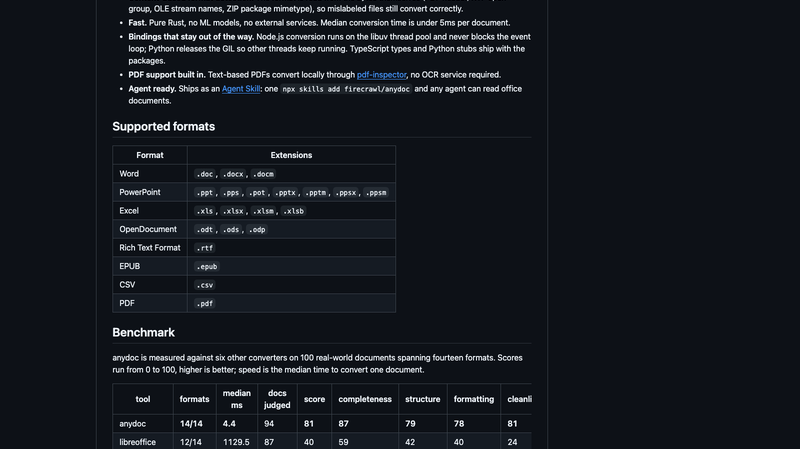
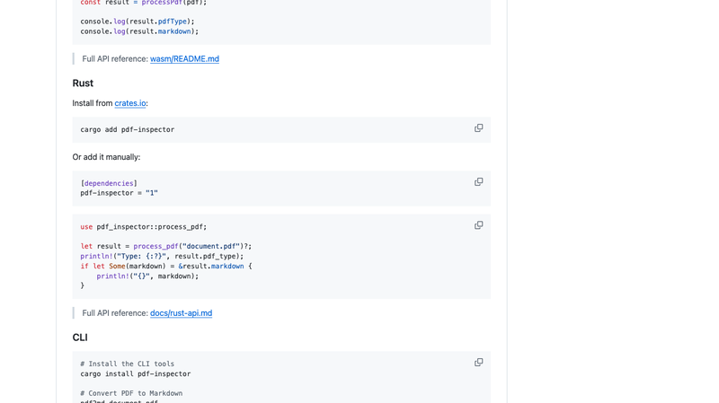
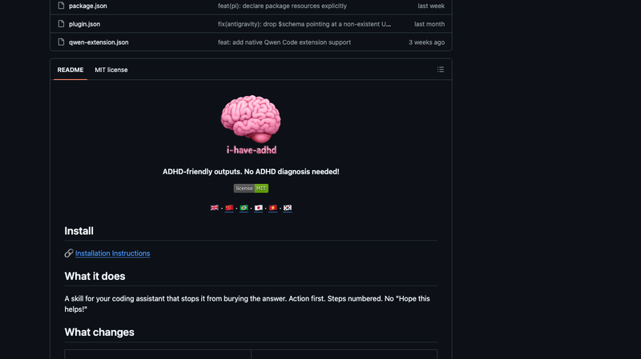
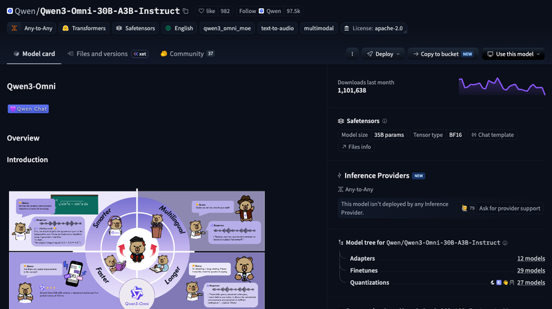
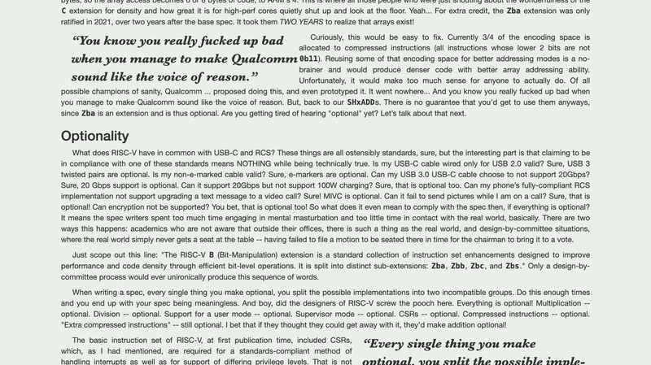
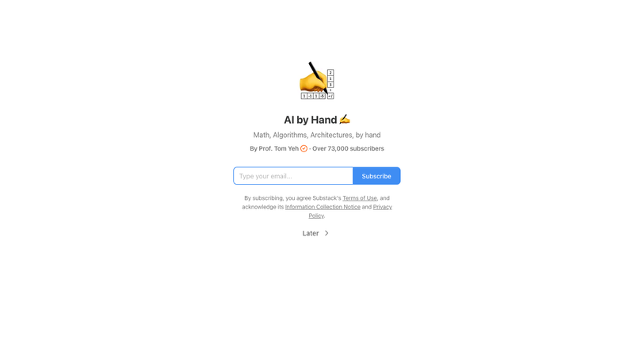
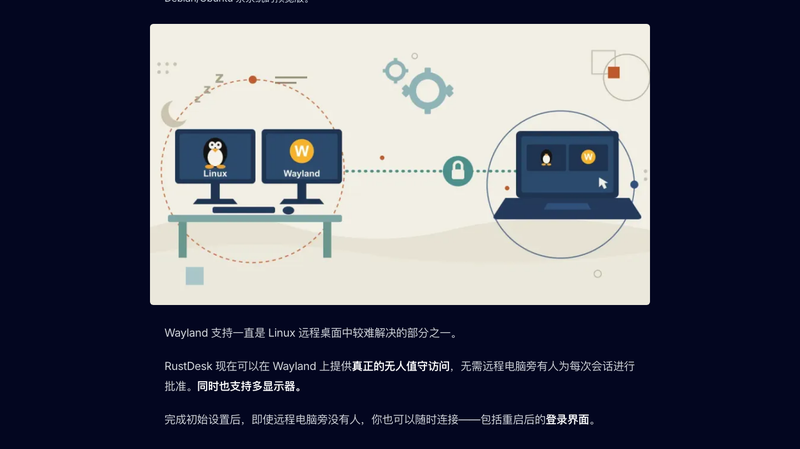
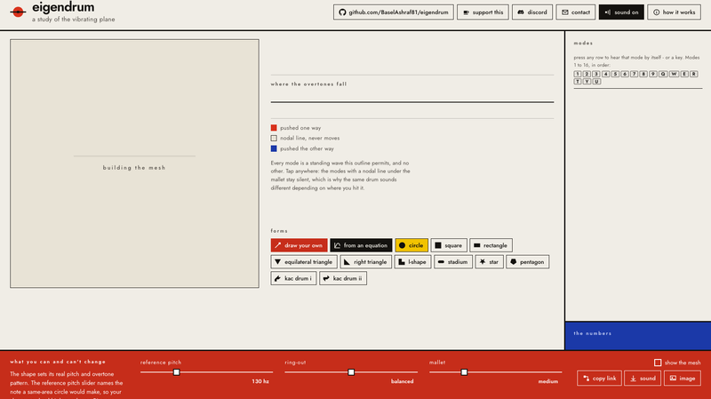
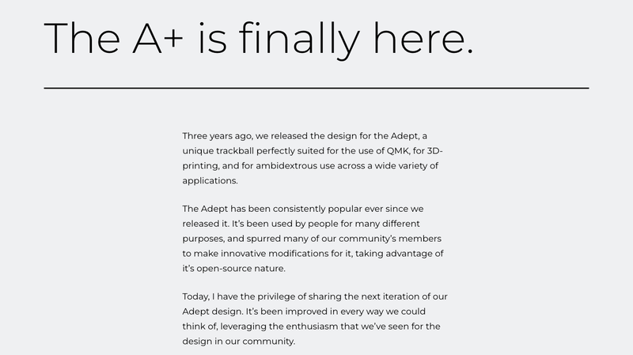

# 机器文摘 第 183 期

### anydoc：500 个 DOCX 1.7 秒的文档解析器

[anydoc](https://github.com/firecrawl/anydoc)，Firecrawl 出品的 Rust 文档→Markdown 转换库，16.3k Star，MIT。核心卖点是快：中位单文档转换 4.4ms（README 声称 <5ms），500 个 DOCX 只要 1.7 秒。

技术实现的核心是"统一文档模型"：每个格式一个解析器（doc/docx/ppt/pptx/xls/xlsx/odf/rtf/epub/csv/pdf）→ 全部汇入共享 Document 模型（blocks/inlines/tables/footnotes/assets）→ 单一 GFM 序列化器输出。关键设计：按内容标记识别格式（PDF header/RTF group/OLE 流名/ZIP mimetype），不依赖文件后缀——所以文件后缀错了也能正确解析。纯 Rust 实现，无 ML、无外部服务。

基准对比很夸张：LibreOffice 1129ms、unstructured 573ms、markitdown 135ms，anydoc 4.4ms——快一个数量级。14 种格式全覆盖，每格式评分第一。支持 Node/Python/Wasm 三端绑定，Wasm 版可以在浏览器里直接做本地文档转换。PDF 扫描件需要外部 OCR。

### pdf-inspector：先判断 PDF 是什么，再决定怎么提取

[pdf-inspector](https://github.com/firecrawl/pdf-inspector)，Firecrawl 的 PDF 分类 + 文本提取库，15.7k Star，MIT。和 anydoc 是同一个团队的配套产品。200 个 PDF 0.47 秒。

核心思路是把 PDF 分类和文本提取分开：先判断 PDF 是文本型、扫描件、图片型还是混合型（只解析 xref + 页面树，不全量加载，10-50ms 完成），然后精确到具体哪几页需要 OCR——文本型的直接本地提取 Markdown，扫描件才路由到 OCR。每页带机器可读的原因码（scanned/no_text/vector_text/suspected_garbled_text）。

防误判的工程细节很有意思：图像主导页会提阈值、模板型 PDF（文字+整页背景图）单独判 Mixed、CID 字体带 ToUnicode 不误判为扫描、报纸多栏排版检测。表格处理是另一大块：双模式（矩形检测 + 文本对齐启发式），TEDS 0.814 业界领先。基准：opendataloader-bench 200 PDFs 上 Overall 0.875 第一，比 pymupdf4llm 快 36 倍。

文档解析领域正在经历"快 100 倍"的竞赛——anydoc 和 pdf-inspector 把之前需要几秒的解析压缩到几毫秒，这让大规模文档处理流水线（RAG、数据清洗）的成本大幅下降。

### i-have-adhd：让代码 AI 闭嘴专注干活

[i-have-adhd](https://github.com/ayghri/i-have-adhd)，20.9k Star 的编码 AI agent 输出风格 skill，支持 Claude Code / Gemini CLI / Cursor / Codex 等。它不是 VS Code 插件，而是一个纯 Prompt 工程的"输出风格"配置。

解决的问题很真实：你问 AI "这个 bug 怎么修"，它会回复"这是个很好的问题！让我想想……你的认证流程有几个关键部分……一种方案是……另外你还可以看看……希望这对你有帮助！"——对新手友好，但对高频使用者是灾难。

10 条输出规则：①第一行给可执行动作（命令/路径/代码片段置顶）②多步骤编号列表③结尾给一个 2 分钟内能做的下一步④禁止"顺便一提"式离题⑤每轮重申进度⑥时间用具体单位⑦明确展示成果⑧报错直说位置+原因+修法⑨列表≤5项⑩禁止开场白/总结/客套（"Great question!"、"Hope this helps!" 全部禁用）。每条规则配 Bad/Good 正反例。还有 pre-send check：发消息前删首句/末句/旁枝/模糊副词/习语。

可复用的启示：想让 agent 简洁回答不需要写代码，做成"输出风格 skill"注入即可；规则要具体到禁止词表+正反例+自检清单。

### 语音到语音不再需要语音到文本

[Qwen3-Omni](https://huggingface.co/Qwen)，来自斌叔OKmath的微博推荐。传统的语音 Agent 技术栈是 VAD → STT → LLM → TTS——先把语音转成文本，LLM 处理文本，再合成语音。现在多模态 LLM 可以直接接收音频输入：VAD → MLLM → TTS，没有 STT 环节，模型能直接理解你的声音。

这意味着什么？语音里的情绪、语调、语气这些在 STT 阶段会丢失的信息，现在可以直接进入模型。而且少一个环节就少一次延迟。多模态模型可以直接听出"你说话很急"或者"你在叹气"，而不只是理解文字内容。

Qwen3-Omni 这类模型让"语音 Agent"变得更自然——不只是听懂你说什么，还能听懂你怎么说。这对客服、语音助手、会议记录这类场景是质变。现在的语音 AI 已经不只是"语音转文字的翻译器"，而是真正"能听声音的模型"。

### 姜饼人版《拯救大兵瑞恩》：本地生成电影级片段

[MiniMax H3](https://github.com/MiniMax-AI/MiniMax-H3)，一个全模态生成系统——文本/图像/视频/音频统一理解与生成。微博上刷到的姜饼人版《拯救大兵瑞恩》D-day 登陆片段就是用它生成的：外国网友在本地跑了这个模型，做出了一段"姜饼人抢滩诺曼底"的短片。

H3 的亮点：原生立体声（32kHz 双声道，与视频同帧生成而非后期拼接）、4-15 秒任意宽高比、默认 768p 可到 2K、24 FPS、支持 11 种语言。架构是 33B 参数稠密模型 + Qwen3-VL-32B 文本编码器 + 16×4 时空压缩 VisualVAE + 40Hz AudioVAE。

本地运行的门槛已经大幅降低：官方推荐 SGLang 4 卡部署；量化优化后峰值显存从 123.6GB 降到 42.5GB（降 66%），动态显存卸载后连 RTX 3060 都能跑。antirez 开源了 h3.c（Apple Silicon 原生推理），M5 Max 128GB 上端到端约 75 秒/段。HN 实测：RTX 4070 Ti Super 16GB 生成 10 秒 480p 视频约 10 分钟，RTX 5090 快得多。

"在本地跑一个电影级视频生成模型"这件事正在从实验室走向桌面。

### RISC-V：他们本应做得更好

[RISC-V: They Should Have Known Better](https://dmitry.gr/index.php?r=05.Thoughts&proj=011.RISCV+They+Should+Have+Known+Better)，Dmitry Grinberg 的文章，HN 273 分、331 评论。作者认为 RISC-V 作为 2010 年代白纸起家的 ISA，手握 x86/ARM/MIPS 几十年教训却犯下新手级错误。

六大批评：1）想通吃所有场景——超算与廉价 MCU 需求在架构层面本就对立；2）MCU 中断延迟惨败——约 44 周期 vs Cortex-M0 的 27 周期，基本 ISA 连合规中断处理都没有；3）压缩指令编码荒谬——16 位 store 偏移仅 0~3/0~2；4）无寄存器+寄存器寻址模式——数组访问要 3 条指令，Zba 两年后才补上（"他们花了两年才意识到数组存在"）；5）无限可选性——特性检测手段 misa 本身可选且低特权不可读；6）缺失明显指令——缺按位测试跳转、缺位域操作。

最狠的一条：Zcmp 与 D 扩展编码冲突，导致同一字节串在不同核上含义不同——x86 保持了 50 年语义稳定，RISC-V 不到 5 年破功。作者结论：RISC-V 不会死，会因免费拿下廉价 MCU 和 ML 加速器"保姆核"市场，但"是被选中因为便宜，不是因为好"。

### Going Dark：当执法机构丧失黑客能力

[Everything is about to "go dark"](https://blog.cryptographyengineering.com/2026/08/14/everything-is-about-to-go-dark/)，约翰霍普金斯大学密码学教授 Matthew Green 的博客，HN 447 分。

论点很有意思：作者担心 AI 会让软件"过于安全"——AI 漏洞挖掘（Anthropic Mythos、中国 Z.ai/Moonshot 开源模型）使防御方两年内可能耗尽可远程利用的漏洞，美国情报/执法机构将首次真正"Going Dark"（丧失攻击监控能力）。

历史脉络：2010 苹果全盘加密 → 2011 短信端到端加密 → 2014 Comey 启动 Going Dark 计划 → 2016 Apple v. FBI 案被外部公司"直接黑掉手机"破局。过去十年执法能力实际建立在购买黑客工具（GrayKey 解锁、NSO Pegasus 远程入侵）之上，属法律模糊地带；漏洞被 AI 清零后，对"例外访问"后门的立法需求将重新抬头。

这个问题没有简单的答案：一方面我们不想给政府开后门，另一方面执法机构的合法需求确实存在。AI 让这个天平变得更极端了。

### AI by Hand：手算 Transformer

[AI by Hand](https://www.byhand.ai/)，Tom Yeh 教授（科罗拉多大学博尔德分校）创办的 By Hand Research 项目，主打"Math, Algorithms, Architectures, by hand"——手算 AI。HN 355 分，73,000+ 订阅者。

核心是 Attention 教程：基于《Attention Is All You Need》的 11 个交互式图解，QKV 投影、自/交叉注意力、多头、MQA、GQA 等，用"狗"做类比。扩展内容还包括 MLP、激活函数（12 节）、微调、矩阵乘法手算教程 + Excel 练习册（GitHub 上有配套仓库）。

这个项目的价值在于：用纸笔和 Excel 手算一遍 transformer，你对它的理解会远超任何视频教程。HN 上被与 llm.c、llm-from-scratch 并列推荐——"手算一遍"是最朴素也最有效的学习方式。缺点是约半数文章被 Substack 付费墙锁定。

### RustDesk 支持 Wayland 真·无人值守远程访问

[RustDesk Wayland 支持](https://rustdesk.com/blog/)，HN 338 分。RustDesk 现在支持 Wayland 上真正的无人值守远程访问——包括登录屏和锁屏场景。

技术实现是"三件套"：抓屏双路——正常 Wayland 会话走 xdg-desktop-portal ScreenCast → PipeWire；登录屏/锁屏/无人值守场景走 DRM/KMS 直采（运行时加载 libdrmtap，root 服务抓取 scanout dma-buf，类似 Sunshine kmsgrab 思路）；输入注入用 uinput 虚拟键盘/鼠标；服务形态是 root systemd 服务先于会话运行，重启后可直连登录屏幕。

Wayland 一直被认为"不能做远程桌面"（协议层面不允许非特权应用抓屏），RustDesk 通过 root 服务 + DRM 直采绕过了这个限制。HN 上也有争议：认证协议被指有 MITM 风险，libdrmtap 是 AI 生成代码。预览包已发布（Debian/Ubuntu x86_64 nightly 通道）。

### 华硕的自行车加速器：把普通自行车变成电助力车

[ASUS Oxiis E250G1 "Intelligent Bike Booster"](https://www.asus.com/)，华硕 2026 年发布的外挂电助力设备，HN 265 分。它不是整车，而是一个摩擦驱动式电动自行车改装套件——夹在座管上、电机滚轮压住后轮轮胎，把任何普通自行车变成智能电助力车。

规格：电机 250W 额定/500W 峰值；电池 158.4Wh/36V 可拆卸，USB-C PD 100W 2 小时充满；3.7kg 可塞背包；Eco 续航 50km；IPX4 防水；三档模式（Eco/Normal/Sport）+ 无线踏频传感器 + 刹车感应尾灯。兼容 16"-29"+700C 轮径、轮胎 ≤60mm、座管 25.4-34.9mm；不兼容全避震车和碳纤维座管。

HN 争议点：摩擦驱动雨天打滑、磨胎、效率低约 20%；被评价为"所见最轻松的 ebike 改装"，但电池容量仅入门 ebike 一半。定价未公布。对不想买整车、想让现有自行车"升级"的人来说是个有意思的方向。

### Eigendrum：画出形状，听它作为鼓的声音

[Eigendrum](https://eigendrum.com)，Show HN 157 分。画出任意形状，听它作为鼓膜的声音。

数学本质：Dirichlet Laplace 特征值问题（−∇²u = λu, u=0 边界），频率 ∝ √λ。技术上是真实的数值求解：P1 线性三角形 FEM（约 2600 内部节点），用块逆迭代 + Rayleigh–Ritz 投影求最低 20 个特征对。精度经过圆形（Bessel 零点）和矩形解析谱验证，优于 0.1%，57 个测试持续回归。

物理细节也是真的：锤子按各模态在击打点的位移投影激发——敲在节线上该模态静默（自然涌现，非硬编码）；Rayleigh 阻尼使高泛音先衰减。彩蛋：内置 Kac 鼓（Gordon–Webb–Wolpert 1992 的同谱鼓，7 个三角形重排，频谱完全相同）——回答"能听出鼓的形状吗？"= 不能。

"画一个形状，听它怎么响"——这个项目的趣味性和数学深度结合得很好。真正算特征值而不是伪造声音，是它和玩具类项目的本质区别。

### Ploopy A+ Trackball：开源轨迹球的新一代

[Ploopy A+ Trackball](https://ploopy.co/)，开源轨迹球 Adept（2023）的下一代迭代，HN 139 分。套件 $99 CAD，2026-08-19 开启预售。

新特性：8 键（Adept 是 6 键）、2 个可编程旋钮（垂直/水平高分辨率滚动）、Pixart PMW-3360 传感器（1000Hz）、Omron D2LS-21 微动、可拆卸腕托、手势（按住旋钮+8 方向甩球触发剪切/复制/粘贴、切桌面、媒体控制）、图层系统（轨迹球行业首创）、设备端配置（左手镜像、DPI、滚动模式）。QMK + VIA，CERN OHL-v2s/GPLv3 全开源。

Ploopy 是轨迹球界的"开源硬件标杆"——硬件设计、固件全部开源，你可以自己 3D 打印外壳、自己改固件。"图层系统"是轨迹球行业首创：一个球可以有多套按键映射，按一下切换，相当于一个物理设备顶三个。

## 订阅
这里会不定期分享我看到的有趣的内容（不一定是最新的，但是有意思），因为大部分都与机器有关，所以先叫它"机器文摘"吧。

Github 仓库地址：https://github.com/sbabybird/MachineDigest

喜欢的朋友可以订阅关注：

- 通过微信公众号"从容地狂奔"订阅。

